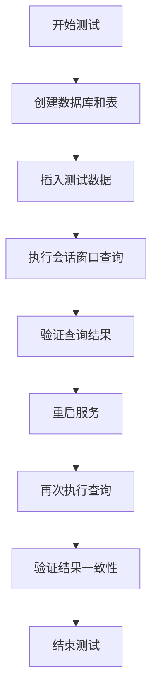
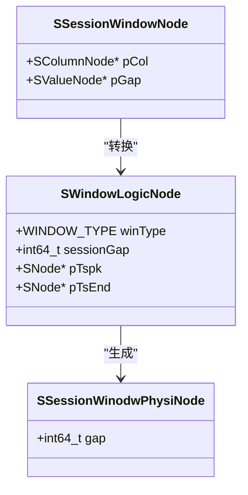

# 会话窗口

<cite>
**本文档引用的文件**   
- [sql.y](file://source/libs/parser/inc/sql.y)
- [test_session.py](file://test/cases/24-TimeSeriesExtensions/06-SessionWindow/test_session.py)
- [planLogicCreater.c](file://source/libs/planner/src/planLogicCreater.c)
- [planPhysiCreater.c](file://source/libs/planner/src/planPhysiCreater.c)
- [nodesCodeFuncs.c](file://source/libs/nodes/src/nodesCodeFuncs.c)
</cite>

## 目录
1. [简介](#简介)
2. [语法结构](#语法结构)
3. [会话窗口机制](#会话窗口机制)
4. [超时参数详解](#超时参数详解)
5. [实际应用场景](#实际应用场景)
6. [测试用例分析](#测试用例分析)
7. [系统架构与实现](#系统架构与实现)
8. [结论](#结论)

## 简介
会话窗口（Session Window）是一种在时间序列数据分析中用于识别用户或设备活动周期的重要功能。该功能通过分析数据点之间的时间间隔，将连续的活动划分为独立的会话。当相邻数据点的时间间隔超过预设的超时时间时，当前会话结束，新的会话开始。此功能广泛应用于用户行为分析、设备监控等领域，能够有效识别用户的活跃周期和非活跃间隔。

**Section sources**
- [sql.y](file://source/libs/parser/inc/sql.y#L1500-L1599)
- [test_session.py](file://test/cases/24-TimeSeriesExtensions/06-SessionWindow/test_session.py#L0-L169)

## 语法结构
会话窗口的语法定义在 `sql.y` 文件中，其核心语法结构如下：

```
SESSION ( column_reference, interval_sliding_duration_literal )
```

其中：
- `column_reference`：指定用于计算时间间隔的时间戳列。
- `interval_sliding_duration_literal`：定义会话超时时间，即当相邻数据点的时间间隔超过此值时，会话将被关闭。

该语法在解析器中通过 `createSessionWindowNode` 函数实现，该函数接收时间戳列和超时间隔作为参数，并创建相应的会话窗口节点。

**Section sources**
- [sql.y](file://source/libs/parser/inc/sql.y#L1500-L1599)
- [parAst.h](file://source/libs/parser/inc/parAst.h#L196)

## 会话窗口机制
会话窗口的工作机制基于数据点之间的时间间隔。系统会按时间顺序处理数据流，对于每个数据点，计算其与前一个数据点的时间差。如果该时间差小于或等于设定的超时时间，则该数据点被归入当前会话；如果时间差大于超时时间，则当前会话结束，一个新的会话开始。

这种机制能够有效地将分散的活动划分为有意义的会话，便于后续的聚合分析，如计算每个会话的持续时间、会话内的事件数量等。

**Section sources**
- [planLogicCreater.c](file://source/libs/planner/src/planLogicCreater.c#L1828-L1865)
- [planPhysiCreater.c](file://source/libs/planner/src/planPhysiCreater.c#L2885-L2917)

## 超时参数详解
超时参数（timeout）是会话窗口的核心配置，它决定了会话的划分边界。在 `sql.y` 文件中，超时参数由 `interval_sliding_duration_literal` 规则定义，支持多种时间单位，如 `a`（毫秒）、`s`（秒）、`m`（分钟）、`h`（小时）、`d`（天）、`w`（周）等。

在逻辑计划生成阶段，`createWindowLogicNodeBySession` 函数会解析并提取超时值，将其存储在 `SWindowLogicNode` 结构的 `sessionGap` 字段中。该值随后被传递给物理执行计划，用于实际的会话划分。

**Section sources**
- [sql.y](file://source/libs/parser/inc/sql.y#L1500-L1599)
- [planLogicCreater.c](file://source/libs/planner/src/planLogicCreater.c#L1828-L1865)

## 实际应用场景
会话窗口的一个典型应用场景是分析用户在应用中的活跃会话周期。例如，通过设置1分钟的超时时间，可以将用户的操作划分为不同的会话，从而分析用户的平均会话时长、单次会话内的操作次数等指标。这对于理解用户行为模式、优化用户体验具有重要意义。

此外，会话窗口还可用于设备监控，识别设备的运行周期和停机时间，帮助进行故障预测和维护计划。

**Section sources**
- [test_session.py](file://test/cases/24-TimeSeriesExtensions/06-SessionWindow/test_session.py#L0-L169)

## 测试用例分析
位于 `test/cases/24-TimeSeriesExtensions/06-SessionWindow/test_session.py` 的测试用例验证了会话窗口的功能。测试通过向数据库插入一系列具有不同时间间隔的数据点，然后使用不同超时值的会话窗口进行查询，检查返回的会话数量和每个会话中的数据点数量是否符合预期。

例如，使用 `session(ts,1s)` 查询时，系统会将时间间隔小于等于1秒的数据点归为同一会话，而间隔大于1秒的数据点则开启新会话。测试用例通过 `tdSql.checkRows` 和 `tdSql.checkData` 方法验证了查询结果的正确性。



**Diagram sources**
- [test_session.py](file://test/cases/24-TimeSeriesExtensions/06-SessionWindow/test_session.py#L0-L169)

**Section sources**
- [test_session.py](file://test/cases/24-TimeSeriesExtensions/06-SessionWindow/test_session.py#L0-L169)

## 系统架构与实现
会话窗口功能的实现涉及多个组件，从语法解析到逻辑计划生成，再到物理执行。



**Diagram sources**
- [sql.y](file://source/libs/parser/inc/sql.y#L1500-L1599)
- [planLogicCreater.c](file://source/libs/planner/src/planLogicCreater.c#L1828-L1865)
- [planPhysiCreater.c](file://source/libs/planner/src/planPhysiCreater.c#L2682-L2718)

**Section sources**
- [sql.y](file://source/libs/parser/inc/sql.y#L1500-L1599)
- [planLogicCreater.c](file://source/libs/planner/src/planLogicCreater.c#L1828-L1865)
- [planPhysiCreater.c](file://source/libs/planner/src/planPhysiCreater.c#L2682-L2718)
- [nodesCodeFuncs.c](file://source/libs/nodes/src/nodesCodeFuncs.c#L6142-L6177)

## 结论
会话窗口是TDengine中一个强大的时间序列分析功能，它通过简单的语法 `SESSION(ts, timeout)` 实现了复杂的行为模式识别。该功能基于数据点间的时间间隔，利用超时参数灵活地划分会话，为用户行为分析、设备监控等场景提供了有力支持。其底层实现经过精心设计，从语法解析、逻辑计划到物理执行，确保了功能的正确性和高效性。