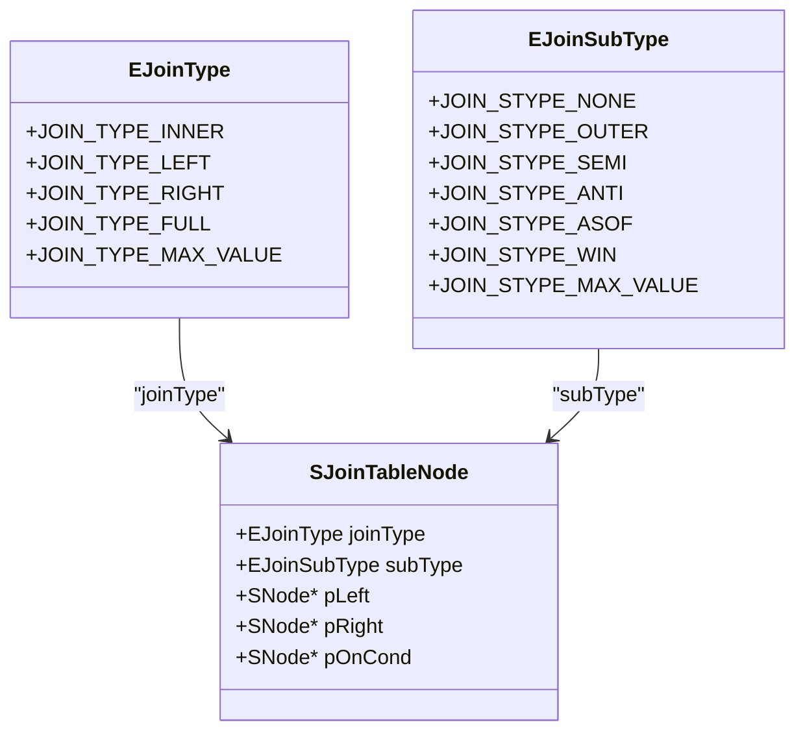
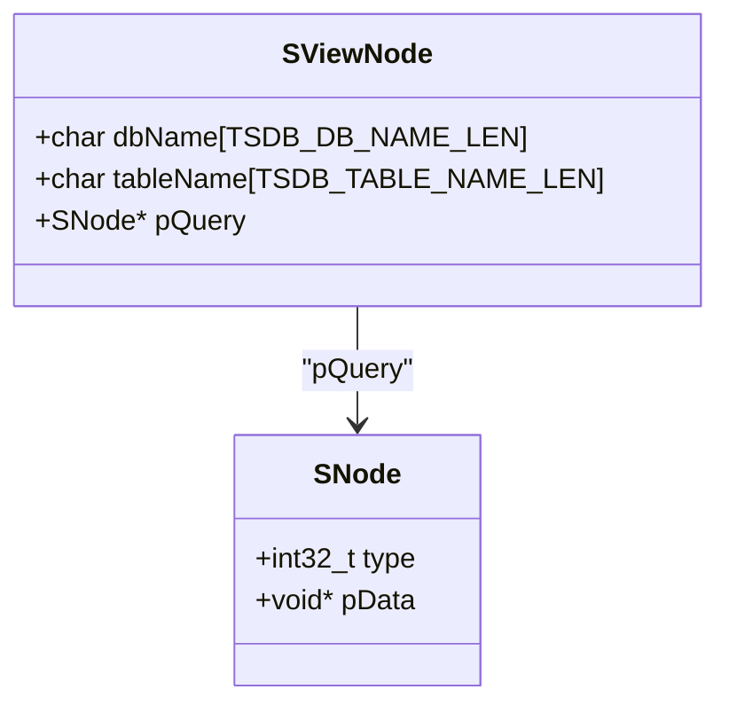

# 高级查询

<cite>
**本文档中引用的文件**   
- [sql.y](file://source/libs/parser/inc/sql.y)
- [test_join.py](file://test/cases/25-JoinQueries/test_join.py)
- [test_view_mgmt.py](file://test/cases/27-Views/test_view_mgmt.py)
- [test_view_nested_join.py](file://test/cases/27-Views/test_view_nested_join.py)
- [parAst.h](file://source/libs/parser/inc/parAst.h)
- [parAstCreater.c](file://source/libs/parser/src/parAstCreater.c)
- [querynodes.h](file://include/libs/nodes/querynodes.h)
</cite>

## 目录
1. [引言](#引言)
2. [连接查询（JOIN）](#连接查询join)
3. [子查询（Subquery）](#子查询subquery)
4. [视图（View）](#视图view)
5. [复杂查询示例](#复杂查询示例)
6. [相关测试用例](#相关测试用例)
7. [结论](#结论)

## 引言
本文档旨在系统性地阐述TDengine数据库中的高级查询功能，重点介绍`JOIN`（连接查询）、子查询（Subquery）和视图（View）的使用方法。通过分析`sql.y`语法文件和相关测试用例，详细说明这些功能的语法、支持的类型、应用场景以及最佳实践。本文档为开发人员和数据库管理员提供全面的参考，帮助他们高效地利用这些高级查询功能进行数据管理和分析。

## 连接查询（JOIN）
连接查询是TDengine中用于跨表分析的重要功能。通过`JOIN`操作，可以将多个表的数据关联起来，实现复杂的数据查询和分析。

### 语法和连接类型
根据`sql.y`文件中的定义，TDengine支持多种`JOIN`类型，包括`INNER JOIN`、`LEFT JOIN`、`RIGHT JOIN`和`FULL JOIN`。此外，还支持`OUTER`、`SEMI`、`ANTI`、`ASOF`和`WINDOW`等子类型。这些连接类型可以通过`JOIN`关键字后的修饰符来指定。



**图源**
- [querynodes.h](file://include/libs/nodes/querynodes.h#L288-L294)
- [querynodes.h](file://include/libs/nodes/querynodes.h#L296-L304)
- [querynodes.h](file://include/libs/nodes/querynodes.h#L317-L333)

### 应用场景
连接查询在跨表分析中具有广泛的应用。例如，可以通过`INNER JOIN`将两个表中具有相同时间戳的数据关联起来，进行聚合分析。`LEFT JOIN`和`RIGHT JOIN`可以用于处理缺失数据的情况，确保查询结果的完整性。`FULL JOIN`则可以将两个表的所有数据合并，适用于需要全面数据视图的场景。

**节源**
- [sql.y](file://source/libs/parser/inc/sql.y#L0-L799)
- [test_join.py](file://test/cases/25-JoinQueries/test_join.py#L0-L524)

## 子查询（Subquery）
子查询是SQL中的一种高级功能，允许在一个查询中嵌套另一个查询。TDengine支持在`SELECT`、`FROM`和`WHERE`子句中使用子查询，以实现复杂的查询逻辑。

### 使用场景和嵌套规则
子查询可以用于过滤数据、生成临时结果集或作为表达式的一部分。在`WHERE`子句中使用子查询可以实现基于另一个查询结果的条件过滤。在`FROM`子句中使用子查询可以将查询结果作为临时表进行进一步处理。嵌套规则要求子查询必须返回单一值或单一列的结果集，且不能包含`ORDER BY`子句。

**节源**
- [sql.y](file://source/libs/parser/inc/sql.y#L0-L799)
- [test_view_nested_join.py](file://test/cases/27-Views/test_view_nested_join.py#L0-L44)

## 视图（View）
视图是虚拟表，其内容由查询定义。TDengine中的视图可以简化复杂查询，提高查询效率，并提供数据抽象层。

### 创建、管理和使用方法
视图的创建通过`CREATE VIEW`语句实现，语法如下：
```sql
CREATE VIEW view_name AS SELECT * FROM table_name;
```
视图的管理包括创建、修改和删除操作。`CREATE OR REPLACE VIEW`语句可以用于更新视图定义，`DROP VIEW`语句用于删除视图。视图的使用与普通表类似，可以通过`SELECT`语句查询视图内容。



**图源**
- [parAst.h](file://source/libs/parser/inc/parAst.h#L193-L193)
- [parAstCreater.c](file://source/libs/parser/src/parAstCreater.c#L1508-L1524)
- [querynodes.h](file://include/libs/nodes/querynodes.h#L271-L279)

**节源**
- [sql.y](file://source/libs/parser/inc/sql.y#L0-L799)
- [test_view_mgmt.py](file://test/cases/27-Views/test_view_mgmt.py#L0-L799)

## 复杂查询示例
以下是一些复杂的查询示例，展示了如何结合使用`JOIN`、子查询和视图来实现高级查询功能。

### 多表关联分析
```sql
SELECT t1.ts, t1.f, t2.f 
FROM table1 t1 
JOIN table2 t2 ON t1.ts = t2.ts;
```

### 在WHERE子句中使用子查询
```sql
SELECT * 
FROM table1 
WHERE f IN (SELECT f FROM table2 WHERE g > 100);
```

### 通过视图简化复杂查询
```sql
CREATE VIEW view1 AS 
SELECT tbname, avg(f) 
FROM sta1 
PARTITION BY tbname;

SELECT * 
FROM view1 
PARTITION BY view1.tbname;
```

**节源**
- [test_join.py](file://test/cases/25-JoinQueries/test_join.py#L0-L524)
- [test_view_mgmt.py](file://test/cases/27-Views/test_view_mgmt.py#L0-L799)
- [test_view_nested_join.py](file://test/cases/27-Views/test_view_nested_join.py#L0-L44)

## 相关测试用例
TDengine的测试用例库中包含了大量的`JOIN`和视图相关的测试用例，用于验证这些功能的正确性和性能。

### 测试用例链接
- [test_join.py](file://test/cases/25-JoinQueries/test_join.py)
- [test_view_mgmt.py](file://test/cases/27-Views/test_view_mgmt.py)
- [test_view_nested_join.py](file://test/cases/27-Views/test_view_nested_join.py)

这些测试用例涵盖了各种`JOIN`类型、子查询和视图的使用场景，为开发人员提供了丰富的参考。

**节源**
- [test_join.py](file://test/cases/25-JoinQueries/test_join.py#L0-L524)
- [test_view_mgmt.py](file://test/cases/27-Views/test_view_mgmt.py#L0-L799)
- [test_view_nested_join.py](file://test/cases/27-Views/test_view_nested_join.py#L0-L44)

## 结论
本文档详细介绍了TDengine中的高级查询功能，包括`JOIN`、子查询和视图的使用方法。通过分析语法文件和测试用例，展示了这些功能的语法、支持的类型、应用场景和最佳实践。开发人员和数据库管理员可以利用这些功能进行复杂的数据查询和分析，提高数据管理和分析的效率。未来的工作可以进一步探索这些功能的性能优化和扩展应用。