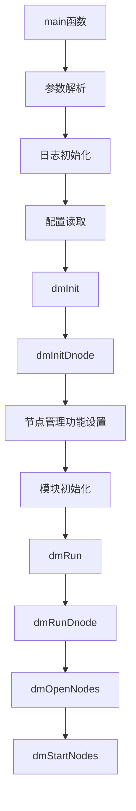
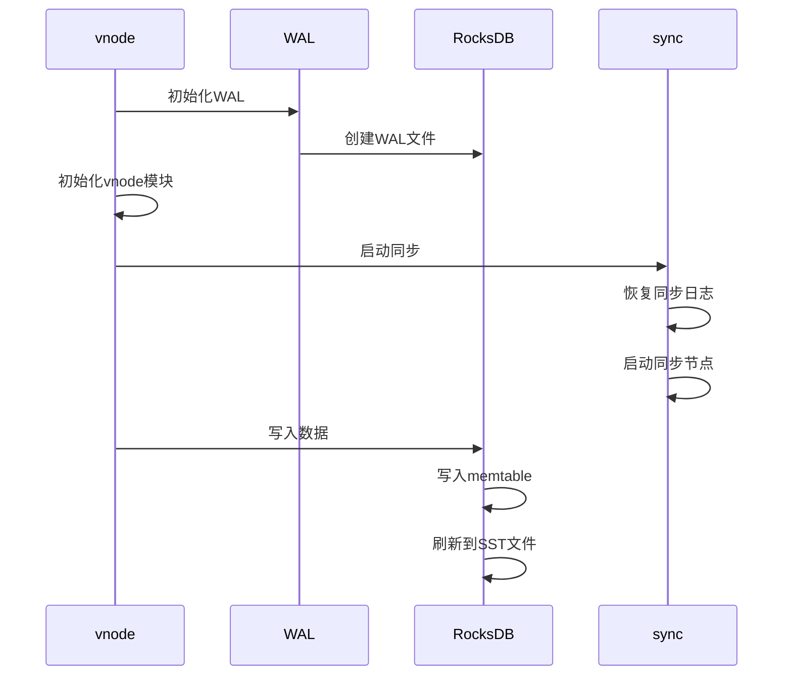
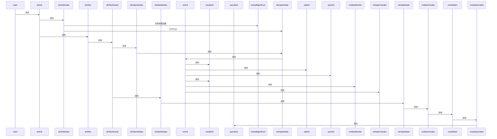

# 内部架构与源码解析

<cite>
**本文档引用的文件**  
- [dmMain.c](file://source/dnode/mgmt/exe/dmMain.c)
- [dnode.h](file://include/dnode/mgmt/dnode.h)
- [dmEnv.c](file://source/dnode/mgmt/node_mgmt/src/dmEnv.c)
- [dmMgmt.c](file://source/dnode/mgmt/node_mgmt/src/dmMgmt.c)
- [dmNodes.c](file://source/dnode/mgmt/node_mgmt/src/dmNodes.c)
- [vmInt.c](file://source/dnode/mgmt/mgmt_vnode/src/vmInt.c)
- [vnode.h](file://source/dnode/vnode/inc/vnode.h)
- [vnodeModule.c](file://source/dnode/vnode/src/vnd/vnodeModule.c)
- [vnodeOpen.c](file://source/dnode/vnode/src/vnd/vnodeOpen.c)
- [vnodeSync.c](file://source/dnode/vnode/src/vnd/vnodeSync.c)
- [sync.h](file://include/libs/sync/sync.h)
- [syncMain.c](file://source/libs/sync/src/syncMain.c)
</cite>

## 目录
1. [主进程启动流程](#主进程启动流程)
2. [查询处理管道](#查询处理管道)
3. [vnode与RocksDB的持久化交互](#vnode与rocksdb的持久化交互)
4. [关键数据结构](#关键数据结构)
5. [调用时序图](#调用时序图)

## 主进程启动流程

`taosd`主进程的启动从`dmMain.c`文件中的`main`函数开始。该函数首先进行系统环境检查，确保运行在小端序机器上，然后解析命令行参数并初始化日志系统。接着，它读取配置文件并初始化内存池和字符集转换模块。

启动流程的核心是`dmInit`和`dmRun`两个函数。`dmInit`负责初始化dnode环境，包括磁盘、监控、度量、审计等模块，并初始化dnode自身。`dmRun`则负责运行dnode，通过`dmRunDnode`函数启动各个节点。

在`dmInitDnode`函数中，系统为不同类型的节点（如DNODE、MNODE、VNODE等）设置管理功能，并初始化压缩模块。然后，它检查系统是否已在运行，并初始化各个模块，包括状态客户端和同步客户端。

`dmRunDnode`函数通过`dmOpenNodes`和`dmStartNodes`函数打开并启动各个节点。这些节点包括管理节点、元数据节点、查询节点、存储节点等。每个节点的打开和启动都是通过函数指针调用的，实现了模块化的架构设计。

**Diagram sources**
- [dmMain.c](file://source/dnode/mgmt/exe/dmMain.c#L500-L600)
- [dmEnv.c](file://source/dnode/mgmt/node_mgmt/src/dmEnv.c#L178-L260)
- [dmMgmt.c](file://source/dnode/mgmt/node_mgmt/src/dmMgmt.c#L42-L108)
- [dmNodes.c](file://source/dnode/mgmt/node_mgmt/src/dmNodes.c#L140-L182)

**Section sources**
- [dmMain.c](file://source/dnode/mgmt/exe/dmMain.c#L500-L600)
- [dmEnv.c](file://source/dnode/mgmt/node_mgmt/src/dmEnv.c#L178-L260)

## 查询处理管道

TDengine的查询处理管道由解析器（parser）、规划器（planner）和执行器（executor）三个主要组件构成。当SQL查询到达系统时，首先由解析器进行语法分析，生成抽象语法树（AST）。

解析器位于`libs/parser`目录下，使用lemon生成的语法分析器将SQL语句解析为内部表示。解析后的查询被传递给规划器，规划器位于`libs/planner`目录下，负责生成执行计划。

执行计划由一系列逻辑子计划（`SLogicSubplan`）组成，每个子计划代表查询的一个执行阶段。执行器位于`libs/executor`目录下，负责执行这些计划。执行器将逻辑计划转换为物理操作，并协调数据的读取、处理和返回。

整个查询处理管道的设计实现了查询的优化和高效执行，支持复杂的聚合、连接和窗口函数操作。

**Section sources**
- [parser.h](file://include/libs/parser/parser.h)
- [planner.h](file://include/libs/planner/planner.h)
- [executor.h](file://include/libs/executor/executor.h)

## vnode与RocksDB的持久化交互

vnode（虚拟节点）是TDengine中负责数据存储的核心组件。它与RocksDB的交互主要通过WAL（Write-Ahead Log）和TSDB（Time Series Database）模块实现。

在`vmInit`函数中，vnode初始化时会调用`walInit`函数初始化WAL系统，然后调用`vnodeInit`函数初始化vnode模块。`vnodeInit`函数进一步调用`walInit`来初始化WAL，确保数据的持久性和一致性。

当数据写入时，首先写入WAL，然后写入内存中的memtable。当memtable达到一定大小时，会刷新到磁盘上的SST文件中。RocksDB作为底层存储引擎，负责管理这些SST文件的创建、合并和删除。

vnode通过`sync`模块实现多副本之间的数据同步。`syncStart`函数启动同步子系统，`syncNodeRestore`函数恢复同步日志缓冲区，`syncNodeStart`函数启动同步节点。这些函数确保了数据在多个副本之间的一致性。

**Diagram sources**
- [vmInt.c](file://source/dnode/mgmt/mgmt_vnode/src/vmInt.c#L1079-L1171)
- [vnodeModule.c](file://source/dnode/vnode/src/vnd/vnodeModule.c#L22-L33)
- [vnodeSync.c](file://source/dnode/vnode/src/vnd/vnodeSync.c#L848-L856)
- [syncMain.c](file://source/libs/sync/src/syncMain.c#L88-L122)

**Section sources**
- [vmInt.c](file://source/dnode/mgmt/mgmt_vnode/src/vmInt.c#L1079-L1171)
- [vnodeModule.c](file://source/dnode/vnode/src/vnd/vnodeModule.c#L22-L33)

## 关键数据结构

### SQuery结构

`SQuery`是查询的核心数据结构，存储了查询的元数据、执行状态和结果信息。它包含了查询ID、数据库信息、表信息、时间范围、过滤条件等属性。该结构在查询的整个生命周期中被使用，从解析到执行再到结果返回。

### SLogicSubplan结构

`SLogicSubplan`表示逻辑执行计划的一个子计划。它包含了计划的类型（如扫描、过滤、聚合等）、输入输出信息、执行参数等。多个`SLogicSubplan`组成一个完整的执行计划树，由执行器按顺序执行。

这些数据结构的设计体现了TDengine对查询处理的模块化和分层设计思想，使得查询的解析、优化和执行可以独立进行，提高了系统的可维护性和扩展性。

**Section sources**
- [query.h](file://include/libs/qcom/query.h)
- [plannodes.h](file://include/libs/nodes/plannodes.h)

## 调用时序图

以下时序图展示了从`main`函数开始到vnode完全启动的完整调用流程：

**Diagram sources**
- [dmMain.c](file://source/dnode/mgmt/exe/dmMain.c#L500-L600)
- [dmEnv.c](file://source/dnode/mgmt/node_mgmt/src/dmEnv.c#L178-L260)
- [dmMgmt.c](file://source/dnode/mgmt/node_mgmt/src/dmMgmt.c#L42-L108)
- [dmNodes.c](file://source/dnode/mgmt/node_mgmt/src/dmNodes.c#L140-L182)
- [vmInt.c](file://source/dnode/mgmt/mgmt_vnode/src/vmInt.c#L1079-L1310)
- [vnodeModule.c](file://source/dnode/vnode/src/vnd/vnodeModule.c#L22-L33)
- [vnodeOpen.c](file://source/dnode/vnode/src/vnd/vnodeOpen.c#L635-L640)
- [vnodeSync.c](file://source/dnode/vnode/src/vnd/vnodeSync.c#L848-L856)
- [syncMain.c](file://source/libs/sync/src/syncMain.c#L88-L122)

**Section sources**
- [dmMain.c](file://source/dnode/mgmt/exe/dmMain.c#L500-L600)
- [dmEnv.c](file://source/dnode/mgmt/node_mgmt/src/dmEnv.c#L178-L260)
- [vmInt.c](file://source/dnode/mgmt/mgmt_vnode/src/vmInt.c#L1079-L1310)