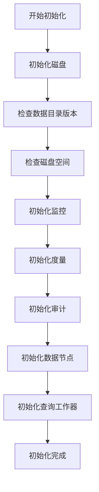

# 启动流程

<cite>
**本文档引用的文件**  
- [dmMain.c](file://source/dnode/mgmt/exe/dmMain.c)
- [dnode.h](file://include/dnode/mgmt/dnode.h)
- [taosInitCfg](file://source/common/src/tglobal.c)
- [dmInit](file://source/dnode/mgmt/node_mgmt/src/dmEnv.c)
- [qWorkerInit](file://source/libs/qworker/src/qworker.c)
</cite>

## 目录
1. [启动流程概述](#启动流程概述)
2. [主函数入口与参数解析](#主函数入口与参数解析)
3. [配置初始化](#配置初始化)
4. [核心模块初始化](#核心模块初始化)
5. [服务启动与运行](#服务启动与运行)
6. [集群模式下的节点通信](#集群模式下的节点通信)
7. [关键日志分析](#关键日志分析)
8. [常见启动失败排查](#常见启动失败排查)

## 启动流程概述

TDengine服务（taosd）的启动流程始于`dmMain.c`文件中的`main`函数。该流程包括环境初始化、配置文件加载、管理节点（mnode）、数据节点（dnode）和查询节点（qnode）的启动。整个过程遵循严格的时序和依赖关系，确保系统稳定运行。在集群模式下，节点间通过握手协议和元数据同步机制实现协同工作。

## 主函数入口与参数解析

启动流程从`dmMain.c`中的`main`函数开始。该函数首先进行环境检查，确保系统为小端序架构，然后调用`dmParseArgs`函数解析命令行参数。参数解析包括配置目录、日志输出、加密密钥等设置，为后续初始化提供必要的配置信息。

**Section sources**
- [dmMain.c](file://source/dnode/mgmt/exe/dmMain.c#L1-L100)

## 配置初始化

配置初始化通过`taosInitCfg`函数完成。该函数加载配置文件（如taos.cfg），设置系统参数，并进行配置项的验证。初始化过程中，系统会读取环境变量和配置文件中的参数，确保所有配置项正确加载并应用到系统中。

**Section sources**
- [tglobal.c](file://source/common/src/tglobal.c#L2421-L2493)

## 核心模块初始化

核心模块初始化由`dmInit`函数负责。该函数依次初始化磁盘、监控、度量、审计等子系统，并启动数据节点。初始化过程中，系统会检查数据目录版本和磁盘空间，确保环境满足运行要求。此外，查询工作器（qworker）在此阶段初始化，为后续查询处理做好准备。

**Diagram sources **
- [dmEnv.c](file://source/dnode/mgmt/node_mgmt/src/dmEnv.c#L178-L209)
- [qworker.c](file://source/libs/qworker/src/qworker.c#L1434-L1531)

**Section sources**
- [dmEnv.c](file://source/dnode/mgmt/node_mgmt/src/dmEnv.c#L178-L209)
- [qworker.c](file://source/libs/qworker/src/qworker.c#L1434-L1531)

## 服务启动与运行

服务启动通过`dmRun`函数执行。该函数启动数据节点的主循环，监听客户端请求并处理数据写入和查询。启动过程中，系统会设置信号处理函数，以便在接收到终止信号时优雅地关闭服务。服务运行期间，日志系统持续记录关键事件，便于监控和故障排查。

**Section sources**
- [dmEnv.c](file://source/dnode/mgmt/node_mgmt/src/dmEnv.c#L257-L260)

## 集群模式下的节点通信

在集群模式下，节点间通过管理节点（mnode）进行通信和元数据同步。新节点加入集群时，会与mnode进行握手，获取集群配置和元数据信息。mnode负责维护集群状态，协调节点间的任务分配和数据同步，确保集群的高可用性和数据一致性。

## 关键日志分析

启动过程中的关键日志包括配置加载、模块初始化、服务启动等阶段的记录。通过分析这些日志，可以了解系统启动的详细过程和潜在问题。例如，配置加载失败的日志会提示配置文件路径或格式错误，模块初始化失败的日志会指出具体的错误原因。

## 常见启动失败排查

常见启动失败包括配置文件错误、磁盘空间不足、端口冲突等。排查时，首先检查日志文件，定位错误信息。对于配置文件错误，需验证配置项的正确性和完整性；对于磁盘空间不足，需清理磁盘或扩展存储；对于端口冲突，需修改配置文件中的端口设置或关闭占用端口的进程。

**Section sources**
- [dmMain.c](file://source/dnode/mgmt/exe/dmMain.c#L1-L613)
- [dnode.h](file://include/dnode/mgmt/dnode.h#L29-L44)