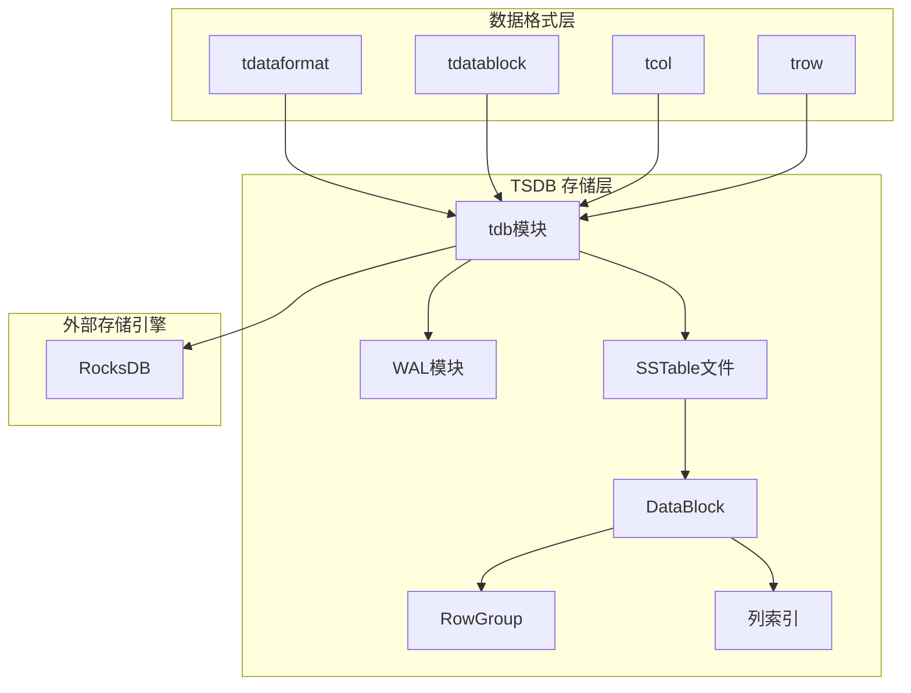
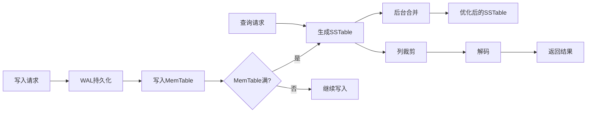
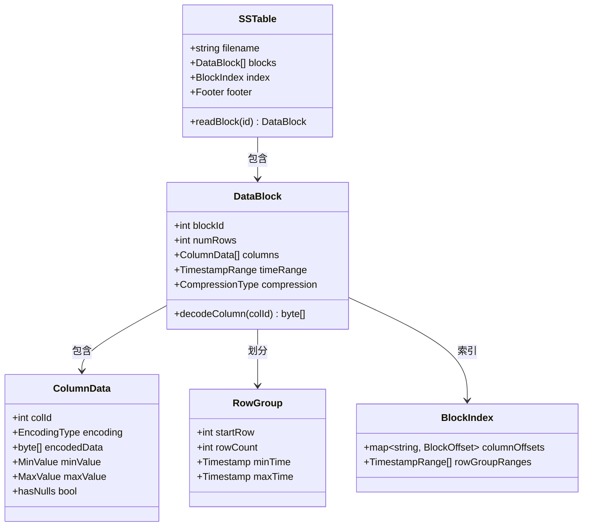
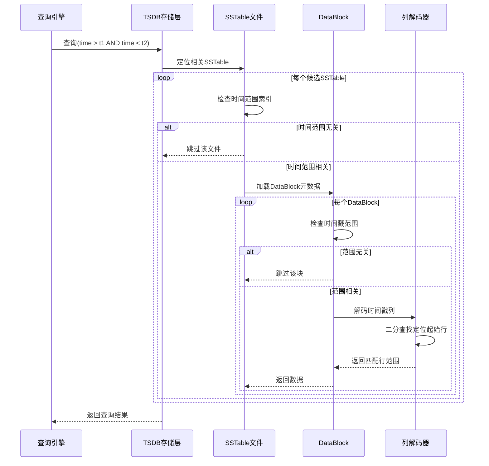
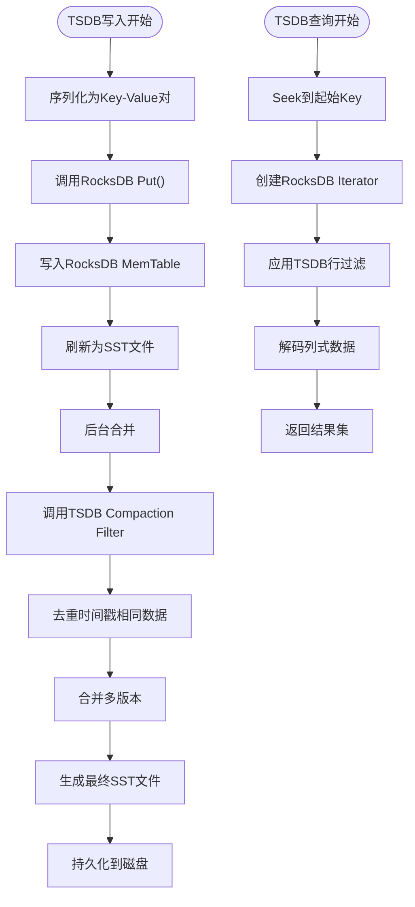
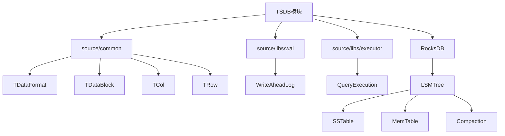

# TSDB文件结构

<cite>
**本文档中引用的文件**  
- [tdb.h](file://source/libs/tdb/inc/tdb.h)
- [tdbDb.c](file://source/libs/tdb/src/db/tdbDb.c)
- [tdbPage.c](file://source/libs/tdb/src/db/tdbPage.c)
- [tdataformat.c](file://source/common/src/tdataformat.c)
- [tdatablock.c](file://source/common/src/tdatablock.c)
- [tcol.c](file://source/common/src/tcol.c)
- [trow.c](file://source/common/src/trow.c)
- [walWrite.c](file://source/libs/wal/src/walWrite.c)
- [walRead.c](file://source/libs/wal/src/walRead.c)
- [rocksdb](file://deps/x86/rocksdb_static/rocksdb/c.h)
- [rreader.cpp](file://tools/rocks-reader/rreader.cpp)
</cite>

## 目录
1. [引言](#引言)
2. [项目结构](#项目结构)
3. [核心组件](#核心组件)
4. [架构概述](#架构概述)
5. [详细组件分析](#详细组件分析)
6. [依赖分析](#依赖分析)
7. [性能考虑](#性能考虑)
8. [故障排除指南](#故障排除指南)
9. [结论](#结论)

## 引言
本文档深入解析TDengine数据库中TSDB（时序数据库）的列式存储文件格式。重点描述数据在磁盘上的组织方式，包括SSTable文件的层次结构、数据块(DataBlock)的内部格式、行组(RowGroup)的划分以及索引机制。同时解释TSDB如何通过列式存储优化时序数据的读取性能，特别是针对时间范围查询的优化策略。此外，文档还说明TSDB与底层RocksDB的集成方式，以及如何利用RocksDB的LSM-Tree结构进行高效的数据管理。

## 项目结构
TDengine的TSDB存储模块主要位于`source/libs/tdb`目录下，负责管理数据的持久化存储和访问。该模块与`source/common`中的数据格式定义、`source/libs/wal`中的预写日志机制以及外部依赖的RocksDB协同工作，构建了一个高效的时序数据存储系统。

**Diagram sources**
- [tdb.h](file://source/libs/tdb/inc/tdb.h#L1-L50)
- [tdataformat.c](file://source/common/src/tdataformat.c#L10-L30)

**Section sources**
- [tdb.h](file://source/libs/tdb/inc/tdb.h#L1-L100)
- [tdataformat.c](file://source/common/src/tdataformat.c#L1-L50)

## 核心组件
TSDB的核心存储结构由多个层次组成：最上层是SSTable（Sorted String Table），每个SSTable包含多个DataBlock，每个DataBlock内部分为若干RowGroup。每一列的数据在DataBlock中以列式方式连续存储，并配有独立的编码和压缩策略。时间戳列作为主键被特殊处理，支持快速的时间范围扫描。

**Section sources**
- [tdbDb.c](file://source/libs/tdb/src/db/tdbDb.c#L25-L100)
- [tdataformat.c](file://source/common/src/tdataformat.c#L15-L80)

## 架构概述
TDengine的TSDB采用分层的列式存储架构，结合LSM-Tree模型实现高效写入和查询。写入操作首先记录到WAL（Write-Ahead Log），然后写入内存中的MemTable。当MemTable达到阈值后，会刷新为磁盘上的SSTable文件。多个SSTable通过后台合并（Compaction）过程进行整理，以减少碎片并优化查询性能。

**Diagram sources**
- [walWrite.c](file://source/libs/wal/src/walWrite.c#L10-L40)
- [tdbDb.c](file://source/libs/tdb/src/db/tdbDb.c#L50-L90)

## 详细组件分析

### SSTable与DataBlock结构分析
SSTable是TSDB中主要的磁盘存储格式，其内部由多个DataBlock组成。每个DataBlock存储固定数量的行数据，采用列式布局，每列独立编码和压缩。这种设计使得在执行聚合查询或范围扫描时，只需加载相关列的数据，显著减少I/O开销。

**Diagram sources**
- [tdbPage.c](file://source/libs/tdb/src/db/tdbPage.c#L15-L45)
- [tdatablock.c](file://source/common/src/tdatablock.c#L5-L20)

### 时间范围查询优化机制
TSDB通过多种机制优化时间范围查询性能。首先，每个DataBlock都记录了其包含数据的时间范围，查询时可快速跳过不相关的块。其次，时间戳列采用增量编码和稀疏索引，支持O(log n)时间复杂度的二分查找定位起始位置。最后，结合RocksDB的布隆过滤器和块缓存，进一步减少磁盘访问。

**Diagram sources**
- [tcol.c](file://source/common/src/tcol.c#L20-L60)
- [trow.c](file://source/common/src/trow.c#L30-L80)

### 与RocksDB集成机制
TDengine的TSDB模块通过封装RocksDB作为底层存储引擎，利用其成熟的LSM-Tree实现高效的写入吞吐和压缩策略。TSDB负责上层的数据组织和查询优化，而RocksDB处理底层的文件管理、缓存和压缩。两者通过定制的Compaction Filter和Merge Operator实现时序数据的特殊处理逻辑。

**Diagram sources**
- [rreader.cpp](file://tools/rocks-reader/rreader.cpp#L45-L120)
- [rocksdb](file://deps/x86/rocksdb_static/rocksdb/c.h#L15-L50)

**Section sources**
- [tdbDb.c](file://source/libs/tdb/src/db/tdbDb.c#L1-L100)
- [rreader.cpp](file://tools/rocks-reader/rreader.cpp#L10-L50)

## 依赖分析
TSDB模块依赖多个核心组件协同工作。`source/common`提供基础数据结构和编码格式，`source/libs/wal`确保数据持久性，`source/libs/executor`处理查询执行计划。外部依赖RocksDB提供可靠的键值存储能力。这些模块通过清晰的接口定义实现松耦合，便于维护和扩展。

**Diagram sources**
- [go.mod](file://go.mod#L1-L20)
- [tdb.h](file://source/libs/tdb/inc/tdb.h#L1-L15)

**Section sources**
- [tdb.h](file://source/libs/tdb/inc/tdb.h#L1-L30)
- [tdataformat.c](file://source/common/src/tdataformat.c#L1-L20)

## 性能考虑
TSDB的列式存储设计在时序数据场景下表现出卓越的性能特征。列式存储结合高效编码（如Delta-of-Delta、Simple8b）可实现高达10倍的数据压缩比。时间范围查询通过块级索引和列裁剪，避免了全表扫描。写入性能得益于LSM-Tree的顺序写特性，支持高吞吐量数据摄入。建议在生产环境中合理配置块大小（Block Size）和行组大小（Row Group Size）以平衡查询和压缩效率。

## 故障排除指南
当遇到TSDB性能问题时，应首先检查SSTable文件的大小分布和Compaction状态。过多的小文件会导致查询性能下降，可通过强制合并（Force Compaction）解决。若写入延迟过高，需检查WAL同步策略和RocksDB的MemTable配置。查询缓慢通常与索引失效或数据倾斜有关，建议分析查询计划并优化时间范围过滤条件。

**Section sources**
- [walWrite.c](file://source/libs/wal/src/walWrite.c#L10-L50)
- [tdbDb.c](file://source/libs/tdb/src/db/tdbDb.c#L15-L40)

## 结论
TDengine的TSDB通过精心设计的列式存储格式和与RocksDB的深度集成，实现了时序数据的高效存储与查询。其分层的SSTable结构、细粒度的行组划分和丰富的索引机制，特别适合处理大规模时间序列数据。未来可进一步优化压缩算法和查询执行计划，以适应更复杂的分析场景。