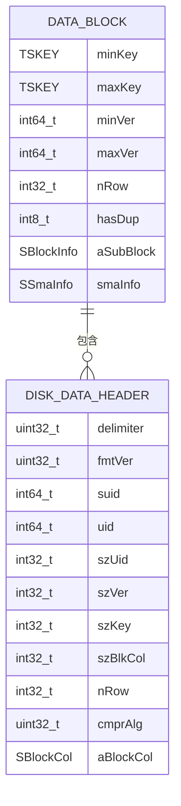

# 存储引擎

<cite>
**本文档中引用的文件**  
- [vnode.h](file://source/dnode/vnode/inc/vnode.h)
- [vnodeInt.h](file://source/dnode/vnode/src/inc/vnodeInt.h)
- [tsdb.h](file://source/dnode/vnode/src/inc/tsdb.h)
- [tsdb.c](file://source/dnode/vnode/src/tsdb/tsdbWrite.c)
- [wal.h](file://include/libs/wal/wal.h)
- [walWrite.c](file://source/libs/wal/src/walWrite.c)
- [tsdbMerge.c](file://source/dnode/vnode/src/tsdb/tsdbMerge.c)
- [tsdbFS.c](file://source/dnode/vnode/src/tsdb/tsdbFS.c)
- [tdb.h](file://source/libs/tdb/inc/tdb.h)
- [sz.h](file://contrib/TSZ/sz/inc/sz.h)
- [zstd.h](file://contrib/TSZ/zstd/zstd.h)
</cite>

## 目录
1. [引言](#引言)
2. [虚拟节点(Vnode)架构](#虚拟节点vnode架构)
3. [WAL写入机制](#wal写入机制)
4. [内存表(MemTable)管理](#内存表memtable管理)
5. [数据落盘与TSDB文件结构](#数据落盘与tsdb文件结构)
6. [列式存储格式与数据块结构](#列式存储格式与数据块结构)
7. [与RocksDB的交互](#与rocksdb的交互)
8. [数据压缩算法](#数据压缩算法)
9. [数据文件合并(Merge)策略](#数据文件合并merge策略)
10. [总结](#总结)

## 引言

TDengine是一款专为物联网(IoT)、车联网、工业互联网等场景设计的高性能、分布式、列式存储的时间序列数据库。其存储引擎采用分层架构设计，核心组件包括虚拟节点(Vnode)、预写日志(WAL)、内存表(MemTable)、时间序列数据库文件(TSDB)以及底层存储引擎RocksDB。本文档旨在全面解析TDengine的存储引擎架构，深入探讨数据从写入到持久化的完整流程，包括WAL的写入机制、MemTable的管理策略、TSDB的列式存储格式、数据压缩算法以及文件合并策略。

## 虚拟节点Vnode架构

虚拟节点(Vnode)是TDengine中数据存储和计算的基本单元。每个Vnode负责管理一个或多个数据表的数据，它是一个独立的、轻量级的数据库实例，封装了WAL、TSDB、元数据(Meta)、流式计算(TQ)等核心组件。

Vnode的核心数据结构定义在`vnodeInt.h`中，其主要成员包括：
- `pWal`: 指向WAL模块的指针，负责处理所有写入请求的持久化。
- `pTsdb`: 指向TSDB模块的指针，负责管理内存表和磁盘上的数据文件。
- `pMeta`: 指向元数据管理模块的指针，存储表的Schema信息。
- `pTq`: 指向流式计算模块的指针，用于处理连续查询。

Vnode通过`SVnode`结构体进行组织，它作为一个容器，协调各个子模块的工作，确保数据的一致性和高可用性。

**Section sources**
- [vnodeInt.h](file://source/dnode/vnode/src/inc/vnodeInt.h#L489-L544)

## WAL写入机制

预写日志(Write-Ahead Log, WAL)是确保数据持久性和崩溃恢复的关键机制。在TDengine中，所有对数据库的修改操作（如插入、更新、删除）都必须先写入WAL，然后才能被应用到内存中的数据结构。

WAL的写入流程如下：
1.  **日志生成**: 当客户端发起写入请求时，Vnode会将请求序列化为一条日志记录(SWalCont)。
2.  **追加写入**: 通过`walAppendLog`接口，将日志记录追加到当前的WAL日志文件末尾。该操作是顺序写入，性能极高。
3.  **索引更新**: 同时，一条包含日志版本号(version)和文件偏移量(offset)的索引记录会被写入对应的WAL索引文件(.idx)，用于快速定位日志。
4.  **持久化**: 根据配置的`fsyncPeriod`，系统会定期或在特定条件下强制将WAL文件从操作系统缓存刷新到磁盘，确保数据不会因系统崩溃而丢失。

WAL的配置参数（如`fsyncPeriod`、`retentionPeriod`）在`SWalCfg`结构体中定义，允许用户根据性能和安全需求进行调整。

**Section sources**
- [wal.h](file://include/libs/wal/wal.h#L101-L128)
- [walWrite.c](file://source/libs/wal/src/walWrite.c)

## 内存表MemTable管理

内存表(MemTable)是数据在写入磁盘前的临时存储区域，它是一个基于跳表(SkipList)的有序数据结构，能够高效地支持数据的插入和查询。

MemTable的管理策略如下：
1.  **写入缓冲**: 从WAL中读取的日志记录会被解析并插入到当前的MemTable中。插入操作根据时间戳(TSKEY)和版本号(version)进行排序。
2.  **双缓冲机制**: TDengine采用双MemTable机制。当一个MemTable写满后，它会被标记为只读(imem)，并触发后台的落盘任务。同时，一个新的可写的MemTable(mem)被创建，用于接收新的写入请求。这种机制避免了写入停顿。
3.  **引用计数**: 为了支持并发读取，MemTable使用了引用计数(`nRef`)。当有查询操作正在访问某个MemTable时，其引用计数会增加，防止该MemTable在落盘过程中被意外销毁。

MemTable的结构体`SMemTable`定义了其核心属性，如`minKey`、`maxKey`、`nRow`等，用于快速判断数据范围和进行查询优化。

**Section sources**
- [tsdb.h](file://source/dnode/vnode/src/inc/tsdb.h#L363-L391)
- [tsdb.h](file://source/dnode/vnode/src/inc/tsdb.h#L450-L470)

## 数据落盘与TSDB文件结构

当MemTable达到一定大小或经过一段时间后，系统会触发一次“提交”(Commit)操作，将内存中的数据持久化到磁盘上的TSDB文件中。

数据落盘的主要流程包括：
1.  **文件组织**: TSDB数据被组织在多个文件中，主要类型有：
    - **.head文件**: 存储数据块(Block)的索引信息。
    - **.data文件**: 存储实际的列式数据块。
    - **.last文件**: 存储每个表的最后一条记录，用于快速查询。
    - **.sma文件**: 存储数据块的统计信息(如最小值、最大值、总和等)。
2.  **文件集(FileSet)**: 一组相关的.head、.data、.sma文件构成一个文件集(SDFileSet)，它们共同代表一个时间窗口内的数据。
3.  **文件系统管理**: `STsdbFS`结构体负责管理所有TSDB文件的元数据，包括文件列表、文件大小、提交ID等。

数据落盘过程由`tsdbCommit`系列函数驱动，确保了数据从内存到磁盘的原子性和一致性。

**Section sources**
- [tsdb.h](file://source/dnode/vnode/src/inc/tsdb.h#L363-L391)
- [tsdbFS.c](file://source/dnode/vnode/src/tsdb/tsdbFS.c)

## 列式存储格式与数据块结构

TDengine采用列式存储，将同一列的数据连续存储，这极大地提高了时间序列数据的压缩率和查询性能（尤其是聚合查询）。

### 数据块(Block)结构

一个数据块(SDataBlk)是TSDB中数据组织的基本单元，其结构如下：
- **元数据**: 包含该块的最小/最大时间戳(`minKey`/`maxKey`)、最小/最大版本号、行数(`nRow`)等。
- **子块(SubBlock)**: 一个数据块可以包含多个子块，用于进一步划分数据。
- **SMA信息**: 指向.sma文件中对应统计信息的偏移量和大小。

### 文件块(FileBlock)结构

文件块是数据在磁盘上的物理存储单元，其结构由`SDiskDataHdr`定义：
- **分隔符和版本号**: 用于校验和兼容性。
- **表ID**: 标识该块属于哪个表(suid/uid)。
- **列信息(SBlockCol)**: 描述每一列的元数据，包括列ID、数据类型、压缩算法、原始大小、位图大小等。
- **数据部分**: 紧随其后的是经过压缩的列数据。

这种设计使得读取时可以按需解压特定列，而无需加载整行数据。

**Diagram sources**
- [tsdb.h](file://source/dnode/vnode/src/inc/tsdb.h#L590-L600)
- [tsdb.h](file://source/dnode/vnode/src/inc/tsdb.h#L630-L640)

## 与RocksDB的交互

TDengine的TSDB模块在底层使用了RocksDB作为其嵌入式键值存储引擎，主要用于缓存和加速对元数据及部分热数据的访问。

交互方式如下：
1.  **RocksDB实例**: 在`STsdb`结构体中，`SRocksCache`成员封装了RocksDB的数据库实例(`db`)、选项(`options`)和读写选项(`readoptions`, `writeoptions`)。
2.  **缓存层**: RocksDB充当了一个持久化的LRU缓存。TSDB会将频繁访问的元数据（如表Schema）或数据块索引缓存在RocksDB中。
3.  **读写操作**: 当需要读取数据时，TSDB会首先尝试从RocksDB缓存中获取。如果缓存未命中，则从TSDB文件中读取，并将结果写入RocksDB以供后续使用。写入操作也会同步更新缓存。

通过`tdb.h`中的接口，TSDB模块与RocksDB进行交互，实现了高性能的键值存储功能。

**Section sources**
- [tsdb.h](file://source/dnode/vnode/src/inc/tsdb.h#L363-L391)
- [tdb.h](file://source/libs/tdb/inc/tdb.h)

## 数据压缩算法

为了最大化存储效率，TDengine对时间序列数据应用了多种高效的压缩算法。

### SZ压缩算法

SZ是一种专为科学计算数据设计的有损/无损压缩算法，特别适用于浮点数序列。TDengine集成了SZ算法，其核心思想是利用数据的时空相关性进行预测和编码。
- **原理**: 通过线性预测模型预测下一个数据点，然后对预测误差进行编码和压缩。
- **应用**: 主要用于压缩`FLOAT`和`DOUBLE`类型的列数据，压缩比极高。

### Zstd压缩算法

Zstd是一种通用的、高性能的无损压缩算法，由Facebook开发。它在压缩速度和压缩比之间提供了优秀的平衡。
- **原理**: 基于LZ77算法的改进，结合了有限状态熵(FSE)编码。
- **应用**: 作为TSDB文件的通用压缩层，用于压缩数据块、索引等所有二进制内容。用户可以通过配置选择不同的压缩级别。

这些压缩算法的应用由`SBlockCol`结构体中的`cmprAlg`字段控制，并在`tBlockDataCompress`和`tBlockDataDecompress`函数中实现。

**Section sources**
- [sz.h](file://contrib/TSZ/sz/inc/sz.h)
- [zstd.h](file://contrib/TSZ/zstd/zstd.h)
- [tsdb.h](file://source/dnode/vnode/src/inc/tsdb.h#L640-L650)

## 数据文件合并Merge策略

随着时间的推移，TSDB会产生大量小的文件集。为了减少文件数量、提高查询效率并回收存储空间，TDengine会定期执行文件合并(Merge)操作。

合并策略的核心要点：
1.  **触发条件**: 当某个时间窗口内的文件集数量超过阈值，或系统空闲时，后台合并任务(`tsdbMerge`)会被触发。
2.  **合并过程**: 
    - 读取多个小的文件集。
    - 将其中的数据块按时间顺序重新排序和合并。
    - 生成一个或多个新的、更大的文件集。
    - 更新.sma文件中的统计信息。
    - 原始的小文件集在确认无用后被删除。
3.  **优势**: 合并后，查询一个时间范围内的数据可能只需要访问更少的文件，大大减少了I/O开销。同时，删除过期数据也在此过程中完成。

合并操作由`tsdbMerge.c`中的`tsdbMerge`函数实现，是一个资源密集型但对长期性能至关重要的后台任务。

**Section sources**
- [tsdbMerge.c](file://source/dnode/vnode/src/tsdb/tsdbMerge.c)
- [tsdb.h](file://source/dnode/vnode/src/inc/tsdb.h#L370-L371)

## 总结

TDengine的存储引擎通过精心设计的分层架构，实现了高性能、高可靠的时间序列数据管理。其核心在于：
- **WAL**确保了数据的持久性和原子性。
- **双MemTable**机制提供了无锁的高并发写入能力。
- **列式存储**和**多级压缩**（SZ + Zstd）极大提升了存储效率。
- **文件合并**策略保证了长期运行下的查询性能。
- **与RocksDB的集成**为元数据访问提供了高效的缓存层。

这一系列技术的有机结合，使得TDengine能够在海量时间序列数据场景下，提供卓越的写入吞吐量和查询响应速度。