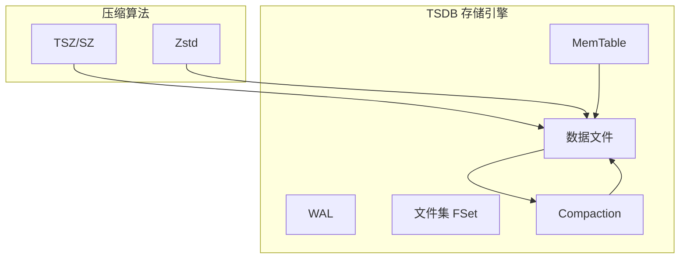
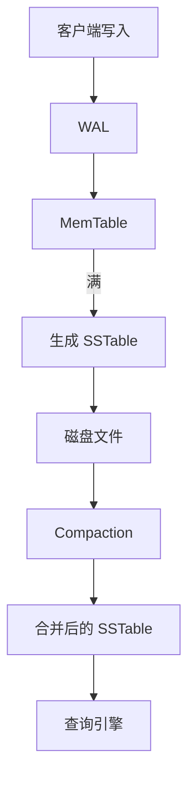
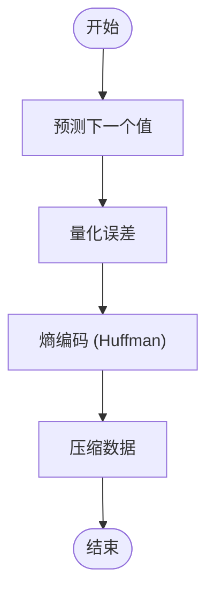
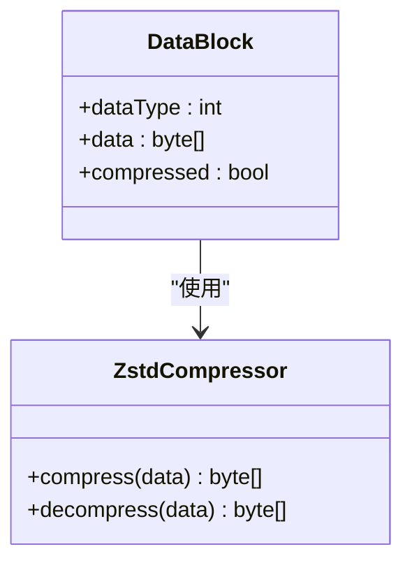
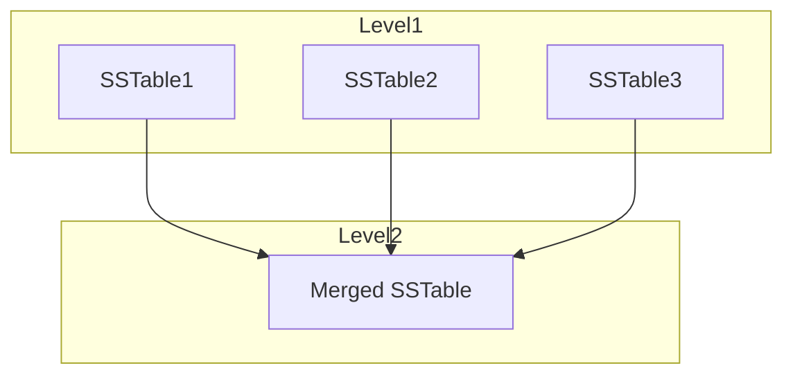
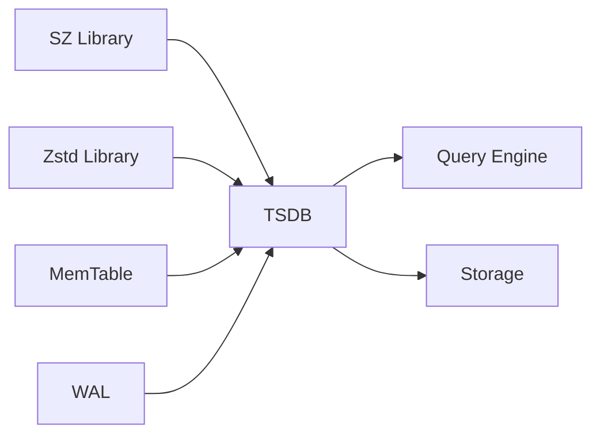

# 数据压缩与合并

<cite>
**本文档中引用的文件**  
- [tsdb.c](file://source/dnode/vnode/src/tsdb/tsdb.c)
- [tsdb.h](file://source/dnode/vnode/src/inc/tsdb.h)
- [tsdbMerge.c](file://source/dnode/vnode/src/tsdb/tsdbMerge.c)
- [sz.c](file://contrib/TSZ/sz/src/sz.c)
- [sz_float.c](file://contrib/TSZ/sz/src/sz_float.c)
- [sz_double.c](file://contrib/TSZ/sz/src/sz_double.c)
- [td_sz.c](file://contrib/TSZ/sz/src/td_sz.c)
- [dataCompression.c](file://contrib/TSZ/sz/src/dataCompression.c)
- [tsdbDef.h](file://source/dnode/vnode/src/tsdb/tsdbDef.h)
- [tsdbFS.c](file://source/dnode/vnode/src/tsdb/tsdbFS.c)
- [tsdbFile.c](file://source/dnode/vnode/src/tsdb/tsdbFile.c)
</cite>

## 目录
1. [引言](#引言)
2. [项目结构](#项目结构)
3. [核心组件](#核心组件)
4. [架构概述](#架构概述)
5. [详细组件分析](#详细组件分析)
6. [依赖分析](#依赖分析)
7. [性能考虑](#性能考虑)
8. [故障排除指南](#故障排除指南)
9. [结论](#结论)

## 引言
TDengine 是一个高性能、分布式的时序数据库，专为物联网、车联网、工业互联网等场景设计。其核心优势之一是高效的数据压缩与存储管理机制。本文档全面介绍 TDengine 的数据压缩与文件合并策略，重点分析其如何利用 SZ 和 Zstd 等压缩算法对浮点数、整数、字符串等不同类型的数据进行高效压缩，并通过后台 Compaction 机制优化存储结构与查询性能。

## 项目结构
TDengine 的源码结构清晰，模块化程度高。数据压缩与文件合并功能主要分布在 `contrib/TSZ` 和 `source/dnode/vnode/src/tsdb` 两个目录中。`contrib/TSZ` 包含了 SZ 压缩算法的实现，而 `tsdb` 模块则负责时序数据的存储、压缩、合并等核心逻辑。

**Diagram sources**
- [tsdb.h](file://source/dnode/vnode/src/inc/tsdb.h#L1-L50)
- [sz.c](file://contrib/TSZ/sz/src/sz.c#L1-L30)

**Section sources**
- [source/dnode/vnode](file://source/dnode/vnode)
- [contrib/TSZ](file://contrib/TSZ)

## 核心组件
TDengine 的数据压缩与合并功能由多个核心组件协同完成。主要包括：
- **SZ 压缩库**：用于浮点数的有损压缩，特别适用于科学计算和传感器数据。
- **Zstd 压缩库**：用于整数、字符串等类型的无损压缩，提供高压缩比和快速解压性能。
- **TSDB 存储引擎**：负责数据的写入、缓存、落盘、查询和合并。
- **MemTable 与 SSTable**：内存表和磁盘上的排序字符串表，是 LSM-Tree 架构的基础。
- **Compaction 模块**：负责将多个小的 SSTable 合并为更大的文件，以减少文件数量和提升查询效率。

**Section sources**
- [tsdb.h](file://source/dnode/vnode/src/inc/tsdb.h#L50-L100)
- [sz.c](file://contrib/TSZ/sz/src/sz.c#L30-L60)
- [tsdbMerge.c](file://source/dnode/vnode/src/tsdb/tsdbMerge.c#L10-L40)

## 架构概述
TDengine 采用 LSM-Tree（Log-Structured Merge-Tree）架构来管理时序数据。新写入的数据首先写入 WAL（Write-Ahead Log）以确保持久性，然后进入内存中的 MemTable。当 MemTable 达到一定大小后，会被冻结并转换为 SSTable（Sorted String Table），落盘存储。随着数据不断写入，会产生大量小的 SSTable 文件。Compaction 过程会周期性地将这些小文件合并成更大的文件，同时清理过期或被删除的数据。

**Diagram sources**
- [tsdbWrite.c](file://source/dnode/vnode/src/tsdb/tsdbWrite.c#L1-L20)
- [tsdbMerge.c](file://source/dnode/vnode/src/tsdb/tsdbMerge.c#L1-L30)

## 详细组件分析

### 数据压缩机制分析
TDengine 针对不同类型的数据采用不同的压缩算法，以实现最佳的压缩效果。

#### 浮点数压缩（SZ 算法）
对于浮点数类型（float/double），TDengine 集成了 SZ 压缩算法。SZ 是一种基于误差控制的有损压缩算法，能够在保证数据精度的前提下实现极高的压缩比。其核心思想是利用数据的局部相关性，通过预测和量化来消除冗余。

**Diagram sources**
- [sz_float.c](file://contrib/TSZ/sz/src/sz_float.c#L1-L40)
- [sz_double.c](file://contrib/TSZ/sz/src/sz_double.c#L1-L40)
- [dataCompression.c](file://contrib/TSZ/sz/src/dataCompression.c#L1-L30)

#### 整数与字符串压缩（Zstd 算法）
对于整数、字符串等类型，TDengine 使用 Zstd 进行无损压缩。Zstd 在压缩速度和压缩比之间取得了良好的平衡，非常适合时序数据库的场景。

**Diagram sources**
- [tsdbDataFileRW.c](file://source/dnode/vnode/src/tsdb/tsdbDataFileRW.c#L100-L150)
- [tsdbDef.h](file://source/dnode/vnode/src/tsdb/tsdbDef.h#L200-L220)

### 合并（Compaction）过程分析
Compaction 是 TDengine 后台的重要维护任务，旨在优化存储结构。

#### 合并触发条件
Compaction 的触发主要基于以下条件：
- 内存中的 MemTable 达到阈值，触发 flush 到磁盘。
- 磁盘上某一层的 SSTable 文件数量超过预设阈值。
- 系统空闲时进行周期性合并。

#### 合并策略
TDengine 采用了类似 size-tiered 的合并策略。同一层的多个小文件会被合并成一个更大的文件，并提升到下一层。这种策略可以有效减少查询时需要扫描的文件数量。

**Diagram sources**
- [tsdbMerge.c](file://source/dnode/vnode/src/tsdb/tsdbMerge.c#L50-L100)
- [tsdbMergeTree.c](file://source/dnode/vnode/src/tsdb/tsdbMergeTree.c#L1-L30)

#### 合并对查询性能的影响
合并操作虽然会消耗一定的 I/O 和 CPU 资源，但长期来看对查询性能有显著提升：
- 减少了文件数量，降低了文件打开和元数据读取的开销。
- 合并过程中会清理过期数据，减少无效数据的扫描。
- 数据更加有序，有利于范围查询的性能。

**Section sources**
- [tsdbMerge.c](file://source/dnode/vnode/src/tsdb/tsdbMerge.c#L1-L150)
- [sz_float.c](file://contrib/TSZ/sz/src/sz_float.c#L1-L100)
- [sz_double.c](file://contrib/TSZ/sz/src/sz_double.c#L1-L100)

## 依赖分析
TDengine 的压缩与合并功能依赖于多个外部和内部模块。

**Diagram sources**
- [go.mod](file://go.mod#L1-L20)
- [CMakeLists.txt](file://CMakeLists.txt#L50-L70)

**Section sources**
- [contrib/TSZ/CMakeLists.txt](file://contrib/TSZ/CMakeLists.txt#L1-L20)
- [source/dnode/vnode/CMakeLists.txt](file://source/dnode/vnode/CMakeLists.txt#L100-L120)

## 性能考虑
- **压缩比**：SZ 算法对浮点数的压缩比通常可达 10:1 以上，Zstd 对文本和整数的压缩比也十分可观。
- **CPU 开销**：压缩和解压过程会消耗 CPU 资源，但 TDengine 通过异步处理和批处理来最小化对主线程的影响。
- **I/O 优化**：通过减少实际写入磁盘的数据量，显著降低了 I/O 压力。

## 故障排除指南
- **压缩失败**：检查数据类型是否匹配，或 SZ 的误差配置是否合理。
- **合并卡住**：查看系统 I/O 负载，或检查是否有大查询正在运行。
- **存储空间未释放**：合并完成后，旧文件的删除可能有延迟，需等待系统清理。

**Section sources**
- [tsdbMerge.c](file://source/dnode/vnode/src/tsdb/tsdbMerge.c#L200-L250)
- [tsdbFS.c](file://source/dnode/vnode/src/tsdb/tsdbFS.c#L100-L150)

## 结论
TDengine 通过集成 SZ 和 Zstd 等先进的压缩算法，并结合 LSM-Tree 架构下的 Compaction 机制，实现了高效的时序数据存储。这种设计不仅大幅减少了存储空间占用，还通过后台合并优化了查询性能，使其在处理海量时序数据时表现出色。源码层面的实现清晰、模块化，为后续的优化和扩展提供了坚实的基础。