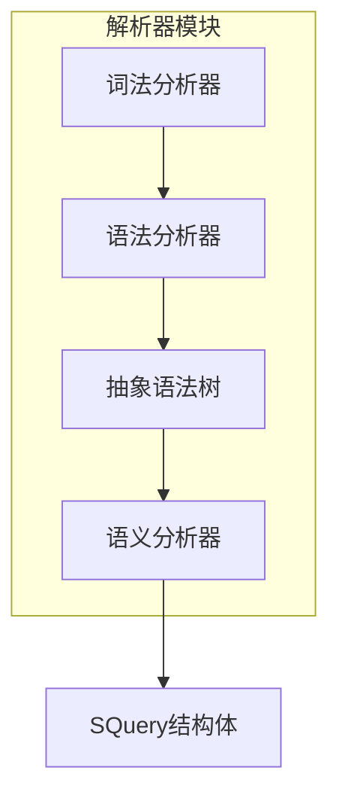
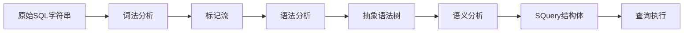
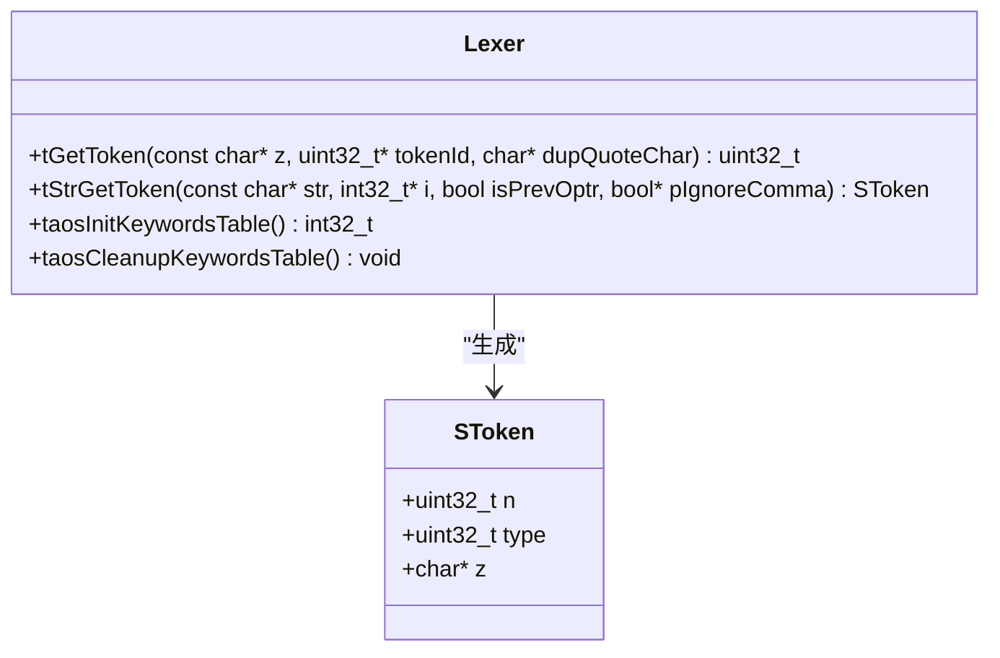
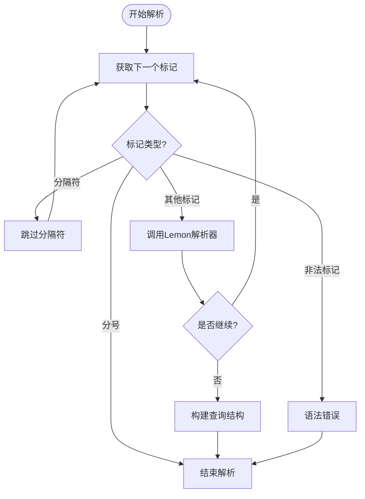
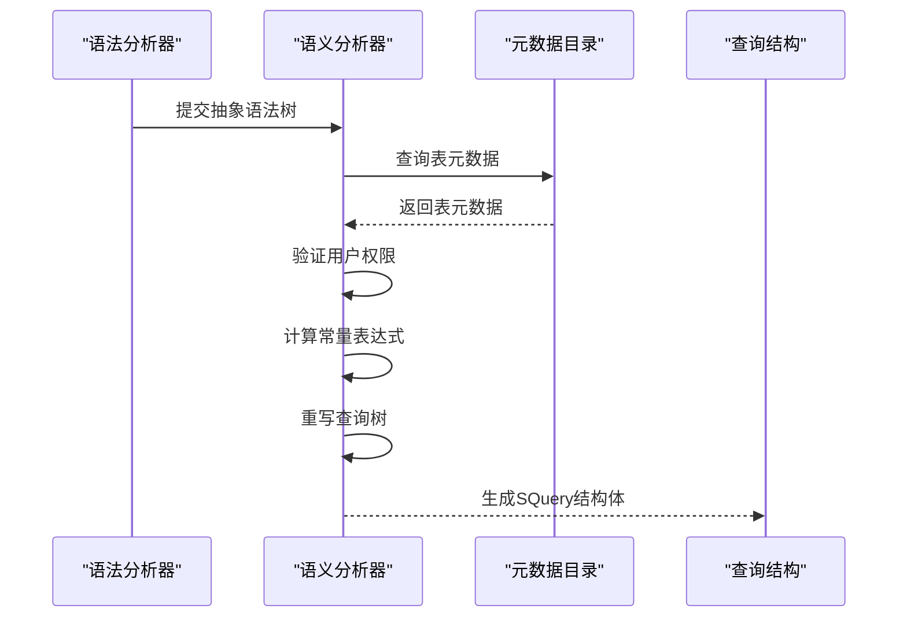
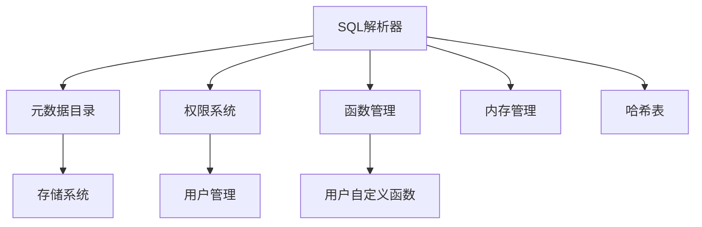

# SQL解析

<cite>
**本文档引用的文件**  
- [sql.y](file://source/libs/parser/inc/sql.y)
- [parser.c](file://source/libs/parser/src/parser.c)
- [parAstParser.c](file://source/libs/parser/src/parAstParser.c)
- [parAst.h](file://source/libs/parser/inc/parAst.h)
- [parTokenizer.c](file://source/libs/parser/src/parTokenizer.c)
- [parToken.h](file://source/libs/parser/inc/parToken.h)
- [parInt.h](file://source/libs/parser/inc/parInt.h)
- [parTranslater.c](file://source/libs/parser/src/parTranslater.c)
</cite>

## 目录
1. [引言](#引言)
2. [项目结构](#项目结构)
3. [核心组件](#核心组件)
4. [架构概述](#架构概述)
5. [详细组件分析](#详细组件分析)
6. [依赖分析](#依赖分析)
7. [性能考虑](#性能考虑)
8. [故障排除指南](#故障排除指南)
9. [结论](#结论)

## 引言
本文档详细介绍了TDengine数据库中SQL解析器的设计与实现。重点阐述了如何使用Lemon工具从`sql.y`语法文件生成C语言解析器，以及解析器如何将原始SQL字符串转换为内部查询表示。文档涵盖了词法分析、语法分析、语义分析的全过程，并详细说明了`SQuery`结构体的生成机制和对各种SQL语句的处理方式。

## 项目结构
TDengine的SQL解析器位于`source/libs/parser`目录下，采用模块化设计，主要由词法分析器、语法分析器和语义分析器三部分组成。该模块通过Lemon工具生成的解析器与自定义的AST（抽象语法树）创建和转换逻辑相结合，实现了完整的SQL解析功能。

**Diagram sources**
- [parTokenizer.c](file://source/libs/parser/src/parTokenizer.c#L1-L100)
- [parAstParser.c](file://source/libs/parser/src/parAstParser.c#L1-L50)
- [parTranslater.c](file://source/libs/parser/src/parTranslater.c#L1-L50)

**Section sources**
- [parTokenizer.c](file://source/libs/parser/src/parTokenizer.c#L1-L200)
- [parAstParser.c](file://source/libs/parser/src/parAstParser.c#L1-L100)
- [parTranslater.c](file://source/libs/parser/src/parTranslater.c#L1-L100)

## 核心组件
SQL解析器的核心组件包括词法分析器、语法分析器和语义分析器。词法分析器负责将SQL字符串分解为标记流，语法分析器根据`sql.y`定义的语法规则构建抽象语法树，语义分析器则负责将语法树转换为可执行的查询计划。

**Section sources**
- [parTokenizer.c](file://source/libs/parser/src/parTokenizer.c#L1-L500)
- [parAstParser.c](file://source/libs/parser/src/parAstParser.c#L1-L300)
- [parTranslater.c](file://source/libs/parser/src/parTranslater.c#L1-L200)

## 架构概述
TDengine的SQL解析器采用经典的编译器架构，分为三个主要阶段：词法分析、语法分析和语义分析。整个解析过程从原始SQL字符串开始，经过词法分析生成标记流，再通过语法分析构建抽象语法树，最后通过语义分析生成可执行的查询结构。

**Diagram sources**
- [parTokenizer.c](file://source/libs/parser/src/parTokenizer.c#L1-L100)
- [parAstParser.c](file://source/libs/parser/src/parAstParser.c#L1-L50)
- [parTranslater.c](file://source/libs/parser/src/parTranslater.c#L1-L50)

## 详细组件分析

### 词法分析器分析
词法分析器负责将输入的SQL字符串分解为有意义的标记（Token）。它通过`parTokenizer.c`文件中的`tGetToken`函数实现，能够识别关键字、标识符、字符串、数字等各种SQL元素。

#### 词法分析器类图

**Diagram sources**
- [parTokenizer.c](file://source/libs/parser/src/parTokenizer.c#L1-L1000)
- [parToken.h](file://source/libs/parser/inc/parToken.h#L1-L50)

### 语法分析器分析
语法分析器使用Lemon工具从`sql.y`语法文件生成，负责根据预定义的语法规则将标记流转换为抽象语法树。解析器采用自底向上的分析方法，通过状态机实现语法分析。

#### 语法分析流程图

**Diagram sources**
- [parAstParser.c](file://source/libs/parser/src/parAstParser.c#L1-L500)
- [sql.y](file://source/libs/parser/inc/sql.y#L1-L100)

### 语义分析器分析
语义分析器负责将抽象语法树转换为可执行的查询结构。它通过`parTranslater.c`文件中的`translate`函数实现，负责处理表名解析、权限验证、常量计算等语义层面的处理。

#### 语义分析序列图

**Diagram sources**
- [parTranslater.c](file://source/libs/parser/src/parTranslater.c#L1-L1000)
- [parAstParser.c](file://source/libs/parser/src/parAstParser.c#L1-L100)

## 依赖分析
SQL解析器模块依赖于多个外部组件，包括元数据目录服务、权限验证系统和函数管理系统。这些依赖关系确保了解析器能够正确处理表名解析、权限检查和函数调用等复杂语义。

**Diagram sources**
- [parTranslater.c](file://source/libs/parser/src/parTranslater.c#L1-L50)
- [parAstParser.c](file://source/libs/parser/src/parAstParser.c#L1-L50)

**Section sources**
- [parTranslater.c](file://source/libs/parser/src/parTranslater.c#L1-L200)
- [parAstParser.c](file://source/libs/parser/src/parAstParser.c#L1-L100)

## 性能考虑
SQL解析器在设计时充分考虑了性能因素。通过使用Lemon生成的高效状态机进行语法分析，以及采用哈希表快速查找关键字和表名，确保了高并发场景下的解析效率。此外，解析器还实现了查询缓存机制，避免重复解析相同的SQL语句。

## 故障排除指南
当SQL解析出现错误时，通常可以通过检查错误消息和SQL语句的语法来定位问题。常见的解析错误包括语法错误、表名不存在、权限不足等。解析器会生成详细的错误消息，帮助用户快速定位和解决问题。

**Section sources**
- [parAstParser.c](file://source/libs/parser/src/parAstParser.c#L1-L100)
- [parTranslater.c](file://source/libs/parser/src/parTranslater.c#L1-L100)

## 结论
TDengine的SQL解析器采用模块化设计，通过词法分析、语法分析和语义分析三个阶段，将原始SQL字符串转换为可执行的查询结构。该设计具有良好的可扩展性和维护性，能够高效处理各种复杂的SQL语句，为数据库的查询执行提供了坚实的基础。