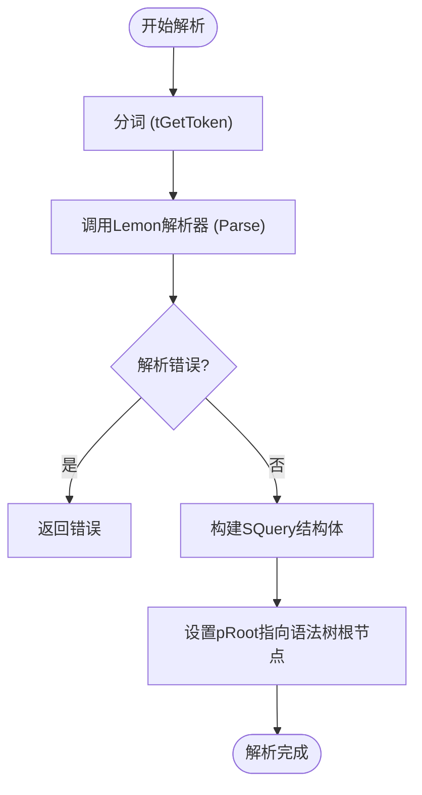
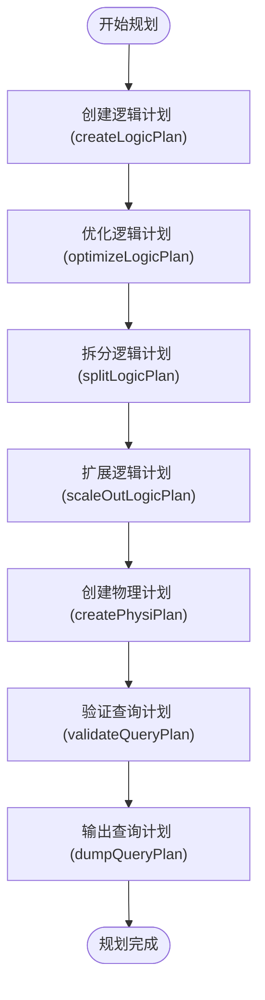
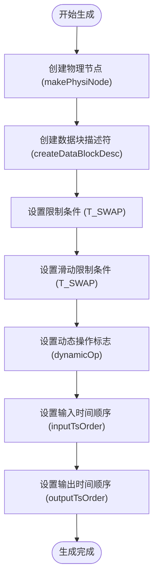
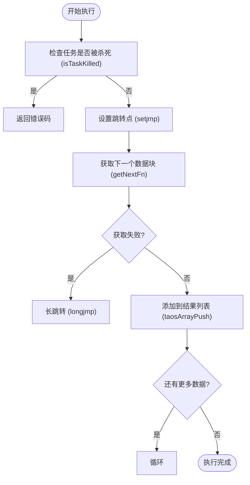
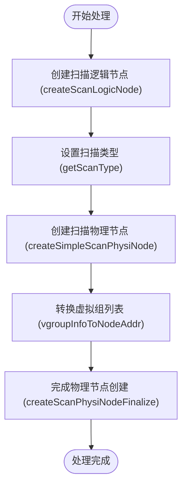
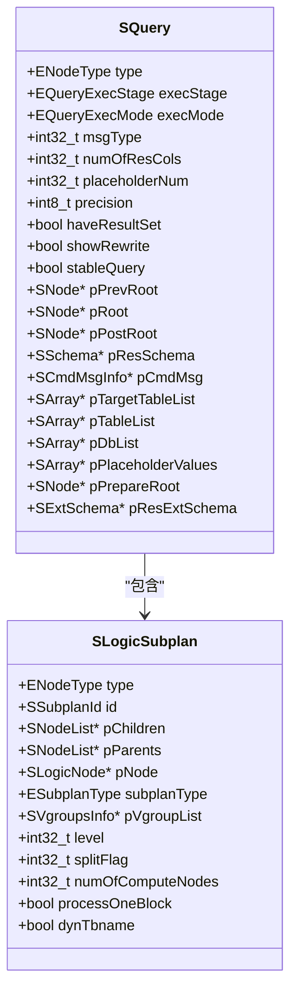

# 查询处理

<cite>
**本文档引用的文件**   
- [SQuery.h](file://include/libs/nodes/querynodes.h#L770-L792)
- [SLogicSubplan.h](file://include/libs/nodes/plannodes.h#L424-L437)
- [parAstParser.c](file://source/libs/parser/src/parAstParser.c)
- [planner.c](file://source/libs/planner/src/planner.c)
- [planLogicCreater.c](file://source/libs/planner/src/planLogicCreater.c)
- [planPhysiCreater.c](file://source/libs/planner/src/planPhysiCreater.c)
- [executor.c](file://source/libs/executor/src/executor.c)
- [querytask.c](file://source/libs/executor/src/querytask.c)
- [scanoperator.c](file://source/libs/executor/src/scanoperator.c)
- [projectoperator.c](file://source/libs/executor/src/projectoperator.c)
</cite>

## 目录
1. [引言](#引言)
2. [SQL解析与语法树生成](#sql解析与语法树生成)
3. [查询规划](#查询规划)
4. [执行计划生成](#执行计划生成)
5. [执行器与操作符](#执行器与操作符)
6. [分布式查询处理](#分布式查询处理)
7. [查询生命周期](#查询生命周期)
8. [结论](#结论)

## 引言
本文档深入剖析TDengine的查询处理管道，详细说明SQL语句如何通过Lemon生成的解析器被解析成语法树，查询规划器(planner)如何生成逻辑和物理执行计划，以及执行器(executor)如何调度和执行这些计划。重点解释分布式查询的拆分与合并逻辑，以及执行计划中各个操作符（如Scan, Filter, Aggregate, Join）的实现。结合SQuery和SLogicSubplan等核心数据结构，阐述查询的生命周期。

## SQL解析与语法树生成
TDengine使用Lemon生成的解析器将SQL语句解析成语法树。解析过程从`parAstParser.c`文件中的`parse`函数开始，该函数接收`SParseContext`和`SQuery`指针作为参数。解析器通过`ParseAlloc`分配内存，然后逐个读取SQL语句中的标记，调用`Parse`函数进行解析。当遇到分号或非法标记时，解析过程结束。解析完成后，`buildQueryAfterParse`函数将生成的语法树根节点赋值给`SQuery`结构体的`pRoot`字段。

**图源**
- [parAstParser.c](file://source/libs/parser/src/parAstParser.c#L34-L77)

**章节源**
- [parAstParser.c](file://source/libs/parser/src/parAstParser.c#L34-L77)

## 查询规划
查询规划器负责将语法树转换为逻辑执行计划。`planner.c`文件中的`qCreateQueryPlan`函数是查询规划的入口点。该函数接收`SPlanContext`指针和`SQueryPlan`指针作为参数，首先调用`createLogicPlan`函数创建逻辑计划，然后调用`optimizeLogicPlan`函数优化逻辑计划，接着调用`splitLogicPlan`函数拆分逻辑计划，再调用`scaleOutLogicPlan`函数扩展逻辑计划，最后调用`createPhysiPlan`函数创建物理计划。

**图源**
- [planner.c](file://source/libs/planner/src/planner.c#L101-L125)

**章节源**
- [planner.c](file://source/libs/planner/src/planner.c#L101-L125)

## 执行计划生成
执行计划生成器将逻辑执行计划转换为物理执行计划。`planPhysiCreater.c`文件中的`makePhysiNode`函数是物理节点创建的核心函数。该函数接收`SPhysiPlanContext`指针、`SLogicNode`指针和节点类型作为参数，首先调用`nodesMakeNode`函数创建物理节点，然后调用`createDataBlockDesc`函数创建数据块描述符，最后将逻辑节点的限制条件和滑动限制条件赋值给物理节点。

**图源**
- [planPhysiCreater.c](file://source/libs/planner/src/planPhysiCreater.c#L101-L125)

**章节源**
- [planPhysiCreater.c](file://source/libs/planner/src/planPhysiCreater.c#L101-L125)

## 执行器与操作符
执行器负责调度和执行物理执行计划。`executor.c`文件中的`qExecTaskOpt`函数是执行任务的核心函数。该函数接收`qTaskInfo_t`、`SArray`、`uint64_t`、`bool`、`SLocalFetch`和`bool`作为参数，首先检查任务是否已被杀死，然后设置跳转点以处理错误，接着调用`pTaskInfo->pRoot->fpSet.getNextFn`函数获取下一个数据块，最后将数据块添加到结果列表中。

**图源**
- [executor.c](file://source/libs/executor/src/executor.c#L101-L125)

**章节源**
- [executor.c](file://source/libs/executor/src/executor.c#L101-L125)

## 分布式查询处理
TDengine的分布式查询处理涉及查询计划的拆分与合并。`planLogicCreater.c`文件中的`createScanLogicNode`函数负责创建扫描逻辑节点，该函数会根据表的类型和扫描类型设置不同的扫描标志。`planPhysiCreater.c`文件中的`createSimpleScanPhysiNode`函数负责创建简单的扫描物理节点，该函数会将逻辑节点的虚拟组列表转换为节点地址，并调用`createScanPhysiNodeFinalize`函数完成物理节点的创建。

**图源**
- [planLogicCreater.c](file://source/libs/planner/src/planLogicCreater.c#L101-L125)
- [planPhysiCreater.c](file://source/libs/planner/src/planPhysiCreater.c#L101-L125)

**章节源**
- [planLogicCreater.c](file://source/libs/planner/src/planLogicCreater.c#L101-L125)
- [planPhysiCreater.c](file://source/libs/planner/src/planPhysiCreater.c#L101-L125)

## 查询生命周期
TDengine的查询生命周期从客户端发送SQL语句开始，经过解析、规划、执行三个阶段，最终返回结果。`SQuery`结构体是查询的核心数据结构，包含查询的类型、执行阶段、执行模式、消息类型、结果列数、占位符数量、精度、是否有结果集、是否显示重写、是否为稳定查询、前一个根节点、根节点、后一个根节点、结果模式、命令消息信息、目标表列表、表列表、数据库列表、占位符值列表、准备根节点和结果扩展模式等字段。

**图源**
- [SQuery.h](file://include/libs/nodes/querynodes.h#L770-L792)
- [SLogicSubplan.h](file://include/libs/nodes/plannodes.h#L424-L437)

**章节源**
- [SQuery.h](file://include/libs/nodes/querynodes.h#L770-L792)
- [SLogicSubplan.h](file://include/libs/nodes/plannodes.h#L424-L437)

## 结论
TDengine的查询处理管道是一个复杂而高效的系统，通过Lemon生成的解析器将SQL语句解析成语法树，查询规划器生成逻辑和物理执行计划，执行器调度和执行这些计划。分布式查询的拆分与合并逻辑确保了查询在多节点环境下的高效执行。SQuery和SLogicSubplan等核心数据结构贯穿整个查询生命周期，确保了查询的正确性和一致性。