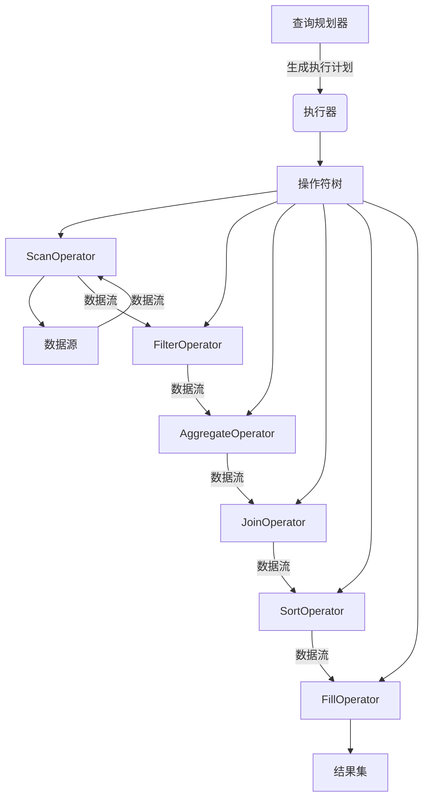
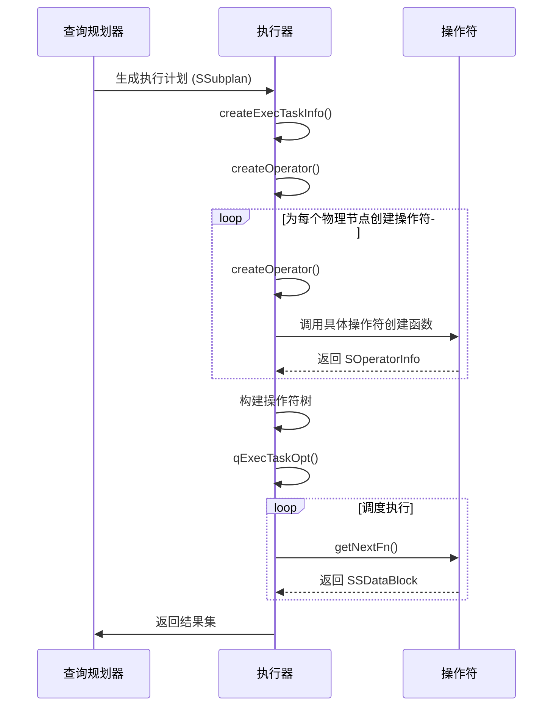
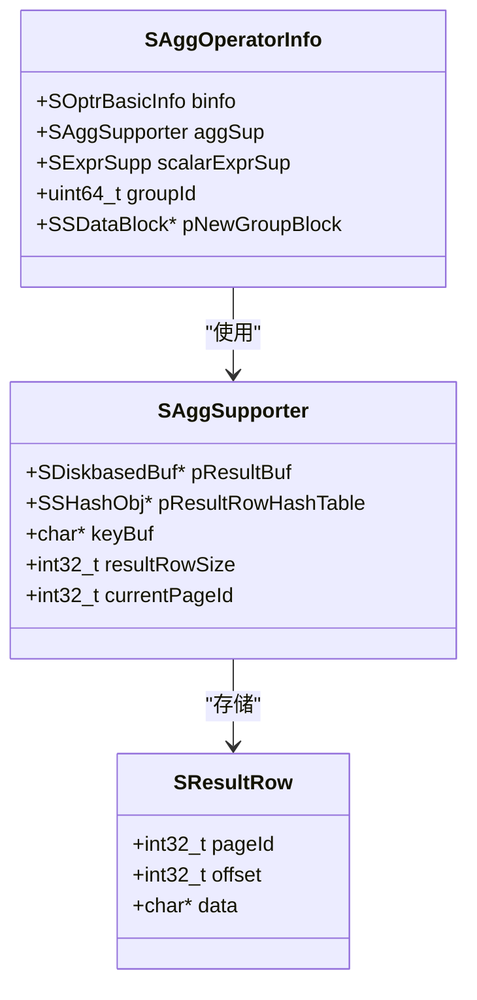
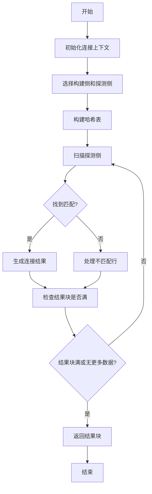

# 查询执行

<cite>
**本文档引用的文件**
- [operator.h](file://source\libs\executor\inc\operator.h)
- [querytask.h](file://source\libs\executor\inc\querytask.h)
- [operator.c](file://source\libs\executor\src\operator.c)
- [executor.c](file://source\libs\executor\src\executor.c)
- [scanoperator.c](file://source\libs\executor\src\scanoperator.c)
- [aggregateoperator.c](file://source\libs\executor\src\aggregateoperator.c)
- [hashjoinoperator.c](file://source\libs\executor\src\hashjoinoperator.c)
- [sortoperator.c](file://source\libs\executor\src\sortoperator.c)
- [filloperator.c](file://source\libs\executor\src\filloperator.c)
</cite>

## 目录
1. [引言](#引言)
2. [执行器架构概述](#执行器架构概述)
3. [执行计划的接收与调度](#执行计划的接收与调度)
4. [核心操作符实现机制](#核心操作符实现机制)
5. [数据流与内存管理](#数据流与内存管理)
6. [分布式查询结果合并](#分布式查询结果合并)
7. [错误与超时处理](#错误与超时处理)
8. [性能监控与调优建议](#性能监控与调优建议)

## 引言
本文档旨在全面描述TDengine数据库中查询执行引擎的工作机制。重点阐述执行器如何接收由查询规划器生成的执行计划，并调度执行。文档深入解析了执行管道中的各种操作符（Operator）的实现细节，包括ScanOperator、FilterOperator、AggregateOperator和JoinOperator。同时，详细说明了数据在操作符之间的流式处理方式，以及内存管理和资源调度策略。此外，文档还阐述了分布式查询结果的合并过程，以及执行器如何处理执行过程中的错误和超时情况，并提供了性能监控和调优建议。

## 执行器架构概述

**Diagram sources**
- [operator.h](file://source\libs\executor\inc\operator.h#L1-L214)
- [operator.c](file://source\libs\executor\src\operator.c#L0-L799)

**Section sources**
- [operator.h](file://source\libs\executor\inc\operator.h#L1-L214)
- [operator.c](file://source\libs\executor\src\operator.c#L0-L799)

## 执行计划的接收与调度

执行器通过`createOperator`函数接收由查询规划器生成的物理执行计划节点（`SPhysiNode`），并递归地创建相应的操作符对象（`SOperatorInfo`），最终构建出一棵操作符树。该树的根节点即为整个查询的执行入口。

**Diagram sources**
- [operator.c](file://source\libs\executor\src\operator.c#L0-L799)
- [executor.c](file://source\libs\executor\src\executor.c#L0-L799)

**Section sources**
- [operator.c](file://source\libs\executor\src\operator.c#L0-L799)
- [executor.c](file://source\libs\executor\src\executor.c#L0-L799)

## 核心操作符实现机制

### ScanOperator
ScanOperator负责从数据源（如TSDB）读取原始数据块。它通过`STableScanInfo`结构体管理扫描状态，并利用`tsdReader`接口与存储层交互。其核心函数`loadDataBlock`根据过滤条件和时间窗口，决定是加载完整数据块、仅加载SMA信息、跳过数据块还是将其过滤掉。

**Section sources**
- [scanoperator.c](file://source\libs\executor\src\scanoperator.c#L0-L799)

### AggregateOperator
AggregateOperator执行聚合计算。它使用`SAggSupporter`结构体在内存或磁盘上维护聚合结果。对于每个数据组（由`groupId`标识），它会分配一个`SResultRow`来存储中间结果。`doAggregateImpl`函数遍历所有聚合函数，并调用其`process`函数进行计算。

**Diagram sources**
- [aggregateoperator.c](file://source\libs\executor\src\aggregateoperator.c#L0-L799)

**Section sources**
- [aggregateoperator.c](file://source\libs\executor\src\aggregateoperator.c#L0-L799)

### JoinOperator
JoinOperator实现了哈希连接（Hash Join）。它首先将一个输入流（构建侧）的数据加载到哈希表中，然后扫描另一个输入流（探测侧），对每一行在哈希表中查找匹配项。`SHJoinOperatorInfo`结构体管理连接的上下文，包括构建表和探测表的元数据、哈希表以及结果缓冲区。

**Diagram sources**
- [hashjoinoperator.c](file://source\libs\executor\src\hashjoinoperator.c#L0-L799)

**Section sources**
- [hashjoinoperator.c](file://source\libs\executor\src\hashjoinoperator.c#L0-L799)

### SortOperator
SortOperator负责对数据进行排序。它使用`tsort`模块来处理内存和外部排序。`SSortOperatorInfo`结构体中的`pSortHandle`是排序操作的核心句柄。`doOpenSortOperator`函数初始化排序器，`doSort`函数则负责获取已排序的数据块。

**Section sources**
- [sortoperator.c](file://source\libs\executor\src\sortoperator.c#L0-L799)

### FillOperator
FillOperator用于处理时间序列数据中的空值填充。它通过`SFillInfo`结构体管理填充逻辑，支持NULL、PREV、LINEAR等多种填充模式。`doFillImpl`函数是其核心执行逻辑，它从下游操作符获取数据块，应用填充规则，并生成结果。

**Section sources**
- [filloperator.c](file://source\libs\executor\src\filloperator.c#L0-L780)

## 数据流与内存管理

数据在操作符之间以`SSDataBlock`的形式流动。每个`SSDataBlock`包含一个`SDataBlockInfo`（元信息）和一个`SArray`（数据列数组）。执行器通过`blockDataEnsureCapacity`等函数管理数据块的内存，确保有足够的空间容纳结果。

内存管理策略包括：
- **查询缓冲区**：通过`tsQueryBufferSize`参数控制，防止查询消耗过多内存。
- **结果缓冲区**：聚合操作符使用`SDiskbasedBuf`在内存不足时将中间结果写入磁盘。
- **LRU缓存**：`STableMetaCacheInfo`用于缓存表元数据，减少对存储层的访问。

**Section sources**
- [tdatablock.c](file://source\common\src\tdatablock.c#L1-L100)
- [operator.c](file://source\libs\executor\src\operator.c#L0-L799)

## 分布式查询结果合并

在分布式环境中，查询可能在多个vnode上并行执行。执行器通过`SExchangeOperator`来协调不同节点之间的数据交换。`createExchangeOperatorInfo`函数创建交换操作符，它负责从其他节点接收数据块，并将其合并到本地结果流中。最终，根节点的操作符将所有部分结果合并成一个完整的结果集。

**Section sources**
- [operator.c](file://source\libs\executor\src\operator.c#L0-L799)

## 错误与超时处理

执行器使用`setjmp`/`longjmp`机制来处理运行时错误。在`qExecTaskOpt`函数中，通过`setjmp(pTaskInfo->env)`设置一个跳转点。当任何操作符内部发生错误时，通过`T_LONG_JMP`宏跳转回该点，并设置错误码。

超时处理主要由上层组件（如taosd）控制。执行器本身不直接处理超时，但会响应来自上层的取消请求。`isTaskKilled`函数检查任务是否被标记为已终止，如果为真，则立即停止执行。

**Section sources**
- [executor.c](file://source\libs\executor\src\executor.c#L0-L799)
- [querytask.h](file://source\libs\executor\inc\querytask.h#L0-L126)

## 性能监控与调优建议

### 性能监控
- **执行成本**：每个操作符都记录其`openCost`和`totalCost`，可用于分析性能瓶颈。
- **资源使用**：监控查询缓冲区、排序缓冲区和磁盘缓冲区的使用情况。
- **Explain功能**：通过`getOperatorExplainExecInfo`函数获取详细的执行计划信息。

### 调优建议
1. **合理设置缓冲区大小**：根据工作负载调整`tsQueryBufferSize`和排序内存阈值。
2. **优化查询计划**：确保查询规划器生成的计划是高效的，避免不必要的全表扫描。
3. **利用SMA信息**：在查询中使用时间窗口和过滤条件，以便执行器可以利用SMA信息快速过滤数据块。
4. **控制并发**：避免过多的并发查询导致资源争用。

**Section sources**
- [executor.c](file://source\libs\executor\src\executor.c#L0-L799)
- [operator.c](file://source\libs\executor\src\operator.c#L0-L799)