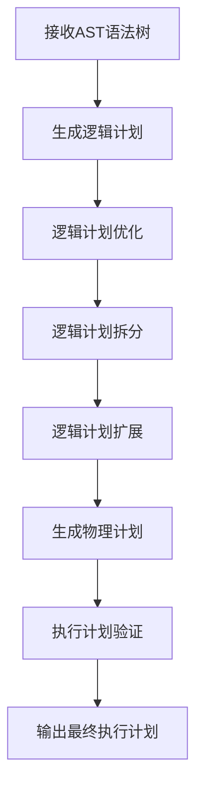
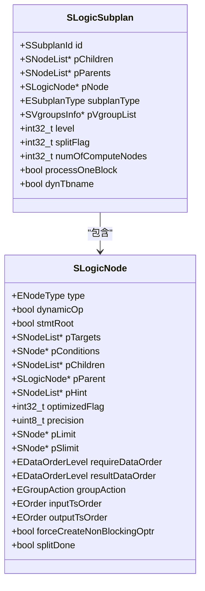
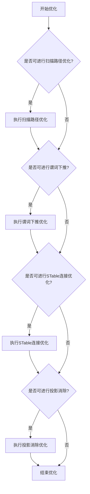
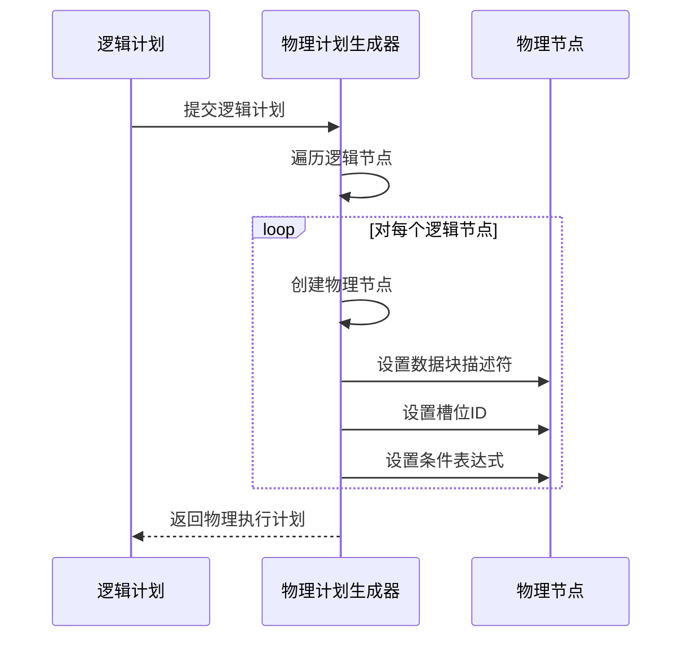
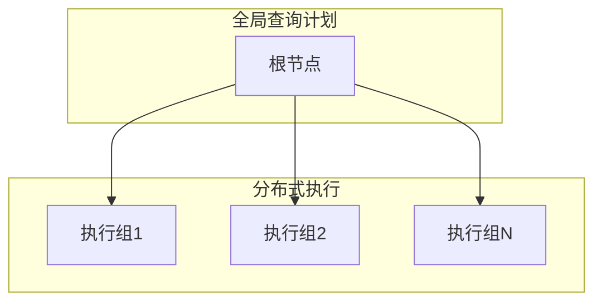
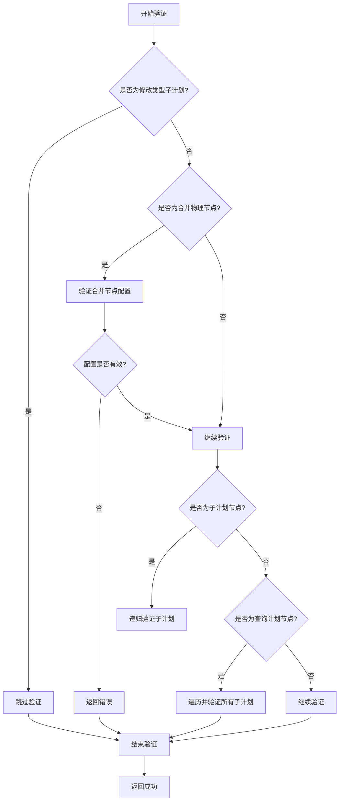

# 查询规划

<cite>
**本文档引用的文件**
- [planner.h](file://include/libs/planner/planner.h)
- [planner.c](file://source/libs/planner/src/planner.c)
- [planLogicCreater.c](file://source/libs/planner/src/planLogicCreater.c)
- [planOptimizer.c](file://source/libs/planner/src/planOptimizer.c)
- [planPhysiCreater.c](file://source/libs/planner/src/planPhysiCreater.c)
- [planSpliter.c](file://source/libs/planner/src/planSpliter.c)
- [planScaleOut.c](file://source/libs/planner/src/planScaleOut.c)
- [planUtil.c](file://source/libs/planner/src/planUtil.c)
- [planValidator.c](file://source/libs/planner/src/planValidator.c)
- [plannodes.h](file://include/libs/nodes/plannodes.h)
</cite>

## 目录
1. [引言](#引言)
2. [查询规划器总体流程](#查询规划器总体流程)
3. [逻辑计划生成](#逻辑计划生成)
4. [查询优化](#查询优化)
5. [物理计划生成](#物理计划生成)
6. [分布式查询拆分](#分布式查询拆分)
7. [SLogicSubplan数据结构](#slogicsubplan数据结构)
8. [执行计划验证](#执行计划验证)
9. [结论](#结论)

## 引言
查询规划器是TDengine数据库的核心组件之一，负责将SQL解析器生成的语法树转换为最优的执行计划。本技术文档详细阐述了查询规划器的工作流程，包括逻辑计划和物理计划的生成过程、查询优化技术、分布式查询的拆分策略，以及`SLogicSubplan`数据结构的设计和作用。

## 查询规划器总体流程
查询规划器的工作流程遵循一个清晰的阶段化处理模式，从接收解析后的语法树开始，经过多个处理阶段，最终生成可执行的物理计划。整个流程体现了模块化和分层处理的设计思想。



**Diagram sources**
- [planner.c](file://source/libs/planner/src/planner.c#L75-L107)

**Section sources**
- [planner.c](file://source/libs/planner/src/planner.c#L75-L107)

## 逻辑计划生成
逻辑计划生成是查询规划的第一步，其主要任务是将抽象语法树（AST）转换为一个逻辑执行计划。这个过程由`createLogicPlan`函数主导，它创建了一个`SLogicSubplan`结构作为逻辑计划的容器。



**Diagram sources**
- [plannodes.h](file://include/libs/nodes/plannodes.h#L424-L437)
- [plannodes.h](file://include/libs/nodes/plannodes.h#L38-L67)

**Section sources**
- [planLogicCreater.c](file://source/libs/planner/src/planLogicCreater.c#L3200-L3226)

## 查询优化
查询优化阶段旨在通过一系列优化规则来改进逻辑计划，以提高查询性能。优化器会应用谓词下推、投影裁剪等技术，减少不必要的数据扫描和处理。



**Diagram sources**
- [planOptimizer.c](file://source/libs/planner/src/planOptimizer.c#L100-L200)

**Section sources**
- [planOptimizer.c](file://source/libs/planner/src/planOptimizer.c#L100-L200)

## 物理计划生成
物理计划生成阶段将优化后的逻辑计划转换为具体的物理操作序列。这个过程由`createPhysiPlan`函数完成，它遍历逻辑计划树，并为每个逻辑节点创建相应的物理节点。



**Diagram sources**
- [planPhysiCreater.c](file://source/libs/planner/src/planPhysiCreater.c#L100-L200)

**Section sources**
- [planPhysiCreater.c](file://source/libs/planner/src/planPhysiCreater.c#L100-L200)

## 分布式查询拆分
分布式查询拆分是TDengine查询规划的关键环节，它将全局查询计划分解为可在不同vnode上执行的子计划。`splitLogicPlan`函数负责此任务，根据数据分布情况创建多个执行组。



**Diagram sources**
- [planSpliter.c](file://source/libs/planner/src/planSpliter.c#L100-L200)

**Section sources**
- [planSpliter.c](file://source/libs/planner/src/planSpliter.c#L100-L200)

## SLogicSubplan数据结构
`SLogicSubplan`是查询规划器中的核心数据结构，用于表示逻辑执行计划的子计划单元。它不仅包含了指向逻辑节点的指针，还维护了子计划的元信息，如执行组ID、子计划类型和数据分布信息。

```c
typedef struct SLogicSubplan {
  ENodeType     type;
  SSubplanId    id;
  SNodeList*    pChildren;
  SNodeList*    pParents;
  SLogicNode*   pNode;
  ESubplanType  subplanType;
  SVgroupsInfo* pVgroupList;
  int32_t       level;
  int32_t       splitFlag;
  int32_t       numOfComputeNodes;
  bool          processOneBlock;
  bool          dynTbname;
} SLogicSubplan;
```

该结构的设计充分考虑了分布式环境下的执行需求，通过`pVgroupList`字段直接关联了数据的物理分布，使得规划器能够基于实际的数据位置做出最优的执行路径选择。

**Section sources**
- [plannodes.h](file://include/libs/nodes/plannodes.h#L424-L437)

## 执行计划验证
在生成最终的物理计划后，查询规划器会对其进行验证，确保计划的正确性和可行性。`validateQueryPlan`函数负责执行这一检查，它会遍历整个计划树，验证每个节点的配置是否符合执行要求。



**Diagram sources**
- [planValidator.c](file://source/libs/planner/src/planValidator.c#L100-L130)

**Section sources**
- [planValidator.c](file://source/libs/planner/src/planValidator.c#L100-L130)

## 结论
TDengine的查询规划器通过一个精心设计的多阶段处理流程，有效地将SQL查询转换为高效的执行计划。从逻辑计划生成到物理计划生成，再到分布式拆分和最终验证，每个阶段都体现了对性能和正确性的高度重视。`SLogicSubplan`数据结构作为核心，不仅承载了执行计划的逻辑结构，还紧密关联了数据的物理分布，使得规划器能够做出最优的执行决策。