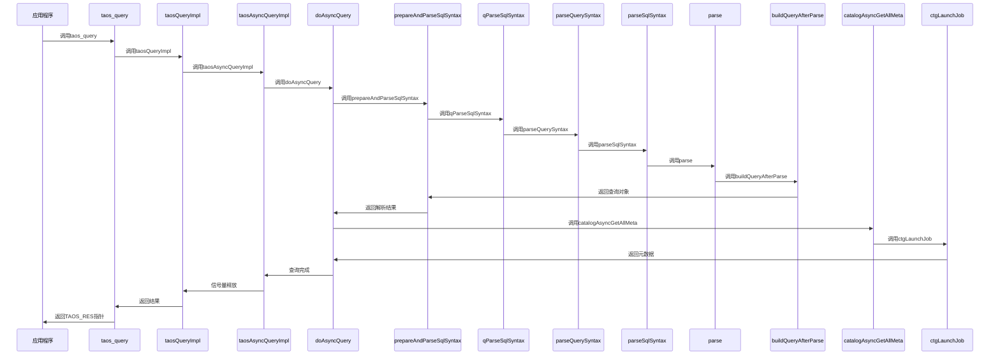

# 同步查询

<cite>
**本文档引用的文件**  
- [taos.h](file://include/client/taos.h)
- [clientImpl.c](file://source/client/src/clientImpl.c)
- [clientInt.h](file://source/client/inc/clientInt.h)
- [clientMain.c](file://source/client/src/clientMain.c)
- [parser.c](file://source/libs/parser/src/parser.c)
- [parAstParser.c](file://source/libs/parser/src/parAstParser.c)
- [catalog.c](file://source/libs/catalog/src/catalog.c)
- [ctgAsync.c](file://source/libs/catalog/src/ctgAsync.c)
</cite>

## 目录
1. [简介](#简介)
2. [核心函数工作机制](#核心函数工作机制)
3. [查询执行流程](#查询执行流程)
4. [结果集内存管理](#结果集内存管理)
5. [行数据提取流程](#行数据提取流程)
6. [SQL语句处理示例](#sql语句处理示例)
7. [查询性能优化技巧](#查询性能优化技巧)
8. [最佳实践](#最佳实践)

## 简介
同步查询是TDengine数据库客户端API的核心功能之一，提供了阻塞式的查询执行机制。本文档深入分析`taos_query`、`taos_fetch_rows`和`taos_get_result`等函数的工作机制，详细说明查询执行的阻塞特性、结果集内存管理以及行数据提取流程。通过分析`source/client/src/clientImpl.c`中的实际查询处理逻辑，为开发者提供权威的使用指南和最佳实践。

## 核心函数工作机制

### taos_query函数
`taos_query`函数是同步查询的入口点，负责执行SQL语句并返回结果集。该函数通过调用`taosQueryImpl`实现具体的查询逻辑。

**函数原型**
```c
TAOS_RES *taos_query(TAOS *taos, const char *sql);
```

**工作机制**
1. 验证输入参数的有效性
2. 创建同步查询参数结构体`SSyncQueryParam`
3. 调用异步查询实现`taosAsyncQueryImpl`，但通过信号量实现同步阻塞
4. 等待查询完成并返回结果

**Section sources**
- [taos.h](file://include/client/taos.h#L265)
- [clientImpl.c](file://source/client/src/clientImpl.c#L3106-L3145)

### taosQueryImpl函数
`taosQueryImpl`是`taos_query`的核心实现，负责协调同步查询的各个阶段。

**工作机制**
1. 检查连接对象的有效性
2. 分配并初始化同步查询参数
3. 创建信号量用于同步控制
4. 调用异步查询接口`taosAsyncQueryImpl`
5. 阻塞等待信号量，直到查询完成
6. 清理资源并返回查询结果

**Section sources**
- [clientImpl.c](file://source/client/src/clientImpl.c#L3106-L3145)

### taosAsyncQueryImpl函数
`taosAsyncQueryImpl`是查询执行的核心函数，无论是同步还是异步查询都基于此函数实现。

**工作机制**
1. 验证输入参数
2. 检查SQL语句长度是否超过限制
3. 构建请求对象`SRequestObj`
4. 调用`doAsyncQuery`启动查询执行流程

**Section sources**
- [clientImpl.c](file://source/client/src/clientImpl.c#L3038-L3070)

## 查询执行流程



**Diagram sources**
- [clientImpl.c](file://source/client/src/clientImpl.c#L3106-L3145)
- [clientMain.c](file://source/client/src/clientMain.c#L1655-L1708)
- [parser.c](file://source/libs/parser/src/parser.c#L582-L596)

### 查询阶段分析

#### SQL解析阶段
SQL解析是查询执行的第一步，负责将SQL文本转换为抽象语法树(AST)。

**解析流程**
1. `parse`函数：词法分析和语法分析，生成AST
2. `buildQueryAfterParse`函数：将AST转换为查询对象
3. `parseSqlSyntax`函数：收集元数据信息
4. `parseQuerySyntax`函数：构建元数据请求

**Section sources**
- [parAstParser.c](file://source/libs/parser/src/parAstParser.c#L45-L105)
- [parser.c](file://source/libs/parser/src/parser.c#L452-L458)

#### 元数据获取阶段
元数据获取是查询执行的关键环节，确保客户端拥有执行查询所需的所有表结构信息。

**获取流程**
1. `catalogAsyncGetAllMeta`：启动元数据获取任务
2. `ctgLaunchJob`：执行元数据获取任务
3. 回调函数处理元数据获取结果

**Section sources**
- [catalog.c](file://source/libs/catalog/src/catalog.c#L1571-L1605)
- [ctgAsync.c](file://source/libs/catalog/src/ctgAsync.c#L4683-L4719)

## 结果集内存管理

### 内存分配策略
TDengine客户端采用高效的内存管理策略来处理查询结果：

1. **预分配机制**：根据查询结果的预期大小预先分配内存
2. **分块管理**：大结果集采用分块方式管理，避免单次分配过大内存
3. **引用计数**：使用引用计数机制管理结果集生命周期

### 内存结构
查询结果集的内存结构主要包括：

- **字段信息**：存储结果集中各列的元数据
- **数据缓冲区**：存储实际的查询结果数据
- **状态信息**：记录查询执行状态和统计信息

**Section sources**
- [clientImpl.c](file://source/client/src/clientImpl.c#L3106-L3145)
- [clientInt.h](file://source/client/inc/clientInt.h#L324)

## 行数据提取流程

### taos_fetch_rows函数
`taos_fetch_rows`函数用于从结果集中提取数据行。

**工作机制**
1. 检查结果集状态
2. 从当前游标位置读取下一行数据
3. 更新游标位置
4. 返回数据行指针

### 数据提取过程
1. **游标管理**：维护当前读取位置的游标
2. **数据格式转换**：将内部存储格式转换为用户可读格式
3. **类型处理**：根据字段类型进行特殊处理
4. **空值处理**：正确处理NULL值

**Section sources**
- [clientImpl.c](file://source/client/src/clientImpl.c#L3106-L3145)

## SQL语句处理示例

### SELECT语句处理
```c
TAOS_RES *res = taos_query(taos, "SELECT * FROM meters WHERE voltage > 220");
if (taos_errno(res) == 0) {
    TAOS_ROW row;
    int32_t rows_affected = 0;
    while ((row = taos_fetch_row(res)) != NULL) {
        // 处理每一行数据
        rows_affected++;
    }
    taos_free_result(res);
}
```

### INSERT语句处理
```c
TAOS_RES *res = taos_query(taos, "INSERT INTO meters VALUES ('d1001', 1640995200000, 220, 0.23)");
if (taos_errno(res) == 0) {
    int32_t affected_rows = taos_affected_rows(res);
    printf("成功插入 %d 行\n", affected_rows);
}
taos_free_result(res);
```

### UPDATE语句处理
```c
TAOS_RES *res = taos_query(taos, "UPDATE meters SET current = 0.25 WHERE current < 0.2");
if (taos_errno(res) == 0) {
    int32_t affected_rows = taos_affected_rows(res);
    printf("成功更新 %d 行\n", affected_rows);
}
taos_free_result(res);
```

**Section sources**
- [clientImpl.c](file://source/client/src/clientImpl.c#L3106-L3145)

## 查询性能优化技巧

### 批量插入优化
1. **使用VALUES列表**：在单个INSERT语句中插入多行数据
2. **预编译语句**：对于重复执行的插入操作，使用预编译语句
3. **批量提交**：设置合适的批量提交大小

### 结果集预取
1. **调整预取大小**：根据网络条件和数据量调整预取行数
2. **流式处理**：对于大结果集，采用流式处理方式
3. **内存优化**：合理设置客户端内存使用上限

### 查询缓存
1. **元数据缓存**：充分利用元数据缓存减少网络往返
2. **结果缓存**：对于频繁执行的查询，考虑使用应用层缓存
3. **连接池**：使用连接池减少连接建立开销

**Section sources**
- [clientImpl.c](file://source/client/src/clientImpl.c#L3106-L3145)

## 最佳实践

### 错误处理
1. **检查返回值**：始终检查`taos_query`的返回值
2. **使用taos_errno**：通过`taos_errno`获取具体的错误代码
3. **资源清理**：确保在错误发生时正确释放资源

### 资源管理
1. **及时释放**：使用`taos_free_result`及时释放结果集资源
2. **连接管理**：合理管理数据库连接生命周期
3. **内存监控**：监控客户端内存使用情况

### 性能监控
1. **查询统计**：利用TDengine提供的查询统计信息
2. **慢查询分析**：定期分析慢查询日志
3. **连接监控**：监控连接状态和性能指标

**Section sources**
- [clientImpl.c](file://source/client/src/clientImpl.c#L3106-L3145)
- [clientInt.h](file://source/client/inc/clientInt.h#L324)