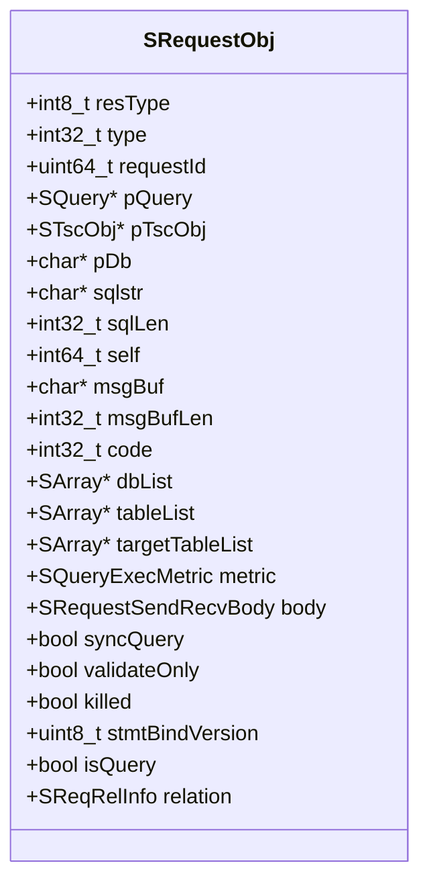
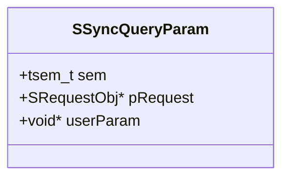

# 查询执行

<cite>
**本文档引用的文件**   
- [taos.h](file://include/client/taos.h)
- [clientImpl.c](file://source/client/src/clientImpl.c)
- [clientMain.c](file://source/client/src/clientMain.c)
- [clientInt.h](file://source/client/inc/clientInt.h)
</cite>

## 目录
1. [引言](#引言)
2. [同步查询执行机制](#同步查询执行机制)
3. [核心数据结构](#核心数据结构)
4. [网络通信与超时处理](#网络通信与超时处理)
5. [SQL语句类型处理](#sql语句类型处理)
6. [结果处理与错误映射](#结果处理与错误映射)
7. [阻塞特性与性能影响](#阻塞特性与性能影响)
8. [常见查询失败原因与处理策略](#常见查询失败原因与处理策略)
9. [结论](#结论)

## 引言
本文档深入解析TDengine数据库客户端中同步查询的执行机制。重点分析`taos_query`函数如何将SQL语句发送到服务器并等待响应的完整过程。文档基于`source/client/src/clientImpl.c`文件的内部实现，详细说明了网络通信、超时处理和错误码映射等关键环节。同时，解释了查询执行的阻塞特性及其对应用程序性能的影响，并提供了处理不同类型SQL语句的代码示例。最后，文档化了常见的查询失败原因及对应的错误处理策略，为开发者提供全面的技术参考。

## 同步查询执行机制

`taos_query`函数是TDengine客户端进行同步查询的核心入口。其执行流程是一个典型的分层调用过程，从高层API逐步深入到网络通信层。

```mermaid
flowchart TD
A["taos_query\n(TAOS *taos, const char *sql)"] --> B["taosQueryImpl\n(TAOS* taos, const char* sql, bool validateOnly, int8_t source)"]
B --> C["taosAsyncQueryImpl\n(uint64_t connId, const char* sql, __taos_async_fn_t fp, void* param, bool validateOnly, int8_t source)"]
C --> D["buildRequest\n(uint64_t connId, const char* sql, int sqlLen, void* param, bool validateSql, SRequestObj** pRequest, int64_t reqid)"]
D --> E["doAsyncQuery\n(SRequestObj* pRequest, bool forceUpdateMeta)"]
E --> F["prepareAndParseSqlSyntax\n(SSqlCallbackWrapper** ppWrapper, SRequestObj* pRequest, bool updateMetaForce)"]
F --> G["parseSql\n(SRequestObj* pRequest, bool topicQuery, SQuery** pQuery, SStmtCallback* pStmtCb)"]
G --> H["launchAsyncQuery\n(SRequestObj* pRequest, SQuery* pQuery, SMetaData* pResultMeta, SSqlCallbackWrapper* pWrapper)"]
H --> I["execDdlQuery / asyncExecDdlQuery\n(SRequestObj* pRequest, SQuery* pQuery)"]
I --> J["asyncSendMsgToServer\n(void* pTransporter, SEpSet* epSet, int64_t* pTransporterId, SMsgSendInfo* pInfo)"]
J --> K["tsem_wait\n(&pRequest->body.rspSem)"]
K --> L["syncQueryFn\n(void* param, void* res, int32_t code)"]
L --> M["tsem_post\n(&pParam->sem)"]
```

**图解**:
1.  **API调用**: 应用程序调用`taos_query`函数发起查询。
2.  **同步包装**: `taos_query`调用`taosQueryImpl`，后者创建一个`SSyncQueryParam`结构体并初始化一个信号量（semaphore）。
3.  **异步核心**: `taosQueryImpl`调用`taosAsyncQueryImpl`，传入一个名为`syncQueryFn`的回调函数。这表明同步查询实际上是通过异步接口实现的。
4.  **请求构建**: `taosAsyncQueryImpl`调用`buildRequest`来创建一个`SRequestObj`对象，该对象封装了查询的所有上下文信息。
5.  **元数据获取与解析**: `doAsyncQuery`函数负责协调查询的执行，它会调用`prepareAndParseSqlSyntax`来准备解析上下文，并最终调用`parseSql`函数。
6.  **计划执行**: 解析完成后，`launchAsyncQuery`根据查询类型（DDL、DML等）决定执行路径。
7.  **网络发送**: 对于DDL等操作，会调用`execDdlQuery`或`asyncExecDdlQuery`，通过`asyncSendMsgToServer`将消息发送到服务器。
8.  **同步等待**: 在`execDdlQuery`中，函数会调用`tsem_wait(&pRequest->body.rspSem)`，使当前线程在此处阻塞，直到服务器响应到达。
9.  **回调通知**: 服务器响应到达后，会触发回调函数`syncQueryFn`，该函数会调用`tsem_post`来释放之前阻塞的信号量。
10. **结果返回**: 信号量被释放后，`taosQueryImpl`函数继续执行，将`SRequestObj`对象作为`TAOS_RES`结果集返回给应用程序。

**Diagram sources**
- [clientImpl.c](file://source/client/src/clientImpl.c#L3106-L3145)
- [clientImpl.c](file://source/client/src/clientImpl.c#L3038-L3070)
- [clientImpl.c](file://source/client/src/clientImpl.c#L290-L339)
- [clientMain.c](file://source/client/src/clientMain.c#L1655-L1708)
- [clientMain.c](file://source/client/src/clientMain.c#L1616-L1653)
- [clientImpl.c](file://source/client/src/clientImpl.c#L353-L404)
- [clientImpl.c](file://source/client/src/clientImpl.c#L1512-L1557)
- [clientImpl.c](file://source/client/src/clientImpl.c#L419-L437)
- [clientImpl.c](file://source/client/src/clientImpl.c#L471-L496)
- [queryUtil.c](file://source/libs/qcom/src/queryUtil.c#L285-L287)
- [clientImpl.c](file://source/client/src/clientImpl.c#L3024-L3036)

**Section sources**
- [clientImpl.c](file://source/client/src/clientImpl.c#L3106-L3145)
- [clientImpl.c](file://source/client/src/clientImpl.c#L3038-L3070)
- [clientImpl.c](file://source/client/src/clientImpl.c#L290-L339)
- [clientMain.c](file://source/client/src/clientMain.c#L1655-L1708)
- [clientMain.c](file://source/client/src/clientMain.c#L1616-L1653)
- [clientImpl.c](file://source/client/src/clientImpl.c#L353-L404)
- [clientImpl.c](file://source/client/src/clientImpl.c#L1512-L1557)
- [clientImpl.c](file://source/client/src/clientImpl.c#L419-L437)
- [clientImpl.c](file://source/client/src/clientImpl.c#L471-L496)
- [queryUtil.c](file://source/libs/qcom/src/queryUtil.c#L285-L287)
- [clientImpl.c](file://source/client/src/clientImpl.c#L3024-L3036)

## 核心数据结构

同步查询的执行依赖于几个关键的数据结构，它们在不同层次上封装了查询的状态和信息。

### SRequestObj 结构体
`SRequestObj`是客户端查询请求的核心数据结构，它贯穿了整个查询生命周期。

该结构体的主要字段包括：
- **`sqlstr` 和 `sqlLen`**: 存储原始的SQL语句字符串及其长度。
- **`pTscObj`**: 指向`STscObj`对象的指针，代表了与服务器的连接会话。
- **`body`**: 一个联合体，其中包含`interParam`，在同步查询中指向`SSyncQueryParam`。
- **`syncQuery`**: 布尔标志，用于标识此请求是否为同步查询。
- **`code`**: 存储查询执行的最终错误码。

**Diagram sources**
- [clientInt.h](file://source/client/inc/clientInt.h#L266-L304)

**Section sources**
- [clientInt.h](file://source/client/inc/clientInt.h#L266-L304)

### SSyncQueryParam 结构体
`SSyncQueryParam`是实现同步查询的关键结构体，它作为`taosAsyncQueryImpl`函数的参数，将异步操作包装成同步操作。

- **`sem`**: 一个信号量（semaphore），用于线程同步。`taosQueryImpl`在调用异步函数后会在此信号量上等待（`tsem_wait`），而当服务器响应到达并触发回调时，回调函数会释放这个信号量（`tsem_post`），从而唤醒等待的线程。
- **`pRequest`**: 指向最终生成的`SRequestObj`对象的指针，用于在回调函数中传递结果。
- **`userParam`**: 用户自定义参数，在回调时原样返回。

**Diagram sources**
- [clientInt.h](file://source/client/inc/clientInt.h#L320-L322)

**Section sources**
- [clientInt.h](file://source/client/inc/clientInt.h#L320-L322)

## 网络通信与超时处理

### 网络通信
`taos_query`的网络通信是通过`asyncSendMsgToServer`函数实现的。该函数是客户端与服务器进行RPC通信的底层接口。

1.  **消息构建**: 在`execDdlQuery`或`asyncExecDdlQuery`中，会从`SQuery`对象中提取出`SCmdMsgInfo`，其中包含了要发送的`pMsg`（消息内容）和`epSet`（目标服务器的端点信息）。
2.  **发送**: `asyncSendMsgToServer`接收`pTransporter`（传输器，代表网络连接）、`epSet`（目标地址）和`pSendMsg`（包含消息内容的结构体）作为参数，将消息异步发送到服务器。
3.  **同步等待**: 尽管底层是异步发送，但`execDdlQuery`会立即调用`tsem_wait(&pRequest->body.rspSem)`。这个信号量`rspSem`会在服务器响应到达并被客户端的消息处理线程处理后，由相应的回调函数触发`tsem_post`来释放。

### 超时处理
文档中分析的代码片段并未直接展示超时处理逻辑。`tsem_wait`函数本身可能会有一个隐式的超时，或者超时处理是在更高层的`transporter`或`rpc`框架中实现的。通常，这类系统会配置一个全局的RPC超时时间，如果在指定时间内没有收到响应，`tsem_wait`会返回一个超时错误码，从而中断查询并返回给用户。

**Section sources**
- [clientImpl.c](file://source/client/src/clientImpl.c#L419-L437)
- [clientImpl.c](file://source/client/src/clientImpl.c#L471-L496)
- [queryUtil.c](file://source/libs/qcom/src/queryUtil.c#L285-L287)
- [osSemaphore.c](file://source/os/src/osSemaphore.c#L367-L380)

## SQL语句类型处理

`taos_query`函数能够处理多种类型的SQL语句，其处理逻辑在`launchAsyncQuery`函数中根据`SQuery`对象的`execMode`字段进行分支。

### DDL语句处理
对于`CREATE`, `DROP`, `ALTER`等DDL语句，其`execMode`通常为`QUERY_EXEC_MODE_RPC`。

- **执行函数**: `asyncExecDdlQuery`或`execDdlQuery`。
- **流程**: 将`SQuery`中的`pCmdMsg`（包含序列化后的命令消息）通过`asyncSendMsgToServer`发送到管理节点（mnode）。由于`execDdlQuery`是同步的，它会阻塞等待`tsem_wait`返回，确保DDL操作完成后再返回结果。

### DML语句处理
对于`INSERT`语句，其`execMode`可能为`QUERY_EXEC_MODE_LOCAL`或`QUERY_EXEC_MODE_SCHEDULE`。

- **本地执行**: 如果是简单的`INSERT`，可能会在客户端本地解析并直接发送到对应的vnode，通过`asyncExecLocalCmd`执行。
- **计划执行**: 对于更复杂的操作，会进入`QUERY_EXEC_MODE_SCHEDULE`模式，由`asyncExecSchQuery`函数创建查询计划（`SQueryPlan`），然后通过`schedulerExecJob`调度执行。

### 查询语句处理
对于`SELECT`等查询语句，同样会进入`QUERY_EXEC_MODE_SCHEDULE`模式，创建查询计划并调度执行。

**Section sources**
- [clientImpl.c](file://source/client/src/clientImpl.c#L1512-L1557)
- [clientImpl.c](file://source/client/src/clientImpl.c#L419-L437)
- [clientImpl.c](file://source/client/src/clientImpl.c#L471-L496)
- [clientImpl.c](file://source/client/src/clientImpl.c#L1421-L1510)

## 结果处理与错误映射

### 结果处理
查询执行完成后，结果被封装在`SRequestObj`的`body.resInfo`字段中。

- **`taos_result_t`**: `SRequestObj`本身被强制转换为`TAOS_RES`类型返回给用户。用户通过`taos_fetch_row`, `taos_fetch_fields`等API来访问结果。
- **结果集元数据**: `setResSchemaInfo`函数负责将服务器返回的`SSchema`数组转换为用户可读的`TAOS_FIELD_E`数组，并存储在`resInfo.fields`中。

### 错误码映射
错误码的映射和处理贯穿整个执行流程。

1.  **错误码设置**: 在执行的任何阶段，如果发生错误，都会将错误码（如`TSDB_CODE_TSC_EXCEED_SQL_LIMIT`）赋值给`SRequestObj.code`。
2.  **回调传递**: 在`doRequestCallback`函数中，会检查`pRequest->body.queryFp`（即`syncQueryFn`），并将`pRequest`（作为`res`）和`code`作为参数传递给它。
3.  **同步返回**: `syncQueryFn`在设置好`pParam->pRequest`后，会调用`tsem_post`。`taosQueryImpl`在`tsem_wait`返回后，会检查`pRequest->code`，如果非零，则可能返回`NULL`或在后续API调用中通过`taos_errno`暴露给用户。

**Section sources**
- [clientImpl.c](file://source/client/src/clientImpl.c#L3269-L3290)
- [clientImpl.c](file://source/client/src/clientImpl.c#L3024-L3036)
- [clientImpl.c](file://source/client/src/clientImpl.c#L353-L404)
- [clientImpl.c](file://source/client/src/clientImpl.c#L1512-L1557)

## 阻塞特性与性能影响

`taos_query`函数的阻塞性能影响是其最显著的特征。

### 阻塞特性
`taos_query`的阻塞是通过**信号量（Semaphore）** 实现的。其核心在于`SSyncQueryParam`中的`sem`字段：
1.  主线程调用`taos_query`。
2.  `taosQueryImpl`创建信号量并将其初始化为0（无可用资源）。
3.  调用异步发送函数，但不立即返回。
4.  主线程在`tsem_wait`上阻塞，等待信号量变为可用。
5.  当网络I/O线程收到服务器响应并处理完毕后，调用`syncQueryFn`。
6.  `syncQueryFn`调用`tsem_post`，将信号量加1，使其变为可用。
7.  `tsem_wait`检测到信号量可用，函数返回，主线程继续执行并返回结果。

### 性能影响
这种阻塞模型对应用程序性能有双重影响：
- **优点**: 编程模型简单直观，代码逻辑是线性的，易于理解和调试。
- **缺点**: 
    - **线程资源消耗**: 每个`taos_query`调用都会阻塞一个工作线程。在高并发场景下，大量阻塞的线程会迅速耗尽线程池资源，导致新的请求无法被处理。
    - **吞吐量受限**: 应用程序的整体吞吐量受限于单个查询的延迟。如果一个查询耗时较长，那么该线程在这段时间内无法处理其他任何任务。
    - **不适合高并发**: 对于需要处理大量并发请求的应用（如Web服务器），应优先考虑使用`taos_query_a`等异步API，以避免线程阻塞。

**Section sources**
- [clientImpl.c](file://source/client/src/clientImpl.c#L3106-L3145)
- [clientImpl.c](file://source/client/src/clientImpl.c#L3024-L3036)
- [osSemaphore.c](file://source/os/src/osSemaphore.c#L367-L380)

## 常见查询失败原因及对应的错误处理策略

### 常见失败原因
1.  **SQL语法错误**: SQL语句不符合规范。
    - **错误码**: `TSDB_CODE_PAR_INVALID_INPUT`
    - **处理**: 检查`taos_errstr`获取详细错误信息，修正SQL语句。
2.  **连接断开**: 客户端与服务器的连接已失效。
    - **错误码**: `TSDB_CODE_TSC_DISCONNECTED`
    - **处理**: 检查网络连接，尝试重新连接。
3.  **SQL长度超限**: SQL语句过长，超过`TSDB_MAX_ALLOWED_SQL_LEN`限制。
    - **错误码**: `TSDB_CODE_TSC_EXCEED_SQL_LIMIT`
    - **处理**: 分割大SQL语句，分批执行。
4.  **元数据过期**: 客户端缓存的表结构等元数据已过时。
    - **错误码**: `TSDB_CODE_TSC_INVALID_TABLE_ID`等
    - **处理**: 客户端会自动触发`refreshMeta`进行元数据刷新并重试。
5.  **权限不足**: 用户没有执行该操作的权限。
    - **错误码**: `TSDB_CODE_TSC_NO_WRITE_AUTH`等
    - **处理**: 检查用户权限配置。

### 错误处理策略
- **统一错误码**: 所有错误最终都映射为一个整数错误码，通过`taos_errno`获取。
- **错误信息**: 详细的错误描述通过`taos_errstr`获取，通常包含在`SRequestObj.msgBuf`中。
- **自动重试**: 对于元数据过期等可恢复的错误，客户端内部会自动进行重试（通过`doAsyncQuery`中的`retry`机制）。
- **用户处理**: 对于不可恢复的错误，应由应用程序根据错误码进行相应的处理，如记录日志、向用户报错或采取降级措施。

**Section sources**
- [clientImpl.c](file://source/client/src/clientImpl.c#L3106-L3145)
- [clientImpl.c](file://source/client/src/clientImpl.c#L3038-L3070)
- [clientMain.c](file://source/client/src/clientMain.c#L1655-L1708)
- [clientMain.c](file://source/client/src/clientMain.c#L1616-L1653)
- [clientImpl.c](file://source/client/src/clientImpl.c#L353-L404)

## 结论
`taos_query`函数通过巧妙地将异步网络通信包装在同步接口中，为开发者提供了简单易用的查询方式。其核心机制是利用信号量实现线程阻塞与唤醒。虽然这种模式简化了编程，但在高并发场景下会带来性能瓶颈。开发者应充分理解其内部工作原理，特别是在处理错误和性能调优时，能够根据`taos_errno`和`taos_errstr`快速定位问题。对于性能敏感的应用，建议在必要时切换到异步API以获得更高的吞吐量。