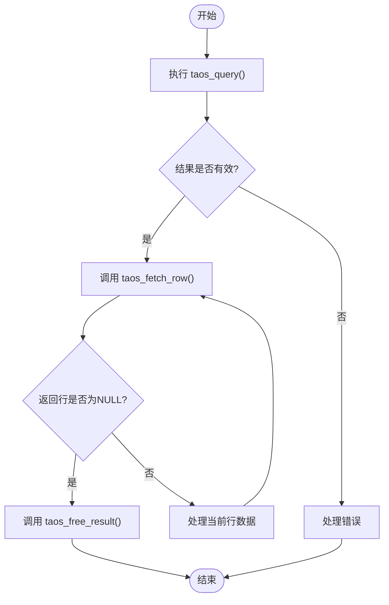
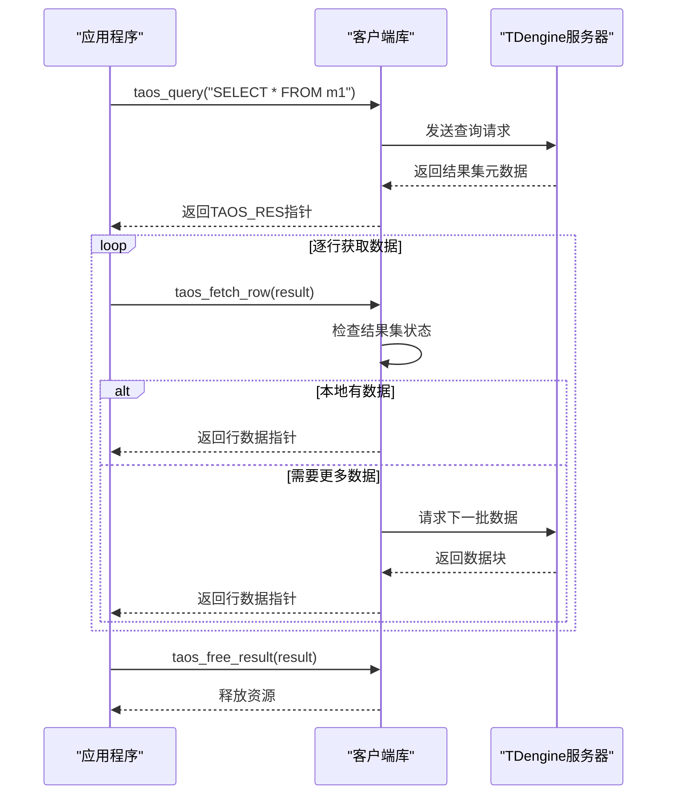
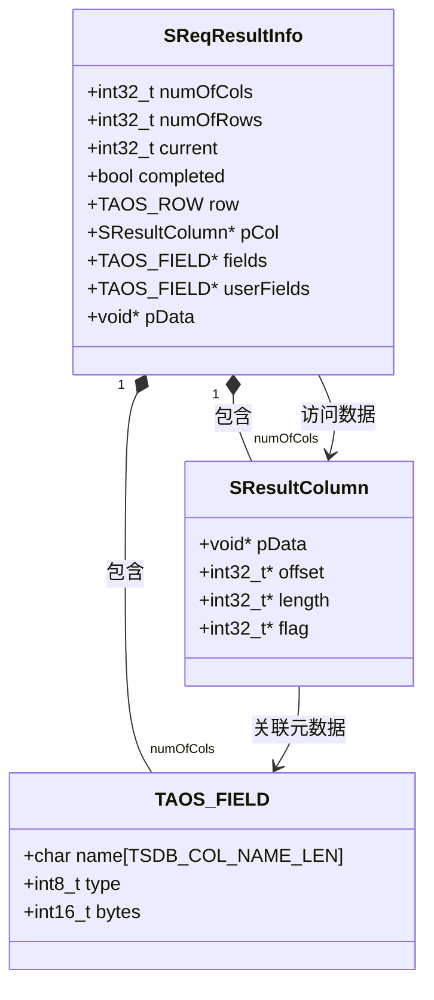

# 结果处理

<cite>
**本文档引用的文件**
- [demo.c](file://examples/c/demo.c)
- [taos.h](file://include/client/taos.h)
- [clientMain.c](file://source/client/src/clientMain.c)
- [wrapperFunc.c](file://source/client/wrapper/src/wrapperFunc.c)
- [clientImpl.c](file://source/client/src/clientImpl.c)
- [wrapperDriver.c](file://source/client/wrapper/src/wrapperDriver.c)
</cite>

## 目录
1. [简介](#简介)
2. [结果集处理流程](#结果集处理流程)
3. [核心函数协作机制](#核心函数协作机制)
4. [结果集内存布局](#结果集内存布局)
5. [数据类型处理](#数据类型处理)
6. [NULL值处理](#null值处理)
7. [大数据量处理最佳实践](#大数据量处理最佳实践)
8. [性能优化建议](#性能优化建议)

## 简介

TDengine数据库的同步查询结果集处理是客户端应用程序与数据库交互的核心环节。本文档全面阐述`taos_get_result`和`taos_fetch_rows`函数的协作机制，详细解释结果集的内存布局、行指针的移动和数据类型转换。通过分析`examples/c/demo.c`中的实际遍历模式，展示如何安全地访问每一行的数据。文档化不同数据类型（如INT、DOUBLE、BINARY、TIMESTAMP）的提取方法和注意事项，并提供处理NULL值和大数据量结果集的最佳实践，包括内存管理和性能优化建议。

## 结果集处理流程

TDengine的同步查询结果集处理遵循标准的三步流程：查询执行、结果获取和结果遍历。首先通过`taos_query`函数执行SQL语句并获取结果集句柄，然后通过`taos_fetch_row`函数逐行获取数据，最后通过`taos_free_result`函数释放结果集资源。

在`examples/c/demo.c`示例中，这一流程被清晰地展示。查询操作通过`taos_query`函数执行，返回一个`TAOS_RES`类型的结果集指针。随后，通过循环调用`taos_fetch_row`函数来逐行获取查询结果，直到返回NULL表示所有行已读取完毕。最后，通过`taos_free_result`函数释放结果集占用的内存资源。



**Diagram sources**
- [demo.c](file://examples/c/demo.c#L100-L130)

**Section sources**
- [demo.c](file://examples/c/demo.c#L1-L134)

## 核心函数协作机制

`taos_get_result`和`taos_fetch_rows`函数（在实际代码中对应`taos_query`和`taos_fetch_row`）构成了TDengine同步查询的核心协作机制。`taos_query`负责发起查询请求并获取结果集句柄，而`taos_fetch_row`则负责从结果集中逐行提取数据。

从函数调用链来看，`taos_query`函数首先通过客户端库向服务器发送查询请求，服务器处理查询并返回结果集的元数据和部分数据。`taos_fetch_row`函数则通过内部的状态机管理，根据当前结果集的状态决定是从本地缓存获取数据还是向服务器请求更多数据。

在`source/client/src/clientMain.c`中，`taos_fetch_row`函数的实现展示了这一协作机制。对于查询结果，函数会调用`doAsyncFetchRows`来获取数据行。该函数首先检查结果集对象的状态，如果存在错误或查询类型不支持，则直接返回NULL。否则，它会设置单行指针并递增当前行索引，最终返回指向当前行数据的指针。



**Diagram sources**
- [clientMain.c](file://source/client/src/clientMain.c#L768-L818)
- [demo.c](file://examples/c/demo.c#L100-L130)

**Section sources**
- [clientMain.c](file://source/client/src/clientMain.c#L768-L818)
- [wrapperFunc.c](file://source/client/wrapper/src/wrapperFunc.c#L363-L366)

## 结果集内存布局

TDengine结果集的内存布局设计旨在高效地存储和访问查询结果。结果集由元数据区和数据区两部分组成，元数据区存储列信息、数据类型、精度等描述性信息，数据区则存储实际的查询结果数据。

在`source/client/src/clientImpl.c`中，`doSetOneRowPtr`函数的实现揭示了结果集的内存布局细节。该函数为结果集中的每一列设置行指针，对于可变长度数据类型（如BINARY、NCHAR），需要特殊处理。函数首先获取列的数据类型和schema字节数，然后根据类型判断是否为可变数据类型。如果是可变类型且不是NULL值，则通过偏移量计算数据的实际位置。

结果集的内存布局采用列式存储与行式访问相结合的方式。数据在内存中按列连续存储，以提高压缩效率和缓存局部性，但在访问时通过行指针机制提供行式访问接口。这种设计既保持了列式存储的性能优势，又提供了用户友好的行式编程接口。

对于固定长度数据类型（如INT、DOUBLE、TIMESTAMP），每行的数据是连续存储的，可以通过简单的指针算术计算出任意行任意列的数据位置。而对于可变长度数据类型，采用偏移量表的方式存储，每个数据项的起始位置由偏移量表中的值确定，数据本身则存储在连续的内存区域中。



**Diagram sources**
- [clientImpl.c](file://source/client/src/clientImpl.c#L2008-L2041)
- [taos.h](file://include/client/taos.h#L268)

**Section sources**
- [clientImpl.c](file://source/client/src/clientImpl.c#L2008-L2041)

## 数据类型处理

TDengine支持多种数据类型，包括数值类型、字符串类型和时间类型等。不同数据类型的处理方式有所不同，需要根据具体类型采用相应的数据提取方法。

### 数值类型处理

对于整数类型（如TINYINT、SMALLINT、INT、BIGINT）和浮点类型（如FLOAT、DOUBLE），可以直接通过指针转换获取值。在`examples/c/demo.c`示例中，创建表时定义了多种数值类型：

```c
queryDB(taos, "create table m1 (ts timestamp, ti tinyint, si smallint, i int, bi bigint, f float, d double, b blob)");
```

访问这些数值类型的数据时，可以直接将`TAOS_ROW`数组中对应列的指针转换为相应类型的指针，然后解引用获取值。例如，访问INT类型的数据：

```c
int *intValue = (int*)row[columnIndex];
int value = *intValue;
```

### 字符串类型处理

BINARY和NCHAR类型属于可变长度字符串类型，其处理方式与固定长度类型不同。由于数据长度可变，不能直接通过固定偏移量访问，而需要通过`taos_fetch_lengths`函数获取每行每列的实际长度。

在`utils/test/c/varbinary_test.c`的测试代码中，展示了如何正确处理BINARY类型数据：

```c
int32_t* length = taos_fetch_lengths(pRes);
// 使用length[columnIndex]获取实际数据长度
```

访问BINARY类型数据时，需要先获取长度信息，然后根据长度安全地复制数据，避免缓冲区溢出。

### 时间戳类型处理

TIMESTAMP类型在TDengine中占用8字节，存储自1970年1月1日以来的微秒数。可以直接将其视为`int64_t`类型处理。在示例代码中，时间戳值通过`PRId64`格式化字符串插入：

```c
sprintf(qstr, "insert into m1 values (%" PRId64 ", %d, %d, %d, %d, %f, %lf, '%s')",
        (uint64_t)(1546300800000 + i * 1000), i, i, i, i * 10000000, i * 1.0, i * 2.0, "abc");
```

### 数据类型提取方法对比

| 数据类型 | 字节长度 | 提取方法 | 注意事项 |
|--------|--------|--------|--------|
| TINYINT | 1 | `(int8_t*)row[i]` | 直接指针转换 |
| SMALLINT | 2 | `(int16_t*)row[i]` | 直接指针转换 |
| INT | 4 | `(int32_t*)row[i]` | 直接指针转换 |
| BIGINT | 8 | `(int64_t*)row[i]` | 直接指针转换 |
| FLOAT | 4 | `(float*)row[i]` | 直接指针转换 |
| DOUBLE | 8 | `(double*)row[i]` | 直接指针转换 |
| TIMESTAMP | 8 | `(int64_t*)row[i]` | 微秒时间戳 |
| BINARY | 可变 | `taos_fetch_lengths()` + 偏移量 | 需获取实际长度 |
| NCHAR | 可变 | `taos_fetch_lengths()` + 偏移量 | 需获取实际长度 |

**Section sources**
- [demo.c](file://examples/c/demo.c#L50-L60)
- [varbinary_test.c](file://utils/test/c/varbinary_test.c#L262-L309)

## NULL值处理

在数据库查询结果中，NULL值的处理是一个重要且容易出错的环节。TDengine提供了多种机制来检测和处理NULL值，确保应用程序能够安全地访问可能为NULL的数据。

### NULL值检测方法

TDengine提供了两种主要的NULL值检测方法：`taos_is_null`和`taos_fetch_lengths`。`taos_is_null`函数可以直接检测指定行和列的值是否为NULL，而`taos_fetch_lengths`函数在返回NULL值的长度时会返回特定的标志值。

在`source/client/wrapper/src/wrapperDriver.c`中，可以看到`taos_is_null`函数被作为动态加载的函数指针：

```c
LOAD_FUNC(fp_taos_is_null, "taos_is_null");
LOAD_FUNC(fp_taos_is_null_by_column, "taos_is_null_by_column");
```

这表明NULL值检测是TDengine客户端API的重要组成部分。

### NULL值处理最佳实践

处理NULL值的最佳实践包括：

1. **在访问数据前进行NULL检查**：在解引用任何数据指针前，应先检查该值是否为NULL，避免空指针解引用导致程序崩溃。

2. **使用专门的NULL检测函数**：优先使用`taos_is_null`函数而不是依赖长度判断，因为长度判断可能因实现细节变化而失效。

3. **为NULL值提供默认值**：在应用程序逻辑中，为可能为NULL的字段提供合理的默认值，避免NULL值传播导致后续处理异常。

在`utils/test/c/varbinary_test.c`的测试代码中，展示了如何处理包含NULL值的结果集：

```c
while ((row = taos_fetch_row(pRes)) != NULL) {
    if (rowIndex == 0) {
        ASSERT(row[1] == NULL);
        rowIndex++;
        continue;
    }
    // 处理非NULL行
}
```

这段代码明确检查了特定行的特定列是否为NULL，并相应地处理。

### NULL值内存表示

在内存布局中，NULL值通常通过特殊的偏移量或标志位表示。在`doSetOneRowPtr`函数中，可以看到对于可变长度类型，如果偏移量为-1，则表示该值为NULL：

```c
if (!IS_VAR_NULL_TYPE(type, schemaBytes) && pCol->offset[pResultInfo->current] != -1) {
    char* pStart = pResultInfo->pCol[i].offset[pResultInfo->current] + pResultInfo->pCol[i].pData;
    // 处理非NULL值
}
```

这种设计使得NULL值的检测非常高效，只需检查偏移量是否为-1即可。

**Section sources**
- [wrapperDriver.c](file://source/client/wrapper/src/wrapperDriver.c#L131-L157)
- [varbinary_test.c](file://utils/test/c/varbinary_test.c#L262-L309)

## 大数据量处理最佳实践

处理大数据量结果集时，内存管理和性能优化至关重要。不当的处理方式可能导致内存耗尽或性能急剧下降。

### 内存管理

大数据量结果集的内存管理应遵循以下原则：

1. **及时释放资源**：在处理完结果集后，立即调用`taos_free_result`释放内存，避免内存泄漏。

2. **分批处理**：对于超大结果集，考虑分批处理而不是一次性加载所有数据。可以通过LIMIT和OFFSET子句实现分页查询。

3. **避免数据复制**：在可能的情况下，直接使用结果集中的数据指针，而不是复制数据到新的缓冲区。

在`examples/c/demo.c`中，虽然没有直接展示大数据量处理，但其基本模式可以扩展：

```c
// 处理完一行后立即处理，而不是累积所有行
while ((row = taos_fetch_row(result))) {
    // 立即处理当前行
    processRow(row, fields, num_fields);
    // 不需要存储所有行的引用
}
taos_free_result(result); // 及时释放
```

### 性能优化

性能优化建议包括：

1. **选择合适的列**：只查询需要的列，避免SELECT *，减少网络传输和内存占用。

2. **使用适当的索引**：确保查询条件中的列有适当的索引，加快查询速度。

3. **批量处理**：对于插入或更新操作，使用批量操作而不是逐行操作。

4. **连接复用**：重用数据库连接，避免频繁的连接建立和断开开销。

在`source/client/wrapper/src/wrapperFunc.c`中，`taos_free_result`函数的实现强调了资源释放的重要性：

```c
void taos_free_result(TAOS_RES *res) {
  CHECK_VOID(fp_taos_free_result);
  return (*fp_taos_free_result)(res);
}
```

这表明结果集资源的释放是通过专门的函数完成的，强调了显式资源管理的重要性。

**Section sources**
- [demo.c](file://examples/c/demo.c#L100-L130)
- [wrapperFunc.c](file://source/client/wrapper/src/wrapperFunc.c#L371-L375)

## 性能优化建议

为了获得最佳的查询性能，除了基本的内存管理外，还需要考虑以下优化建议：

### 查询优化

1. **使用参数化查询**：避免SQL注入，同时提高查询计划的重用率。

2. **合理使用WHERE条件**：将最能过滤数据的条件放在前面，减少中间结果集的大小。

3. **避免全表扫描**：确保查询条件中的列有适当的索引。

### 客户端优化

1. **调整结果集缓冲区大小**：根据网络条件和数据量调整客户端的结果集缓冲区大小，平衡内存使用和网络效率。

2. **使用连接池**：对于高并发应用，使用连接池管理数据库连接，减少连接建立的开销。

3. **异步处理**：对于长时间运行的查询，考虑使用异步API避免阻塞主线程。

### 监控和调优

1. **监控查询性能**：使用TDengine提供的监控工具跟踪查询执行时间、资源使用等指标。

2. **分析执行计划**：理解查询的执行计划，识别性能瓶颈。

3. **定期维护**：定期进行数据库维护操作，如VNODE的平衡、数据文件的整理等。

通过综合运用这些优化建议，可以显著提高TDengine查询的性能和稳定性，特别是在处理大数据量场景时。

**Section sources**
- [wrapperFunc.c](file://source/client/wrapper/src/wrapperFunc.c#L371-L375)
- [demo.c](file://examples/c/demo.c#L1-L134)