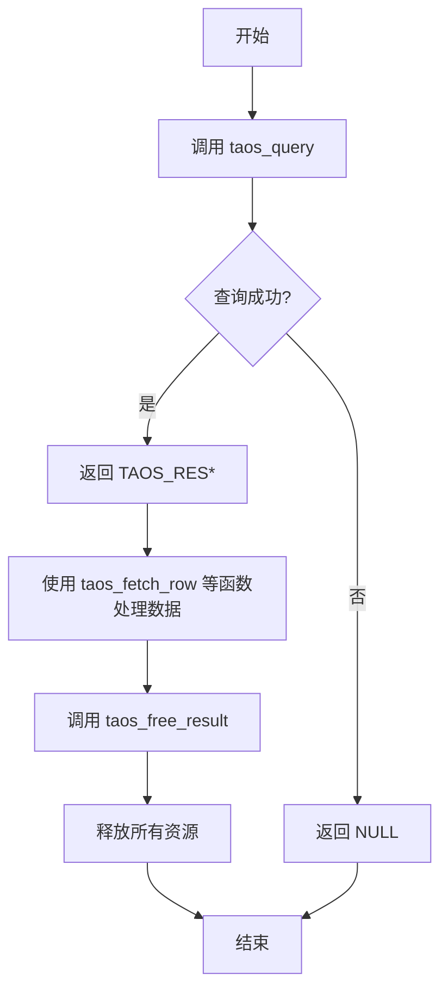

# 资源管理

<cite>
**本文档中引用的文件**  
- [taos.h](file://include/client/taos.h)
- [clientMain.c](file://source/client/src/clientMain.c)
- [wrapperFunc.c](file://source/client/wrapper/src/wrapperFunc.c)
</cite>

## 目录
1. [引言](#引言)
2. [资源生命周期概述](#资源生命周期概述)
3. [taos_query 与 taos_free_result 的核心作用](#taos_query-与-taos_free_result-的核心作用)
4. [异常处理中的资源释放](#异常处理中的资源释放)
5. [C语言中的资源管理模式](#c语言中的资源管理模式)
6. [结论](#结论)

## 引言

在使用 TDengine 的 C 客户端接口进行同步查询时，资源管理是确保程序稳定性和防止内存泄漏的关键环节。本文档系统化地阐述了 `taos_query` 和 `taos_free_result` 函数在资源生命周期中的核心作用，分析了从查询创建到结果释放的完整流程，并探讨了在异常情况下如何确保资源被正确释放。同时，本文档提供了基于 C 语言的资源管理实践建议，以提升代码的健壮性和安全性。

## 资源生命周期概述

TDengine 的同步查询操作遵循一个明确的资源生命周期，该周期始于 `taos_query` 的调用，终于 `taos_free_result` 的调用。此生命周期确保了与查询相关的所有内存和系统资源（如网络连接、内部缓冲区、元数据等）能够被正确分配和最终释放。

一个典型的生命周期流程如下：
1.  **资源创建**：调用 `taos_query` 函数发起一个同步 SQL 查询。该函数内部会创建一个 `TAOS_RES` 类型的结果集对象，该对象封装了查询的响应数据、元信息以及状态。
2.  **资源使用**：应用程序通过 `taos_fetch_row`、`taos_fetch_fields` 等函数访问 `TAOS_RES` 对象中的数据。
3.  **资源释放**：查询处理完毕后，必须调用 `taos_free_result` 函数。该函数负责清理 `TAOS_RES` 对象所占用的所有资源，防止内存泄漏。

**Section sources**
- [taos.h](file://include/client/taos.h#L265)
- [clientMain.c](file://source/client/src/clientMain.c#L755)

## taos_query 与 taos_free_result 的核心作用

### taos_query 函数

`taos_query` 函数是同步查询的入口点。它接收一个数据库连接句柄 `TAOS*` 和一条 SQL 语句作为参数，执行查询并返回一个指向 `TAOS_RES` 结构的指针。

```c
TAOS_RES *taos_query(TAOS *taos, const char *sql);
```

该函数的实现（位于 `clientMain.c`）会调用内部的 `taosQueryImpl` 函数来完成实际的查询逻辑。成功执行后，它会返回一个有效的 `TAOS_RES` 指针，该指针指向一块动态分配的内存区域，这块内存包含了查询结果的所有信息。

### taos_free_result 函数

`taos_free_result` 函数是资源管理中至关重要的环节，其必要性在于它是防止内存泄漏的唯一手段。如果在 `taos_query` 之后不调用 `taos_free_result`，由 `taos_query` 分配的内存将永远不会被释放，导致程序的内存使用量持续增长。

```c
void taos_free_result(TAOS_RES *res);
```

该函数的实现非常关键，它首先检查 `res` 指针是否为空。如果不为空，它会根据结果集的类型（通过宏 `TD_RES_QUERY`、`TD_RES_TMQ` 等判断）执行不同的清理逻辑：
- 对于普通查询结果 (`TD_RES_QUERY`)，它会调用 `destroyRequest` 函数来销毁内部的 `SRequestObj` 请求对象。
- 对于 TMQ（TDengine Message Queue）相关的结果，它会根据具体类型调用 `tDeleteMqDataRsp`、`tDeleteMqMetaRsp` 等函数来释放特定的数据结构。
- 最后，它会调用 `taosMemoryFree` 来释放 `SMqRspObj` 或 `SRequestObj` 本身的内存。

这个分层的清理机制确保了无论查询结果的类型如何，所有关联的资源都能被彻底回收。



**Diagram sources**
- [taos.h](file://include/client/taos.h#L270)
- [clientMain.c](file://source/client/src/clientMain.c#L691-L720)

**Section sources**
- [taos.h](file://include/client/taos.h#L270)
- [clientMain.c](file://source/client/src/clientMain.c#L691-L720)

## 异常处理中的资源释放

在实际应用中，程序可能因为各种原因（如查询失败、用户中断、程序崩溃）而提前退出。在这种异常流程下，确保资源被正确释放至关重要。

### 查询失败

当 `taos_query` 执行失败时，它会返回 `NULL`。在这种情况下，虽然没有有效的结果集，但仍然需要确保没有其他资源被意外分配。根据代码分析，`taos_query` 在失败时不会返回一个需要手动释放的 `TAOS_RES` 对象，因此无需调用 `taos_free_result`。然而，最佳实践是使用统一的清理模式，例如：

```c
TAOS_RES *res = taos_query(taos, sql);
if (res == NULL) {
    // 处理错误，例如打印错误信息
    fprintf(stderr, "Query failed: %s\n", taos_errstr(res));
    // 注意：这里 res 是 NULL，所以 taos_free_result 是安全的，但非必需。
    // 为了代码一致性，仍可调用。
    taos_free_result(res); 
    return;
}
// ... 处理结果 ...
taos_free_result(res); // 正常路径释放
```

### 程序提前退出

如果程序在 `taos_query` 之后、`taos_free_result` 之前因异常而终止（如 `return`、`goto` 或 `exit`），则必须确保 `taos_free_result` 被调用。这可以通过以下方式实现：
- **使用 goto 语句进行集中清理**：在函数末尾设置一个清理标签，所有退出路径都跳转到该标签。
- **使用 RAII 模式**：虽然 C 语言不直接支持，但可以通过封装来模拟。

**Section sources**
- [clientMain.c](file://source/client/src/clientMain.c#L691-L720)
- [taos.h](file://include/client/taos.h#L270)

## C语言中的资源管理模式

为了确保代码的健壮性，可以采用以下模式来管理资源。

### 使用 goto 的清理模式

这是一种在 C 语言中广泛使用的、清晰且可靠的模式。

```c
int perform_query(TAOS *taos, const char *sql) {
    TAOS_RES *res = NULL;
    int code = 0;

    res = taos_query(taos, sql);
    if (res == NULL) {
        code = -1;
        goto cleanup;
    }

    // 检查查询是否成功
    if (taos_errno(res) != 0) {
        fprintf(stderr, "SQL Error: %s\n", taos_errstr(res));
        code = -2;
        goto cleanup;
    }

    // 处理查询结果...
    TAOS_ROW row;
    while ((row = taos_fetch_row(res)) != NULL) {
        // ... 处理每一行 ...
    }

cleanup:
    taos_free_result(res); // 无论成功或失败，都会执行清理
    return code;
}
```

### RAII 模式（通过宏或函数封装）

可以创建一个简单的宏或辅助函数来封装查询和清理过程，但这需要更复杂的实现，通常不如 `goto` 模式直观。

**Section sources**
- [clientMain.c](file://source/client/src/clientMain.c#L691-L720)

## 结论

`taos_free_result` 函数在 TDengine C 客户端的资源管理中扮演着不可或缺的角色。它不仅是释放查询结果内存的必要手段，更是防止内存泄漏、保证程序长期稳定运行的关键。开发者必须严格遵守“一次 `taos_query` 调用，必须对应一次 `taos_free_result` 调用”的原则。无论查询成功与否，都应在作用域结束前调用 `taos_free_result`。通过采用 `goto` 清理模式等实践，可以有效地管理异常流程，确保资源得到妥善释放，从而编写出健壮、安全的数据库应用程序。