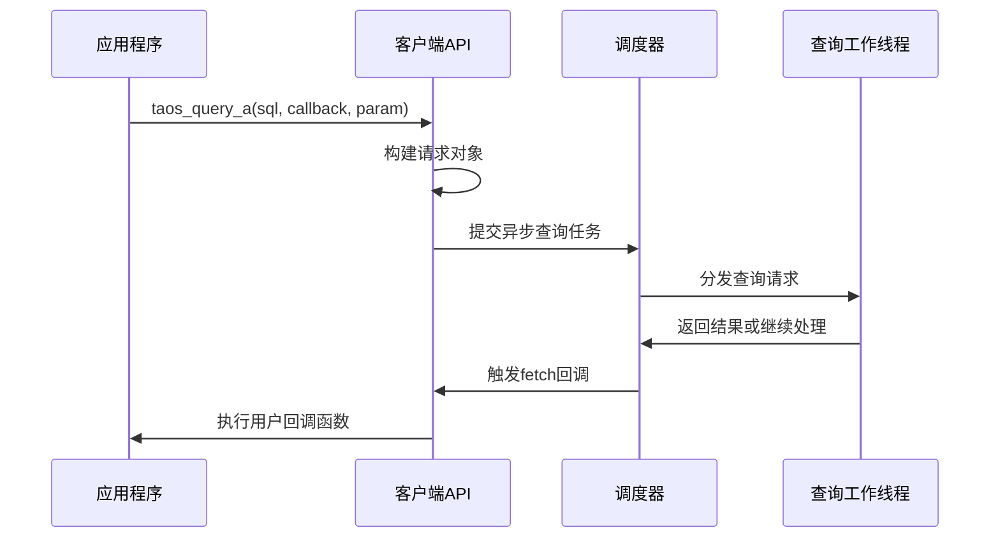
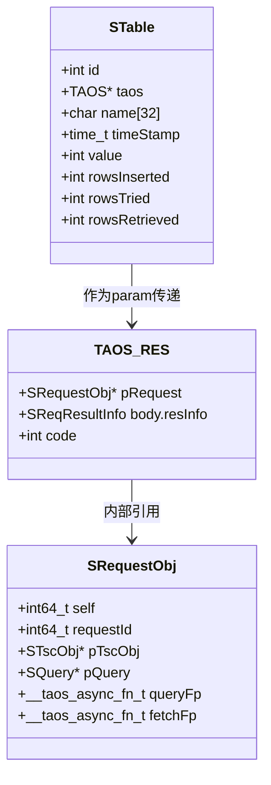
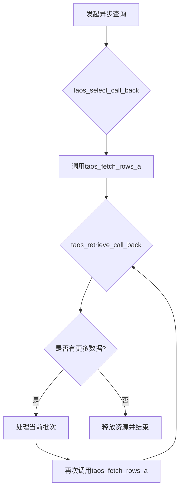
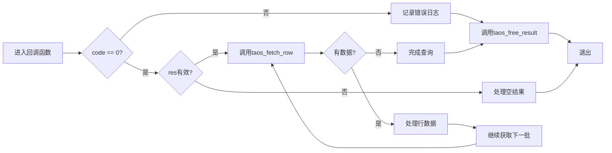
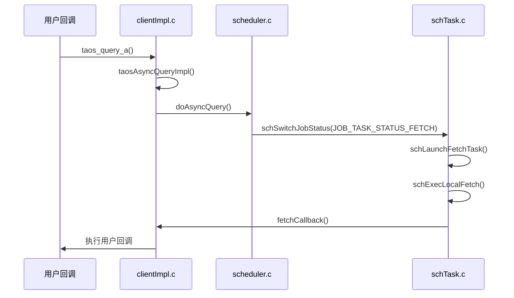
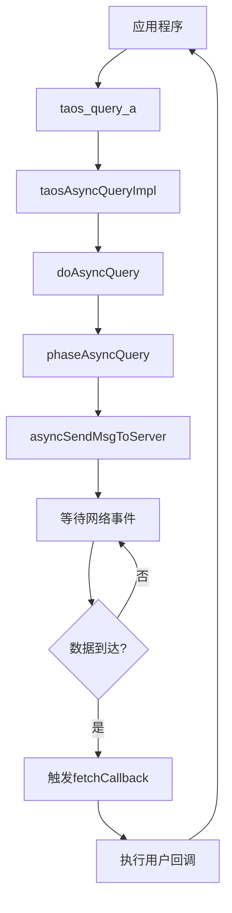
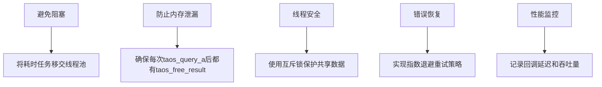

# 回调机制

<cite>
**本文档引用的文件**  
- [asyncdemo.c](file://examples/c/asyncdemo.c)
- [taos.h](file://include/client/taos.h)
- [clientImpl.c](file://source/client/src/clientImpl.c)
- [clientMain.c](file://source/client/src/clientMain.c)
- [scheduler.c](file://source/libs/scheduler/src/scheduler.c)
- [schTask.c](file://source/libs/scheduler/src/schTask.c)
- [qworker.c](file://source/libs/qworker/src/qworker.c)
</cite>

## 目录
1. [简介](#简介)
2. [异步API回调函数设计](#异步api回调函数设计)
3. [回调函数的执行上下文与参数传递](#回调函数的执行上下文与参数传递)
4. [多级回调组织方式](#多级回调组织方式)
5. [查询结果访问与错误处理](#查询结果访问与错误处理)
6. [回调调度器内部实现](#回调调度器内部实现)
7. [事件循环集成](#事件循环集成)
8. [常见陷阱与最佳实践](#常见陷阱与最佳实践)

## 简介
TDengine数据库提供了异步API以支持高性能、非阻塞的数据操作。本文档深入解析其异步查询回调机制，涵盖从用户接口到内核调度的完整链路。通过分析`examples/c/asyncdemo.c`示例代码和`source/client/src/clientImpl.c`等核心源码，揭示回调函数的设计原理、执行流程及底层调度机制。重点阐述如何在回调中安全处理查询结果、管理上下文数据以及避免阻塞和内存泄漏等问题。

## 异步API回调函数设计

TDengine的异步API通过函数指针注册回调，允许应用程序在不等待I/O完成的情况下继续执行。主要异步接口包括`taos_query_a`和`taos_fetch_rows_a`，它们接受用户定义的回调函数作为参数。

回调函数签名遵循统一模式：`void (*callback)(void *param, TAOS_RES *res, int code)`。其中`param`为用户自定义上下文，`res`指向结果集对象，`code`表示操作状态码。这种设计实现了控制反转，将执行权交还给用户代码，同时保持接口简洁。

**Diagram sources**  
- [taos.h](file://include/client/taos.h#L303)
- [clientImpl.c](file://source/client/src/clientImpl.c#L3038-L3070)

**Section sources**  
- [taos.h](file://include/client/taos.h#L303-L305)
- [clientImpl.c](file://source/client/src/clientImpl.c#L3038-L3070)

## 回调函数的执行上下文与参数传递

回调函数通过`void *param`参数接收用户上下文，实现跨调用的数据传递。在`asyncdemo.c`示例中，`STable`结构体被用作上下文，存储表名、连接句柄和统计信息，确保每个回调能独立处理对应表的操作。

执行上下文由客户端库维护，包含请求ID、连接状态和结果元数据。当回调被触发时，这些信息与用户参数合并，形成完整的执行环境。例如，在插入回调`taos_insert_call_back`中，可通过`param`访问`STable`实例，并利用其`taos`字段发起下一轮异步查询。

**Diagram sources**  
- [asyncdemo.c](file://examples/c/asyncdemo.c#L203-L237)
- [clientImpl.c](file://source/client/src/clientImpl.c#L3225-L3267)

**Section sources**  
- [asyncdemo.c](file://examples/c/asyncdemo.c#L203-L237)
- [clientImpl.c](file://source/client/src/clientImpl.c#L3225-L3267)

## 多级回调组织方式

TDengine采用多级回调机制处理复杂查询流程。以`taos_select_call_back`为例，第一级回调负责启动数据获取，调用`taos_fetch_rows_a`注册第二级回调`taos_retrieve_call_back`。后者在接收到数据批次后，可选择继续获取更多数据或结束查询。

这种链式结构支持流式处理大规模结果集，避免一次性加载导致内存溢出。在`asyncdemo.c`中，`taos_retrieve_call_back`循环调用自身形成递归模式，直到所有数据被消费。每轮回调处理固定行数，实现平滑的资源占用。

**Diagram sources**  
- [asyncdemo.c](file://examples/c/asyncdemo.c#L278-L292)
- [asyncdemo.c](file://examples/c/asyncdemo.c#L239-L276)

**Section sources**  
- [asyncdemo.c](file://examples/c/asyncdemo.c#L239-L292)

## 查询结果访问与错误处理

在回调函数中访问查询结果需遵循特定流程。首先检查`code`参数判断操作是否成功，非零值表示错误，应进行相应处理。对于查询操作，即使`code`为0也需验证`TAOS_RES`有效性。

获取数据时，推荐使用`taos_fetch_row`配合`taos_num_fields`和`taos_fetch_fields`解析行数据。每次`taos_fetch_rows_a`调用可能返回多行，需循环读取直至耗尽。错误处理应包含日志记录、资源清理和可能的重试逻辑。

**Diagram sources**  
- [asyncdemo.c](file://examples/c/asyncdemo.c#L239-L276)
- [clientImpl.c](file://source/client/src/clientImpl.c#L3182-L3223)

**Section sources**  
- [asyncdemo.c](file://examples/c/asyncdemo.c#L239-L276)
- [clientImpl.c](file://source/client/src/clientImpl.c#L3182-L3223)

## 回调调度器内部实现

回调调度器位于`source/client/src/clientImpl.c`中的`taosAsyncQueryImpl`和`taosAsyncFetchImpl`函数。前者负责初始化异步查询，构建`SRequestObj`并提交至调度系统；后者处理结果获取，通过`schedulerFetchRows`接口与底层调度器交互。

调度器采用事件驱动架构，将查询任务封装为`SSchJob`对象，包含执行状态机和回调函数指针。当数据就绪时，调度器调用`fetchCallback`，该函数再转发至用户注册的回调，完成整个调用链。

**Diagram sources**  
- [clientImpl.c](file://source/client/src/clientImpl.c#L3038-L3070)
- [scheduler.c](file://source/libs/scheduler/src/scheduler.c#L82-L95)
- [schTask.c](file://source/libs/scheduler/src/schTask.c#L1470-L1492)

**Section sources**  
- [clientImpl.c](file://source/client/src/clientImpl.c#L3038-L3070)
- [scheduler.c](file://source/libs/scheduler/src/scheduler.c#L82-L95)

## 事件循环集成

TDengine客户端通过集成事件循环实现高效的异步I/O。`taosAsyncExec`函数将回调任务提交至全局工作队列，由专用线程池处理。每个`SRequestObj`关联一个状态机，经历"提交-解析-执行-获取"等阶段，各阶段转换触发相应回调。

事件循环与操作系统I/O多路复用机制结合，监听网络套接字状态变化。当服务器响应到达时，内核通知事件循环，进而激活对应的`SSchedulerReq`请求，驱动`fetchCallback`执行。这种设计最小化了线程阻塞，提升了并发性能。

**Diagram sources**  
- [clientImpl.c](file://source/client/src/clientImpl.c#L3225-L3267)
- [scheduler.c](file://source/libs/scheduler/src/scheduler.c#L82-L95)

**Section sources**  
- [clientImpl.c](file://source/client/src/clientImpl.c#L3225-L3267)
- [scheduler.c](file://source/libs/scheduler/src/scheduler.c#L82-L95)

## 常见陷阱与最佳实践

使用异步回调时需警惕以下陷阱：在回调中执行阻塞操作会冻结整个事件循环；忘记调用`taos_free_result`导致内存泄漏；跨线程访问共享数据引发竞态条件。

最佳实践包括：保持回调函数轻量，耗时操作移交工作线程；使用智能指针或引用计数管理上下文生命周期；通过原子操作或互斥锁保护共享状态；设置合理的超时机制防止永久挂起。

**Diagram sources**  
- [asyncdemo.c](file://examples/c/asyncdemo.c#L203-L237)
- [clientImpl.c](file://source/client/src/clientImpl.c#L3182-L3223)

**Section sources**  
- [asyncdemo.c](file://examples/c/asyncdemo.c#L203-L237)
- [clientImpl.c](file://source/client/src/clientImpl.c#L3182-L3223)