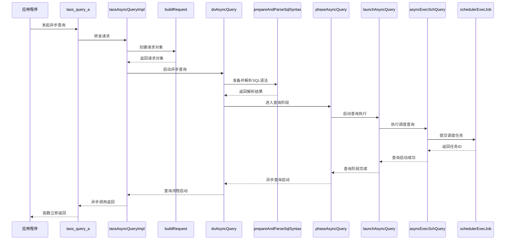

# 异步执行

<cite>
**本文档中引用的文件**  
- [taos.h](file://include/client/taos.h)
- [clientImpl.c](file://source/client/src/clientImpl.c)
- [clientMain.c](file://source/client/src/clientMain.c)
- [clientInt.h](file://source/client/inc/clientInt.h)
- [scheduler.c](file://source/libs/scheduler/src/scheduler.c)
- [schJob.c](file://source/libs/scheduler/src/schJob.c)
- [schTask.c](file://source/libs/scheduler/src/schTask.c)
- [schInt.h](file://source/libs/scheduler/inc/schInt.h)
</cite>

## 目录
1. [引言](#引言)
2. [核心组件分析](#核心组件分析)
3. [异步查询执行流程](#异步查询执行流程)
4. [底层通信与调度机制](#底层通信与调度机制)
5. [高并发性能优势](#高并发性能优势)
6. [最佳实践](#最佳实践)
7. [结论](#结论)

## 引言
本文档深入解析 TDengine 客户端中 `taos_query_a` 函数的实现机制，重点分析其异步执行功能。通过详细剖析 `taos_query_a` 的参数定义、非阻塞调用原理以及与底层通信层的交互方式，揭示如何通过该函数发起异步 SQL 查询。文档结合 `source/client/src/clientImpl.c` 中的实际代码，分析查询请求的封装、发送和状态管理流程，并提供使用 `taos_query_a` 的最佳实践建议，包括连接管理、请求上下文传递和线程安全注意事项。

## 核心组件分析

`taos_query_a` 函数是 TDengine 客户端异步查询的核心接口，其定义位于 `include/client/taos.h` 中。该函数接受一个数据库连接句柄、SQL 查询语句、一个回调函数指针和一个用户参数。其主要作用是发起一个非阻塞的 SQL 查询，并在查询完成后通过回调函数通知调用者。

在 `source/client/src/clientMain.c` 中，`taos_query_a` 的实现是一个简单的封装，它将连接句柄转换为连接 ID，并调用内部函数 `taosAsyncQueryImpl`。`taosAsyncQueryImpl` 是异步查询逻辑的真正入口，它负责创建请求对象、解析 SQL 语句并启动查询执行流程。

**Section sources**
- [taos.h](file://include/client/taos.h#L303)
- [clientMain.c](file://source/client/src/clientMain.c#L1569-L1572)
- [clientImpl.c](file://source/client/src/clientImpl.c#L3038-L3070)

## 异步查询执行流程

`taos_query_a` 的执行流程是一个多阶段的异步过程，涉及客户端内部多个组件的协作。

**Diagram sources**
- [clientImpl.c](file://source/client/src/clientImpl.c#L3038-L3070)
- [clientMain.c](file://source/client/src/clientMain.c#L1655-L1708)
- [clientMain.c](file://source/client/src/clientMain.c#L1616-L1653)
- [clientMain.c](file://source/client/src/clientMain.c#L1500-L1521)
- [clientImpl.c](file://source/client/src/clientImpl.c#L1512-L1557)
- [clientImpl.c](file://source/client/src/clientImpl.c#L1421-L1510)
- [scheduler.c](file://source/libs/scheduler/src/scheduler.c#L63-L80)

**Section sources**
- [clientImpl.c](file://source/client/src/clientImpl.c#L3038-L3070)
- [clientMain.c](file://source/client/src/clientMain.c#L1655-L1708)
- [clientMain.c](file://source/client/src/clientMain.c#L1616-L1653)
- [clientMain.c](file://source/client/src/clientMain.c#L1500-L1521)
- [clientImpl.c](file://source/client/src/clientImpl.c#L1512-L1557)
- [clientImpl.c](file://source/client/src/clientImpl.c#L1421-L1510)
- [scheduler.c](file://source/libs/scheduler/src/scheduler.c#L63-L80)

## 底层通信与调度机制

`taos_query_a` 的底层通信与调度机制是其高性能的关键。当 `asyncExecSchQuery` 函数确定查询需要在集群中调度执行时，它会调用 `schedulerExecJob` 函数，将查询计划提交给调度器。

`schedulerExecJob` 函数在 `source/libs/scheduler/src/scheduler.c` 中定义，它负责初始化一个调度任务（`SSchJob`）。该任务包含了查询计划、执行节点列表、回调函数等所有必要信息。调度器会根据查询计划中的依赖关系，构建一个任务图，并将任务分发到相应的执行节点。

```mermaid
classDiagram
class SSchedulerReq {
+bool syncReq
+bool localReq
+SRequestConnInfo* pConn
+SArray* pNodeList
+SQueryPlan* pDag
+int64_t allocatorRefId
+const char* sql
+int64_t startTs
+schedulerExecCb execFp
+void* cbParam
+chkRequestKilled chkKillFp
+void* chkKillParam
+SSchedulerExecRes* pExecRes
+int8_t source
+getTaskPoolWorkerCb pWorkerCb
}
class SSchJob {
+int64_t refId
+SQueryId queryId
+SQueryAttr attr
+SRequestConnInfo conn
+char* sql
+SQueryPlan* pDag
+int64_t allocatorRefId
+chkRequestKilled chkKillFp
+void* chkKillParam
+SSchedulerExecRes userRes
+int8_t source
+getTaskPoolWorkerCb pWorkerCb
+SArray* nodeList
+SArray* levels
+int32_t levelNum
+int32_t levelIdx
+int64_t seriesId
+int32_t taskNum
+SHashObj* taskList
+SHashObj* execTasks
+SArray* dataSrcTasks
+int32_t jobType
+int64_t startTs
+int64_t endTs
+int64_t rspSem
}
class SSchTask {
+int64_t taskId
+SSubplan* plan
+SSchLevel* level
+int64_t seriesId
+int32_t execId
+int32_t failedExecId
+int64_t failedSeriesId
+int64_t timeoutUsec
+int32_t clientId
+int32_t maxRetryTimes
+int32_t maxExecTimes
+int32_t retryTimes
+int32_t status
+SArray* children
+SArray* parents
+SHashObj* execNodes
+SArray* profile.execTime
+SArray* profile.waitTime
+SArray* profile.sendTime
+SArray* profile.recvTime
+SArray* profile.totalTime
}
class SSchLevel {
+int32_t level
+int32_t taskNum
+int32_t status
+SArray* subTasks
}
SSchedulerReq --> SSchJob : "初始化"
SSchJob --> SSchLevel : "包含多个"
SSchLevel --> SSchTask : "包含多个"
SSchTask --> SSchTask : "通过children和parents关联"
```

**Diagram sources**
- [scheduler.h](file://include/libs/scheduler/scheduler.h#L74)
- [scheduler.c](file://source/libs/scheduler/src/scheduler.c#L63-L80)
- [schJob.c](file://source/libs/scheduler/src/schJob.c#L851-L951)
- [schJob.c](file://source/libs/scheduler/src/schJob.c#L311-L455)
- [schTask.c](file://source/libs/scheduler/src/schTask.c#L58-L92)
- [schJob.c](file://source/libs/scheduler/src/schJob.c#L167-L297)

**Section sources**
- [scheduler.c](file://source/libs/scheduler/src/scheduler.c#L63-L80)
- [schJob.c](file://source/libs/scheduler/src/schJob.c#L851-L951)
- [schJob.c](file://source/libs/scheduler/src/schJob.c#L311-L455)
- [schTask.c](file://source/libs/scheduler/src/schTask.c#L58-L92)
- [schJob.c](file://source/libs/scheduler/src/schJob.c#L167-L297)

## 高并发性能优势

`taos_query_a` 的异步执行模型为高并发场景提供了显著的性能优势。传统的同步查询会阻塞调用线程，直到查询完成，这在处理大量并发请求时会导致线程资源耗尽和响应延迟增加。而 `taos_query_a` 采用非阻塞 I/O 模型，允许单个线程同时处理多个查询请求。

当一个查询被提交后，`taos_query_a` 会立即返回，不会阻塞调用线程。查询的实际执行在后台进行，完成后通过回调函数通知应用程序。这种模式极大地提高了系统的吞吐量和资源利用率，特别适合于需要处理大量短时查询的实时数据处理应用。

此外，TDengine 的分布式架构和高效的调度器进一步增强了其高并发性能。查询计划被分解为多个子任务，并行地在集群中的不同节点上执行，从而充分利用了集群的计算资源。

## 最佳实践

为了充分发挥 `taos_query_a` 的性能优势并确保应用的稳定性和可靠性，应遵循以下最佳实践：

1.  **连接管理**：复用数据库连接，避免频繁创建和销毁连接。可以使用连接池来管理连接。
2.  **请求上下文传递**：利用 `param` 参数传递请求上下文信息，如用户会话、请求ID等，以便在回调函数中进行处理。
3.  **线程安全**：确保回调函数是线程安全的，因为回调可能在任意线程中执行。避免在回调函数中访问共享资源时产生竞态条件。
4.  **错误处理**：在回调函数中检查 `code` 参数，以确定查询是否成功执行，并进行相应的错误处理。
5.  **资源清理**：在回调函数中及时释放与查询相关的资源，如结果集、内存等，防止内存泄漏。

**Section sources**
- [taos.h](file://include/client/taos.h#L303)
- [clientImpl.c](file://source/client/src/clientImpl.c#L3038-L3070)

## 结论

`taos_query_a` 函数是 TDengine 客户端实现高性能异步查询的关键。通过深入分析其内部实现机制，我们可以看到它如何通过非阻塞调用、高效的调度器和分布式执行来处理高并发查询。理解其工作原理和最佳实践，有助于开发者构建更高效、更可靠的实时数据处理应用。