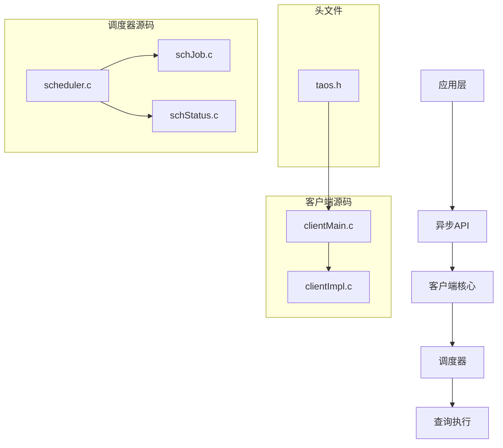
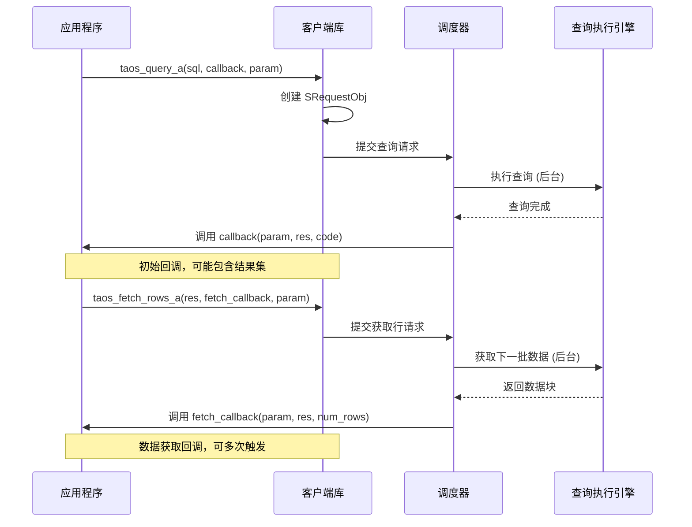
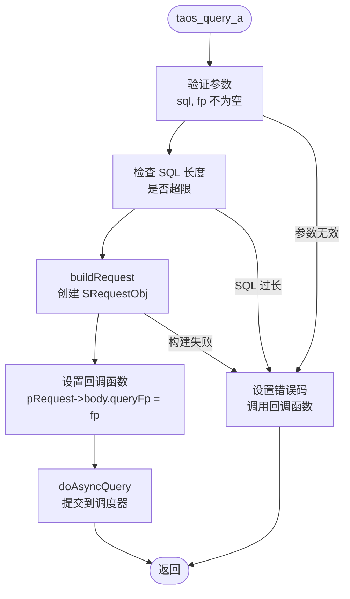
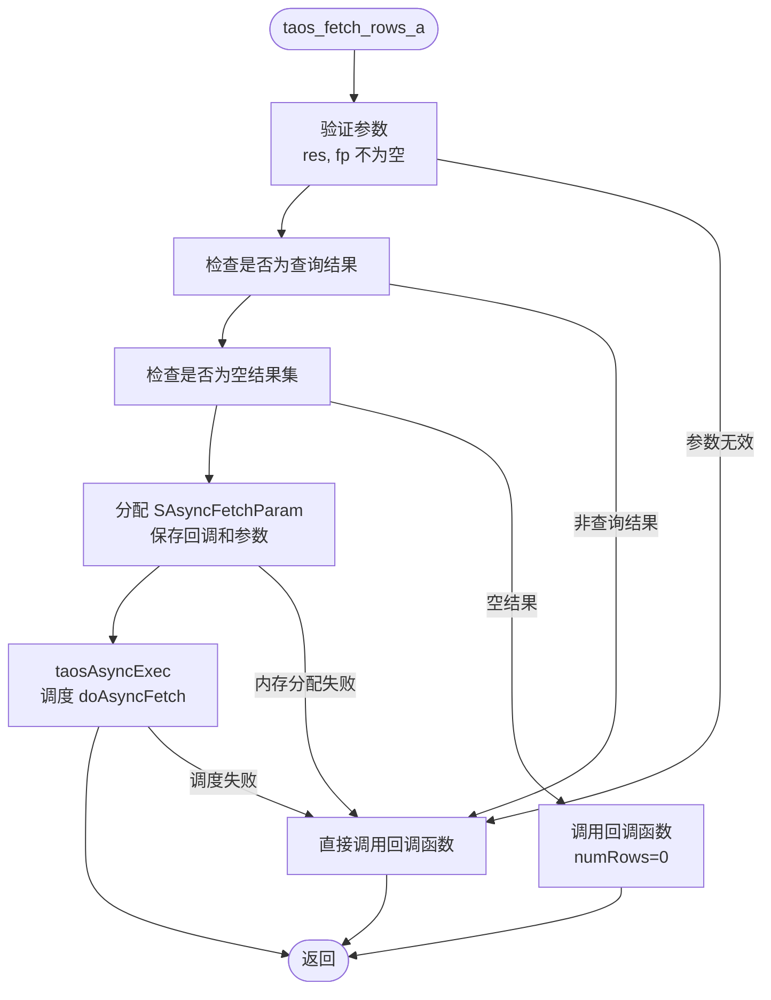
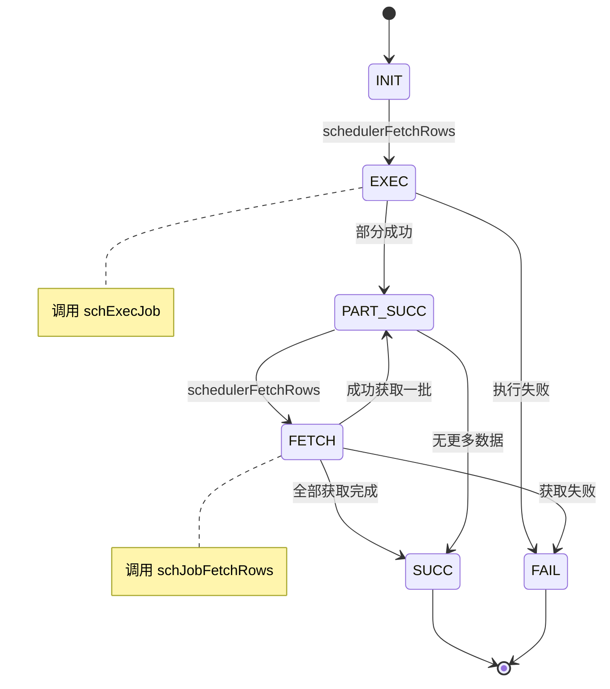
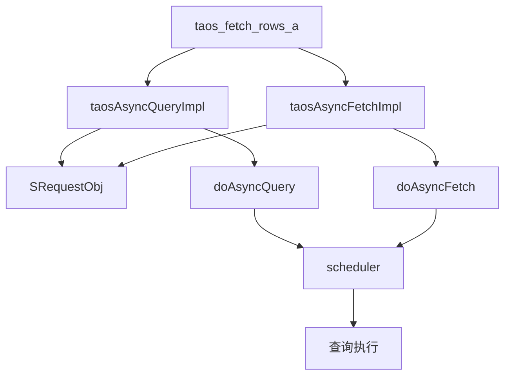

# 异步查询

<cite>
**本文档中引用的文件**  
- [asyncdemo.c](file://examples/c/asyncdemo.c)
- [taos.h](file://include/client/taos.h)
- [clientMain.c](file://source/client/src/clientMain.c)
- [clientImpl.c](file://source/client/src/clientImpl.c)
- [scheduler.c](file://source/libs/scheduler/src/scheduler.c)
- [schJob.c](file://source/libs/scheduler/src/schJob.c)
- [schStatus.c](file://source/libs/scheduler/src/schStatus.c)
</cite>

## 目录
1. [简介](#简介)
2. [项目结构](#项目结构)
3. [核心组件](#核心组件)
4. [架构概述](#架构概述)
5. [详细组件分析](#详细组件分析)
6. [依赖分析](#依赖分析)
7. [性能考虑](#性能考虑)
8. [故障排除指南](#故障排除指南)
9. [结论](#结论)

## 简介
本文档全面解析 TDengine 数据库客户端中的异步查询功能，重点分析 `taos_query_a`、`taos_fetch_rows_a` 及其回调机制。通过事件驱动的查询模式，应用程序能够在不阻塞主线程的情况下执行数据库操作，从而显著提升并发性能。文档结合 `examples/c/asyncdemo.c` 中的实际代码示例，深入探讨了多线程环境下的异步查询使用方法、回调函数的安全实现、上下文管理、错误处理策略以及资源清理注意事项，旨在为开发者构建高性能的数据处理管道提供指导。

## 项目结构
TDengine 项目的异步查询功能主要分布在客户端源码和示例代码中。核心的异步 API 定义在 `include/client/taos.h` 头文件中，其实现在 `source/client/src/` 目录下的 `clientMain.c` 和 `clientImpl.c` 文件中。调度器相关的逻辑位于 `source/libs/scheduler/` 目录。用户可以通过 `examples/c/asyncdemo.c` 示例程序学习如何使用这些异步接口。

**Diagram sources**
- [taos.h](file://include/client/taos.h)
- [clientMain.c](file://source/client/src/clientMain.c)
- [clientImpl.c](file://source/client/src/clientImpl.c)
- [scheduler.c](file://source/libs/scheduler/src/scheduler.c)
- [schJob.c](file://source/libs/scheduler/src/schJob.c)
- [schStatus.c](file://source/libs/scheduler/src/schStatus.c)

**Section sources**
- [taos.h](file://include/client/taos.h)
- [clientMain.c](file://source/client/src/clientMain.c)
- [clientImpl.c](file://source/client/src/clientImpl.c)

## 核心组件
异步查询功能的核心组件包括异步查询 API (`taos_query_a`)、异步获取结果 API (`taos_fetch_rows_a`)、回调函数机制、请求对象 (`SRequestObj`) 和调度器 (`scheduler`)。`taos_query_a` 函数用于发起异步查询，它将查询任务提交给内部调度器，并在完成后通过用户提供的回调函数通知应用。`taos_fetch_rows_a` 则用于在查询返回结果集后，以异步方式分批获取数据行。整个流程由 `SRequestObj` 结构体管理其生命周期和状态，而 `scheduler` 负责任务的排队、执行和状态转换。

**Section sources**
- [taos.h](file://include/client/taos.h#L303-L305)
- [clientMain.c](file://source/client/src/clientMain.c#L1569-L1786)
- [clientImpl.c](file://source/client/src/clientImpl.c#L3038-L3267)

## 架构概述
TDengine 的异步查询架构采用事件驱动模型，将数据库操作从应用的主执行流中解耦。当应用调用 `taos_query_a` 时，客户端库会创建一个 `SRequestObj` 请求对象，封装 SQL 语句、连接信息和用户回调函数。该请求对象被提交给 `scheduler`（调度器），调度器负责在后台线程中执行查询。查询完成后，调度器会触发相应的回调。对于 `SELECT` 查询，初始回调会收到一个结果集句柄 (`TAOS_RES`)，应用需要调用 `taos_fetch_rows_a` 来启动异步获取数据的流程，该流程同样由调度器管理，数据分批到达后通过另一个回调函数返回给应用。

**Diagram sources**
- [taos.h](file://include/client/taos.h#L303-L305)
- [clientMain.c](file://source/client/src/clientMain.c#L1569-L1786)
- [clientImpl.c](file://source/client/src/clientImpl.c#L3038-L3267)
- [scheduler.c](file://source/libs/scheduler/src/scheduler.c#L82-L95)

## 详细组件分析

### taos_query_a 函数分析
`taos_query_a` 是异步查询的入口点。它接收一个 SQL 语句、一个回调函数指针和一个用户参数。该函数的主要作用是将查询请求封装并提交给调度系统，而不阻塞调用线程。

#### 函数调用流程

**Diagram sources**
- [clientMain.c](file://source/client/src/clientMain.c#L1569-L1572)
- [clientImpl.c](file://source/client/src/clientImpl.c#L3038-L3070)

**Section sources**
- [clientMain.c](file://source/client/src/clientMain.c#L1569-L1572)
- [clientImpl.c](file://source/client/src/clientImpl.c#L3038-L3070)

### taos_fetch_rows_a 函数分析
`taos_fetch_rows_a` 用于异步获取查询结果集中的数据行。它通常在 `taos_query_a` 的初始回调中被调用，以启动数据获取流程。

#### 数据获取流程

**Diagram sources**
- [clientMain.c](file://source/client/src/clientMain.c#L1755-L1786)
- [clientImpl.c](file://source/client/src/clientImpl.c#L3225-L3267)

**Section sources**
- [clientMain.c](file://source/client/src/clientMain.c#L1755-L1786)
- [clientImpl.c](file://source/client/src/clientImpl.c#L3225-L3267)

### 调度器与状态机分析
异步操作的执行由 `scheduler` 模块管理，它通过一个状态机来控制查询任务的生命周期。

#### 调度器状态转换

**Diagram sources**
- [scheduler.c](file://source/libs/scheduler/src/scheduler.c#L82-L95)
- [schStatus.c](file://source/libs/scheduler/src/schStatus.c#L23-L66)
- [schJob.c](file://source/libs/scheduler/src/schJob.c#L1157-L1222)

**Section sources**
- [scheduler.c](file://source/libs/scheduler/src/scheduler.c#L82-L95)
- [schStatus.c](file://source/libs/scheduler/src/schStatus.c#L23-L66)

## 依赖分析
异步查询功能依赖于多个模块的协同工作。`taos_query_a` 和 `taos_fetch_rows_a` 依赖于 `clientImpl.c` 中的 `taosAsyncQueryImpl` 和 `taosAsyncFetchImpl` 函数来处理核心逻辑。这些函数又依赖于 `SRequestObj` 结构体来管理请求状态。最终，任务的执行和状态管理由 `scheduler` 模块负责，它通过 `schedulerFetchRows` 等接口与查询执行引擎交互。这种分层设计使得异步逻辑与具体的查询执行细节解耦，提高了代码的可维护性。

**Diagram sources**
- [taos.h](file://include/client/taos.h#L303-L305)
- [clientMain.c](file://source/client/src/clientMain.c#L1569-L1786)
- [clientImpl.c](file://source/client/src/clientImpl.c#L3038-L3267)
- [scheduler.c](file://source/libs/scheduler/src/scheduler.c#L82-L95)

**Section sources**
- [taos.h](file://include/client/taos.h#L303-L305)
- [clientMain.c](file://source/client/src/clientMain.c#L1569-L1786)
- [clientImpl.c](file://source/client/src/clientImpl.c#L3038-L3267)
- [scheduler.c](file://source/libs/scheduler/src/scheduler.c#L82-L95)

## 性能考虑
事件驱动的异步查询模式极大地提升了应用程序的并发性能。通过将耗时的数据库 I/O 操作移出主线程，应用可以同时处理多个查询或执行其他计算任务，避免了线程阻塞。在 `asyncdemo.c` 示例中，多个表的插入和查询操作都是并行发起的，由调度器在后台统一管理。这种模式特别适合高吞吐量的数据写入和实时数据处理场景。然而，开发者需要注意回调函数的执行效率，避免在回调中执行耗时操作，以免阻塞调度器线程，影响整体性能。

## 故障排除指南
在使用异步查询时，常见的问题包括回调函数未被调用、错误码处理不当和资源泄漏。确保在 `taos_query_a` 和 `taos_fetch_rows_a` 中传入有效的回调函数指针。在回调函数中，必须首先检查 `code` 参数以判断操作是否成功，`code` 为 0 表示成功，负数表示错误。对于 `taos_fetch_rows_a` 的回调，`numOfRows` 为 0 通常表示数据已全部获取完毕或查询失败。务必在最终的回调中调用 `taos_free_result(res)` 来释放结果集资源，防止内存泄漏。调试时，可以启用客户端日志来跟踪请求的完整生命周期。

**Section sources**
- [asyncdemo.c](file://examples/c/asyncdemo.c#L100-L290)
- [clientImpl.c](file://source/client/src/clientImpl.c#L3038-L3267)

## 结论
TDengine 的异步查询 API 提供了一套强大且高效的机制，用于构建高性能、高并发的应用程序。通过深入理解 `taos_query_a`、`taos_fetch_rows_a` 的工作原理和背后的调度器状态机，开发者可以充分利用事件驱动模型的优势。结合 `asyncdemo.c` 中的实践模式，正确管理回调、上下文和资源，能够有效提升数据处理管道的吞吐量和响应速度。掌握这些异步编程技巧对于开发大规模时序数据应用至关重要。