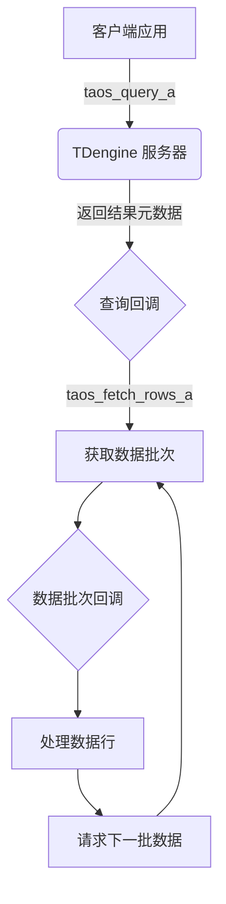
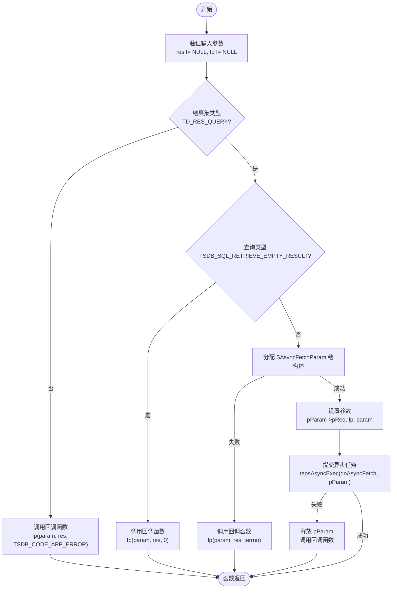
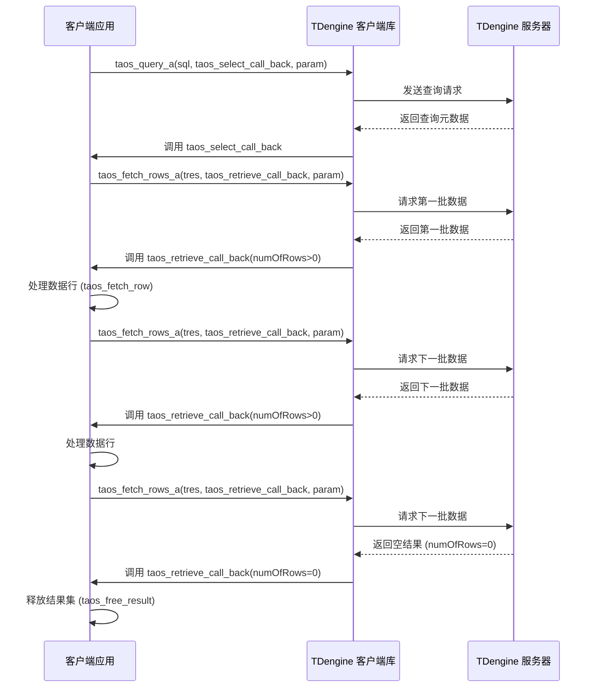
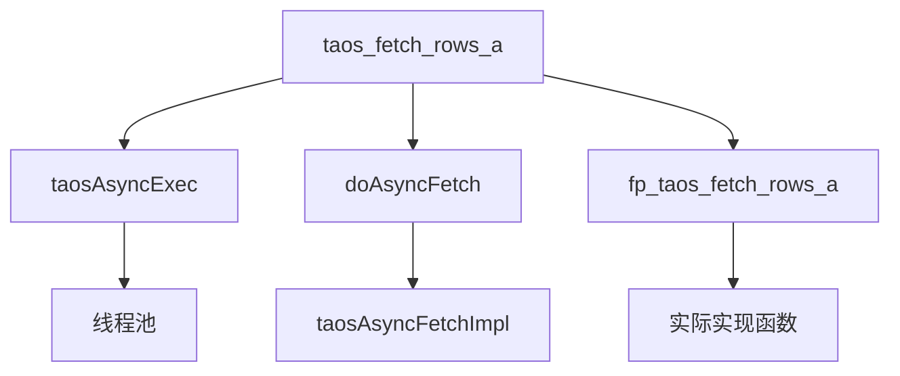

# 异步结果获取

<cite>
**本文档中引用的文件**  
- [asyncdemo.c](file://examples/c/asyncdemo.c)
- [taos.h](file://include/client/taos.h)
- [clientMain.c](file://source/client/src/clientMain.c)
- [wrapperFunc.c](file://source/client/wrapper/src/wrapperFunc.c)
</cite>

## 目录
1. [简介](#简介)
2. [项目结构](#项目结构)
3. [核心组件](#核心组件)
4. [架构概述](#架构概述)
5. [详细组件分析](#详细组件分析)
6. [依赖分析](#依赖分析)
7. [性能考虑](#性能考虑)
8. [故障排除指南](#故障排除指南)
9. [结论](#结论)

## 简介
本文档深入解析了 TDengine 数据库客户端中 `taos_fetch_rows_a` 函数的工作机制。该函数是异步查询结果获取的核心，允许应用程序在不阻塞主线程的情况下接收大规模查询结果。文档详细阐述了该函数如何与查询执行阶段协同工作，通过回调函数接收数据行，并展示了其在处理大规模结果集时的内存效率优势。通过分析 `examples/c/asyncdemo.c` 中的实际使用模式，本文档提供了正确设置回调函数以接收和处理返回数据行的指导。此外，还讨论了在不同网络条件和查询复杂度下，异步结果获取的性能表现和潜在瓶颈。

## 项目结构
TDengine 项目的结构清晰地划分了不同功能模块。核心的异步结果获取功能主要位于客户端（client）模块中。相关的头文件定义在 `include/client/taos.h`，而具体的实现代码则分布在 `source/client/src/` 和 `source/client/wrapper/src/` 目录下。示例代码 `examples/c/asyncdemo.c` 提供了一个完整的异步操作演示，是理解该功能的最佳实践参考。

**Section sources**
- [taos.h](file://include/client/taos.h#L1-L50)
- [clientMain.c](file://source/client/src/clientMain.c#L1-L100)

## 核心组件
异步结果获取功能的核心组件包括 `taos_query_a` 和 `taos_fetch_rows_a` 两个函数。`taos_query_a` 函数用于发起异步查询，它接受一个 SQL 语句和一个回调函数指针，当查询执行完成后，系统会调用该回调函数。`taos_fetch_rows_a` 函数则用于在查询回调中异步获取结果集的行数据，它同样需要一个回调函数来接收实际的数据行。这两个函数共同构成了非阻塞式数据访问的基础。

**Section sources**
- [taos.h](file://include/client/taos.h#L303-L305)
- [clientMain.c](file://source/client/src/clientMain.c#L1569-L1786)

## 架构概述
异步结果获取的架构遵循典型的生产者-消费者模式。客户端应用程序作为生产者，通过 `taos_query_a` 发起查询请求。TDengine 服务器作为数据生产者，执行查询并将结果分批返回。客户端的 `taos_fetch_rows_a` 函数作为消费者，通过注册的回调函数接收这些数据批次。这种架构通过将 I/O 操作与数据处理解耦，显著提高了应用程序的响应性和吞吐量。

**Diagram sources**
- [taos.h](file://include/client/taos.h#L303-L305)
- [clientMain.c](file://source/client/src/clientMain.c#L1569-L1786)

## 详细组件分析

### taos_fetch_rows_a 函数分析
`taos_fetch_rows_a` 函数是异步获取查询结果的关键。它接收一个 `TAOS_RES` 结果集指针、一个回调函数指针和一个用户参数。函数首先进行参数校验，确保结果集有效且回调函数不为空。随后，它创建一个包含请求对象、回调函数和用户参数的 `SAsyncFetchParam` 结构体，并通过 `taosAsyncExec` 将一个异步获取任务提交到线程池中执行。

#### 函数调用流程

**Diagram sources**
- [clientMain.c](file://source/client/src/clientMain.c#L1755-L1786)

**Section sources**
- [clientMain.c](file://source/client/src/clientMain.c#L1755-L1786)
- [wrapperFunc.c](file://source/client/wrapper/src/wrapperFunc.c#L532-L535)

### 异步查询与结果获取流程分析
从 `asyncdemo.c` 示例中可以清晰地看到完整的异步工作流程。程序首先通过 `taos_query_a` 发起一个 SELECT 查询，并指定 `taos_select_call_back` 作为回调函数。当查询元数据准备就绪后，`taos_select_call_back` 被调用，此时它立即调用 `taos_fetch_rows_a` 来获取第一批数据行，并将 `taos_retrieve_call_back` 作为数据接收的回调函数。

#### 异步数据流处理流程

**Diagram sources**
- [asyncdemo.c](file://examples/c/asyncdemo.c#L278-L292)
- [asyncdemo.c](file://examples/c/asyncdemo.c#L239-L276)

**Section sources**
- [asyncdemo.c](file://examples/c/asyncdemo.c#L239-L292)

## 依赖分析
`taos_fetch_rows_a` 函数的实现依赖于多个底层组件。它依赖于 `taosAsyncExec` 函数将获取任务提交到异步执行队列，这保证了主线程不会被阻塞。同时，它依赖于 `doAsyncFetch` 回调函数来执行实际的获取逻辑。在 `wrapperFunc.c` 中，`taos_fetch_rows_a` 通过函数指针 `fp_taos_fetch_rows_a` 调用实际的实现，这为动态链接库的加载和使用提供了灵活性。

**Diagram sources**
- [clientMain.c](file://source/client/src/clientMain.c#L1755-L1786)
- [wrapperFunc.c](file://source/client/wrapper/src/wrapperFunc.c#L532-L535)

**Section sources**
- [clientMain.c](file://source/client/src/clientMain.c#L1755-L1786)
- [wrapperFunc.c](file://source/client/wrapper/src/wrapperFunc.c#L532-L535)

## 性能考虑
异步结果获取在处理大规模结果集时具有显著的内存效率优势。与同步的 `taos_fetch_row` 一次性将所有结果加载到内存不同，`taos_fetch_rows_a` 采用流式处理，每次只加载一批数据。这极大地降低了内存峰值占用，使得应用程序能够处理远超内存容量的查询结果。然而，其性能也受到网络延迟和服务器处理能力的影响。在网络条件较差或查询非常复杂的情况下，回调函数的调用频率会降低，可能导致数据处理的延迟增加。此外，频繁的回调调用本身也会带来一定的 CPU 开销，因此需要合理设置批次大小以平衡内存使用和处理效率。

## 故障排除指南
在使用异步结果获取时，常见的问题包括回调函数未被调用、数据接收不完整或程序崩溃。这些问题通常源于参数错误或资源管理不当。例如，如果传递给 `taos_fetch_rows_a` 的 `res` 或 `fp` 为 NULL，函数会记录错误并直接返回。在 `taos_retrieve_call_back` 回调中，必须检查 `numOfRows` 的值，负数表示错误，零表示数据流结束，正数表示有数据行可处理。在数据流结束后，必须调用 `taos_free_result` 释放资源，否则会导致内存泄漏。调试时，应首先检查日志中的错误信息，并确保所有回调函数都正确处理了各种返回情况。

**Section sources**
- [clientMain.c](file://source/client/src/clientMain.c#L1755-L1786)
- [asyncdemo.c](file://examples/c/asyncdemo.c#L239-L276)

## 结论
`taos_fetch_rows_a` 函数是 TDengine 异步 API 的核心，它通过非阻塞的方式实现了高效的大规模数据流处理。通过与 `taos_query_a` 配合使用，开发者可以构建出高性能、高响应性的数据库应用。其基于回调的流式处理模型有效解决了内存瓶颈问题。尽管在复杂网络环境下可能存在性能波动，但通过合理的错误处理和资源管理，该功能为构建可扩展的数据密集型应用提供了坚实的基础。`asyncdemo.c` 示例代码为正确使用该功能提供了清晰的范例。