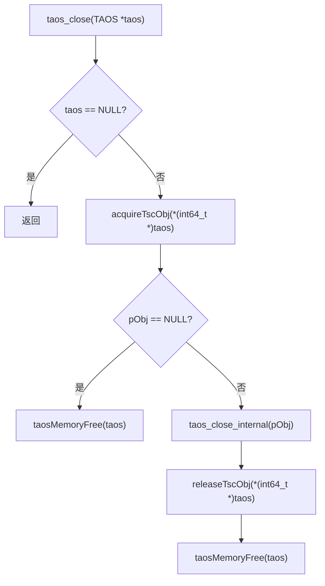
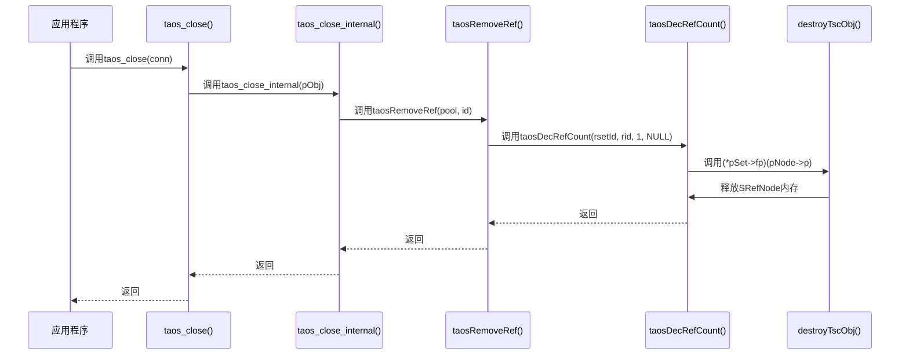
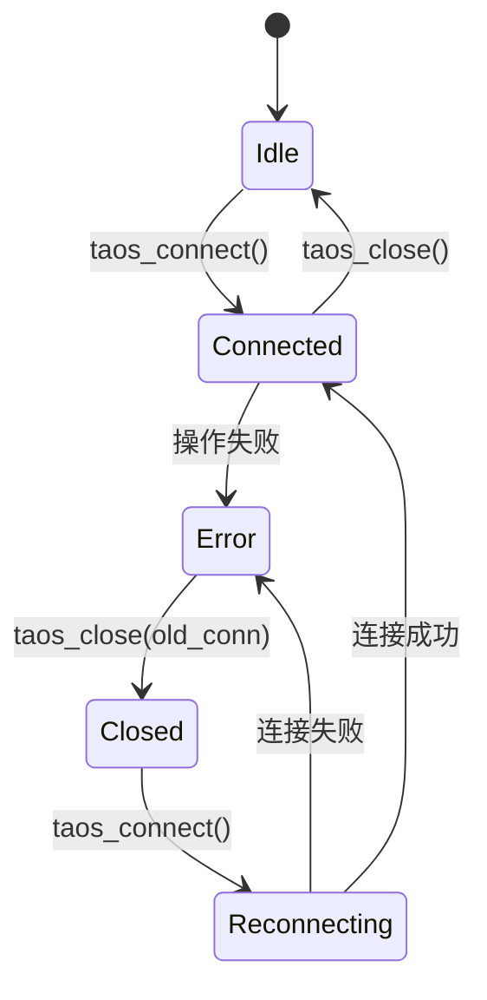

# 连接关闭

<cite>
**本文档中引用的文件**  
- [taos.h](file://include/client/taos.h)
- [clientMain.c](file://source/client/src/clientMain.c)
- [clientEnv.c](file://source/client/src/clientEnv.c)
- [tref.c](file://source/util/src/tref.c)
- [clientInt.h](file://source/client/inc/clientInt.h)
</cite>

## 目录
1. [简介](#简介)
2. [资源释放机制](#资源释放机制)
3. [优雅关闭与强制关闭](#优雅关闭与强制关闭)
4. [连接池环境下的连接归还](#连接池环境下的连接归还)
5. [错误处理与安全关闭](#错误处理与安全关闭)
6. [状态迁移与重新连接策略](#状态迁移与重新连接策略)
7. [常见问题与解决方案](#常见问题与解决方案)

## 简介
`taos_close` 函数是 TDengine 客户端用于关闭数据库连接的核心接口。该函数负责释放与连接相关的所有资源，包括网络连接、内存分配和会话状态。正确使用 `taos_close` 对于防止资源泄漏、确保系统稳定性和提高应用性能至关重要。

**Section sources**
- [taos.h](file://include/client/taos.h#L194-L194)
- [clientMain.c](file://source/client/src/clientMain.c#L646-L660)

## 资源释放机制
`taos_close` 函数的资源释放过程是一个多阶段的、线程安全的操作，涉及引用计数、网络连接终止和内存回收。

### 引用计数管理
TDengine 使用引用计数机制来管理连接对象的生命周期。`clientConnRefPool` 是一个全局的引用计数池，用于跟踪所有活动的连接对象。



**Diagram sources**
- [clientMain.c](file://source/client/src/clientMain.c#L646-L660)

当调用 `taos_close` 时，函数首先检查连接句柄是否为空。如果不为空，则通过 `acquireTscObj` 获取对 `STscObj`（连接对象）的引用。如果获取失败，说明连接对象已被销毁，直接释放句柄内存即可。

### 网络连接终止
`taos_close_internal` 函数负责执行实际的连接关闭逻辑。其核心操作是调用 `taosRemoveRef` 从 `clientConnRefPool` 中移除对该连接对象的引用。



**Diagram sources**
- [clientMain.c](file://source/client/src/clientMain.c#L633-L644)
- [tref.c](file://source/util/src/tref.c#L391-L470)

`taosRemoveRef` 的 `remove` 参数被设置为 `1`，这表示不仅要减少引用计数，还要将该对象标记为“已移除”。当引用计数降至零时，引用计数系统的回调函数 `fp` 会被触发。对于 `clientConnRefPool`，这个回调函数是 `destroyTscObj`。

### 内存回收与会话清理
`destroyTscObj` 函数是连接对象的析构函数，它执行最终的清理工作。

**Section sources**
- [clientEnv.c](file://source/client/src/clientEnv.c#L541-L548)
- [tref.c](file://source/util/src/tref.c#L391-L470)

1.  **注销心跳**：调用 `hbDeregisterConn` 从心跳管理器中注销该连接，停止发送心跳包。
2.  **销毁请求**：遍历 `pRequests` 哈希表，调用 `destroyRequest` 销毁所有与该连接关联的未完成的请求对象，释放其内存。
3.  **关闭传输器**：调用 `rpcClose` 关闭底层的 RPC 传输器，终止与服务器的网络连接。
4.  **释放资源**：销毁互斥锁，并最终释放 `STscObj` 结构体本身的内存。

## 优雅关闭与强制关闭
TDengine 的连接关闭机制本质上是“优雅关闭”，因为它会尝试完成所有正在进行的操作并有序地释放资源。

### 优雅关闭
优雅关闭是 `taos_close` 的默认行为。它确保：
- 所有未完成的查询请求会被正确清理。
- 心跳机制被正常注销。
- 网络连接被有序地关闭。

这种模式适用于正常的应用程序关闭流程或连接池中连接的归还。

### 强制关闭
虽然 `taos_close` 本身不提供“强制”参数，但可以通过 `taos_kill_query` 函数在关闭前强制终止所有正在进行的查询。

```mermaid
flowchart LR
A[应用程序] --> B[调用taos_kill_query(conn)]
B --> C[所有查询被标记为killed]
C --> D[调用taos_close(conn)]
D --> E[执行优雅关闭流程]
```

**适用场景**：
- **超时处理**：当某个查询执行时间过长，需要立即释放连接时。
- **异常恢复**：在应用程序检测到严重错误，需要快速释放所有资源时。

**Section sources**
- [clientMain.c](file://source/client/src/clientMain.c#L646-L660)
- [clientEnv.c](file://source/client/src/clientEnv.c#L1042-L1048)

## 连接池环境下的连接归还
在连接池场景下，`taos_close` 的行为是将连接“归还”给池，而不是永久销毁。

### 最佳实践
1.  **确保调用 `taos_close`**：每次使用完连接后，必须显式调用 `taos_close`。这是将连接归还给池的唯一方式。
2.  **避免重复关闭**：对同一个连接句柄调用多次 `taos_close` 是安全的，但应避免，因为第二次调用时句柄已被释放。
3.  **处理异常**：在 try-catch 块中使用连接，并在 finally 块中调用 `taos_close`，确保即使发生异常，连接也能被正确归还。

### 避免资源泄漏
- **不调用 `taos_close`**：这是最常见的资源泄漏原因。未关闭的连接会一直占用 `clientConnRefPool` 中的条目和服务器端的资源，最终导致连接池耗尽。
- **及时清理**：连接池实现应具备超时机制，对长时间未归还的连接进行强制清理。

**Section sources**
- [clientEnv.c](file://source/client/src/clientEnv.c#L541-L548)
- [tref.c](file://source/util/src/tref.c#L391-L470)

## 错误处理与安全关闭
`taos_close` 函数本身设计为“安全”的，即使在异常情况下也能防止二次释放或空指针访问。

### 错误处理代码示例
```c
// 示例：安全地关闭连接
void safeCloseConnection(TAOS *conn) {
    if (conn == NULL) {
        // 连接句柄为空，无需操作
        return;
    }

    // 尝试获取连接对象的引用
    STscObj *pObj = acquireTscObj(*(int64_t *)conn);
    if (pObj == NULL) {
        // 获取引用失败，说明连接对象可能已被销毁
        // 直接释放句柄内存
        taosMemoryFree(conn);
        return;
    }

    // 正常的关闭流程
    taos_close_internal(pObj);
    releaseTscObj(*(int64_t *)conn);
    taosMemoryFree(conn);
}
```

**关键点**：
- **空指针检查**：函数一开始就检查 `taos` 是否为 `NULL`。
- **双重检查**：`acquireTscObj` 可能失败，此时直接释放句柄内存，避免对无效指针的操作。
- **幂等性**：整个流程设计为幂等的，多次调用不会导致崩溃。

**Section sources**
- [clientMain.c](file://source/client/src/clientMain.c#L646-L660)

## 状态迁移与重新连接策略
### 连接关闭后的状态
一旦 `taos_close` 被调用，连接句柄 `TAOS*` 将进入“无效”状态。任何使用该句柄的后续操作（如 `taos_query`）都将失败，并返回 `TSDB_CODE_TSC_DISCONNECTED` 错误。

### 重新连接策略
应用程序应实现健壮的重连逻辑：
1.  **捕获错误**：当数据库操作返回连接相关的错误时，应捕获并识别。
2.  **关闭旧连接**：调用 `taos_close` 释放旧的连接句柄。
3.  **建立新连接**：调用 `taos_connect` 创建一个新的连接。
4.  **重试操作**：使用新的连接句柄重试失败的操作。



**Diagram sources**
- [clientMain.c](file://source/client/src/clientMain.c#L646-L660)
- [clientMain.c](file://source/client/src/clientMain.c#L243-L260)

## 常见问题与解决方案
### 连接未完全释放
**现象**：调用 `taos_close` 后，服务器端仍有连接存在。
**原因**：`taos_close` 被调用，但 `taosRemoveRef` 失败，或者 `destroyTscObj` 中的 `rpcClose` 未能立即生效。
**解决方案**：确保客户端和服务器版本兼容，检查网络状况。

### 文件描述符泄漏
**现象**：长时间运行的应用程序文件描述符数量持续增长。
**原因**：未调用 `taos_close`，导致 `rpcClose` 从未执行，底层的 socket 文件描述符未被关闭。
**解决方案**：严格遵循“获取即释放”的原则，在所有代码路径上确保 `taos_close` 被调用。

### 连接池耗尽
**现象**：应用程序无法获取新的数据库连接。
**原因**：连接池中的连接被占用但未归还，通常是由于异常路径下 `taos_close` 未被调用。
**解决方案**：
1.  使用 try-finally 或 RAII 模式确保连接关闭。
2.  在连接池中实现连接超时和最大存活时间。
3.  监控 `clientConnRefPool` 的大小，及时发现泄漏。

**Section sources**
- [clientEnv.c](file://source/client/src/clientEnv.c#L541-L548)
- [tref.c](file://source/util/src/tref.c#L391-L470)
- [clientMain.c](file://source/client/src/clientMain.c#L646-L660)