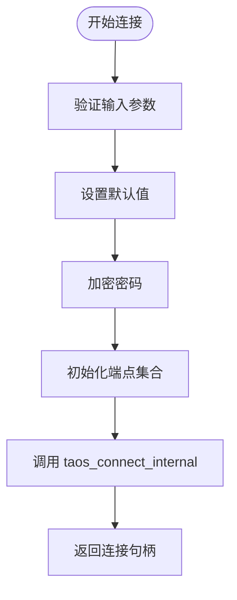
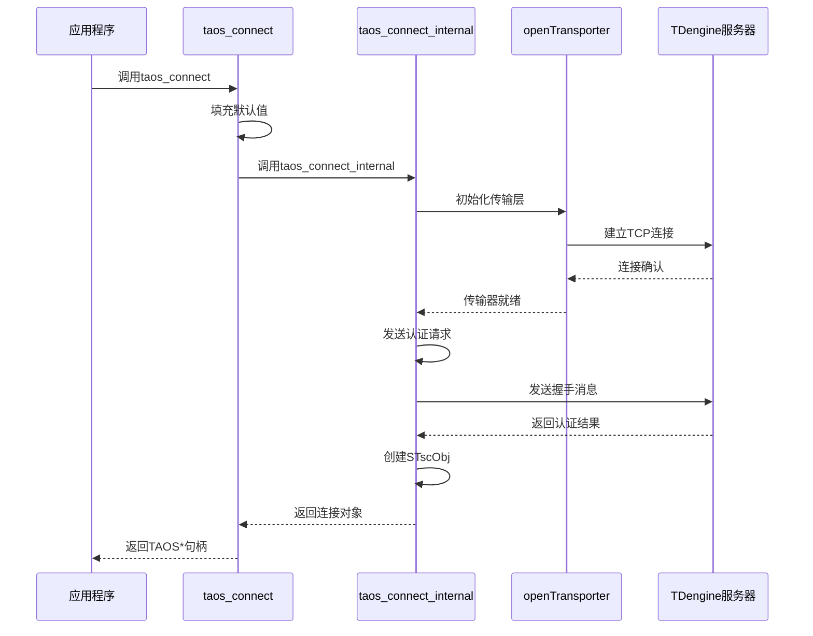
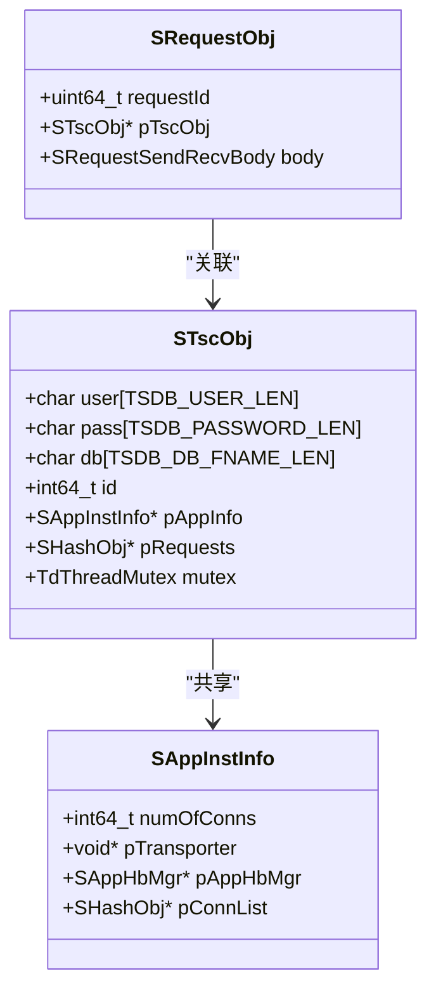
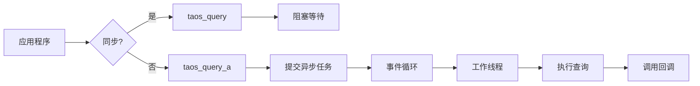

# 连接建立

<cite>
**本文档中引用的文件**  
- [taos.h](file://include/client/taos.h)
- [clientMain.c](file://source/client/src/clientMain.c)
- [clientImpl.c](file://source/client/src/clientImpl.c)
- [clientInt.h](file://source/client/inc/clientInt.h)
- [demo.c](file://examples/c/demo.c)
- [asyncdemo.c](file://examples/c/asyncdemo.c)
</cite>

## 目录
1. [简介](#简介)
2. [连接参数配置](#连接参数配置)
3. `taos_connect` 函数实现机制
4. 连接上下文（TAOS*）结构与生命周期
5. 同步与异步连接模式
6. 常见连接问题与故障排除
7. 最佳实践示例

## 简介

TDengine 数据库客户端通过 `taos_connect` 函数建立与服务器的连接。该函数负责初始化 TCP 连接、执行握手协议并创建会话上下文。连接建立是所有数据库操作的前提，其稳定性直接影响应用性能。本节将深入分析连接建立的完整流程，包括参数处理、内部调用链路及资源管理机制。

**Section sources**
- [taos.h](file://include/client/taos.h#L192-L192)
- [clientMain.c](file://source/client/src/clientMain.c#L298-L323)

## 连接参数配置

`taos_connect` 函数接受五个核心参数：主机地址、用户名、密码、数据库名和端口号。这些参数的配置方式和默认值如下：

- **主机（ip）**：指定服务器 IP 地址或域名。若未提供，则从配置文件中读取默认值。
- **用户（user）**：登录用户名，默认为 "root"（由 `TSDB_DEFAULT_USER` 宏定义）。
- **密码（pass）**：用户密码，默认为 "taosdata"（由 `TSDB_DEFAULT_PASS` 宏定义）。
- **数据库（db）**：连接时使用的默认数据库，可为空，后续可通过 `taos_select_db` 切换。
- **端口（port）**：服务器监听端口，默认为 6030。

参数在调用过程中会被验证长度和格式，并在必要时进行加密处理。例如，密码通过 `taosEncryptPass_c` 函数进行加密后传输。



**Diagram sources**
- [clientImpl.c](file://source/client/src/clientImpl.c#L148-L271)
- [tdef.h](file://include/util/tdef.h#L101-L110)

**Section sources**
- [taos.h](file://include/client/taos.h#L192-L192)
- [clientMain.c](file://source/client/src/clientMain.c#L298-L323)

## `taos_connect` 函数实现机制

`taos_connect` 函数的实现分为两个层次：公共接口层和内部实现层。公共接口位于 `clientMain.c` 中，主要负责参数校验和默认值填充；实际连接逻辑由 `taos_connect_internal` 函数完成。

### TCP连接初始化

连接初始化首先通过 `initEpSetFromCfg` 构建端点集合（EpSet），包含主从节点信息。随后调用 `openTransporter` 创建网络传输层，该函数初始化 RPC 模块并建立与管理节点的 TCP 连接。

### 握手协议

握手过程在 `taos_connect_internal` 中实现。客户端发送包含用户名、加密密码和集群密钥的认证请求。服务器验证凭据后返回会话信息，包括账户 ID、连接 ID 和版本号。此过程确保了通信双方的身份合法性。

### 会话创建

会话创建由 `createTscObj` 完成，分配 `STscObj` 结构体并初始化互斥锁、请求哈希表等资源。每个连接对应一个 `STscObj` 实例，通过引用计数管理生命周期。最终，连接 ID 被封装为 `TAOS*` 句柄返回给用户。



**Diagram sources**
- [clientMain.c](file://source/client/src/clientMain.c#L298-L323)
- [clientImpl.c](file://source/client/src/clientImpl.c#L148-L271)

**Section sources**
- [clientMain.c](file://source/client/src/clientMain.c#L298-L323)
- [clientImpl.c](file://source/client/src/clientImpl.c#L148-L271)

## 连接上下文（TAOS*）结构与生命周期

连接上下文由 `STscObj` 结构体表示，定义在 `clientInt.h` 中。该结构体包含以下关键字段：

- `user`、`pass`：存储用户凭据
- `db`：当前数据库名称
- `pAppInfo`：指向应用实例信息，共享网络资源
- `pRequests`：活跃请求的哈希表
- `id`：引用计数ID，用于资源追踪

生命周期管理通过引用计数实现。`taos_connect` 调用 `taosAddRef` 获取引用ID，`taos_close` 调用 `taosRemoveRef` 释放资源。当引用计数归零时，`destroyTscObj` 被触发，清理互斥锁、释放内存。



**Diagram sources**
- [clientInt.h](file://source/client/inc/clientInt.h#L167-L190)
- [clientMain.c](file://source/client/src/clientMain.c#L646-L660)

**Section sources**
- [clientInt.h](file://source/client/inc/clientInt.h#L167-L190)

## 同步与异步连接模式

TDengine 支持同步和异步两种连接模式，分别适用于不同场景。

### 同步模式

同步模式下，`taos_query` 阻塞等待查询结果。适用于简单脚本或对延迟不敏感的场景。示例如下：

```c
TAOS_RES* res = taos_query(taos, "SELECT * FROM meters");
// 阻塞直到结果返回
```

### 异步模式

异步模式使用回调函数处理结果，避免阻塞主线程。`taos_query_a` 接收一个函数指针作为参数，在查询完成后自动调用。适用于高并发或实时性要求高的应用。

```c
taos_query_a(taos, "SELECT * FROM meters", callback, param);
// 立即返回，不阻塞
```

异步模式依赖事件循环和线程池调度，通过 `taosAsyncExec` 提交任务到异步执行队列。



**Diagram sources**
- [taos.h](file://include/client/taos.h#L303-L305)
- [clientMain.c](file://source/client/src/clientMain.c#L1569-L1572)

**Section sources**
- [asyncdemo.c](file://examples/c/asyncdemo.c#L1-L293)

## 常见连接问题与故障排除

### 连接被拒绝

可能原因包括服务未启动、端口错误或防火墙拦截。检查步骤：
1. 确认 `taosd` 服务正在运行
2. 使用 `telnet` 测试端口连通性
3. 查看服务器日志 `/var/log/taosd.log`

### DNS解析失败

当使用域名连接时，若 DNS 解析失败会导致连接超时。建议：
- 使用 IP 地址代替域名
- 检查本地 DNS 配置
- 启用 IPv6 支持（如需要）

### 防火墙阻断

确保防火墙开放 6030-6042 端口范围。Linux 上可使用：
```bash
sudo firewall-cmd --add-port=6030-6042/tcp --permanent
sudo firewall-cmd --reload
```

### 超时处理

连接超时由底层 RPC 模块控制，可通过配置文件调整 `rpcMaxTime` 参数。应用层应实现重试机制，避免因短暂网络波动导致失败。

**Section sources**
- [clientImpl.c](file://source/client/src/clientImpl.c#L148-L271)
- [demo.c](file://examples/c/demo.c#L1-L134)

## 最佳实践示例

从 `examples/c/demo.c` 提取的最佳实践代码展示了连接建立的标准流程：

```c
TAOS *taos = taos_connect(argv[1], "root", "taosdata", NULL, 0);
if (taos == NULL) {
    printf("连接失败: %s\n", taos_errstr(NULL));
    exit(1);
}
// 使用连接...
taos_close(taos);
taos_cleanup();
```

关键要点：
- 检查返回值以处理连接失败
- 使用 `taos_errstr` 获取详细错误信息
- 调用 `taos_close` 释放连接资源
- 程序退出前调用 `taos_cleanup` 清理全局环境

**Section sources**
- [demo.c](file://examples/c/demo.c#L1-L134)
- [clientMain.c](file://source/client/src/clientMain.c#L234-L283)