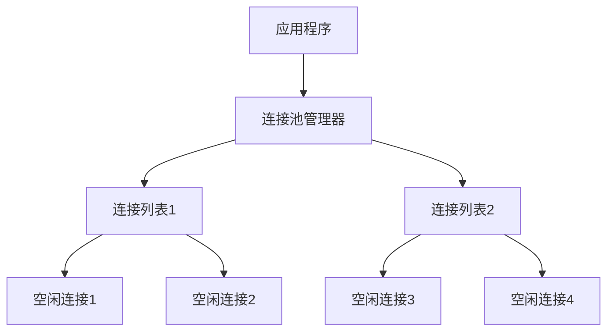
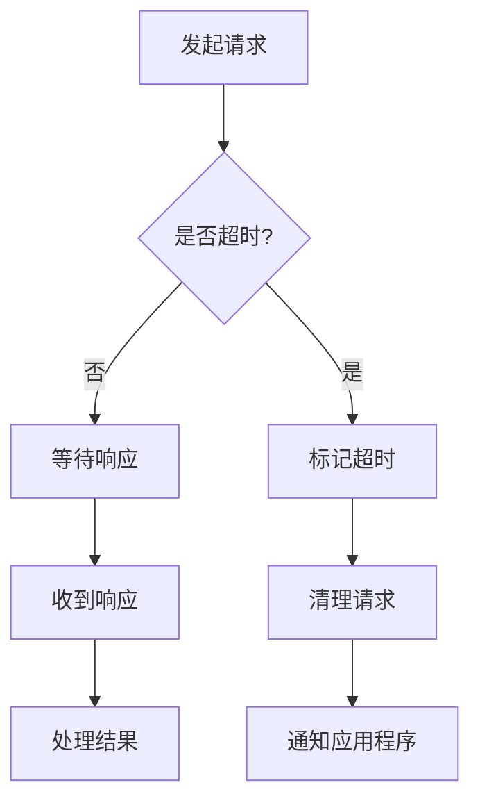

# 连接管理

<cite>
**本文档中引用的文件**  
- [taos.h](file://include/client/taos.h)
- [clientMain.c](file://source/client/src/clientMain.c)
- [clientImpl.c](file://source/client/src/clientImpl.c)
- [clientInt.h](file://source/client/inc/clientInt.h)
- [demo.c](file://examples/c/demo.c)
- [transCli.c](file://source/libs/transport/src/transCli.c)
</cite>

## 目录
1. [简介](#简介)
2. [连接函数实现细节](#连接函数实现细节)
3. [连接参数与配置](#连接参数与配置)
4. [连接池使用模式](#连接池使用模式)
5. [连接超时处理](#连接超时处理)
6. [连接状态监控](#连接状态监控)
7. [连接生命周期示例](#连接生命周期示例)
8. [常见连接问题与解决方案](#常见连接问题与解决方案)
9. [结论](#结论)

## 简介
本文档详细介绍了TDengine数据库客户端连接管理功能的核心实现。重点分析了`taos_connect`、`taos_connect_auth`和`taos_close`三个关键函数的内部工作机制，涵盖了连接建立、认证、关闭的完整流程。文档还深入探讨了连接参数配置、连接池管理、超时处理和状态监控等高级主题，并提供了实际代码示例和常见问题的解决方案，为开发者提供全面的连接管理指导。

## 连接函数实现细节

### taos_connect 函数
`taos_connect`函数是建立与TDengine数据库连接的主要入口。该函数位于`source/client/src/clientMain.c`文件中，接收主机IP、用户名、密码、数据库名和端口号作为参数。当用户名或密码为空时，函数会使用默认值（root和taosdata）。核心连接逻辑通过调用`taos_connect_internal`函数实现，该函数处理实际的连接建立过程，包括验证用户信息、加密密码、初始化连接端点等。成功连接后，函数返回一个指向连接对象的指针，该指针被封装在`TAOS`结构中供后续操作使用。

**Section sources**
- [clientMain.c](file://source/client/src/clientMain.c#L298-L323)
- [clientImpl.c](file://source/client/src/clientImpl.c#L148-L271)

### taos_connect_auth 函数
`taos_connect_auth`函数提供了基于认证信息的连接方式，位于`source/client/src/clientImpl.c`文件中。与`taos_connect`不同，该函数接收认证字符串而非明文密码，提高了安全性。函数首先验证用户信息，然后直接使用提供的认证信息进行连接。如果认证信息为空，函数会立即返回错误。该函数同样依赖`taos_connect_internal`来完成实际的连接过程，但将认证信息传递给内部函数，绕过了密码加密步骤。

**Section sources**
- [clientImpl.c](file://source/client/src/clientImpl.c#L1992-L2015)

### taos_close 函数
`taos_close`函数负责安全地关闭数据库连接，位于`source/client/src/clientMain.c`文件中。该函数首先检查连接指针是否为空，然后通过`acquireTscObj`获取连接对象。调用`taos_close_internal`执行实际的关闭操作，包括清理资源、释放内存等。最后，函数释放连接对象并释放相关内存，确保没有内存泄漏。该函数的设计考虑了异常情况，如空指针和无效连接对象，提供了健壮的错误处理机制。

**Section sources**
- [clientMain.c](file://source/client/src/clientMain.c#L646-L660)

## 连接参数与配置

### 核心连接参数
连接TDengine数据库需要配置以下核心参数：
- **主机（host）**：数据库服务器的IP地址或主机名
- **端口（port）**：数据库服务监听的端口号，默认为6030
- **用户（user）**：用于认证的用户名，默认为root
- **密码（password）**：用户密码，默认为taosdata
- **数据库（database）**：连接后默认使用的数据库名称

这些参数在`taos_connect`函数中直接作为参数传递，允许在连接时动态指定。参数验证在`taos_connect_internal`函数中完成，确保用户名、密码和数据库名称符合长度和格式要求。

### 高级配置选项
除了基本连接参数，TDengine还支持多种高级配置选项，通过`taos_options`函数设置：
- **TSDB_OPTION_LOCALE**：设置客户端区域设置
- **TSDB_OPTION_CHARSET**：指定字符集
- **TSDB_OPTION_TIMEZONE**：设置时区
- **TSDB_OPTION_CONFIGDIR**：指定配置文件目录

这些选项允许客户端根据具体环境进行精细化配置，确保与服务器的兼容性。配置信息存储在全局的`appInfo`结构中，影响所有后续的连接操作。

**Section sources**
- [taos.h](file://include/client/taos.h#L192-L194)
- [clientImpl.c](file://source/client/src/clientImpl.c#L148-L271)

## 连接池使用模式

### 连接池架构
TDengine客户端实现了高效的连接池机制，位于`source/libs/transport/src/transCli.c`文件中。连接池基于哈希表实现，以连接目标（IP+端口）作为键，管理多个连接列表。每个连接列表包含空闲连接队列，当需要新连接时，优先从池中获取空闲连接，避免频繁创建和销毁连接的开销。



**Diagram sources**
- [transCli.c](file://source/libs/transport/src/transCli.c#L813-L861)

### 连接复用策略
连接池采用智能的连接复用策略。当从池中获取连接时，系统会检查连接状态和负载情况。如果连接处于正常状态且请求队列未满，则直接复用该连接。否则，系统会创建新连接或等待现有连接释放。连接使用完毕后，通过`addConnToPool`函数将连接返回池中，标记为"ConnInPool"状态，供后续请求复用。

**Section sources**
- [transCli.c](file://source/libs/transport/src/transCli.c#L900-L945)

## 连接超时处理

### 超时机制设计
TDengine客户端实现了多层次的超时处理机制。在`transCli.c`文件中，`cliConnCheckTimoutMsg`函数负责检查连接上的超时消息。系统为每个连接维护一个定时器，当请求在指定时间内未收到响应时，触发超时处理。超时阈值通过`readTimeout`参数配置，允许用户根据网络环境调整。



**Diagram sources**
- [transCli.c](file://source/libs/transport/src/transCli.c#L766-L817)

### 超时恢复策略
当检测到连接超时，系统会执行一系列恢复操作。首先，从发送队列中移除超时的请求，避免资源浪费。然后，尝试重新建立连接或切换到备用连接。如果启用了心跳机制，系统会发送心跳包验证连接状态。超时处理还考虑了网络抖动情况，通过指数退避算法避免频繁重试导致的雪崩效应。

**Section sources**
- [transCli.c](file://source/libs/transport/src/transCli.c#L3807-L3846)

## 连接状态监控

### 心跳机制
TDengine客户端实现了基于心跳的连接状态监控。在`clientHb.c`文件中，`hbRegisterConn`函数负责注册连接到心跳管理器。系统定期向服务器发送心跳包，验证连接的活跃性。如果连续多次心跳失败，系统会标记连接为不可用，并尝试重新连接。心跳间隔和重试次数可以通过配置参数调整，平衡监控精度和网络开销。

### 状态跟踪
每个连接对象维护详细的状态信息，包括：
- 连接ID和引用计数
- 当前请求队列大小
- 最后活动时间戳
- 错误计数和重试次数

这些状态信息用于连接池管理和负载均衡决策。例如，系统会优先选择负载较低的连接，避免单个连接成为性能瓶颈。状态信息还用于故障诊断，帮助开发者分析连接问题的根本原因。

**Section sources**
- [clientHb.c](file://source/client/src/clientHb.c#L1609-L1653)

## 连接生命周期示例

### 完整连接流程
以下是从`examples/c/demo.c`中提取的连接生命周期示例，展示了从连接建立到关闭的完整过程：

```c
TAOS *taos = taos_connect(argv[1], "root", "taosdata", NULL, 0);
if (taos == NULL) {
    printf("failed to connect to server, reason:%s\n", taos_errstr(NULL));
    exit(1);
}
// 执行数据库操作
taos_close(taos);
taos_cleanup();
```

该示例首先调用`taos_connect`建立连接，检查返回值确保连接成功。然后执行一系列数据库操作，最后调用`taos_close`安全关闭连接。`taos_cleanup`函数用于清理全局资源，确保程序正常退出。

**Section sources**
- [demo.c](file://examples/c/demo.c#L30-L40)

## 常见连接问题与解决方案

### 网络超时
网络超时是最常见的连接问题之一。解决方案包括：
- 增加`readTimeout`配置值，适应高延迟网络
- 启用连接池，减少连接建立开销
- 配置多个备用服务器地址，实现故障转移
- 使用`taos_check_server_status`函数预检查服务器状态

### 认证失败
认证失败通常由以下原因引起：
- 用户名或密码错误
- 用户权限不足
- 认证信息过期

解决方案包括：
- 验证凭据的正确性
- 检查用户权限配置
- 使用`taos_connect_auth`函数传递最新认证信息
- 联系管理员重置密码

### 最大连接数限制
当客户端连接数超过服务器限制时，会收到"TSDB_CODE_RPC_MAX_SESSIONS"错误。解决方案包括：
- 优化应用程序，及时关闭不再使用的连接
- 增加服务器的`numOfRpcSessions`配置
- 实现连接复用和连接池
- 分散负载到多个服务器节点

**Section sources**
- [transCli.c](file://source/libs/transport/src/transCli.c#L858-L905)
- [taos.h](file://include/client/taos.h#L192-L194)

## 结论
本文档全面介绍了TDengine数据库的连接管理功能，从核心函数实现到高级使用模式。通过深入分析连接建立、认证、关闭的完整生命周期，以及连接池、超时处理和状态监控等关键机制，为开发者提供了全面的技术参考。理解这些内部机制有助于优化应用程序性能，提高系统稳定性和可靠性。建议开发者根据具体应用场景，合理配置连接参数，充分利用连接池和监控功能，构建高效稳定的数据库应用。