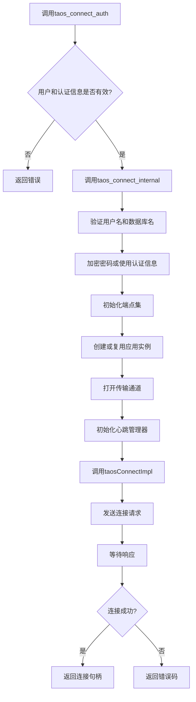
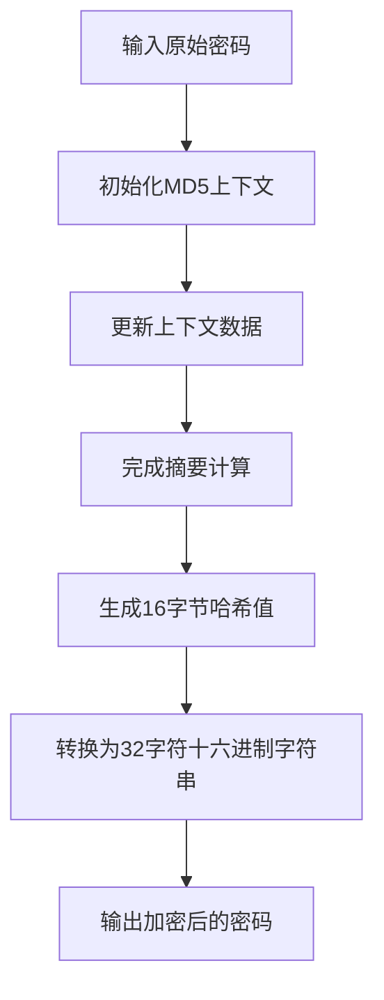

# 连接认证

<cite>
**本文档中引用的文件**  
- [taos.h](file://include/client/taos.h)
- [clientImpl.c](file://source/client/src/clientImpl.c)
- [clientInt.h](file://source/client/inc/clientInt.h)
- [tutil.h](file://include/util/tutil.h)
- [tmsg.h](file://include/common/tmsg.h)
- [clientMsgHandler.c](file://source/client/src/clientMsgHandler.c)
- [wrapperFunc.c](file://source/client/wrapper/src/wrapperFunc.c)
</cite>

## 目录
1. [连接认证概述](#连接认证概述)
2. [认证流程详解](#认证流程详解)
3. [密码加密机制](#密码加密机制)
4. [认证令牌生成与权限验证](#认证令牌生成与权限验证)
5. [多租户环境下的认证隔离](#多租户环境下的认证隔离)
6. [认证失败错误码处理](#认证失败错误码处理)
7. [基于Token和密码的认证示例](#基于token和密码的认证示例)
8. [常见问题与解决方案](#常见问题与解决方案)

## 连接认证概述

TDengine数据库的连接认证功能通过`taos_connect_auth`函数实现，该函数允许客户端通过指定的IP地址、用户名、认证信息、数据库名和端口号建立安全连接。认证信息可以是经过加密的密码或令牌，系统支持本地认证等多种认证方式。此功能确保了只有经过授权的用户才能访问数据库资源，增强了系统的安全性。

**Section sources**
- [taos.h](file://include/client/taos.h#L193-L193)
- [clientImpl.c](file://source/client/src/clientImpl.c#L1992-L2015)

## 认证流程详解

`taos_connect_auth`函数的认证流程始于客户端调用该函数并提供必要的连接参数。首先，函数检查用户和认证信息的有效性，如果用户未指定，则使用默认用户；若认证信息为空，则直接返回错误。随后，调用`taos_connect_internal`函数进行内部连接处理，该过程包括验证用户名和数据库名的长度、加密密码或直接使用提供的认证信息、初始化端点集（Endpoint Set）、创建或复用应用实例信息、打开传输通道、初始化心跳管理器等步骤。最终，通过`taosConnectImpl`函数完成与服务器的实际连接请求。



**Diagram sources**
- [clientImpl.c](file://source/client/src/clientImpl.c#L1992-L2015)
- [clientImpl.c](file://source/client/src/clientImpl.c#L148-L271)

**Section sources**
- [clientImpl.c](file://source/client/src/clientImpl.c#L148-L271)
- [clientImpl.c](file://source/client/src/clientImpl.c#L1690-L1747)

## 密码加密机制

在TDengine中，密码加密采用MD5算法。当用户提供的认证信息为空时，系统会调用`taosEncryptPass_c`函数对原始密码进行加密处理。该函数接收原始密码的字节流和长度作为输入，通过初始化MD5上下文、更新上下文数据、完成摘要计算等步骤，最终生成一个16字节的哈希值，并将其转换为32字符的十六进制字符串形式存储。这一过程确保了即使密码在传输过程中被截获，也无法轻易还原出原始密码，从而提高了安全性。



**Diagram sources**
- [tutil.h](file://include/util/tutil.h#L195-L208)

**Section sources**
- [tutil.h](file://include/util/tutil.h#L195-L208)

## 认证令牌生成与权限验证

除了基于密码的认证外，TDengine还支持基于令牌的认证方式。在这种模式下，客户端直接提供一个已经过服务器验证的令牌作为认证信息。服务器接收到连接请求后，会解析令牌中的用户身份和权限信息，验证其有效性。对于多租户环境，每个租户拥有独立的认证信息和权限配置，确保不同租户之间的数据隔离。此外，系统还支持白名单配置，允许管理员指定哪些IP地址或网络段可以访问数据库，进一步增强了安全性。

**Section sources**
- [clientImpl.c](file://source/client/src/clientImpl.c#L148-L271)
- [clientImpl.c](file://source/client/src/clientImpl.c#L1690-L1747)

## 多租户环境下的认证隔离

在多租户环境中，TDengine通过为每个租户分配独立的账户和数据库来实现认证隔离。每个账户都有自己的用户名、密码或令牌，以及特定的权限设置。当用户尝试连接时，系统根据提供的认证信息查找对应的账户，并验证其是否有权访问请求的数据库。此外，通过配置白名单，可以限制只有来自特定IP地址或网络段的连接请求才能被接受，有效防止未授权访问。

**Section sources**
- [clientImpl.c](file://source/client/src/clientImpl.c#L148-L271)
- [clientImpl.c](file://source/client/src/clientImpl.c#L1690-L1747)

## 认证失败错误码处理

当认证失败时，TDengine会返回相应的错误码，帮助开发者诊断问题。常见的错误码包括`TSDB_CODE_AUTH_FAILED`（认证失败）、`TSDB_CODE_TSC_INVALID_USER_LENGTH`（用户名长度无效）、`TSDB_CODE_TSC_INVALID_PASS_LENGTH`（密码长度无效）等。开发者应根据具体的错误码采取相应的处理措施，如提示用户检查输入的用户名和密码、确认网络连接状态等。对于某些特定的错误，还可以通过日志记录详细信息，便于后续分析和调试。

**Section sources**
- [clientImpl.c](file://source/client/src/clientImpl.c#L148-L271)
- [clientMsgHandler.c](file://source/client/src/clientMsgHandler.c#L59-L197)

## 基于Token和密码的认证示例

### 基于密码的认证示例

```c
TAOS *taos = taos_connect_auth("127.0.0.1", "root", "your_password", "test", 6030);
if (taos == NULL) {
    printf("Failed to connect to TDengine: %s\n", tstrerror(terrno));
} else {
    printf("Connected to TDengine successfully.\n");
}
```

### 基于Token的认证示例

```c
TAOS *taos = taos_connect_auth("127.0.0.1", "root", "your_token", "test", 6030);
if (taos == NULL) {
    printf("Failed to connect to TDengine: %s\n", tstrerror(terrno));
} else {
    printf("Connected to TDengine successfully.\n");
}
```

**Section sources**
- [taos.h](file://include/client/taos.h#L193-L193)
- [clientImpl.c](file://source/client/src/clientImpl.c#L1992-L2015)

## 常见问题与解决方案

### 密码过期

如果用户的密码已过期，系统将拒绝连接请求并返回`TSDB_CODE_AUTH_FAILED`错误码。解决方法是联系管理员重置密码或使用新的认证信息重新连接。

### 权限不足

当用户尝试执行超出其权限范围的操作时，可能会遇到权限不足的问题。此时，应检查用户的权限设置，必要时由管理员授予相应的权限。

### 认证服务不可用

若认证服务暂时不可用，可能导致连接失败。建议检查网络连接状态，确认服务器是否正常运行，并查看相关日志以获取更多信息。

**Section sources**
- [clientImpl.c](file://source/client/src/clientImpl.c#L148-L271)
- [clientMsgHandler.c](file://source/client/src/clientMsgHandler.c#L59-L197)