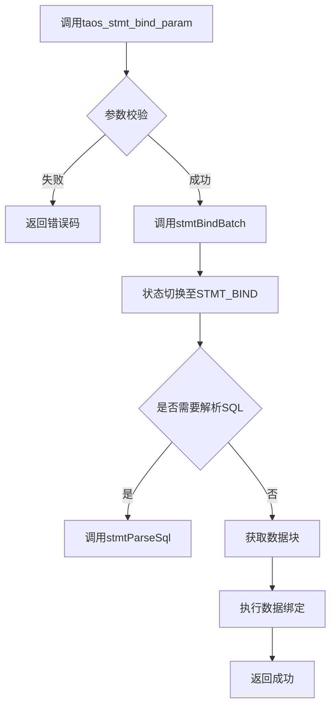
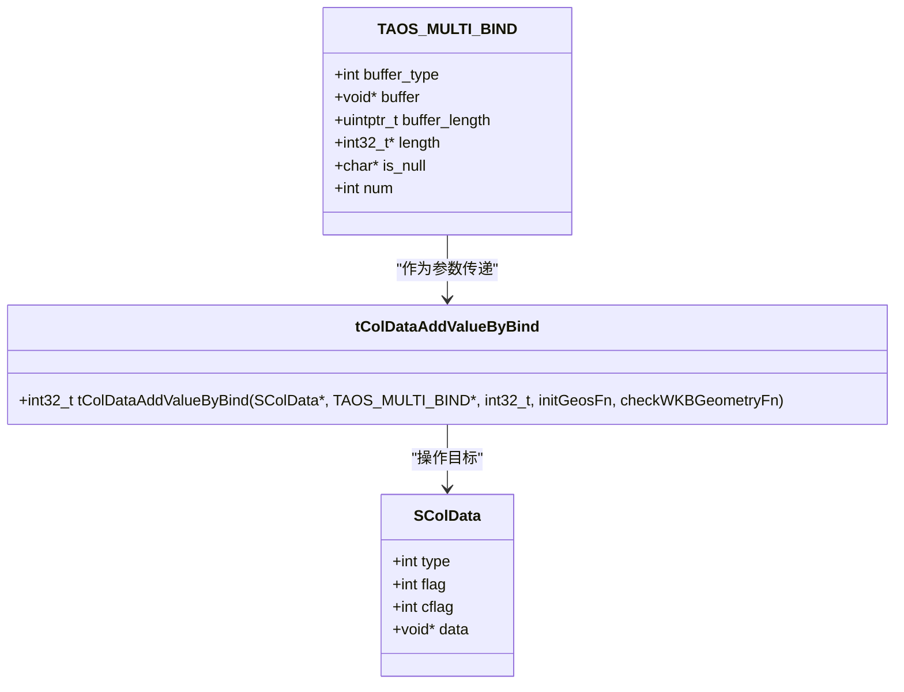
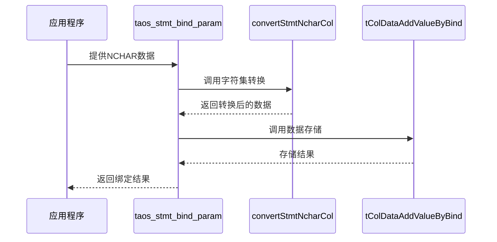

# 参数绑定

<cite>
**本文档引用的文件**
- [taos.h](file://include/client/taos.h)
- [clientStmt.c](file://source/client/src/clientStmt.c)
- [tdataformat.c](file://source/common/src/tdataformat.c)
- [parInsertStmt.c](file://source/libs/parser/src/parInsertStmt.c)
- [ttypes.h](file://include/common/ttypes.h)
- [tdataformat.h](file://include/common/tdataformat.h)
- [tdef.h](file://include/util/tdef.h)
</cite>

## 目录
1. [简介](#简介)
2. [核心功能分析](#核心功能分析)
3. [数据类型支持与绑定规则](#数据类型支持与绑定规则)
4. [内存管理与类型转换机制](#内存管理与类型转换机制)
5. [NULL值与复杂数据类型处理](#null值与复杂数据类型处理)
6. [最佳实践与错误防范](#最佳实践与错误防范)

## 简介
`taos_stmt_bind_param`函数是TDengine客户端中用于参数绑定的核心接口，它允许应用程序将变量安全地绑定到SQL语句中的参数占位符。该功能通过预编译语句（prepared statement）机制，有效防止SQL注入攻击，并提升执行效率。本技术文档将深入分析`taos_stmt_bind_param`的实现机制，涵盖其在`source/client/src/clientStmt.c`中的类型转换、内存管理以及对NULL值和复杂数据类型（如BINARY、NCHAR）的处理方式。

**Section sources**
- [taos.h](file://include/client/taos.h#L214)
- [clientStmt.c](file://source/client/src/clientStmt.c#L0-L1996)

## 核心功能分析
`taos_stmt_bind_param`函数的主要作用是将应用程序中的变量绑定到预编译的SQL语句中。该函数首先进行参数校验，确保`stmt`和`bind`指针不为空，然后调用`stmtBindBatch`函数执行实际的绑定操作。`stmtBindBatch`函数负责处理绑定过程中的状态切换、SQL解析、数据块获取以及最终的数据绑定。整个流程确保了数据从应用程序到数据库的高效、安全传输。

**Diagram sources**
- [clientStmt.c](file://source/client/src/clientStmt.c#L1303-L1470)

**Section sources**
- [clientStmt.c](file://source/client/src/clientStmt.c#L2166-L2180)
- [clientStmt.c](file://source/client/src/clientStmt.c#L1303-L1470)

## 数据类型支持与绑定规则
TDengine支持多种数据类型，每种类型都有其特定的绑定规则。主要数据类型包括：

- **TSDB_DATA_TYPE_BOOL**: 布尔类型，占用1字节。
- **TSDB_DATA_TYPE_INT**: 整数类型，占用4字节。
- **TSDB_DATA_TYPE_BIGINT**: 大整数类型，占用8字节。
- **TSDB_DATA_TYPE_BINARY**: 二进制类型，用于存储二进制数据。
- **TSDB_DATA_TYPE_NCHAR**: 宽字符类型，用于存储Unicode字符。

在绑定过程中，`qBindStmtColsValue`函数会检查绑定参数的类型是否与列的类型匹配。如果类型不匹配，函数将返回错误码`TSDB_CODE_INVALID_PARA`。此外，对于可变长度数据类型（如BINARY、NCHAR），还需要检查数据长度是否超过列定义的最大长度。

**Section sources**
- [taos.h](file://include/client/taos.h#L33-L37)
- [ttypes.h](file://include/common/ttypes.h#L0-L428)
- [parInsertStmt.c](file://source/libs/parser/src/parInsertStmt.c#L415-L475)

## 内存管理与类型转换机制
`taos_stmt_bind_param`函数在内存管理方面采用了高效的策略。对于固定长度数据类型，直接将数据复制到目标缓冲区；对于可变长度数据类型，则需要额外的内存分配和管理。类型转换主要通过`tColDataAddValueByBind`函数实现，该函数根据数据类型调用相应的处理函数，确保数据正确地转换和存储。

**Diagram sources**
- [taos.h](file://include/client/taos.h#L133-L140)
- [tdataformat.h](file://include/common/tdataformat.h#L250-L251)
- [tdataformat.c](file://source/common/src/tdataformat.c#L4746-L4829)

**Section sources**
- [tdataformat.c](file://source/common/src/tdataformat.c#L4746-L4829)
- [tdataformat.h](file://include/common/tdataformat.h#L250-L251)

## NULL值与复杂数据类型处理
处理NULL值时，`taos_stmt_bind_param`函数通过`is_null`字段来标识。如果`is_null[i]`为非零值，则表示第i行的数据为NULL。对于复杂数据类型如NCHAR，需要进行字符集转换。`convertStmtNcharCol`函数负责将多字节字符串转换为UCS-4编码，并检查转换后的数据长度是否符合要求。

**Diagram sources**
- [parInsertStmt.c](file://source/libs/parser/src/parInsertStmt.c#L303-L348)
- [tdataformat.c](file://source/common/src/tdataformat.c#L4746-L4829)

**Section sources**
- [parInsertStmt.c](file://source/libs/parser/src/parInsertStmt.c#L303-L348)
- [tdataformat.c](file://source/common/src/tdataformat.c#L4746-L4829)

## 最佳实践与错误防范
为避免类型不匹配错误，建议在绑定前明确指定数据类型，并确保数据长度不超过列定义的最大长度。使用`taos_stmt_get_param`函数可以获取参数的类型和长度信息，从而进行预检查。此外，合理使用`taos_stmt_is_insert`函数判断语句类型，避免在非插入语句中调用绑定函数。

**Section sources**
- [clientStmt.c](file://source/client/src/clientStmt.c#L1472-L1490)
- [clientStmt.c](file://source/client/src/clientStmt.c#L1492-L1510)