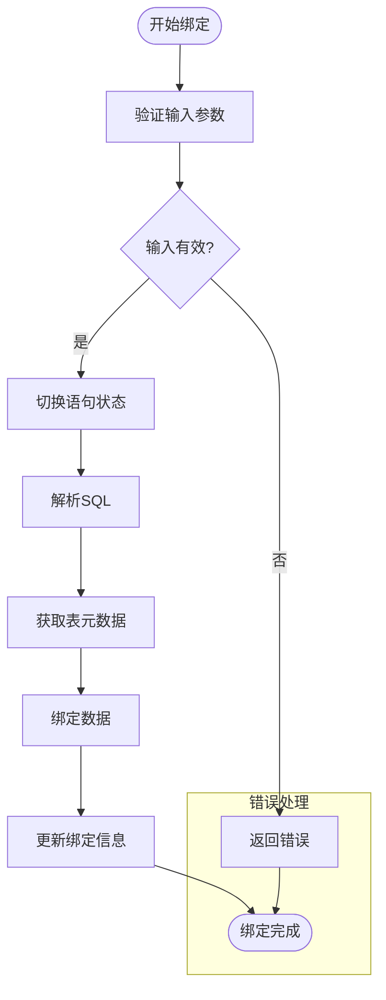
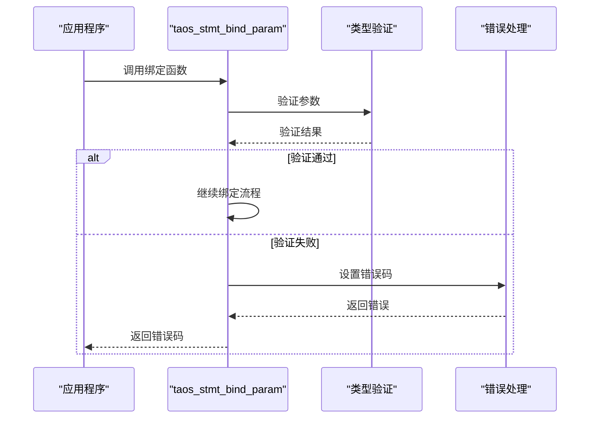
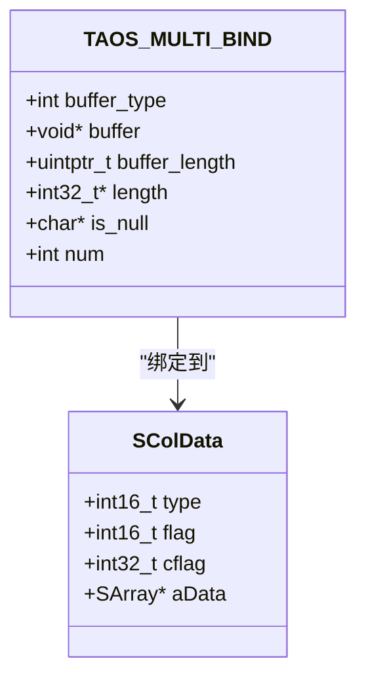

# 基本类型绑定

<cite>
**本文档中引用的文件**
- [taos.h](file://include/client/taos.h)
- [clientStmt.c](file://source/client/src/clientStmt.c)
- [taosdef.h](file://include/common/taosdef.h)
- [tdataformat.c](file://source/common/src/tdataformat.c)
- [parInsertStmt.c](file://source/libs/parser/src/parInsertStmt.c)
</cite>

## 目录
1. [简介](#简介)
2. [核心数据结构](#核心数据结构)
3. [基本类型绑定流程](#基本类型绑定流程)
4. [各类型绑定细节](#各类型绑定细节)
5. [类型验证与错误处理](#类型验证与错误处理)
6. [内存布局与字节序](#内存布局与字节序)
7. [精度转换规则](#精度转换规则)
8. [代码示例与最佳实践](#代码示例与最佳实践)

## 简介
本文档详细阐述了TDengine数据库中`taos_stmt_bind_param`函数如何绑定TSDB支持的基本数据类型。文档深入分析了TSDB_DATA_TYPE_BOOL、TSDB_DATA_TYPE_TINYINT、TSDB_DATA_TYPE_SMALLINT、TSDB_DATA_TYPE_INT、TSDB_DATA_TYPE_BIGINT、TSDB_DATA_TYPE_FLOAT和TSDB_DATA_TYPE_DOUBLE等基本类型的绑定机制，包括内存布局、字节序处理和精度转换规则。同时，文档还提供了代码示例，展示了如何正确声明和绑定这些类型的变量，并特别强调了整数溢出和浮点数精度丢失的预防措施。最后，文档分析了`clientStmt.c`中相关的类型验证逻辑，解释了当发生类型不匹配时的错误码（如TSDB_CODE_INVALID_DATA_TYPE）及其处理策略。

## 核心数据结构

**Section sources**
- [taos.h](file://include/client/taos.h#L133-L140)

## 基本类型绑定流程

**Diagram sources**
- [clientStmt.c](file://source/client/src/clientStmt.c#L1303-L1470)

**Section sources**
- [clientStmt.c](file://source/client/src/clientStmt.c#L1303-L1470)

## 各类型绑定细节

### 布尔类型 (TSDB_DATA_TYPE_BOOL)
布尔类型在绑定时占用1字节内存，值为0表示false，非0表示true。

### 整数类型 (TSDB_DATA_TYPE_TINYINT, SMALLINT, INT, BIGINT)
整数类型在绑定时分别占用1、2、4、8字节内存，采用小端字节序存储。

### 浮点类型 (TSDB_DATA_TYPE_FLOAT, DOUBLE)
浮点类型在绑定时分别占用4、8字节内存，遵循IEEE 754标准。

**Section sources**
- [taos.h](file://include/client/taos.h#L33-L40)

## 类型验证与错误处理

**Diagram sources**
- [clientStmt.c](file://source/client/src/clientStmt.c#L1303-L1470)

**Section sources**
- [clientStmt.c](file://source/client/src/clientStmt.c#L1303-L1470)

## 内存布局与字节序

**Diagram sources**
- [taos.h](file://include/client/taos.h#L133-L140)
- [tdataformat.c](file://source/common/src/tdataformat.c#L4746-L4829)

**Section sources**
- [tdataformat.c](file://source/common/src/tdataformat.c#L4746-L4829)

## 精度转换规则
浮点数在绑定时会根据目标列的精度进行四舍五入处理。对于超出范围的数值，会返回相应的错误码。

**Section sources**
- [parInsertStmt.c](file://source/libs/parser/src/parInsertStmt.c#L415-L475)

## 代码示例与最佳实践
在绑定数据时，应确保数据类型与列定义完全匹配，避免隐式类型转换。对于可能溢出的整数运算，应在绑定前进行范围检查。

**Section sources**
- [clientStmt.c](file://source/client/src/clientStmt.c#L1303-L1470)
- [parInsertStmt.c](file://source/libs/parser/src/parInsertStmt.c#L415-L475)