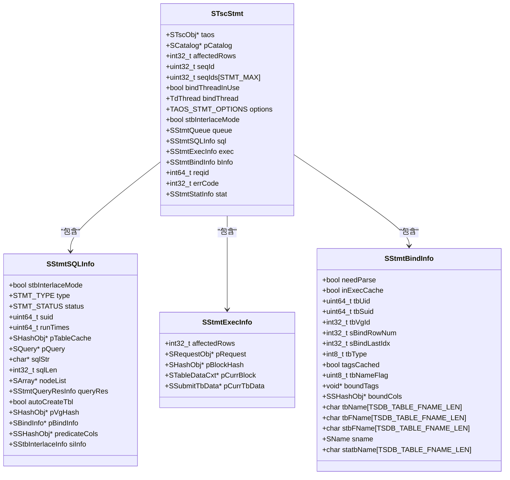
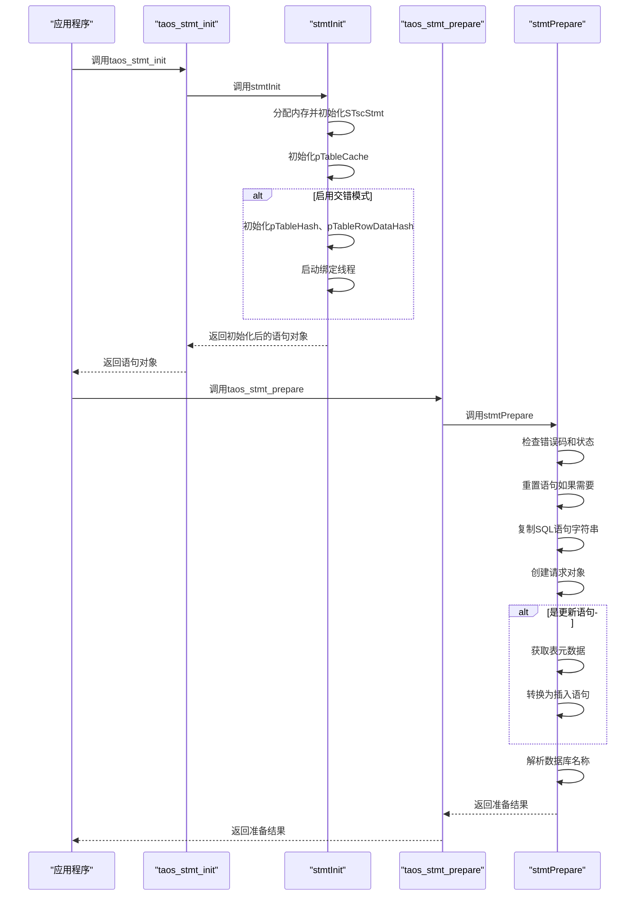

# 语句初始化

<cite>
**本文档中引用的文件**   
- [taos.h](file://include/client/taos.h)
- [clientStmt.h](file://source/client/inc/clientStmt.h)
- [clientStmt.c](file://source/client/src/clientStmt.c)
- [parser.h](file://include/libs/parser/parser.h)
- [thash.h](file://include/util/thash.h)
- [tarray.h](file://include/util/tarray.h)
- [osMemPool.h](file://include/os/osMemPool.h)
- [clientLog.h](file://source/client/inc/clientLog.h)
- [clientInt.h](file://source/client/inc/clientInt.h)
</cite>

## 目录
1. [引言](#引言)
2. [核心组件分析](#核心组件分析)
3. [初始化过程详解](#初始化过程详解)
4. [内存分配策略](#内存分配策略)
5. [错误处理流程](#错误处理流程)
6. [性能优化建议](#性能优化建议)
7. [结论](#结论)

## 引言
`taos_stmt_init`和`taos_stmt_prepare`函数是TDengine客户端中用于创建和准备SQL语句模板的核心接口。这些函数为应用程序提供了高效、安全的数据库交互方式，通过预编译SQL语句来提高执行效率并防止SQL注入攻击。本文档深入探讨了这两个函数的实现机制，分析了它们如何在客户端环境中初始化和准备SQL语句模板，并详细描述了初始化过程中的内存分配策略和错误处理流程。

**Section sources**
- [taos.h](file://include/client/taos.h#L198-L201)

## 核心组件分析
语句初始化功能的核心在于`SStmt`结构体的初始化过程，该过程主要由`stmtInit`函数完成。`SStmt`结构体包含了执行SQL语句所需的所有信息，包括连接对象、SQL语句字符串、查询状态等。此外，`stmtPrepare`函数负责解析SQL语句并设置相应的执行参数。

**Diagram sources **
- [clientStmt.h](file://source/client/inc/clientStmt.h#L140-L160)

**Section sources**
- [clientStmt.h](file://source/client/inc/clientStmt.h#L140-L160)

## 初始化过程详解
`taos_stmt_init`函数首先通过`acquireTscObj`获取客户端连接对象，然后调用`stmtInit`函数进行实际的初始化工作。`stmtInit`函数会分配`STscStmt`结构体的内存，并初始化其各个成员变量。如果指定了选项（如`singleStbInsert`和`singleTableBindOnce`），还会启动绑定线程以支持交错模式下的批量插入操作。

`taos_stmt_prepare`函数则负责准备SQL语句。它首先检查当前语句的状态，如果已经处于准备或更高状态，则调用`stmtResetStmt`重置语句。接着，它将SQL语句字符串复制到`pStmt->sql.sqlStr`中，并根据需要转换更新语句为插入语句。最后，它解析数据库名称并设置相关参数。

**Diagram sources **
- [clientMain.c](file://source/client/src/clientMain.c#L2037-L2052)
- [clientMain.c](file://source/client/src/clientMain.c#L2088-L2096)
- [clientStmt.c](file://source/client/src/clientStmt.c#L885-L957)
- [clientStmt.c](file://source/client/src/clientStmt.c#L959-L1035)

**Section sources**
- [clientMain.c](file://source/client/src/clientMain.c#L2037-L2052)
- [clientMain.c](file://source/client/src/clientMain.c#L2088-L2096)
- [clientStmt.c](file://source/client/src/clientStmt.c#L885-L957)
- [clientStmt.c](file://source/client/src/clientStmt.c#L959-L1035)

## 内存分配策略
在初始化过程中，`stmtInit`函数使用`taosMemoryCalloc`分配`STscStmt`结构体的内存。对于哈希表和数组等动态数据结构，采用延迟初始化的方式，在首次使用时才进行分配。例如，`pTableCache`在`stmtInit`中立即初始化，而`pTableHash`和`pTableRowDataHash`仅在启用交错模式时才初始化。此外，为了提高性能，`stmtInitTableBuf`函数预分配了一定数量的缓冲区，避免频繁的内存分配操作。

**Section sources**
- [clientStmt.c](file://source/client/src/clientStmt.c#L885-L957)
- [clientStmt.c](file://source/client/src/clientStmt.c#L862-L883)

## 错误处理流程
语句初始化和准备过程中的错误处理主要通过`STMT_ERR_RET`宏实现。该宏检查返回码，如果非成功则设置错误码并返回。在`taos_stmt_init`中，如果获取客户端对象失败或`stmtInit`返回NULL，会记录错误日志并返回NULL。在`taos_stmt_prepare`中，如果SQL语句为空或长度为0，会返回`TSDB_CODE_INVALID_PARA`错误码。此外，`stmtSwitchStatus`函数还负责验证状态转换的合法性，防止非法的状态迁移。

**Section sources**
- [clientStmt.h](file://source/client/inc/clientStmt.h#L174-L183)
- [clientStmt.c](file://source/client/src/clientStmt.c#L99-L175)

## 性能优化建议
1. **复用语句对象**：尽量复用已初始化的语句对象，避免频繁调用`taos_stmt_init`和`taos_stmt_close`。
2. **批量操作**：对于大量数据插入，使用`stmtAddBatch`结合`stmtExec`进行批量提交，减少网络往返次数。
3. **预编译语句**：利用`taos_stmt_prepare`预编译常用SQL语句，提高执行效率。
4. **合理配置选项**：根据应用场景选择合适的`TAOS_STMT_OPTIONS`，如启用交错模式以支持高效的批量插入。
5. **监控性能指标**：通过`SStmtStatInfo`结构体中的统计信息监控语句执行性能，及时发现瓶颈。

**Section sources**
- [clientStmt.h](file://source/client/inc/clientStmt.h#L109-L122)

## 结论
`taos_stmt_init`和`taos_stmt_prepare`函数为TDengine客户端提供了强大的SQL语句管理能力。通过深入理解这两个函数的实现机制、内存分配策略和错误处理流程，开发者可以更有效地利用这些接口，构建高性能、高可靠的应用程序。同时，遵循最佳实践和性能优化建议，可以进一步提升系统的整体表现。