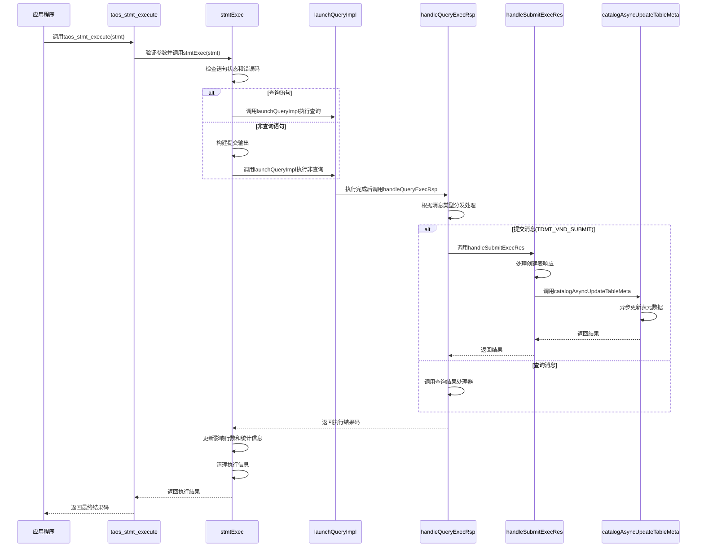
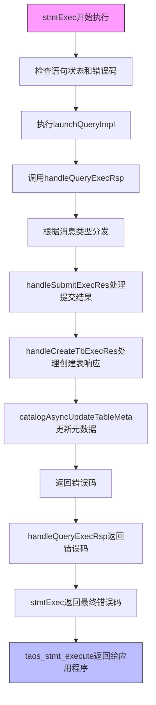
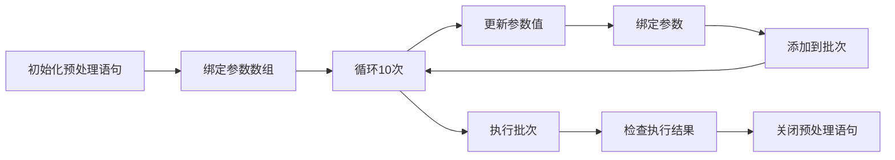

# 同步执行

<cite>
**本文档引用的文件**
- [taos.h](file://include/client/taos.h)
- [clientMain.c](file://source/client/src/clientMain.c)
- [clientStmt.c](file://source/client/src/clientStmt.c)
- [clientStmt.h](file://source/client/inc/clientStmt.h)
- [clientImpl.c](file://source/client/src/clientImpl.c)
- [clientInt.h](file://source/client/inc/clientInt.h)
- [catalog.h](file://include/libs/catalog/catalog.h)
- [catalog.c](file://source/libs/catalog/src/catalog.c)
- [prepare.c](file://examples/c/prepare.c)
</cite>

## 目录
1. [简介](#简介)
2. [核心组件](#核心组件)
3. [同步执行流程](#同步执行流程)
4. [事务控制机制](#事务控制机制)
5. [错误码传播路径](#错误码传播路径)
6. [资源状态管理](#资源状态管理)
7. [批量插入示例分析](#批量插入示例分析)
8. [执行结果判断与异常处理](#执行结果判断与异常处理)
9. [结论](#结论)

## 简介
本文档详细阐述了TDengine数据库中预处理语句的同步执行机制，重点分析`taos_stmt_execute`函数的完整执行流程。文档涵盖从预编译语句发送到服务器、等待执行完成、获取结果集的全过程，深入解析同步执行的事务控制、错误码传播路径以及执行成功后的资源状态管理。通过分析`examples/c/prepare.c`中的代码示例，展示批量数据插入的最佳实践模式。

## 核心组件

`taos_stmt_execute`函数是预处理语句同步执行的核心接口，其调用链涉及多个关键组件：

- **taos_stmt_execute**: 用户调用的公共API，负责参数验证和调用内部执行函数
- **stmtExec**: 预处理语句的实际执行函数，处理查询和非查询语句的差异
- **launchQueryImpl**: 启动查询执行的核心函数，根据执行模式调度不同处理路径
- **handleQueryExecRsp**: 处理查询执行响应，根据消息类型分发到相应的处理器
- **handleSubmitExecRes**: 处理提交执行结果，包括元数据更新
- **catalogAsyncUpdateTableMeta**: 异步更新表元数据，确保客户端元数据一致性

**Section sources**
- [taos.h](file://include/client/taos.h#L218)
- [clientMain.c](file://source/client/src/clientMain.c#L2248-L2256)
- [clientStmt.c](file://source/client/src/clientStmt.c#L1639-L1712)
- [clientImpl.c](file://source/client/src/clientImpl.c#L1331-L1419)

## 同步执行流程

**Diagram sources**
- [clientMain.c](file://source/client/src/clientMain.c#L2248-L2256)
- [clientStmt.c](file://source/client/src/clientStmt.c#L1639-L1712)
- [clientImpl.c](file://source/client/src/clientImpl.c#L1331-L1419)
- [clientImpl.c](file://source/client/src/clientImpl.c#L1060-L1114)
- [clientImpl.c](file://source/client/src/clientImpl.c#L993-L1009)
- [catalog.c](file://source/libs/catalog/src/catalog.c#L1343-L1356)

## 事务控制机制

同步执行的事务控制机制通过以下方式实现：

1. **状态机管理**: 预处理语句对象维护内部状态机，确保执行流程的正确性
2. **原子性操作**: 使用原子操作确保多线程环境下的状态一致性
3. **错误恢复**: 当检测到需要重试的错误时，返回特定错误码(TSDB_CODE_NEED_RETRY)
4. **元数据同步**: 在执行完成后异步更新表元数据，确保后续操作的元数据一致性

事务控制的关键在于`stmtExec`函数中的状态检查和错误处理逻辑，确保每个执行步骤都处于正确的状态，并在发生错误时能够正确恢复。

**Section sources**
- [clientStmt.c](file://source/client/src/clientStmt.c#L1639-L1712)
- [clientStmt.h](file://source/client/inc/clientStmt.h#L219)

## 错误码传播路径

错误码的传播路径遵循严格的层次结构，确保错误信息能够准确传递：

**Diagram sources**
- [clientStmt.c](file://source/client/src/clientStmt.c#L1639-L1712)
- [clientImpl.c](file://source/client/src/clientImpl.c#L1060-L1114)
- [clientImpl.c](file://source/client/src/clientImpl.c#L993-L1009)
- [catalog.c](file://source/libs/catalog/src/catalog.c#L1343-L1356)

## 资源状态管理

执行成功后，预处理语句对象的资源状态会发生以下变化：

1. **影响行数更新**: `affectedRows`字段会更新为本次执行影响的行数
2. **执行统计更新**: 执行时间和等待时间等统计信息会被记录
3. **执行信息清理**: 执行相关的临时信息会被清理
4. **运行次数递增**: `runTimes`计数器会递增

这些状态变化确保了预处理语句对象能够正确反映其执行历史和当前状态，为后续操作提供准确的信息。

**Section sources**
- [clientStmt.c](file://source/client/src/clientStmt.c#L1639-L1712)

## 批量插入示例分析

`examples/c/prepare.c`文件展示了如何使用预处理语句进行批量数据插入：

该示例展示了以下关键模式：
- 使用`taos_stmt_bind_param`绑定参数数组
- 在循环中更新参数值并调用`taos_stmt_add_batch`
- 批量执行后检查返回值
- 正确关闭预处理语句资源

**Section sources**
- [prepare.c](file://examples/c/prepare.c#L0-L235)

## 执行结果判断与异常处理

开发者应通过以下方式判断执行成功与否并处理异常：

1. **返回值检查**: `taos_stmt_execute`返回0表示成功，非0表示失败
2. **错误码获取**: 使用`taos_errno`获取具体的错误码
3. **错误信息获取**: 使用`taos_errstr`获取错误描述信息
4. **超时处理**: 检测网络超时错误并实现重试逻辑
5. **连接中断处理**: 检测连接中断错误并重新建立连接

对于查询语句，执行后必须调用`taos_stmt_use_result`获取结果集，然后通过`taos_fetch_row`逐行获取数据。

**Section sources**
- [taos.h](file://include/client/taos.h#L219)
- [clientMain.c](file://source/client/src/clientMain.c#L2288-L2296)
- [clientStmt.c](file://source/client/src/clientStmt.c#L1983-L1994)

## 结论
`taos_stmt_execute`函数提供了可靠的预处理语句同步执行机制，通过清晰的执行流程、完善的事务控制、准确的错误码传播和有效的资源状态管理，确保了数据库操作的正确性和可靠性。开发者应遵循文档中描述的最佳实践，正确使用返回值判断执行结果，并妥善处理可能的异常情况。