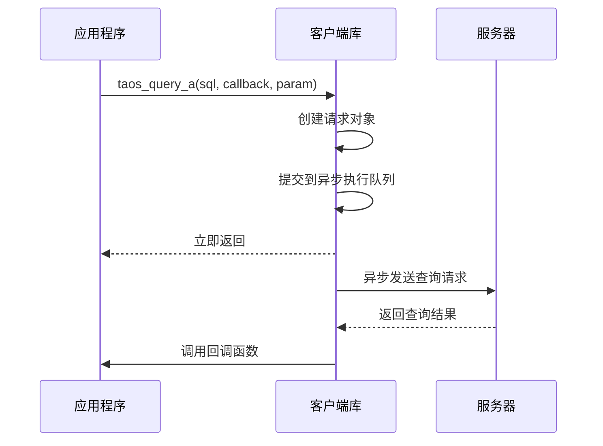
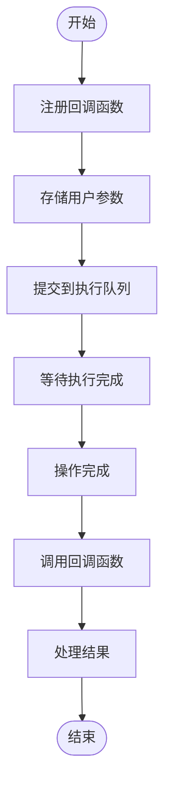
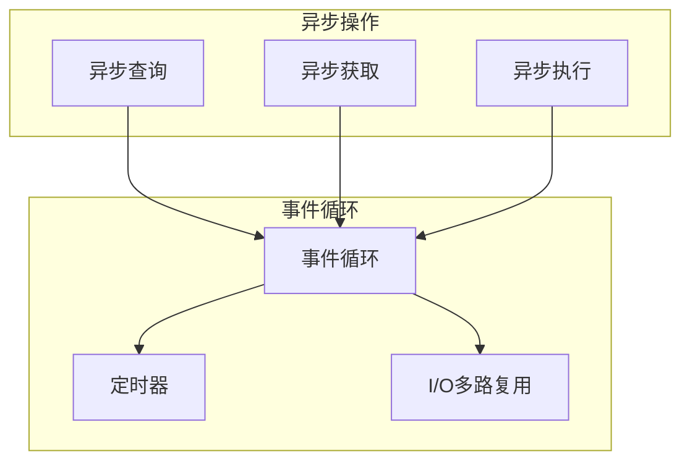
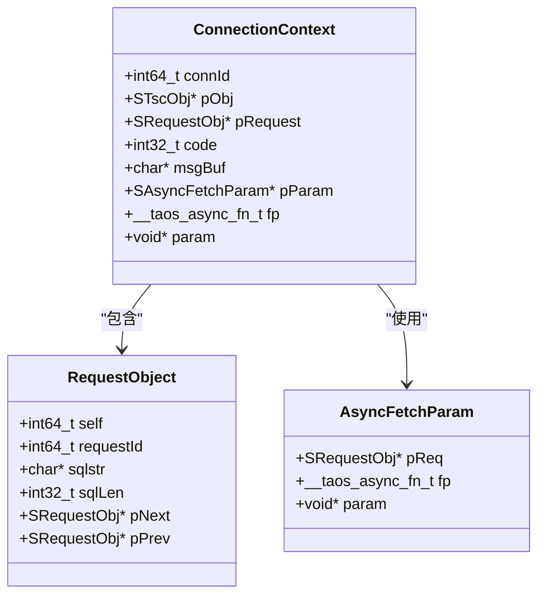
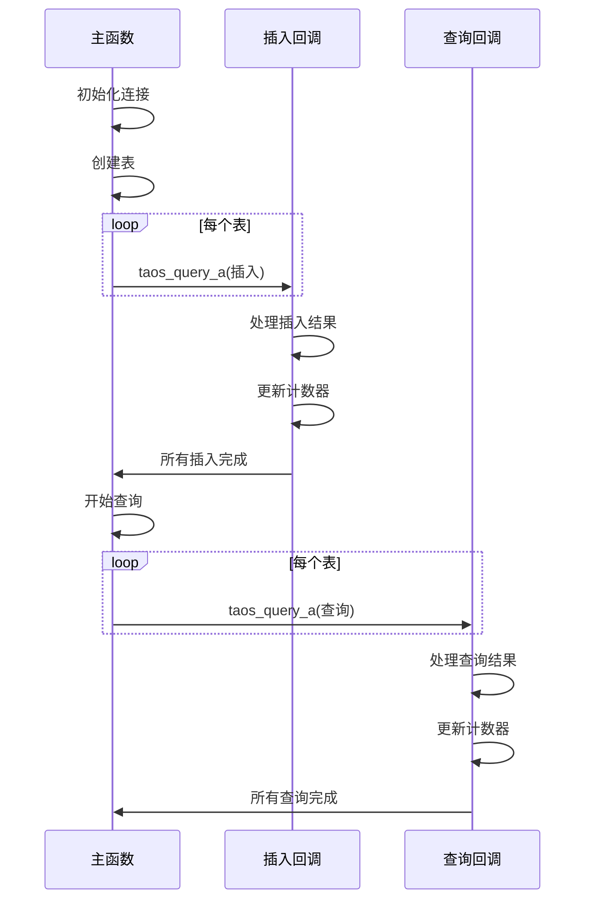

# 异步执行

<cite>
**本文档中引用的文件**
- [asyncdemo.c](file://examples/c/asyncdemo.c)
- [taos.h](file://include/client/taos.h)
- [clientMain.c](file://source/client/src/clientMain.c)
- [clientImpl.c](file://source/client/src/clientImpl.c)
</cite>

## 目录
1. [简介](#简介)
2. [异步执行机制](#异步执行机制)
3. [回调函数注册](#回调函数注册)
4. [事件循环集成](#事件循环集成)
5. [执行上下文管理](#执行上下文管理)
6. [代码示例分析](#代码示例分析)
7. [高并发场景优化](#高并发场景优化)
8. [线程安全与资源管理](#线程安全与资源管理)
9. [结论](#结论)

## 简介
本文档详细介绍了TDengine数据库中预处理语句的异步执行机制。通过深入分析异步API的实现原理，重点阐述了如何利用回调函数机制实现非阻塞的语句执行。文档涵盖了从API调用到内部实现的完整技术细节，为开发者提供了在高并发场景下优化数据库操作性能的指导。

**Section sources**
- [taos.h](file://include/client/taos.h#L1-L50)

## 异步执行机制
TDengine的异步执行机制基于回调函数模式，允许应用程序在执行数据库操作时不会被阻塞。核心API `taos_stmt_execute` 在异步模式下立即返回，而实际的执行过程在后台线程中完成。当操作完成后，系统会调用预先注册的回调函数通知应用程序。

异步执行的关键在于将耗时的网络通信和数据处理操作从主线程中分离出来，从而提高应用程序的整体响应性和吞吐量。这种非阻塞特性特别适合需要处理大量并发请求的场景。

**Diagram sources**
- [taos.h](file://include/client/taos.h#L303-L303)
- [clientMain.c](file://source/client/src/clientMain.c#L1569-L1572)

**Section sources**
- [taos.h](file://include/client/taos.h#L218-L218)
- [clientMain.c](file://source/client/src/clientMain.c#L2248-L2256)

## 回调函数注册
回调函数注册是异步执行的核心机制。开发者需要通过 `taos_query_a` 等异步API注册回调函数，当数据库操作完成时，系统会自动调用该函数。回调函数的原型定义为 `__taos_async_fn_t`，包含三个参数：用户参数、结果集指针和错误代码。

在注册回调时，开发者可以传递自定义的上下文参数，这在处理多个并发请求时尤为重要，因为它允许回调函数识别具体的请求上下文。回调函数的正确实现对于确保应用程序的稳定性和数据一致性至关重要。

**Diagram sources**
- [taos.h](file://include/client/taos.h#L218-L218)
- [clientImpl.c](file://source/client/src/clientImpl.c#L3038-L3070)

**Section sources**
- [taos.h](file://include/client/taos.h#L218-L218)
- [clientImpl.c](file://source/client/src/clientImpl.c#L3038-L3237)

## 事件循环集成
异步执行与事件循环的集成是实现高效I/O处理的关键。TDengine客户端库内部维护了一个事件循环，负责监听网络事件和调度异步操作。当网络数据到达或操作完成时，事件循环会触发相应的处理函数。

这种集成方式使得应用程序可以在单线程中处理多个并发的数据库操作，而无需创建大量的线程。事件循环通过非阻塞I/O和多路复用技术，有效地管理了网络连接和数据传输，从而提高了系统的整体性能。

**Diagram sources**
- [clientImpl.c](file://source/client/src/clientImpl.c#L3225-L3267)
- [clientMain.c](file://source/client/src/clientMain.c#L1755-L1786)

**Section sources**
- [clientImpl.c](file://source/client/src/clientImpl.c#L3225-L3267)
- [clientMain.c](file://source/client/src/clientMain.c#L1755-L1786)

## 执行上下文管理
在多线程环境下，执行上下文的管理对于确保线程安全和数据一致性至关重要。TDengine通过为每个连接维护独立的上下文对象来实现这一点。每个上下文对象包含了连接状态、会话信息和执行环境等必要数据。

当异步操作在后台线程中执行时，系统会确保访问正确的上下文对象，避免了多线程竞争条件。此外，上下文管理还包括资源的自动清理和错误处理，确保即使在异常情况下也能正确释放资源。

**Diagram sources**
- [clientMain.c](file://source/client/src/clientMain.c#L2248-L2447)
- [clientImpl.c](file://source/client/src/clientImpl.c#L3038-L3237)

**Section sources**
- [clientMain.c](file://source/client/src/clientMain.c#L2248-L2447)
- [clientImpl.c](file://source/client/src/clientImpl.c#L3038-L3237)

## 代码示例分析
`examples/c/asyncdemo.c` 提供了一个完整的异步执行示例，展示了如何在实际应用中使用异步API。该示例创建了多个表，并使用异步方式插入和查询数据。通过分析这个示例，我们可以深入了解异步执行的最佳实践。

示例中的关键点包括：使用全局计数器跟踪已完成的操作数量，通过循环等待所有异步操作完成，以及在回调函数中处理执行结果。这些模式为开发者提供了在复杂场景下管理异步操作的参考实现。

**Diagram sources**
- [asyncdemo.c](file://examples/c/asyncdemo.c#L0-L293)
- [taos.h](file://include/client/taos.h#L303-L303)

**Section sources**
- [asyncdemo.c](file://examples/c/asyncdemo.c#L0-L293)
- [taos.h](file://include/client/taos.h#L303-L303)

## 高并发场景优化
在高并发场景下，合理利用异步执行可以显著提升系统吞吐量。通过将耗时的数据库操作异步化，应用程序可以同时处理更多的用户请求。为了最大化性能，建议采用批量处理和连接池等优化策略。

此外，合理设置回调函数的执行优先级和资源分配，可以避免在高负载情况下出现性能瓶颈。监控和调优异步队列的大小和处理速度，也是确保系统稳定性的关键因素。

**Section sources**
- [asyncdemo.c](file://examples/c/asyncdemo.c#L0-L293)
- [clientMain.c](file://source/client/src/clientMain.c#L1569-L1768)

## 线程安全与资源管理
异步执行中的线程安全和资源管理是开发者必须关注的重要问题。由于回调函数可能在任意线程中执行，因此需要确保共享数据的访问是线程安全的。使用适当的同步机制，如互斥锁或原子操作，可以避免数据竞争。

资源管理方面，需要特别注意内存泄漏和资源泄漏的风险。确保在回调函数中正确释放分配的内存，并在连接关闭时清理所有相关的资源。TDengine客户端库提供了自动资源管理机制，但开发者仍需遵循最佳实践来确保系统的稳定性。

**Section sources**
- [clientImpl.c](file://source/client/src/clientImpl.c#L3225-L3300)
- [clientMain.c](file://source/client/src/clientMain.c#L1755-L1954)

## 结论
TDengine的异步执行机制为开发者提供了强大的工具来构建高性能的数据库应用。通过深入理解回调函数机制、事件循环集成和执行上下文管理，开发者可以充分利用异步API的优势，在高并发场景下实现卓越的性能表现。遵循本文档中的最佳实践，可以确保应用程序的稳定性、可维护性和可扩展性。