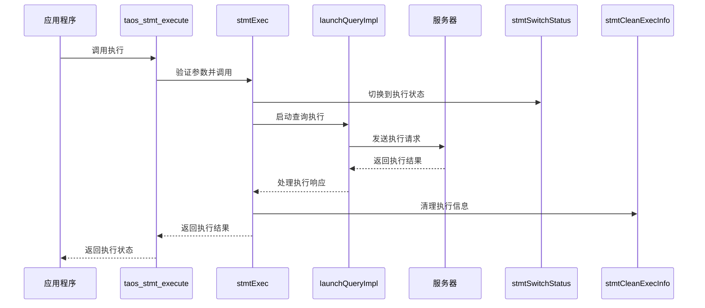
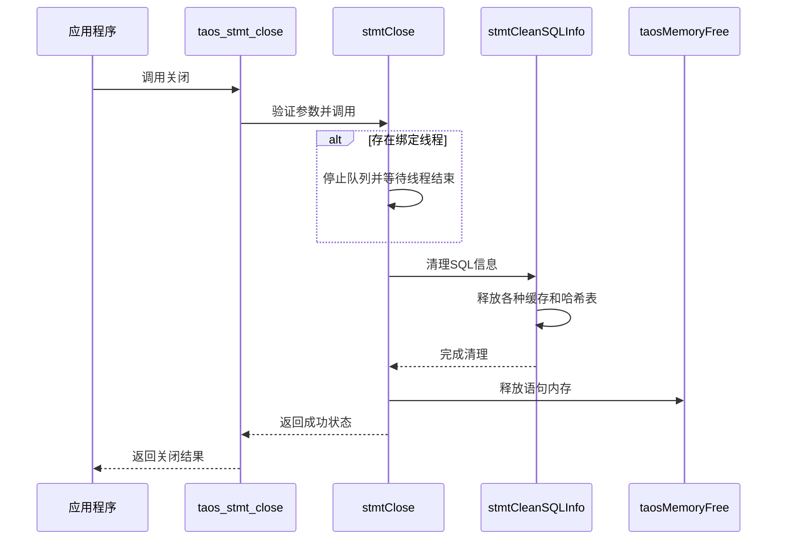
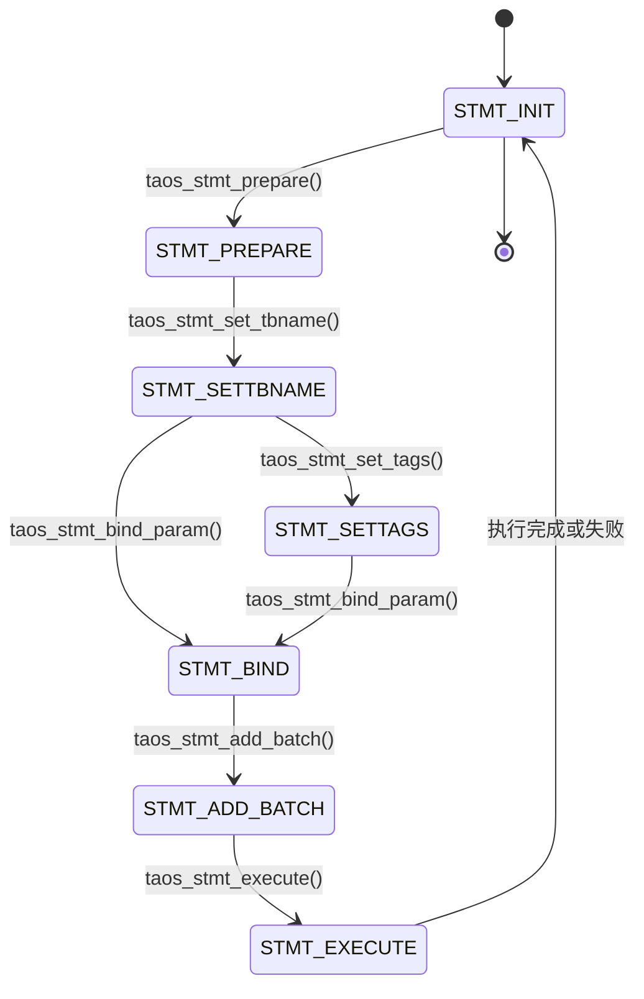
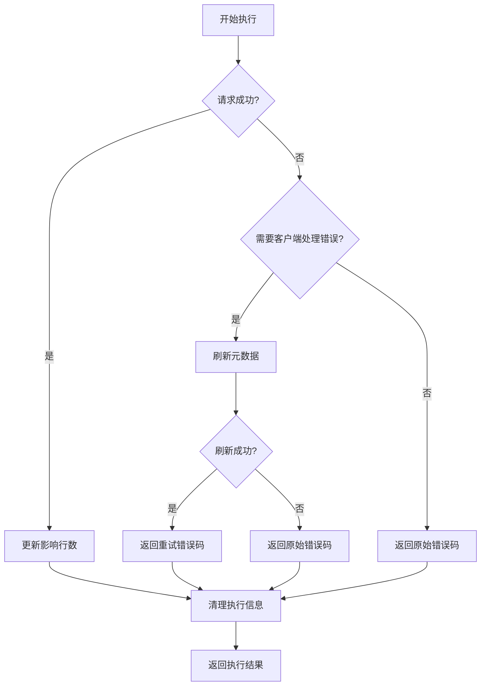
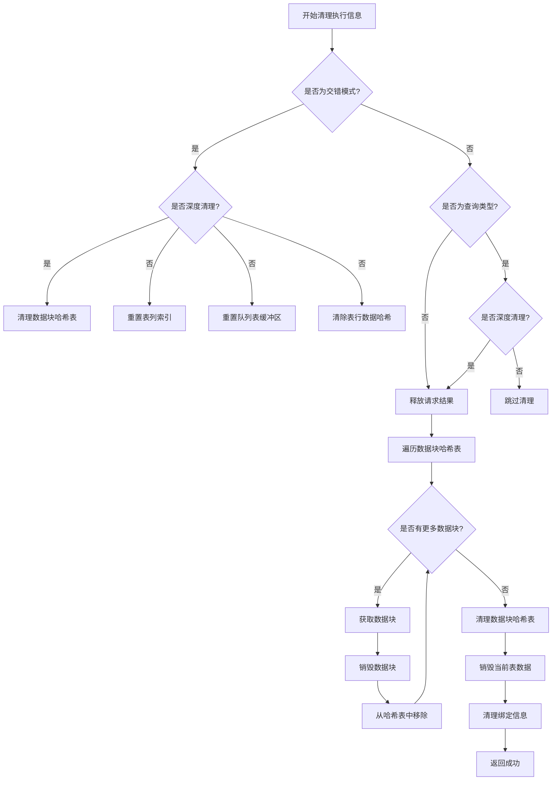
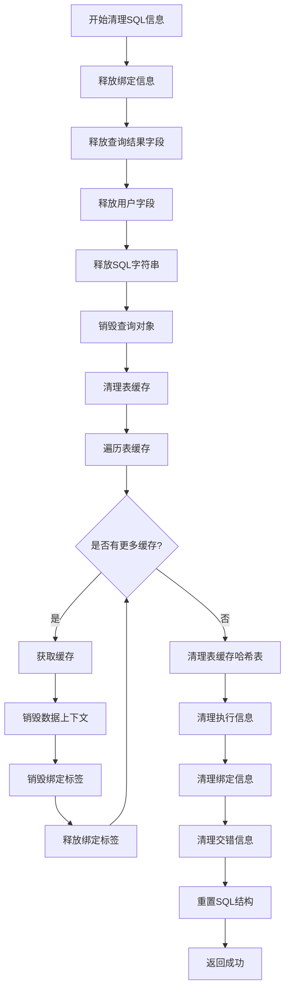
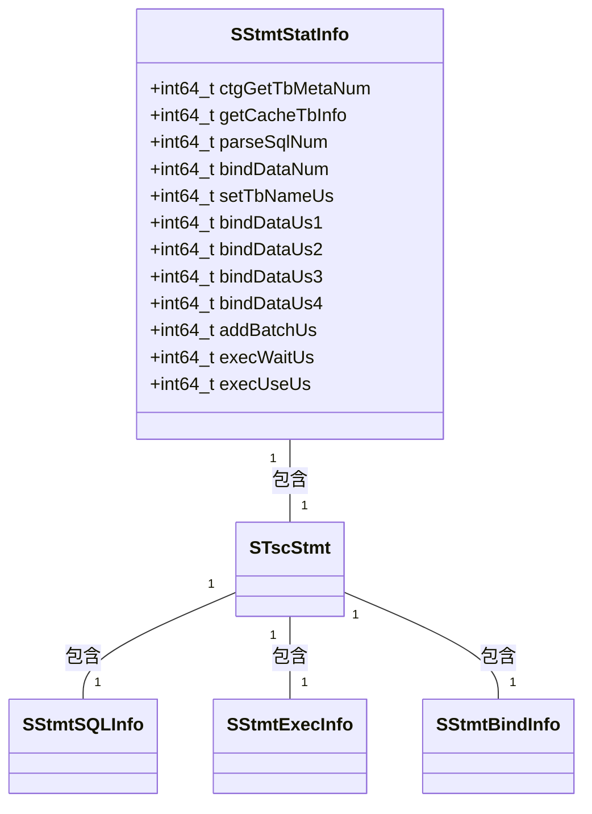
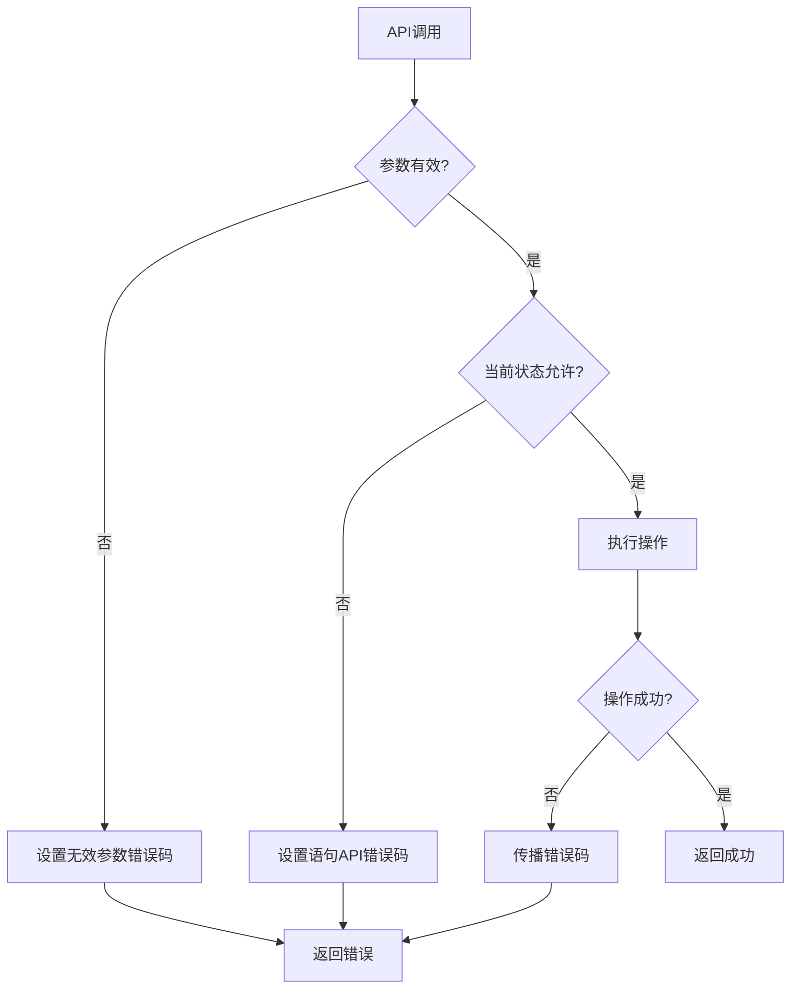

# 语句执行

<cite>
**本文档中引用的文件**  
- [taos.h](file://include/client/taos.h)
- [clientMain.c](file://source/client/src/clientMain.c)
- [clientStmt.c](file://source/client/src/clientStmt.c)
- [clientStmt.h](file://source/client/inc/clientStmt.h)
- [clientImpl.c](file://source/client/src/clientImpl.c)
- [prepare.c](file://examples/c/prepare.c)
</cite>

## 目录
1. [引言](#引言)
2. [核心组件](#核心组件)
3. [执行流程分析](#执行流程分析)
4. [事务管理与错误传播](#事务管理与错误传播)
5. [资源清理机制](#资源清理机制)
6. [批量插入与查询执行模式](#批量插入与查询执行模式)
7. [性能监控与异常处理](#性能监控与异常处理)
8. [结论](#结论)

## 引言
本文档详细阐述了TDengine数据库中预处理语句的执行机制，重点分析`taos_stmt_execute`和`taos_stmt_close`函数的实现逻辑。文档深入探讨了预处理语句如何被发送到服务器执行并返回结果的完整过程，包括事务管理、错误传播和资源清理等关键机制。通过分析`examples/c/prepare.c`中的实际用例，展示了如何利用预处理语句实现高性能数据写入，并为开发者提供执行性能监控和异常处理的指导。

## 核心组件

本节分析语句执行功能的核心组件，包括预处理语句的初始化、准备、绑定、添加批次、执行和关闭等操作。

**Section sources**
- [taos.h](file://include/client/taos.h#L198-L220)
- [clientMain.c](file://source/client/src/clientMain.c#L2037-L2328)
- [clientStmt.h](file://source/client/inc/clientStmt.h#L217-L219)

## 执行流程分析

### 语句执行流程
`taos_stmt_execute`函数是预处理语句执行的核心，负责将已准备和绑定的语句发送到服务器执行。该函数首先进行参数验证，然后调用内部的`stmtExec`函数完成实际的执行逻辑。



**Diagram sources**
- [clientMain.c](file://source/client/src/clientMain.c#L2248-L2256)
- [clientStmt.c](file://source/client/src/clientStmt.c#L1639-L1712)
- [clientImpl.c](file://source/client/src/clientImpl.c#L1331-L1419)

### 语句关闭流程
`taos_stmt_close`函数负责释放预处理语句占用的所有资源。该函数首先检查语句是否正在使用绑定线程，如果是，则停止队列并等待线程结束，然后清理SQL信息并释放内存。



**Diagram sources**
- [clientMain.c](file://source/client/src/clientMain.c#L2320-L2328)
- [clientStmt.c](file://source/client/src/clientStmt.c#L1714-L1749)

**Section sources**
- [clientStmt.c](file://source/client/src/clientStmt.c#L1639-L1749)

## 事务管理与错误传播

### 状态转换管理
预处理语句的执行过程受到严格的状态管理，通过`stmtSwitchStatus`函数确保操作的顺序性和正确性。每个语句都有一个状态机，从初始化到准备、绑定、添加批次，最后到执行。



**Diagram sources**
- [clientStmt.c](file://source/client/src/clientStmt.c#L99-L175)

### 错误传播机制
执行过程中发生的错误通过`STMT_ERR_RET`宏进行传播，确保错误码能够正确返回给调用者。当执行请求返回错误码时，系统会尝试刷新元数据，如果刷新成功则返回重试错误码，否则直接返回原始错误码。



**Diagram sources**
- [clientStmt.c](file://source/client/src/clientStmt.c#L1639-L1712)

**Section sources**
- [clientStmt.c](file://source/client/src/clientStmt.c#L1639-L1712)

## 资源清理机制

### 执行信息清理
`stmtCleanExecInfo`函数负责清理执行过程中产生的各种信息，包括数据块哈希表、当前数据块、绑定信息等。根据是否需要保留表信息和是否深度清理，采取不同的清理策略。



**Diagram sources**
- [clientStmt.c](file://source/client/src/clientStmt.c#L438-L494)

### SQL信息清理
`stmtCleanSQLInfo`函数负责清理SQL相关的所有信息，包括绑定信息、查询结果字段、SQL字符串、查询对象、表缓存等。该函数确保在语句关闭或重置时，所有分配的资源都被正确释放。



**Diagram sources**
- [clientStmt.c](file://source/client/src/clientStmt.c#L506-L550)

**Section sources**
- [clientStmt.c](file://source/client/src/clientStmt.c#L438-L550)

## 批量插入与查询执行模式

### 批量插入执行模式
通过分析`examples/c/prepare.c`中的代码，可以了解如何使用预处理语句实现高效的批量插入。该模式首先初始化语句，准备插入SQL，然后循环绑定参数并添加批次，最后执行插入操作。

```c
// 从prepare.c提取的批量插入模式
TAOS_STMT *stmt = taos_stmt_init(taos);
taos_stmt_prepare(stmt, "insert into m1 values(?,?,?,?,?,?,?,?,?,?,?)", 0);

for (int i = 0; i < 10; ++i) {
    // 更新绑定参数
    v.ts += 1;
    v.b = (int8_t)i % 2;
    // ... 其他字段更新
    
    taos_stmt_bind_param(stmt, params);
    taos_stmt_add_batch(stmt);
}

if (taos_stmt_execute(stmt) != 0) {
    printf("failed to execute insert statement.\n");
}
```

**Section sources**
- [prepare.c](file://examples/c/prepare.c#L100-L150)

### 查询执行模式
查询执行模式与插入类似，但需要在执行后使用`taos_stmt_use_result`获取结果集，然后通过`taos_fetch_row`逐行读取结果。

```c
// 从prepare.c提取的查询执行模式
taos_stmt_prepare(stmt, "SELECT * FROM m1 WHERE v1 > ? AND v2 < ?", 0);
taos_stmt_bind_param(stmt, params + 2);

if (taos_stmt_execute(stmt) != 0) {
    printf("failed to execute select statement.\n");
}

TAOS_RES *result = taos_stmt_use_result(stmt);
TAOS_ROW row;
while ((row = taos_fetch_row(result))) {
    // 处理每一行数据
    taos_print_row(temp, row, fields, num_fields);
    printf("%s\n", temp);
}
```

**Section sources**
- [prepare.c](file://examples/c/prepare.c#L155-L180)

## 性能监控与异常处理

### 执行性能监控
预处理语句提供了详细的性能统计信息，通过`SStmtStatInfo`结构体记录各种操作的耗时，包括SQL解析次数、绑定数据次数、设置表名耗时、绑定数据耗时、添加批次耗时、执行等待耗时和执行使用耗时等。



**Diagram sources**
- [clientStmt.h](file://source/client/inc/clientStmt.h#L109-L122)
- [clientStmt.h](file://source/client/inc/clientStmt.h#L140-L160)

### 异常处理策略
系统采用分层的异常处理策略，从参数验证、状态检查到执行错误处理，确保每个环节的错误都能被正确捕获和处理。开发者应检查每个API调用的返回值，并根据错误码采取相应的恢复措施。



**Section sources**
- [clientStmt.c](file://source/client/src/clientStmt.c#L99-L175)
- [clientStmt.c](file://source/client/src/clientStmt.c#L1639-L1712)

## 结论
本文档详细分析了TDengine中预处理语句的执行机制，包括`taos_stmt_execute`和`taos_stmt_close`函数的实现逻辑。通过深入理解语句执行流程、事务管理、错误传播和资源清理机制，开发者可以更好地利用预处理语句实现高性能的数据操作。同时，通过分析`examples/c/prepare.c`中的实际用例，展示了批量插入和查询的最佳实践，为开发者提供了性能监控和异常处理的指导。