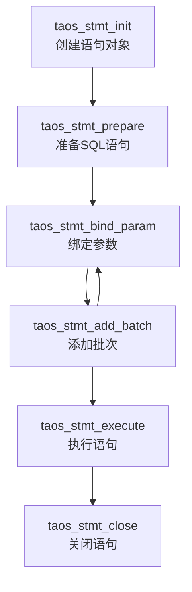

# 预处理语句

<cite>
**本文档引用的文件**
- [taos.h](file://include/client/taos.h#L198-L218)
- [clientStmt.c](file://source/client/src/clientStmt.c#L885-L1712)
- [clientMain.c](file://source/client/src/clientMain.c#L2037-L2256)
- [prepare.c](file://examples/c/prepare.c#L0-L235)
</cite>

## 目录
1. [简介](#简介)
2. [核心API函数详解](#核心api函数详解)
3. [预处理语句的优势](#预处理语句的优势)
4. [参数绑定机制与类型转换](#参数绑定机制与类型转换)
5. [生命周期管理](#生命周期管理)
6. [实用示例分析](#实用示例分析)
7. [实现逻辑剖析](#实现逻辑剖析)

## 简介
预处理语句（Prepared Statements）是TDengine客户端提供的一种高效、安全的数据库操作方式。通过将SQL语句的解析和执行过程分离，预处理语句不仅显著提升了查询性能，还有效防止了SQL注入攻击。本技术文档将深入解析`taos_stmt_init`、`taos_stmt_prepare`、`taos_stmt_bind_param`和`taos_stmt_execute`等核心函数的使用方法，并结合`examples/c/prepare.c`中的实际代码示例，指导开发者如何在应用中高效地使用预处理语句进行批量数据插入和参数化查询。

**Section sources**
- [taos.h](file://include/client/taos.h#L198-L218)
- [prepare.c](file://examples/c/prepare.c#L0-L235)

## 核心API函数详解
预处理语句的使用遵循一个标准的四步流程：初始化、准备、绑定和执行。

### 初始化预处理语句
`taos_stmt_init`函数用于创建一个新的预处理语句对象。该函数接收一个已建立的数据库连接（`TAOS*`）作为参数，并返回一个`TAOS_STMT*`类型的句柄。此句柄是后续所有操作的基础。

**Section sources**
- [taos.h](file://include/client/taos.h#L198-L198)
- [clientMain.c](file://source/client/src/clientMain.c#L2037-L2052)

### 准备SQL语句
`taos_stmt_prepare`函数用于将一个包含占位符（`?`）的SQL语句发送到服务器进行预解析和编译。此步骤会生成一个执行计划，该计划可以被后续的执行重复使用，从而避免了重复解析的开销。

**Section sources**
- [taos.h](file://include/client/taos.h#L201-L201)
- [clientMain.c](file://source/client/src/clientMain.c#L2088-L2096)

### 绑定参数
`taos_stmt_bind_param`函数用于将应用程序中的变量值绑定到SQL语句中的占位符。它通过一个`TAOS_MULTI_BIND`结构体数组来传递参数，该结构体包含了数据类型、缓冲区地址、长度等信息。

**Section sources**
- [taos.h](file://include/client/taos.h#L214-L214)
- [clientMain.c](file://source/client/src/clientMain.c#L2166-L2180)

### 执行语句
`taos_stmt_execute`函数用于执行已准备好的SQL语句。对于插入操作，它会将所有已绑定的数据批量发送到服务器；对于查询操作，它会启动查询并准备获取结果集。

**Section sources**
- [taos.h](file://include/client/taos.h#L218-L218)
- [clientMain.c](file://source/client/src/clientMain.c#L2248-L2256)

## 预处理语句的优势
预处理语句在性能和安全性方面具有显著优势。

### 性能提升
通过将SQL语句的解析和编译过程与执行过程分离，预处理语句实现了执行计划的复用。当需要执行大量结构相同但参数不同的SQL语句时（如批量插入），这种复用机制可以极大地减少服务器的CPU开销，从而显著提升整体性能。

### 防止SQL注入
预处理语句通过参数绑定机制，将数据与SQL指令逻辑完全分离。用户提供的数据被视为纯数据，不会被当作SQL代码的一部分进行解析，从而从根本上杜绝了SQL注入攻击的可能性。

**Section sources**
- [prepare.c](file://examples/c/prepare.c#L0-L235)

## 参数绑定机制与类型转换
参数绑定是预处理语句的核心功能，它依赖于`TAOS_MULTI_BIND`结构体来传递数据。

### TAOS_MULTI_BIND结构体
该结构体定义了如何将应用程序中的数据绑定到SQL语句的占位符上。其关键成员包括：
- `buffer_type`: 指定数据类型，如`TSDB_DATA_TYPE_INT`、`TSDB_DATA_TYPE_VARCHAR`等。
- `buffer`: 指向包含实际数据的内存缓冲区的指针。
- `length`: 指向一个整数，该整数存储了`buffer`中数据的实际长度（以字节为单位）。
- `is_null`: 一个字符指针，用于指示该参数是否为NULL值。

**Section sources**
- [taos.h](file://include/client/taos.h#L133-L140)

### 类型转换规则
在绑定过程中，客户端库会根据`buffer_type`自动进行必要的类型转换。例如，当绑定一个`int32_t`类型的整数时，应将`buffer_type`设置为`TSDB_DATA_TYPE_INT`，并将`buffer`指向该整数的地址。系统会确保数据以正确的格式传输到服务器。

**Section sources**
- [clientStmt.c](file://source/client/src/clientStmt.c#L1303-L1470)

## 生命周期管理
正确管理预处理语句的生命周期对于资源的有效利用至关重要。

### 创建与初始化
调用`taos_stmt_init`创建语句对象是生命周期的起点。此操作分配了必要的内存和资源。

### 重置与复用
在执行完一个语句后，可以通过调用`taos_stmt_reset`（或通过`taos_stmt_prepare`隐式重置）来重置语句状态，以便用于执行新的SQL语句。这比销毁并重新创建语句对象更高效。

### 关闭与清理
当预处理语句不再需要时，必须调用`taos_stmt_close`来释放所有相关资源。这是一个关键步骤，可以防止内存泄漏。

**Section sources**
- [clientStmt.c](file://source/client/src/clientStmt.c#L885-L1712)

## 实用示例分析
`examples/c/prepare.c`文件提供了一个完整的预处理语句使用示例。

### 批量数据插入
该示例首先创建一个包含多种数据类型的表，然后使用预处理语句批量插入10条记录。它展示了如何定义`TAOS_MULTI_BIND`数组，将C语言结构体中的各个字段绑定到SQL语句的占位符，并通过循环调用`taos_stmt_add_batch`来累积多行数据，最后通过一次`taos_stmt_execute`完成批量插入。

### 参数化查询
示例还演示了如何使用预处理语句执行参数化查询。它准备了一个带有两个占位符的`SELECT`语句，然后绑定参数并执行查询，最后使用`taos_stmt_use_result`获取结果集并遍历输出。

**Section sources**
- [prepare.c](file://examples/c/prepare.c#L0-L235)

## 实现逻辑剖析
预处理语句的底层实现位于`source/client/src/clientStmt.c`文件中。

### 状态机管理
整个预处理流程由一个状态机控制，状态包括`STMT_INIT`、`STMT_PREPARE`、`STMT_BIND`、`STMT_ADD_BATCH`和`STMT_EXECUTE`。`stmtSwitchStatus`函数负责在不同状态间进行转换，并在非法转换时返回错误。

### 核心函数调用链
- `taos_stmt_init` -> `stmtInit`: 初始化`STscStmt`结构体，分配内存和哈希表。
- `taos_stmt_prepare` -> `stmtPrepare`: 复制SQL字符串，创建请求，并进行语法解析。
- `taos_stmt_bind_param` -> `stmtBindBatch`: 根据绑定信息，将数据填充到内部的数据块（`STableDataCxt`）中。
- `taos_stmt_execute` -> `stmtExec`: 构建最终的提交请求，并调用`launchQueryImpl`将数据发送到服务器。

**Diagram sources**
- [clientStmt.c](file://source/client/src/clientStmt.c#L885-L1712)
- [clientMain.c](file://source/client/src/clientMain.c#L2037-L2256)

**Section sources**
- [clientStmt.c](file://source/client/src/clientStmt.c#L885-L1712)