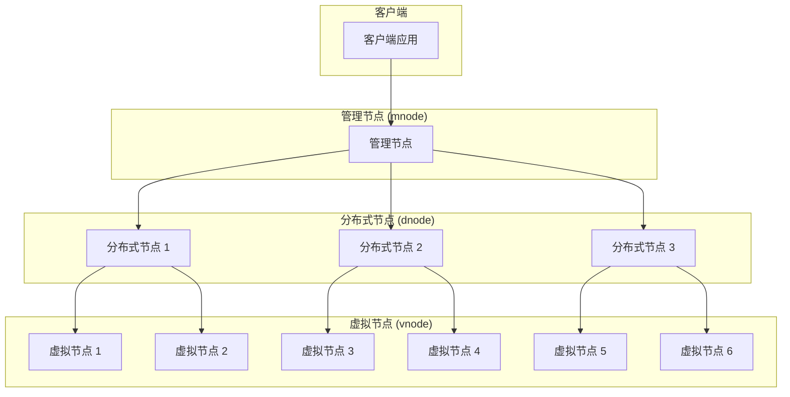
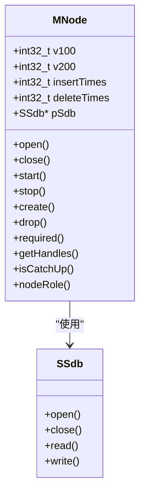
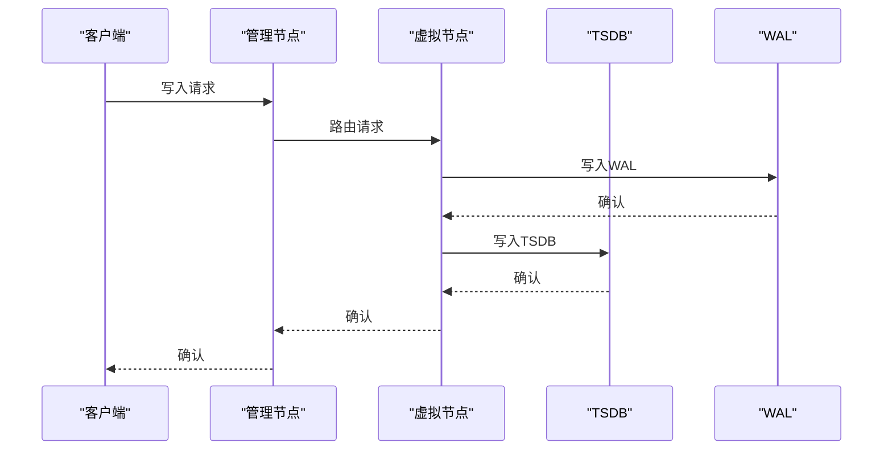
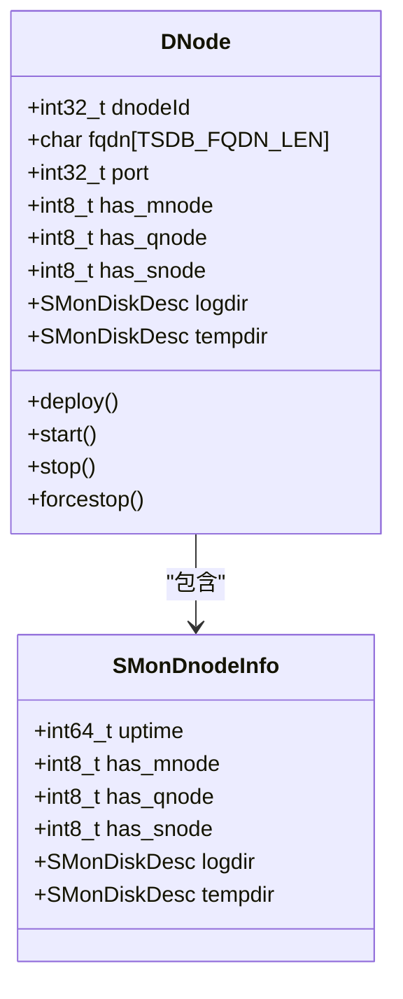
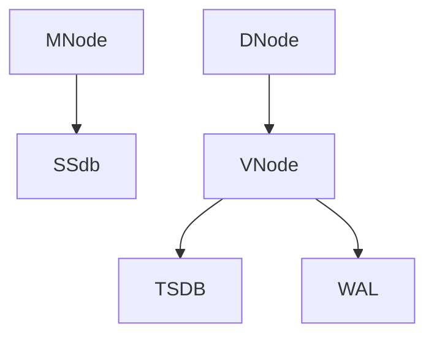

# 分布式架构

<cite>
**本文档引用的文件**   
- [mnode.h](file://include/dnode/mnode/mnode.h)
- [mmInt.c](file://source/dnode/mgmt/mgmt_mnode/src/mmInt.c)
- [vnode.h](file://source/dnode/vnode/inc/vnode.h)
- [vnodeOpen.c](file://source/dnode/vnode/src/vnd/vnodeOpen.c)
- [dnode.h](file://include/dnode/dnode.h)
- [tsdbOpen.c](file://source/dnode/vnode/src/tsdb/tsdbOpen.c)
- [tsdbFS2.c](file://source/dnode/vnode/src/tsdb/tsdbFS2.c)
- [tsdbCommit2.c](file://source/dnode/vnode/src/tsdb/tsdbCommit2.c)
</cite>

## 目录
1. [引言](#引言)
2. [核心组件](#核心组件)
3. [架构概述](#架构概述)
4. [详细组件分析](#详细组件分析)
5. [依赖分析](#依赖分析)
6. [性能考虑](#性能考虑)
7. [故障排除指南](#故障排除指南)
8. [结论](#结论)

## 引言
TDengine是一个高性能、分布式的时序数据库，其架构设计旨在实现高可用性、水平扩展和高效的数据管理。本文档深入探讨了TDengine的分布式架构，重点分析了管理节点（mnode）、虚拟节点（vnode）和分布式节点（dnode）的角色和协作机制。通过详细的序列图和代码分析，本文档为运维人员提供了必要的理论基础，以理解和优化TDengine的集群行为。

## 核心组件
TDengine的分布式架构由三个核心组件构成：管理节点（mnode）、虚拟节点（vnode）和分布式节点（dnode）。这些组件协同工作，确保数据的高效存储、查询和管理。

**Section sources**
- [mnode.h](file://include/dnode/mnode/mnode.h#L1-L50)
- [vnode.h](file://source/dnode/vnode/inc/vnode.h#L1-L50)
- [dnode.h](file://include/dnode/dnode.h#L1-L50)

## 架构概述
TDengine的分布式架构采用了一种分层设计，其中管理节点（mnode）作为集群的大脑，负责元数据管理、用户认证和负载均衡。虚拟节点（vnode）作为数据存储和计算的基本单元，实现了数据的水平扩展。分布式节点（dnode）作为物理服务器的抽象，托管多个vnode，从而实现了资源的灵活分配和管理。

**Diagram sources **
- [mnode.h](file://include/dnode/mnode/mnode.h#L1-L20)
- [dnode.h](file://include/dnode/dnode.h#L10-L30)
- [vnode.h](file://source/dnode/vnode/inc/vnode.h#L15-L45)

## 详细组件分析

### 管理节点（mnode）分析
管理节点（mnode）是TDengine集群的核心，负责元数据管理、用户认证和负载均衡。它通过维护集群的全局状态，确保所有节点之间的协调一致。

#### 管理节点类图

**Diagram sources **
- [mnode.h](file://include/dnode/mnode/mnode.h#L15-L45)
- [mmInt.c](file://source/dnode/mgmt/mgmt_mnode/src/mmInt.c#L5-L20)

### 虚拟节点（vnode）分析
虚拟节点（vnode）是TDengine中数据存储和计算的基本单元。每个vnode负责管理一个特定的数据分片，通过水平扩展实现数据的高效存储和查询。

#### 虚拟节点序列图

**Diagram sources **
- [vnode.h](file://source/dnode/vnode/inc/vnode.h#L15-L45)
- [vnodeOpen.c](file://source/dnode/vnode/src/vnd/vnodeOpen.c#L20-L60)
- [tsdbOpen.c](file://source/dnode/vnode/src/tsdb/tsdbOpen.c#L30-L80)

### 分布式节点（dnode）分析
分布式节点（dnode）是物理服务器的抽象，负责托管多个虚拟节点（vnode）。通过将多个vnode分布在不同的dnode上，TDengine实现了资源的灵活分配和管理。

#### 分布式节点类图

**Diagram sources **
- [dnode.h](file://include/dnode/dnode.h#L15-L45)
- [dmMain.c](file://source/dnode/mgmt/exe/dmMain.c#L5-L20)

## 依赖分析
TDengine的各个组件之间存在紧密的依赖关系。管理节点（mnode）依赖于SSdb进行元数据管理，虚拟节点（vnode）依赖于TSDB和WAL进行数据存储和持久化，而分布式节点（dnode）则托管多个虚拟节点（vnode）。

**Diagram sources **
- [mnode.h](file://include/dnode/mnode/mnode.h#L1-L20)
- [vnode.h](file://source/dnode/vnode/inc/vnode.h#L10-L30)
- [dnode.h](file://include/dnode/dnode.h#L15-L45)

**Section sources**
- [mnode.h](file://include/dnode/mnode/mnode.h#L1-L30)
- [vnode.h](file://source/dnode/vnode/inc/vnode.h#L1-L50)
- [dnode.h](file://include/dnode/dnode.h#L1-L30)

## 性能考虑
TDengine通过多种机制优化性能，包括数据分片、异步写入和后台任务调度。虚拟节点（vnode）通过异步写入WAL和TSDB，确保了高吞吐量和低延迟。此外，后台任务如压缩和合并操作在不影响主流程的情况下进行，进一步提升了系统的整体性能。

## 故障排除指南
当遇到性能问题或数据不一致时，运维人员应首先检查管理节点（mnode）的状态，确保其正常运行。其次，检查虚拟节点（vnode）的日志，确认数据写入和读取是否成功。最后，检查分布式节点（dnode）的资源使用情况，确保没有资源瓶颈。

**Section sources**
- [mmInt.c](file://source/dnode/mgmt/mgmt_mnode/src/mmInt.c#L10-L50)
- [vnodeOpen.c](file://source/dnode/vnode/src/vnd/vnodeOpen.c#L15-L40)
- [tsdbFS2.c](file://source/dnode/vnode/src/tsdb/tsdbFS2.c#L15-L40)

## 结论
TDengine的分布式架构通过管理节点（mnode）、虚拟节点（vnode）和分布式节点（dnode）的协同工作，实现了高可用性、水平扩展和高效的数据管理。通过深入理解这些组件的角色和协作机制，运维人员可以更好地优化和维护TDengine集群，确保其稳定运行。