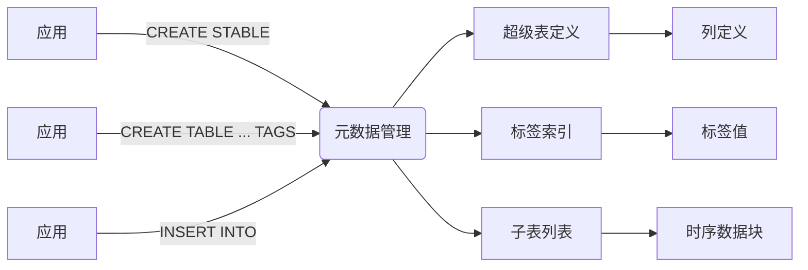
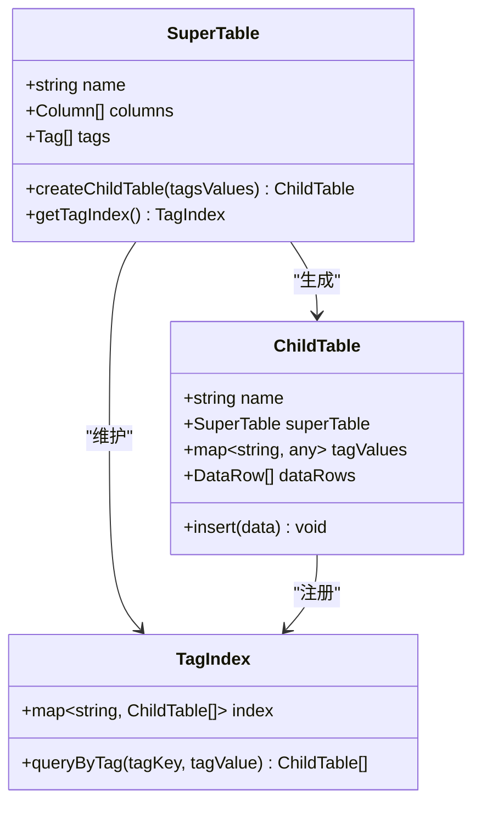
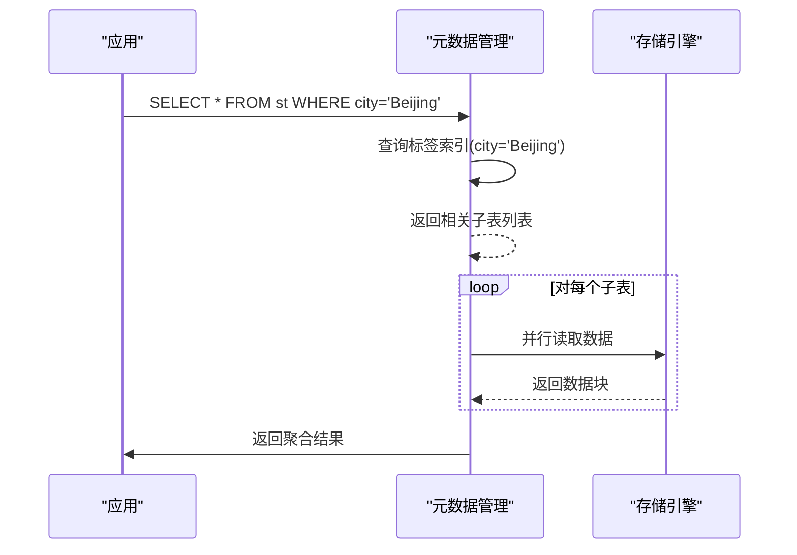

# 数据模型

<cite>
**本文档引用的文件**  
- [taos.h](file://include/client/taos.h)
- [tdataformat.h](file://include/common/tdataformat.h)
- [systable.c](file://source/common/systable.c)
- [catalog.h](file://include/libs/catalog/catalog.h)
- [command.h](file://include/libs/command/command.h)
- [test_super_table.sql](file://test/cases/04-SuperTables/test_super_table.sql)
- [test_tag_index.sql](file://test/cases/26-TagIndex/test_tag_index.sql)
- [taosdemo.c](file://examples/c/taosdemo.c)
</cite>

## 目录
1. [引言](#引言)
2. [项目结构](#项目结构)
3. [核心组件](#核心组件)
4. [架构概述](#架构概述)
5. [详细组件分析](#详细组件分析)
6. [依赖分析](#依赖分析)
7. [性能考虑](#性能考虑)
8. [故障排除指南](#故障排除指南)
9. [结论](#结论)

## 引言
TDengine 是一款专为物联网（IoT）、车联网、工业互联网等场景设计的高性能、分布式、时序数据库。其独特的数据模型，特别是超级表（Super Table）与子表（Child Table）机制，使其在处理海量设备数据时表现出卓越的性能和可扩展性。本文档深入解析 TDengine 的时序数据模型，重点阐述超级表作为模板的作用、标签（tags）的使用方式、数据的物理存储布局，以及该模型相较于传统关系型数据库的优势。

## 项目结构
TDengine 的代码库采用模块化设计，主要分为客户端、服务端核心组件、通用库和测试用例。与数据模型最相关的代码位于 `include` 和 `source` 目录下，特别是 `include/common`、`include/libs/catalog` 和 `source/libs/catalog` 等模块，它们定义了数据表、标签、超级表的元数据结构和操作逻辑。

```mermaid
graph TB
subgraph "核心模块"
Catalog[元数据管理模块]
Command[SQL命令解析]
DataFormat[数据格式定义]
end
subgraph "接口与客户端"
ClientAPI[客户端API]
TaosDemo[示例程序]
end
subgraph "测试用例"
TestSTable[超级表测试]
TestTag[标签索引测试]
end
Command --> Catalog : "创建/查询表"
DataFormat --> Catalog : "定义表结构"
ClientAPI --> Command : "发送SQL"
TestSTable --> Catalog : "验证功能"
TestTag --> Catalog : "验证索引"
```

**Diagram sources**
- [catalog.h](file://include/libs/catalog/catalog.h#L1-L50)
- [command.h](file://include/libs/command/command.h#L1-L30)
- [test_super_table.sql](file://test/cases/04-SuperTables/test_super_table.sql#L1-L20)

**Section sources**
- [project_structure](file://#L1-L500)

## 核心组件
TDengine 数据模型的核心在于其对“设备”这一概念的抽象。一个超级表（STable）定义了同类设备的公共数据结构和标签集合。每个具体的设备实例则通过创建一个子表（CTable）来表示，该子表继承超级表的结构，并拥有自己唯一的标签值。这种模型将设备的静态属性（标签）与动态的时序数据分离，极大地优化了存储和查询效率。

**Section sources**
- [taos.h](file://include/client/taos.h#L100-L200)
- [tdataformat.h](file://include/common/tdataformat.h#L50-L150)
- [catalog.h](file://include/libs/catalog/catalog.h#L20-L80)

## 架构概述
TDengine 的数据模型架构围绕“超级表-子表”范式构建。元数据管理模块（Catalog）负责维护超级表的定义和所有子表的标签索引。当数据写入时，系统根据标签值将数据路由到相应的存储位置。查询引擎能够利用标签索引快速定位和聚合来自多个子表的数据。



**Diagram sources**
- [catalog.h](file://include/libs/catalog/catalog.h#L1-L100)
- [systable.c](file://source/common/systable.c#L10-L60)

## 详细组件分析

### 超级表与子表机制分析
超级表（Super Table）是 TDengine 数据模型的核心创新。它不仅仅是一个表，更是一个模板和索引中心。

#### 超级表的创建与定义
创建超级表时，需要定义两部分：**列（columns）** 和 **标签（tags）**。列用于存储随时间变化的测量值（如温度、湿度），而标签用于描述设备的静态属性（如位置、型号、负责人）。这种分离使得对标签的查询（如“查找所有北京的设备”）可以非常高效，因为它不涉及扫描庞大的时序数据。



**Diagram sources**
- [catalog.h](file://include/libs/catalog/catalog.h#L30-L70)
- [command.h](file://include/libs/command/command.h#L40-L60)

#### 数据插入与查询流程
当向一个子表插入数据时，数据会根据其时间戳被写入对应的时序数据块。查询时，如果查询条件包含标签，系统会首先通过标签索引快速定位到相关的子表集合，然后并行地从这些子表中读取时序数据进行聚合。



**Diagram sources**
- [catalog.h](file://include/libs/catalog/catalog.h#L80-L100)
- [test_super_table.sql](file://test/cases/04-SuperTables/test_super_table.sql#L21-L40)

### 与传统关系型数据库的对比
在传统关系型数据库中，要存储海量设备数据，通常有两种方式：一是为每个设备创建一个独立的表，这会导致表数量爆炸，管理困难；二是将所有设备的数据存入一张大表，并增加设备ID等字段作为筛选条件，但这会导致单表数据量巨大，查询性能低下，尤其是涉及设备属性的查询。

TDengine 的“超级表-子表”模型完美解决了这个问题。它通过标签实现了逻辑上的统一管理和物理上的自动分片。所有同类设备的数据在逻辑上属于同一个超级表，便于统一查询和管理；而在物理上，每个设备的数据（子表）是独立存储的，实现了数据的自动分片，保证了查询性能。

**Section sources**
- [test_super_table.sql](file://test/cases/04-SuperTables/test_super_table.sql#L1-L100)
- [test_tag_index.sql](file://test/cases/26-TagIndex/test_tag_index.sql#L1-L50)

## 依赖分析
TDengine 的数据模型功能依赖于多个核心模块的协同工作。`catalog` 模块负责元数据的持久化和索引管理，`command` 模块负责解析 SQL 命令并调用相应的处理逻辑，`dataformat` 模块定义了数据在内存和磁盘上的存储格式。

```mermaid
graph TD
SQL[SQL命令] --> CommandParser[命令解析器]
CommandParser --> CatalogManager[元数据管理]
CommandParser --> StorageEngine[存储引擎]
CatalogManager --> TagIndex[标签索引]
CatalogManager --> STableDef[超级表定义]
StorageEngine --> DataBlock[时序数据块]
TagIndex --> StorageEngine : "提供子表列表"
```

**Diagram sources**
- [catalog.h](file://include/libs/catalog/catalog.h#L1-L120)
- [command.h](file://include/libs/command/command.h#L1-L40)

**Section sources**
- [catalog.h](file://include/libs/catalog/catalog.h#L1-L150)
- [command.h](file://include/libs/command/command.h#L1-L80)

## 性能考虑
TDengine 的数据模型在性能上具有显著优势：
1.  **高效聚合查询**：由于同类设备的数据模式相同，对超级表的聚合查询（如 `SELECT AVG(temperature) FROM st`）可以非常高效地并行执行。
2.  **快速标签过滤**：标签索引使得基于设备属性的查询速度极快，不受时序数据量的影响。
3.  **数据压缩**：同类设备的时序数据具有高度相似性，TDengine 可以利用这一点实现更高的数据压缩比。
4.  **自动分片**：每个子表独立存储，天然实现了数据分片，避免了单表瓶颈。

## 故障排除指南
在使用超级表和标签时，常见的问题包括：
*   **标签索引未生效**：确保查询条件中的标签名拼写正确，并且该标签已成功创建。
*   **子表创建失败**：检查标签值的数量和类型是否与超级表定义的标签完全匹配。
*   **查询性能不佳**：对于复杂的跨标签查询，考虑是否可以优化查询条件或增加必要的索引。

**Section sources**
- [test_tag_index.sql](file://test/cases/26-TagIndex/test_tag_index.sql#L1-L60)
- [taosdemo.c](file://examples/c/taosdemo.c#L100-L200)

## 结论
TDengine 的“超级表-子表”数据模型是其为物联网场景量身定制的核心优势。通过将设备的静态属性（标签）与动态时序数据分离，并利用超级表作为模板和索引中心，TDengine 实现了对海量设备数据的高效存储、快速查询和便捷管理。这种模型不仅解决了传统数据库在处理此类数据时的性能瓶颈，还极大地简化了数据架构的设计和维护，是 TDengine 在时序数据领域脱颖而出的关键所在。