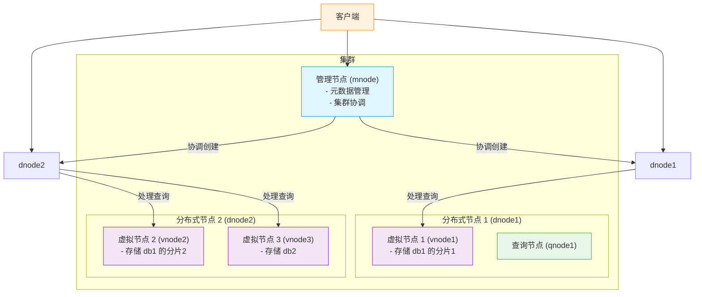

# 核心概念

<cite>
**本文档中引用的文件**  
- [mnode.h](file://include/dnode/mnode/mnode.h)
- [snode.h](file://include/dnode/snode/snode.h)
- [vnode.h](file://source/dnode/vnode/inc/vnode.h)
- [bnode.h](file://include/dnode/bnode/bnode.h)
- [qnode.h](file://include/dnode/qnode/qnode.h)
- [test_stable_create_basic.py](file://test/cases/04-SuperTables/01-Create/test_stable_create_basic.py)
</cite>

## 目录
1. [引言](#引言)
2. [超级表与子表数据模型](#超级表与子表数据模型)
3. [虚拟节点（vnode）](#虚拟节点vnode)
4. [管理节点（mnode）](#管理节点mnode)
5. [分布式节点（dnode）](#分布式节点dnode)
6. [数据分布机制](#数据分布机制)
7. [架构图示](#架构图示)
8. [总结](#总结)

## 引言
TDengine 是一个专为物联网（IoT）、车联网、工业互联网等时序数据场景设计的高性能、分布式、列式存储的时序数据库。其核心架构围绕“设备”这一核心概念构建，通过独特的数据模型和分布式架构，实现了对海量设备数据的高效写入、存储和查询。本文档旨在深入解释 TDengine 特有的核心概念，包括超级表（Super Table）、子表（Child Table）、虚拟节点（vnode）、管理节点（mnode）和分布式节点（dnode），为初学者提供清晰的模型理解，并为架构师提供设计决策的背景。

## 超级表与子表数据模型

TDengine 的数据模型是其高效处理设备数据的关键。它引入了“超级表”（Super Table, STB）和“子表”（Child Table, CTB）的概念，以优雅地解决设备数据的共性与个性问题。

超级表（STB）定义了一个设备类型（或数据采集点类型）的公共数据结构。它包含两部分：**数据列**（data columns）和**标签列**（tag columns）。数据列定义了所有该类型设备共有的测量值，例如温度、湿度、电压等。标签列则定义了用于描述设备本身属性的静态信息，例如地理位置、设备型号、负责人等。标签不随时间变化，但可以用于高效地过滤和聚合数据。

子表（CTB）是超级表的具体实例，代表一个真实的设备。每个子表继承其超级表定义的数据列结构，并必须为其标签列提供具体的值。例如，一个名为 `weather_station` 的超级表可能有数据列 `temperature` 和 `humidity`，以及标签列 `location` 和 `model`。那么，一个位于“北京”的具体气象站就会创建一个子表，并将 `location` 标签设为“北京”，`model` 标签设为“WS-2000”。

这种设计模式的优势在于：
1.  **高效存储**：相同设备类型的数据列结构被集中定义，避免了为每个设备重复存储 schema 信息。
2.  **高效查询**：用户可以轻松地对同一超级表下的所有子表进行聚合查询（例如，查询所有气象站的平均温度），或通过标签进行快速过滤（例如，查询所有“北京”地区的设备数据）。
3.  **灵活扩展**：新增设备只需创建一个子表并填充其标签，无需修改数据库的整体结构。

**Section sources**
- [test_stable_create_basic.py](file://test/cases/04-SuperTables/01-Create/test_stable_create_basic.py)

## 虚拟节点（vnode）

虚拟节点（Virtual Node, vnode）是 TDengine 中数据分片和存储的核心单元。一个物理的分布式节点（dnode）可以承载多个虚拟节点。每个 vnode 负责管理一个或多个数据库（database）的特定分片。

vnode 的主要职责包括：
- **数据存储**：vnode 是实际存储数据的地方。它管理着其负责的数据分片的写入、读取和压缩。
- **数据分片**：当一个数据库被创建时，TDengine 会根据配置将其数据水平切分到多个 vnode 中。这种分片机制是实现水平扩展的基础。
- **元数据缓存**：vnode 缓存其管理的表的元数据（如 schema），以加速查询处理。
- **事务处理**：vnode 负责处理针对其数据分片的写入和查询请求。

在代码层面，`vnode.h` 头文件定义了 vnode 的核心接口，如 `vnodeOpen`、`vnodeClose`、`vnodeProcessWriteMsg` 和 `vnodeProcessQueryMsg`，这些函数分别用于启动/关闭 vnode 以及处理写入和查询消息。

**Section sources**
- [vnode.h](file://source/dnode/vnode/inc/vnode.h)

## 管理节点（mnode）

管理节点（Management Node, mnode）是 TDengine 集群的“大脑”，负责维护整个集群的元数据和协调集群操作。在一个集群中，通常有多个 mnode 实例，它们通过 Raft 协议保证数据的一致性和高可用性。

mnode 的主要职责包括：
- **元数据管理**：mnode 存储和管理所有数据库、超级表、用户、权限等全局元数据。当客户端创建一个新表或数据库时，请求首先会到达 mnode。
- **集群协调**：mnode 负责集群的节点管理，包括节点的加入、离开和状态监控。
- **负载均衡**：mnode 参与集群的负载均衡决策，例如在创建新数据库时，决定将其分配到哪个 dnode 上的 vnode 中。
- **查询路由**：对于涉及多个 vnode 的复杂查询，mnode 或与之协同的查询节点（qnode）会负责将查询分解并路由到相应的 vnode。

`mnode.h` 头文件中的 `SMnode` 结构体和 `mndOpen`、`mndProcessRpcMsg` 等函数，体现了 mnode 作为一个独立服务模块的架构。

**Section sources**
- [mnode.h](file://include/dnode/mnode/mnode.h)

## 分布式节点（dnode）

分布式节点（Distributed Node, dnode）是 TDengine 集群中的物理服务器或进程。它是集群的物理基础，承载着 vnode、mnode 和 qnode 等逻辑组件。

dnode 的主要职责包括：
- **资源提供**：dnode 提供 CPU、内存、磁盘和网络等物理资源。
- **组件宿主**：一个 dnode 可以运行一个或多个逻辑节点，包括一个 mnode（如果该 dnode 被指定为管理节点）、一个 qnode 和多个 vnode。
- **服务入口**：客户端连接通常指向一个 dnode，该 dnode 再根据请求类型将其分发给内部的 mnode、qnode 或 vnode 进行处理。

从代码结构看，`include/dnode` 目录下的 `bnode.h`、`mnode.h`、`qnode.h`、`snode.h` 和 `vnode.h` 分别对应了 dnode 内部的不同功能模块，这清晰地展示了 dnode 作为“容器”的角色。

**Section sources**
- [bnode.h](file://include/dnode/bnode/bnode.h)
- [snode.h](file://include/dnode/snode/snode.h)

## 数据分布机制

TDengine 的数据分布机制是其高性能的关键。数据的分布主要基于两个维度：**数据库**和**设备 ID（tag）**。

1.  **数据库级分片**：当一个数据库被创建时，TDengine 会根据集群配置，将该数据库分配到一个或多个 dnode 上。每个 dnode 会为该数据库创建一个或多个 vnode 来负责其数据存储。这个过程由 mnode 协调完成。

2.  **设备级分片（vnode 内部）**：对于一个数据库内的数据，TDengine 会根据子表的名称（通常代表设备 ID）进行哈希计算，然后根据哈希值将不同的子表分配到该数据库所属的不同的 vnode 中。这意味着，即使属于同一个数据库，不同设备（子表）的数据也可能被存储在不同的 vnode 里，从而实现负载均衡。

这种两级分片机制确保了数据能够均匀地分布在集群的各个物理节点上，避免了单点瓶颈，实现了真正的水平扩展。

## 架构图示

**Diagram sources**
- [mnode.h](file://include/dnode/mnode/mnode.h)
- [vnode.h](file://source/dnode/vnode/inc/vnode.h)
- [qnode.h](file://include/dnode/qnode/qnode.h)

## 总结

TDengine 通过其创新的超级表/子表数据模型，完美地抽象了设备数据的共性与个性，极大地简化了时序数据的管理。其分布式架构以 vnode 为基本存储单元，以 mnode 为集群大脑，以 dnode 为物理载体，通过两级分片机制实现了数据的高效分布和负载均衡。理解这些核心概念，是掌握 TDengine 使用和进行架构设计的基础。对于初学者，应重点理解 STB/CTB 模型如何组织数据；对于架构师，则需深入理解 vnode 的分片策略和 mnode 的协调机制，以设计出高性能、可扩展的系统。