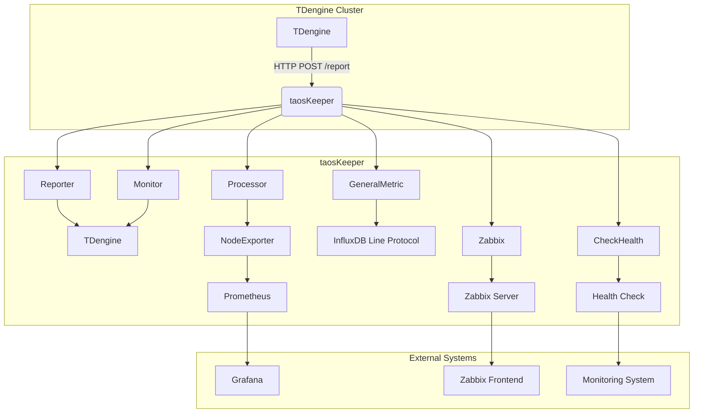
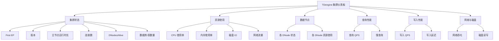

# 监控告警

<cite>
**本文档中引用的文件**  
- [main.go](file://tools/keeper/main.go)
- [taoskeeper.toml](file://tools/keeper/config/taoskeeper.toml)
- [tdengine-taoskeeper-prometheus-dashboard.json](file://tools/keeper/dashboards/tdengine-taoskeeper-prometheus-dashboard.json)
- [program.go](file://tools/keeper/system/program.go)
- [config.go](file://tools/keeper/infrastructure/config/config.go)
- [report.go](file://tools/keeper/api/report.go)
- [monitor.go](file://tools/keeper/monitor/monitor.go)
- [handle.go](file://tools/keeper/process/handle.go)
- [nodeexporter.go](file://tools/keeper/api/nodeexporter.go)
- [adapter2.go](file://tools/keeper/api/adapter2.go)
- [gen_metric.go](file://tools/keeper/api/gen_metric.go)
- [zabbix.go](file://tools/keeper/api/zabbix.go)
- [checkhealth.go](file://tools/keeper/api/checkhealth.go)
- [audit.go](file://tools/keeper/api/audit.go)
- [collect.go](file://tools/keeper/monitor/collect.go)
- [system.go](file://tools/keeper/monitor/system.go)
</cite>

## 目录
1. [简介](#简介)
2. [架构概述](#架构概述)
3. [安装与配置](#安装与配置)
4. [taoskeeper.toml 配置详解](#taoskeeper.toml-配置详解)
5. [与 Prometheus 集成](#与-prometheus-集成)
6. [Grafana 可视化](#grafana-可视化)
7. [关键监控指标](#关键监控指标)
8. [告警规则配置](#告警规则配置)
9. [最佳实践](#最佳实践)

## 简介

taosKeeper 是 TDengine 3.0 引入的监控指标导出工具，旨在帮助用户实时监控 TDengine 的运行状态和性能指标。通过简单的配置，TDengine 可以将其自身的运行状态和各类指标上报给 taosKeeper。taosKeeper 接收监控数据后，会通过 taosAdapter 提供的 RESTful 接口将数据存储到 TDengine 中。

taosKeeper 的一个重要价值在于，它可以将多个甚至一批 TDengine 集群的监控数据集中到一个统一的平台。这样，监控软件可以轻松获取这些数据，进而实现对 TDengine 集群的全面监控和实时分析。通过 taosKeeper，用户可以更方便地了解 TDengine 的运行状况，及时发现并解决潜在问题，确保系统的稳定性和高效性。

**Section sources**
- [README.md](file://tools/keeper/README.md#L1-L125)

## 架构概述

taosKeeper 的核心架构由多个组件协同工作，形成一个完整的监控数据采集、处理和导出系统。



**Diagram sources**
- [main.go](file://tools/keeper/main.go#L1-L9)
- [program.go](file://tools/keeper/system/program.go#L25-L106)
- [report.go](file://tools/keeper/api/report.go#L47-L71)
- [monitor.go](file://tools/keeper/monitor/monitor.go#L18-L88)
- [handle.go](file://tools/keeper/process/handle.go#L267-L297)
- [nodeexporter.go](file://tools/keeper/api/nodeexporter.go#L15-L23)
- [adapter2.go](file://tools/keeper/api/adapter2.go#L41-L66)
- [gen_metric.go](file://tools/keeper/api/gen_metric.go#L134-L176)
- [zabbix.go](file://tools/keeper/api/zabbix.go#L18-L43)
- [checkhealth.go](file://tools/keeper/api/checkhealth.go#L8-L20)

**Section sources**
- [program.go](file://tools/keeper/system/program.go#L25-L106)
- [config.go](file://tools/keeper/infrastructure/config/config.go#L51-L165)

## 安装与配置

taosKeeper 可以通过源码编译或使用预编译的二进制文件进行安装。

### 源码编译

1.  确保已安装 Go 1.23 或更高版本。
2.  确保 TDengine 已部署并启动，包括 `taosd` 和 `taosAdapter`。
3.  在 `TDengine/tools/keeper` 目录下执行以下命令进行编译：

```bash
go build
```

编译成功后，将生成 `taoskeeper` 可执行文件。

### 配置文件

taosKeeper 的主要配置文件是 `taoskeeper.toml`，通常位于 `/etc/taos/` 目录下。该文件定义了 taosKeeper 的监听端口、连接 TDengine 的参数、日志配置等。

**Section sources**
- [README.md](file://tools/keeper/README.md#L1-L125)
- [config.go](file://tools/keeper/infrastructure/config/config.go#L51-L165)

## taoskeeper.toml 配置详解

`taoskeeper.toml` 是 taosKeeper 的核心配置文件，其结构清晰，主要包含以下几个部分：

### 基础配置

```toml
instanceId = 64

# 监听主机，支持 IPv4/IPv6，默认为空
host = ""
# 监听端口，默认为 6043
port = 6043

# Go 协程池大小
gopoolsize = 50000

# 指标采集间隔
RotationInterval = "15s"
```

- **instanceId**: 当前 taosKeeper 实例的 ID，用于在查询时区分不同的实例。
- **host**: taosKeeper 服务监听的主机地址。留空表示监听所有网络接口。
- **port**: taosKeeper 服务监听的端口号。Prometheus 将通过此端口的 `/metrics` 路径抓取指标。
- **gopoolsize**: 内部使用的 Go 协程池大小，用于处理并发请求。
- **RotationInterval**: 指标数据的采集和上报间隔，建议设置为 15 秒或 30 秒，与 Prometheus 的抓取间隔保持一致。

### TDengine 连接配置

```toml
[tdengine]
# 使用方括号表示 IPv6 (例如 "[::1]")，IPv4 使用点分十进制。
host = "127.0.0.1"
port = 6041
username = "root"
password = "taosdata"
usessl = false
```

- **host**: TDengine 服务器的地址。
- **port**: TDengine 的 RESTful 端口（通常是 6041）。
- **username/password**: 用于连接 TDengine 的用户名和密码。
- **usessl**: 是否使用 SSL 连接。

### 监控指标配置

```toml
[metrics]
# 指标名称中的前缀
prefix = "taos"

# 导出一些非超级表的表
tables = []

# 用于存储指标数据的数据库
[metrics.database]
name = "log"
# 存储指标数据的数据库选项
[metrics.database.options]
vgroups = 1
buffer = 64
keep = 90
cachemodel = "both"
```

- **prefix**: 所有导出的 Prometheus 指标名称的前缀，例如 `taos_cluster_info_dnodes_total`。
- **tables**: 一个字符串数组，用于指定需要导出的非超级表（普通表）的名称。
- **metrics.database.name**: 用于存储所有监控数据的数据库名称，通常为 `log`。
- **metrics.database.options**: 为 `log` 数据库设置的选项，如 vgroups 数量、缓存大小、数据保留天数等。

### 环境与日志配置

```toml
[environment]
# 是否在 cgroup 中运行。
incgroup = false

[log]
# 存放日志文件的目录。
# path = "/var/log/taos"
level = "info"
# 日志文件轮转前的最大保留数量。
rotationCount = 30
# 保留日志文件的天数。
keepDays = 30
# 单个日志文件的最大大小，达到此大小后进行轮转。
rotationSize = "1GB"
# 如果设置为 true，则轮转后的日志文件将被压缩。
compress = false
# 预留的最小磁盘空间。当磁盘空间低于此值时，将不再写入日志。
reservedDiskSize = "1GB"
```

- **environment.incgroup**: 当 taosKeeper 在容器（cgroup）环境中运行时，应设置为 `true`，以便正确采集 CPU 和内存使用率。
- **log.level**: 日志级别，可选值有 `debug`, `info`, `warn`, `error`。
- **log.rotationSize/rotationCount/keepDays**: 控制日志文件的轮转策略，防止日志文件无限增长。

**Section sources**
- [taoskeeper.toml](file://tools/keeper/config/taoskeeper.toml#L1-L57)
- [config.go](file://tools/keeper/infrastructure/config/config.go#L51-L165)

## 与 Prometheus 集成

taosKeeper 通过实现 Prometheus 的 `Exporter` 模式，将 TDengine 的监控指标暴露给 Prometheus。

### 集成原理

1.  **数据采集**: taosKeeper 内部的 `Processor` 组件会定期（由 `RotationInterval` 控制）向 TDengine 发起查询，获取 `log` 数据库中存储的各类监控信息（如集群信息、节点信息、vgroup 信息等）。
2.  **数据转换**: `Processor` 将查询到的 TDengine 原始数据转换为 Prometheus 客户端库能够识别的指标格式（Counter, Gauge, Summary 等）。
3.  **HTTP 暴露**: taosKeeper 内置了一个 HTTP 服务器（由 `NodeExporter` 组件管理），在 `/metrics` 路径下暴露一个符合 Prometheus 格式的文本接口。
4.  **Prometheus 抓取**: 用户需要在 Prometheus 的配置文件中添加一个 `job`，指向 taosKeeper 的监听地址和端口（如 `http://localhost:6043/metrics`）。Prometheus 会按照其自身的抓取周期（scrape interval）定期访问此接口，拉取最新的指标数据。

### 配置 Prometheus

在 `prometheus.yml` 配置文件中添加以下 `job`：

```yaml
scrape_configs:
  - job_name: 'tdengine'
    static_configs:
      - targets: ['localhost:6043']
```

**Section sources**
- [nodeexporter.go](file://tools/keeper/api/nodeexporter.go#L15-L23)
- [handle.go](file://tools/keeper/process/handle.go#L299-L543)
- [monitor.go](file://tools/keeper/monitor/monitor.go#L18-L88)

## Grafana 可视化

taosKeeper 提供了一个预定义的 Grafana 仪表板，用于直观地展示 TDengine 集群的各项关键指标。

### 仪表板导入

1.  登录 Grafana。
2.  点击左侧导航栏的 "+" 号，选择 "Import"。
3.  在 "Import via panel json" 区域，点击 "Upload .json file" 按钮。
4.  选择 `tools/keeper/dashboards/tdengine-taoskeeper-prometheus-dashboard.json` 文件并上传。
5.  在 "Prometheus" 下拉菜单中选择已配置好的 Prometheus 数据源，然后点击 "Import"。

### 仪表板概览

导入后的仪表板提供了以下关键视图：



**Diagram sources**
- [tdengine-taoskeeper-prometheus-dashboard.json](file://tools/keeper/dashboards/tdengine-taoskeeper-prometheus-dashboard.json#L1-L799)

**Section sources**
- [tdengine-taoskeeper-prometheus-dashboard.json](file://tools/keeper/dashboards/tdengine-taoskeeper-prometheus-dashboard.json#L1-L799)

## 关键监控指标

taosKeeper 从 TDengine 的 `log` 数据库中采集并导出大量关键指标，这些指标是监控和告警的基础。

### 集群与节点状态

- **`taos_cluster_info_dnodes_total`**: 集群中 DNode 的总数。
- **`taos_cluster_info_dnodes_alive`**: 集群中存活的 DNode 数量。
- **`taos_cluster_info_master_uptime`**: 主 MNode 的运行时长（秒）。
- **`taos_cluster_info_connections_total`**: 集群的总连接数。
- **`taos_dnodes_info_status`**: 各个 DNode 的状态（1=正常，0=离线）。

### 资源使用

- **`taoskeeper_cpu_percent`**: taosKeeper 进程的 CPU 使用率。
- **`taoskeeper_mem_percent`**: taosKeeper 进程的内存使用率。
- **`taos_dnodes_info_cpu_cores`**: 各个 DNode 的 CPU 核心数。
- **`taos_dnodes_info_memory_total`**: 各个 DNode 的总内存大小。
- **`taos_dnodes_info_disk_engine`**: 各个 DNode 上数据文件占用的磁盘空间。

### 性能指标

- **`taos_vgroups_info_write_req_total`**: 各个 vgroup 的写入请求数量（Counter）。
- **`taos_vgroups_info_query_req_total`**: 各个 vgroup 的查询请求数量（Counter）。
- **`taos_vgroups_info_insert_rows_total`**: 各个 vgroup 的插入行数（Counter）。
- **`taos_vgroups_info_query_slow_total`**: 各个 vgroup 的慢查询次数（Counter）。
- **`taos_vgroups_info_query_time`**: 各个 vgroup 的查询耗时（Summary）。

### 网络与磁盘

- **`taos_dnodes_info_network_tx_bytes`**: 各个 DNode 的网络发送字节数。
- **`taos_dnodes_info_network_rx_bytes`**: 各个 DNode 的网络接收字节数。
- **`taos_dnodes_info_disk_read_bytes`**: 各个 DNode 的磁盘读取字节数。
- **`taos_dnodes_info_disk_write_bytes`**: 各个 DNode 的磁盘写入字节数。

**Section sources**
- [handle.go](file://tools/keeper/process/handle.go#L299-L543)
- [report.go](file://tools/keeper/api/report.go#L259-L366)
- [tdengine-taoskeeper-prometheus-dashboard.json](file://tools/keeper/dashboards/tdengine-taoskeeper-prometheus-dashboard.json#L1-L799)

## 告警规则配置

基于上述关键指标，可以在 Prometheus 中配置告警规则，以便在系统出现异常时及时通知运维人员。

### 示例告警规则

以下是一些推荐的告警规则示例，可添加到 Prometheus 的 `rules.yml` 文件中：

```yaml
groups:
- name: tdengine.rules
  rules:
  # 集群健康告警
  - alert: TDengineClusterDown
    expr: up{job="tdengine"} == 0
    for: 1m
    labels:
      severity: critical
    annotations:
      summary: "TDengine 集群不可达"
      description: "无法从 {{ $labels.instance }} 抓取到 TDengine 监控数据，集群可能已宕机。"

  # DNode 离线告警
  - alert: TDengineDNodeOffline
    expr: taos_dnodes_info_status{status="0"} == 1
    for: 5m
    labels:
      severity: warning
    annotations:
      summary: "TDengine DNode 离线"
      description: "DNode {{ $labels.dnode_ep }} 已离线超过 5 分钟。"

  # CPU 使用率过高
  - alert: TDengineHighCpuUsage
    expr: taoskeeper_cpu_percent > 80
    for: 10m
    labels:
      severity: warning
    annotations:
      summary: "taosKeeper CPU 使用率过高"
      description: "taosKeeper 的 CPU 使用率持续 10 分钟超过 80%。"

  # 内存使用率过高
  - alert: TDengineHighMemoryUsage
    expr: taoskeeper_mem_percent > 80
    for: 10m
    labels:
      severity: warning
    annotations:
      summary: "taosKeeper 内存使用率过高"
      description: "taosKeeper 的内存使用率持续 10 分钟超过 80%。"

  # 写入 QPS 异常
  - alert: TDengineWriteQpsDrop
    expr: rate(taos_vgroups_info_write_req_total[5m]) < 10
    for: 15m
    labels:
      severity: warning
    annotations:
      summary: "TDengine 写入 QPS 异常下降"
      description: "TDengine 的写入 QPS 持续 15 分钟低于 10，可能存在写入阻塞。"

  # 慢查询增多
  - alert: TDengineSlowQueryIncrease
    expr: increase(taos_vgroups_info_query_slow_total[1h]) > 100
    for: 1h
    labels:
      severity: warning
    annotations:
      summary: "TDengine 慢查询数量显著增加"
      description: "过去一小时内，TDengine 的慢查询数量增加了超过 100 次，请检查查询性能。"
```

**Section sources**
- [handle.go](file://tools/keeper/process/handle.go#L299-L543)
- [tdengine-taoskeeper-prometheus-dashboard.json](file://tools/keeper/dashboards/tdengine-taoskeeper-prometheus-dashboard.json#L1-L799)

## 最佳实践

为了确保 taosKeeper 稳定、高效地运行，建议遵循以下最佳实践：

1.  **合理配置采集间隔**: 将 `taoskeeper.toml` 中的 `RotationInterval` 设置为 15 秒或 30 秒，并确保 Prometheus 的 `scrape_interval` 与之匹配或为其整数倍，以避免不必要的性能开销。
2.  **使用专用数据库**: 始终使用一个专用的数据库（如 `log`）来存储监控数据，避免与业务数据混合，保证监控系统的独立性和稳定性。
3.  **资源隔离**: 在生产环境中，建议将 taosKeeper 部署在与 TDengine 集群不同的物理机或容器中，以避免资源竞争。
4.  **启用日志轮转**: 正确配置 `log` 部分的参数，特别是 `rotationSize` 和 `reservedDiskSize`，以防止日志文件耗尽磁盘空间。
5.  **定期更新**: 关注 TDengine 的官方发布，及时更新 taosKeeper 到最新版本，以获取新功能和安全修复。
6.  **监控 taosKeeper 自身**: 不仅要监控 TDengine，也要通过操作系统监控工具（如 Node Exporter）监控 taosKeeper 进程的 CPU、内存和网络使用情况。