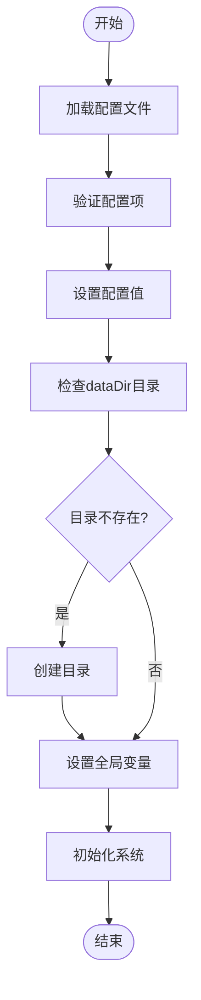

# 配置管理

<cite>
**本文档引用的文件**
- [taos.cfg](file://packaging/cfg/taos.cfg)
- [tglobal.c](file://source/common/src/tglobal.c)
</cite>

## 目录
1. [引言](#引言)
2. [核心配置参数详解](#核心配置参数详解)
3. [配置文件修改与生效机制](#配置文件修改与生效机制)
4. [配置加载与验证流程](#配置加载与验证流程)
5. [总结](#总结)

## 引言
TDengine的配置管理是系统性能调优和稳定运行的关键。本文档深入解析`packaging/cfg/taos.cfg`配置文件中的每一个参数，重点说明`maxSQLLength`、`asyncLog`、`dataDir`、`logDir`等核心参数的调优策略。同时，结合`source/dnode/mgmt/mgmtDnode.c`中的代码逻辑，解释配置加载和验证的过程。

**Section sources**
- [taos.cfg](file://packaging/cfg/taos.cfg)

## 核心配置参数详解

### maxSQLLength（最大SQL长度）
该参数定义了系统允许执行的SQL语句的最大长度。默认值通常为1048576（1MB），取值范围为1到INT32_MAX。过长的SQL语句可能导致内存溢出或解析性能下降。建议根据实际业务需求调整，对于复杂的查询场景，可适当增加此值以避免SQL被截断。

### asyncLog（异步日志）
`asyncLog`参数控制日志写入模式，1表示启用异步日志，0表示同步日志。异步日志能显著提升系统性能，特别是在高并发写入场景下，因为它减少了主线程等待日志写入的时间。默认值为1。在对数据一致性要求极高的场景下，可考虑关闭异步日志以确保日志的即时持久化。

### dataDir（数据目录）
`dataDir`指定TDengine存储数据文件的目录，默认路径为`/var/lib/taos`。该目录必须有足够的磁盘空间，并且建议使用高性能的SSD存储。系统启动时会检查该目录的可用空间，若低于`minimalDataDirGB`（默认2.0GB）则启动失败。合理规划数据目录的位置和磁盘配额对于系统稳定性至关重要。

### logDir（日志目录）
`logDir`用于指定日志文件的存储路径，默认为`/var/log/taos`。日志文件对于故障排查和系统监控非常重要。系统会根据`minimalLogDirGB`（默认1.0GB）来判断是否停止写入日志，以防止磁盘被日志文件占满。建议将日志目录与数据目录分离，以避免相互影响。

**Section sources**
- [taos.cfg](file://packaging/cfg/taos.cfg#L1-L243)
- [tglobal.c](file://source/common/src/tglobal.c#L414-L426)

## 配置文件修改与生效机制

### 配置文件修改方法
TDengine的配置文件`taos.cfg`位于`packaging/cfg/`目录下。用户可以直接编辑此文件，修改所需的参数值。例如，要修改`asyncLog`参数，只需将`# asyncLog 1`改为`asyncLog 0`即可。修改后需重启TDengine服务使配置生效。

### 动态配置修改
部分配置参数支持通过SQL命令动态修改，无需重启服务。例如，可以使用`ALTER CONFIG`命令来修改`asyncLog`或`logKeepDays`等参数。动态修改的配置会立即生效，并持久化到配置文件中。这为系统运维提供了极大的灵活性，允许在运行时进行性能调优。

**Section sources**
- [tglobal.c](file://source/common/src/tglobal.c#L2997-L3000)

## 配置加载与验证流程

### 配置加载过程
TDengine的配置加载主要在`source/common/src/tglobal.c`文件中的`taosInitCfg`函数中实现。系统启动时，首先初始化配置结构体，然后依次加载客户端和服务器端的配置项。配置项的定义通过`cfgAdd*`系列函数完成，如`cfgAddDir`用于添加目录类型的配置，`cfgAddInt32`用于添加整型配置。

### 配置验证与设置
配置加载完成后，系统会调用`taosSetClientCfg`和`taosSetServerCfg`等函数来验证和设置配置值。这些函数会检查配置项的有效性，例如`taosSetTfsCfg`会验证`dataDir`目录是否存在，若不存在则尝试创建。对于无效的配置值，系统会记录错误并返回相应的错误码。

### 动态配置更新
对于支持动态修改的配置项，系统提供了`taosCfgDynamicOptions`函数来处理运行时的配置更新。该函数根据配置项的名称和类型，调用相应的处理逻辑。例如，当`asyncLog`被修改时，系统会立即切换日志写入模式。

**Diagram sources**
- [tglobal.c](file://source/common/src/tglobal.c#L2400-L2499)

**Section sources**
- [tglobal.c](file://source/common/src/tglobal.c#L2400-L2499)

## 总结
TDengine的配置管理是一个复杂而精细的过程，涉及配置文件的解析、验证、设置和动态更新。理解这些核心参数的作用和调优策略，对于充分发挥TDengine的性能潜力至关重要。通过合理配置`maxSQLLength`、`asyncLog`、`dataDir`和`logDir`等参数，可以有效提升系统的稳定性和响应速度。