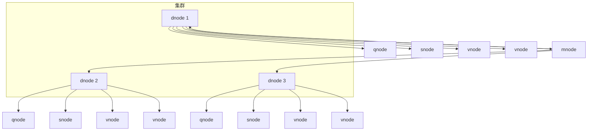
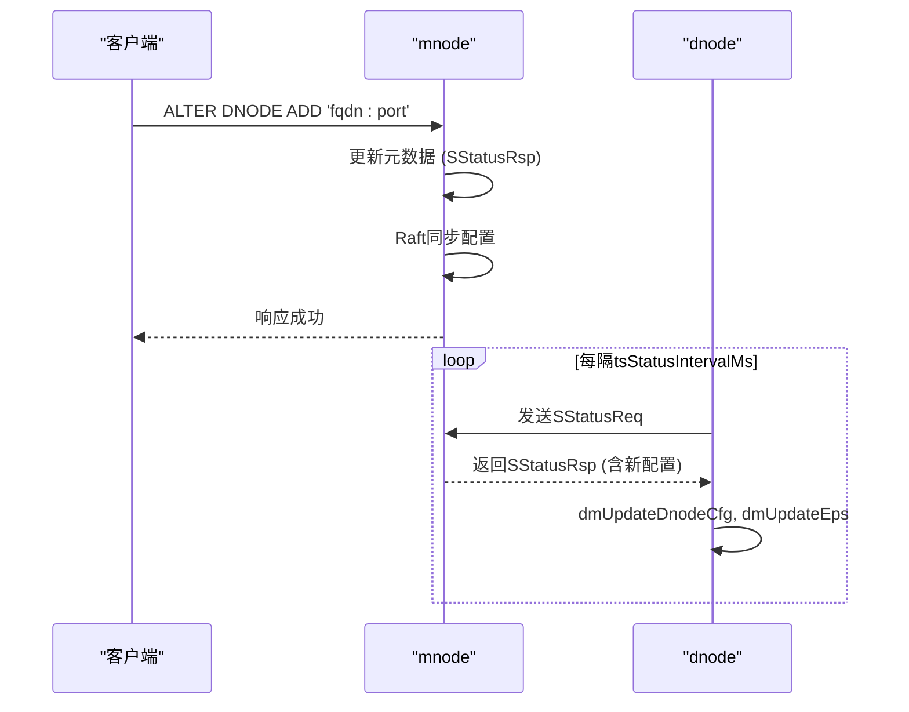

# 集群管理

<cite>
**本文档引用的文件**
- [dmMgmt.c](file://source/dnode/mgmt/node_mgmt/src/dmMgmt.c)
- [dmNodes.c](file://source/dnode/mgmt/node_mgmt/src/dmNodes.c)
- [dmHandle.c](file://source/dnode/mgmt/mgmt_dnode/src/dmHandle.c)
- [dmInt.c](file://source/dnode/mgmt/mgmt_dnode/src/dmInt.c)
- [mmInt.c](file://source/dnode/mgmt/mgmt_mnode/src/mmInt.c)
- [qmInt.c](file://source/dnode/mgmt/mgmt_qnode/src/qmInt.c)
- [smInt.c](file://source/dnode/mgmt/mgmt_snode/src/smInt.c)
- [vmInt.c](file://source/dnode/mgmt/mgmt_vnode/src/vmInt.c)
- [dnode.h](file://include/dnode/mgmt/dnode.h)
- [dmInt.h](file://source/dnode/mgmt/mgmt_dnode/inc/dmInt.h)
- [mmInt.h](file://source/dnode/mgmt/mgmt_mnode/inc/mmInt.h)
</cite>

## 目录
1. [引言](#引言)
2. [集群架构与节点角色](#集群架构与节点角色)
3. [集群部署流程](#集群部署流程)
4. [集群动态管理](#集群动态管理)
5. [元数据同步与高可用机制](#元数据同步与高可用机制)
6. [集群扩容与缩容](#集群扩容与缩容)
7. [故障恢复](#故障恢复)
8. [总结](#总结)

## 引言
本指南旨在为TDengine分布式集群的管理提供权威、详尽的操作说明。内容涵盖从集群部署、节点角色分配、网络配置，到使用SQL命令进行动态管理、元数据同步机制、高可用性保障，以及集群的扩容、缩容和故障恢复等核心运维场景。通过深入分析`source/dnode/mgmt/`目录下的核心管理代码，本指南将揭示TDengine集群内部的工作原理，为用户提供坚实的理论基础和实践指导。

## 集群架构与节点角色
TDengine采用分布式架构，其核心由多种功能节点协同工作，共同构成一个高可用、高性能的时序数据库集群。理解这些节点的角色是管理集群的基础。

### 核心节点类型
- **dnode (Data Node)**: 数据节点，是集群的物理基础。每个dnode代表一个独立的服务器实例，负责管理其上的数据和计算资源。它是集群中其他逻辑节点的宿主。
- **mnode (Management Node)**: 管理节点，是集群的“大脑”。它负责存储和管理集群的元数据，如数据库、表的Schema信息，以及整个集群的拓扑结构。mnode通常以Raft协议实现高可用，确保元数据的一致性和可靠性。
- **qnode (Query Node)**: 查询节点，负责处理来自客户端的查询请求。它接收SQL查询，解析并生成执行计划，然后将任务分发给相关的vnode执行，并最终汇总结果返回给客户端。
- **snode (Stream Node)**: 流计算节点，负责执行持续查询（Continuous Query）和流式数据处理任务。它监听数据流，根据预定义的规则进行实时计算和数据转换。
- **vnode (Virtual Node)**: 虚拟节点，是数据存储和计算的基本单元。一个数据库的数据被水平切分到多个vnode中，每个vnode负责一部分数据的存储、写入和查询。vnode是实现数据分片和负载均衡的关键。

### 节点间关系
一个dnode可以承载多个mnode、qnode、snode和vnode。集群的启动和管理始于dnode。dnode在启动时会根据配置和集群状态，决定是否需要部署mnode，并启动其管理的其他节点。各节点通过RPC进行通信，mnode作为中心协调者，维护着所有节点的状态。

**Diagram sources**
- [dmMgmt.c](file://source/dnode/mgmt/node_mgmt/src/dmMgmt.c#L1-L407)
- [dmNodes.c](file://source/dnode/mgmt/node_mgmt/src/dmNodes.c#L1-L183)

## 集群部署流程
部署一个TDengine集群涉及节点发现、角色分配和网络配置等关键步骤。

### 节点发现与初始化
集群的启动始于dnode的初始化。`dmInitDnode`函数负责创建dnode实例，初始化其内部变量（如`SDnodeData`结构体），并为mnode、qnode、snode等各个管理模块注册功能函数指针。此过程还包含压缩模块、索引模块的初始化。

### 角色分配
dnode的角色分配由`required`机制决定。在`dmInitDnode`中，`dmRequireNode`函数会根据配置和集群状态判断某个节点（如mnode）是否需要启动。例如，`mmRequire`函数会检查`mnode.json`文件和本地端点（`tsLocalEp`）是否为集群中的第一个节点，以此决定是否需要部署mnode。

### 网络配置
网络配置是集群通信的基础。每个节点通过其FQDN（完全限定域名）和端口进行标识。`dmGetMnodeEpSet`等函数负责获取mnode的端点集合（`SEpSet`），以便dnode能够向mnode发送状态报告（`dmSendStatusReq`）或配置请求（`dmSendConfigReq`）。确保所有节点的FQDN都能被正确解析至关重要，否则会导致“some vnode/qnode/mnode(s) out of service”的错误。

**Section sources**
- [dmMgmt.c](file://source/dnode/mgmt/node_mgmt/src/dmMgmt.c#L1-L407)
- [mmInt.c](file://source/dnode/mgmt/mgmt_mnode/src/mmInt.c#L1-L191)

## 集群动态管理
TDengine提供了强大的SQL命令来动态管理集群，无需重启服务。

### 使用ALTER DNODE命令
`ALTER DNODE`命令是管理dnode的核心工具。通过该命令，管理员可以：
- **添加/删除节点**: 通过指定节点的FQDN和端口，可以将新的dnode加入集群，或从集群中移除已有的dnode。
- **查看集群状态**: 执行`SHOW DNODES`等命令可以查询集群中所有dnode的状态，包括其ID、端点、角色、负载等信息。

### 内部处理流程
当执行`ALTER DNODE`命令时，请求首先被发送到mnode。mnode的`mmProcessAlterReq`函数（在`mmHandle.c`中）会处理该请求。它会更新集群的元数据，并通过Raft协议将变更同步到其他mnode副本，确保配置的一致性。随后，相关dnode会通过定期的状态报告（`SStatusReq`）从mnode获取最新的集群配置（`dmProcessStatusRsp`），并据此调整自身的行为。

**Diagram sources**
- [dmHandle.c](file://source/dnode/mgmt/mgmt_dnode/src/dmHandle.c#L1-L799)
- [mmInt.c](file://source/dnode/mgmt/mgmt_mnode/src/mmInt.c#L1-L191)

## 元数据同步与高可用机制
TDengine通过一系列机制确保集群元数据的同步和高可用。

### 元数据同步
元数据的同步主要依赖于dnode与mnode之间的状态报告机制。dnode会定期（由`tsStatusIntervalMs`参数控制）向mnode发送`SStatusReq`消息，报告自身及所管理的vnode、qnode的负载信息。mnode在收到请求后，会将最新的集群配置（如节点列表、IP白名单版本等）打包在`SStatusRsp`响应中返回给dnode。dnode收到响应后，调用`dmUpdateDnodeCfg`和`dmUpdateEps`等函数更新本地配置。

### 故障检测
故障检测是高可用性的关键。dnode通过`dmSendStatusReq`向mnode发送心跳。如果mnode长时间未收到某个dnode的心跳，会将其标记为离线。同时，dnode也会监控mnode的状态。`dmGetServerRunStatus`函数会检查mnode的同步状态（`syncState`），如果mnode处于`ERROR`或`OFFLINE`状态，dnode会将自身状态标记为`SERVICE_DEGRADED`。

### 高可用实现
mnode的高可用性通过Raft协议实现。多个mnode组成一个Raft组，其中只有一个Leader负责处理写请求（如`ALTER DNODE`），其他Follower节点同步日志。当Leader失效时，Raft协议会自动选举出新的Leader，保证服务的连续性。`mmSyncGetRole`函数可以查询当前mnode在Raft组中的角色（Leader、Follower等）。

**Section sources**
- [dmHandle.c](file://source/dnode/mgmt/mgmt_dnode/src/dmHandle.c#L1-L799)
- [mmInt.c](file://source/dnode/mgmt/mgmt_mnode/src/mmInt.c#L1-L191)

## 集群扩容与缩容
集群的扩容与缩容是常见的运维操作。

### 扩容
扩容通常指添加新的dnode。操作步骤如下：
1.  在新服务器上安装TDengine。
2.  配置`taos.cfg`，将`firstEp`指向现有集群的任一节点。
3.  启动新节点的taosd服务。
4.  在任意客户端执行`ALTER DNODE ADD 'new_fqdn:port'`命令，将新节点正式加入集群。
5.  mnode会自动将部分vnode迁移到新节点，实现负载均衡。

### 缩容
缩容指从集群中移除dnode。操作步骤如下：
1.  执行`ALTER DNODE DROP 'old_fqdn:port'`命令。
2.  mnode会先将该dnode上的所有vnode迁移到其他节点。
3.  迁移完成后，该dnode会被标记为`dropped`状态。
4.  最后，可以安全地停止该dnode上的taosd服务。

**Section sources**
- [dmHandle.c](file://source/dnode/mgmt/mgmt_dnode/src/dmHandle.c#L1-L799)
- [dmNodes.c](file://source/dnode/mgmt/node_mgmt/src/dmNodes.c#L1-L183)

## 故障恢复
当集群中的节点发生故障时，TDengine具备自动恢复能力。

### 节点重启
对于临时性故障，只需重启故障节点的taosd服务。该节点会自动通过`dmSendStatusReq`与mnode重新建立连接，并从mnode获取最新的集群状态，恢复其服务。

### 数据恢复
对于vnode级别的故障，如果数据未丢失，vnode在重启后会通过WAL（Write-Ahead Log）机制恢复到故障前的状态。`vmOpenVnodeInThread`函数负责在后台线程中并行打开所有vnode，`vnodeOpen`函数会读取WAL日志并重放未持久化的写入操作。

### mnode故障恢复
由于mnode采用Raft协议，单个mnode故障不会影响集群的读写。剩余的mnode会选举出新的Leader继续提供服务。当故障的mnode恢复后，它会作为Follower重新加入Raft组，并从Leader同步缺失的日志。

**Section sources**
- [vmInt.c](file://source/dnode/mgmt/mgmt_vnode/src/vmInt.c#L1-L799)
- [mmInt.c](file://source/dnode/mgmt/mgmt_mnode/src/mmInt.c#L1-L191)

## 总结
本指南详细阐述了TDengine集群管理的各个方面。从理解dnode、mnode、qnode、snode和vnode等核心组件的角色，到掌握集群的部署、动态管理、元数据同步、高可用机制以及扩容缩容和故障恢复的操作步骤，为用户提供了全面的运维知识体系。通过深入分析源代码，我们揭示了TDengine集群内部高效、可靠的运行机制，帮助用户更好地管理和优化其时序数据库系统。