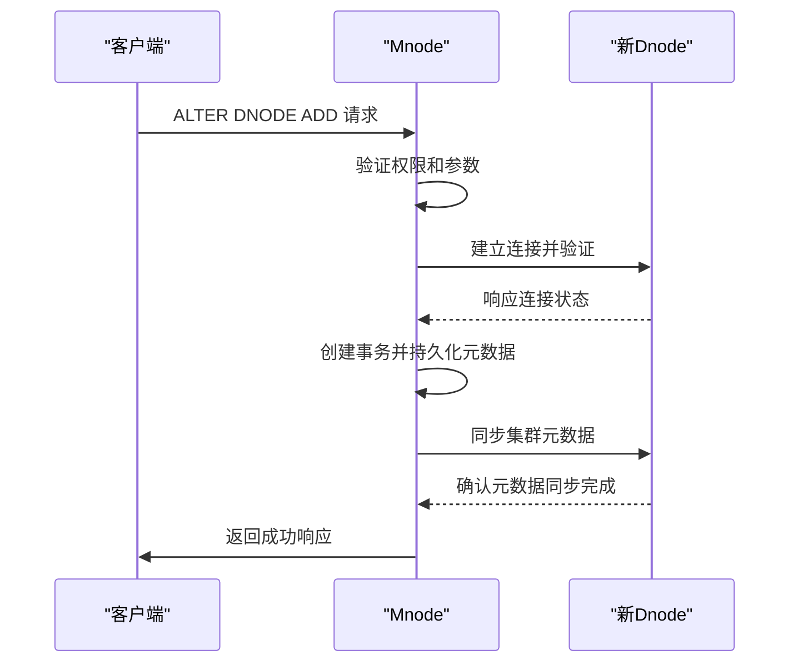
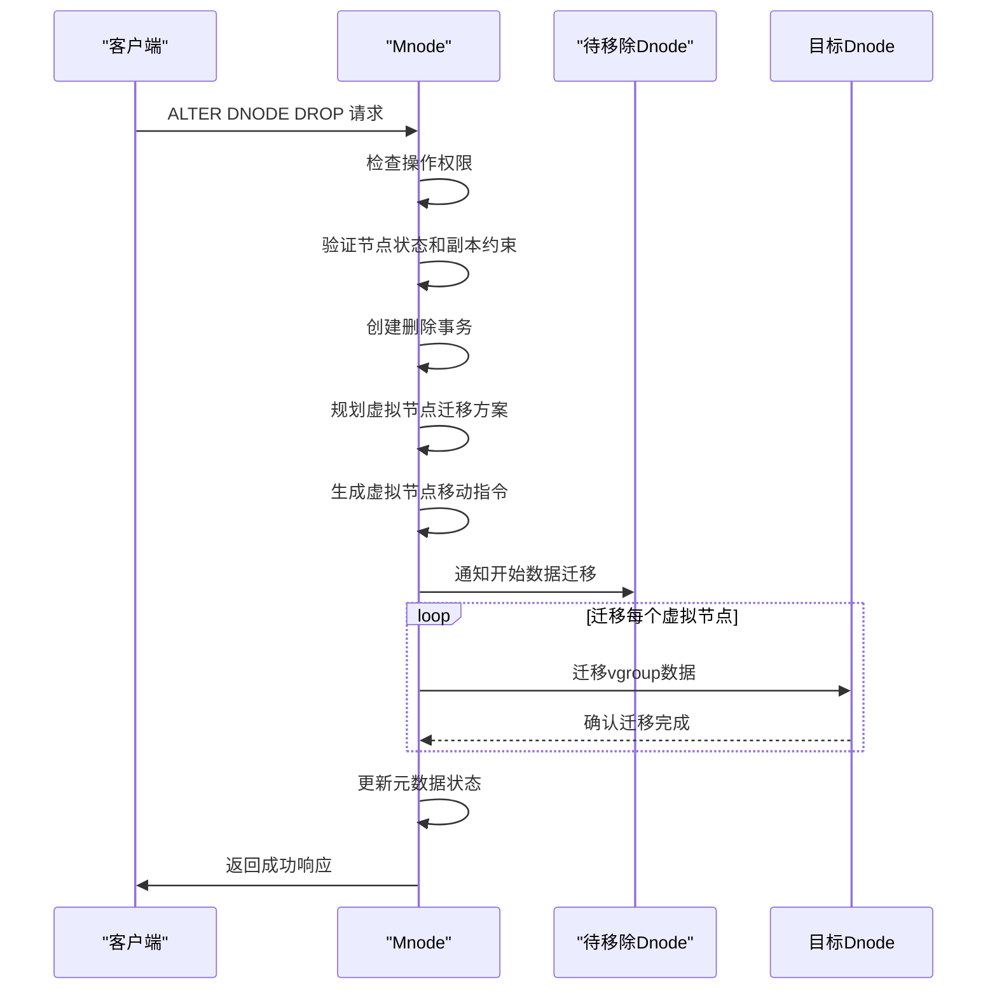
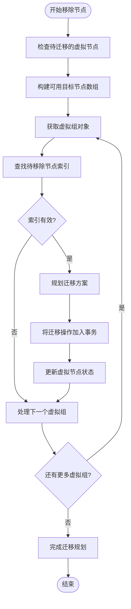

# 节点管理

<cite>
**本文档中引用的文件**  
- [mndDnode.c](file://source/dnode/mnode/impl/src/mndDnode.c)
- [mndVgroup.c](file://source/dnode/mnode/impl/src/mndVgroup.c)
- [dmMgmt.c](file://source/dnode/mgmt/node_mgmt/src/dmMgmt.c)
- [parAstCreater.c](file://source/libs/parser/src/parAstCreater.c)
- [sql.y](file://source/libs/parser/inc/sql.y)
- [vmInt.c](file://source/dnode/mgmt/mgmt_vnode/src/vmInt.c)
</cite>

## 目录
1. [简介](#简介)
2. [核心命令详解](#核心命令详解)
3. [添加数据节点流程](#添加数据节点流程)
4. [移除数据节点流程](#移除数据节点流程)
5. [虚拟节点管理](#虚拟节点管理)
6. [元数据同步机制](#元数据同步机制)
7. [数据重平衡机制](#数据重平衡机制)
8. [操作验证方法](#操作验证方法)
9. [性能影响与最佳实践](#性能影响与最佳实践)
10. [故障排查指南](#故障排查指南)

## 简介
本指南详细阐述了TDengine集群中数据节点（dnode）的动态管理机制。重点介绍如何使用`ALTER DNODE ADD`和`ALTER DNODE DROP`命令对集群进行弹性伸缩，以及`ALTER VNODE`命令对虚拟节点的管理。基于核心管理模块的实现原理，深入解析节点加入时的元数据同步、数据重平衡机制，以及节点移除时的数据迁移和负载调整流程。

## 核心命令详解

### 添加数据节点命令
使用`ALTER DNODE ADD`命令可向现有集群添加新的数据节点。该命令通过解析器生成对应的语法树节点，并触发元数据管理模块的创建流程。

### 移除数据节点命令
`ALTER DNODE DROP`命令用于从集群中安全移除指定的数据节点。系统会检查节点状态、副本数量等约束条件，并在满足条件时启动数据迁移流程。

### 虚拟节点管理命令
`ALTER VNODE`命令允许对虚拟节点进行配置调整和状态管理，包括迁移、分裂等高级操作。

**Section sources**
- [parAstCreater.c](file://source/libs/parser/src/parAstCreater.c#L4033-L4072)
- [sql.y](file://source/libs/parser/inc/sql.y#L183-L193)

## 添加数据节点流程

**Diagram sources**
- [mndDnode.c](file://source/dnode/mnode/impl/src/mndDnode.c#L1116-L1172)
- [mndDnode.c](file://source/dnode/mnode/impl/src/mndDnode.c#L985-L1026)

**Section sources**
- [mndDnode.c](file://source/dnode/mnode/impl/src/mndDnode.c#L1116-L1172)

## 移除数据节点流程

**Diagram sources**
- [mndDnode.c](file://source/dnode/mnode/impl/src/mndDnode.c#L1281-L1403)
- [mndDnode.c](file://source/dnode/mnode/impl/src/mndDnode.c#L1182-L1253)

**Section sources**
- [mndDnode.c](file://source/dnode/mnode/impl/src/mndDnode.c#L1281-L1403)

## 虚拟节点管理

### 虚拟节点迁移流程
当数据节点被移除时，其承载的虚拟节点需要迁移到其他健康节点上。系统通过`mndSetMoveVgroupsInfoToTrans`函数规划迁移路径，并确保数据一致性。

**Diagram sources**
- [mndVgroup.c](file://source/dnode/mnode/impl/src/mndVgroup.c#L2268-L2310)
- [mndVgroup.h](file://source/dnode/mnode/impl/inc/mndVgroup.h#L45)

**Section sources**
- [mndVgroup.c](file://source/dnode/mnode/impl/src/mndVgroup.c#L2268-L2310)

## 元数据同步机制
新节点加入时，主节点（Mnode）会将其集群元数据同步给新节点。这包括数据库定义、表结构、虚拟节点分布等关键信息，确保新节点能够正确参与集群工作。

**Section sources**
- [dmMgmt.c](file://source/dnode/mgmt/node_mgmt/src/dmMgmt.c)

## 数据重平衡机制
在节点添加或移除后，系统自动触发数据重平衡过程。通过虚拟节点的重新分布，确保数据在集群中均匀分布，避免热点问题。重平衡过程采用事务机制，保证数据一致性。

**Section sources**
- [mndDnode.c](file://source/dnode/mnode/impl/src/mndDnode.c#L1182-L1253)

## 操作验证方法
执行节点管理操作后，可通过查询`information_schema.ins_dnodes`和`information_schema.ins_vgroups`系统表来验证操作结果。检查节点状态、虚拟节点分布等指标是否符合预期。

**Section sources**
- [test_alter_dnode.py](file://test/cases/70-Node/01-Dnode/test_alter_dnode.py#L111-L122)

## 性能影响与最佳实践

### 性能影响
- 节点添加：短暂的元数据同步开销
- 节点移除：显著的数据迁移负载，影响查询性能
- 重平衡：持续的网络和磁盘I/O压力

### 最佳实践
1. 在业务低峰期执行节点移除操作
2. 确保集群有足够的备用容量来接收迁移的数据
3. 监控网络带宽和磁盘I/O使用率
4. 分批执行大规模节点调整
5. 保持足够的副本数量以确保高可用性

## 故障排查指南
常见问题包括节点无法加入、数据迁移超时、元数据不一致等。应检查网络连接、磁盘空间、系统日志等关键指标。使用`SHOW DNODES`和`SHOW VGROUPS`命令查看集群状态。

**Section sources**
- [alter_debugFlag.py](file://tests/pytest/alter/alter_debugFlag.py#L37-L53)