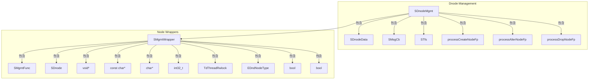
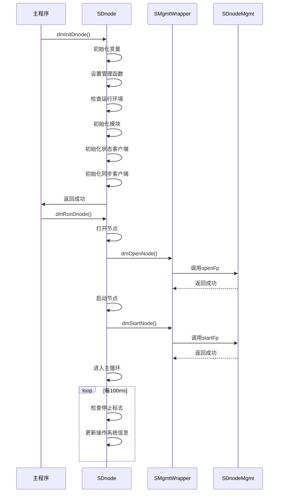
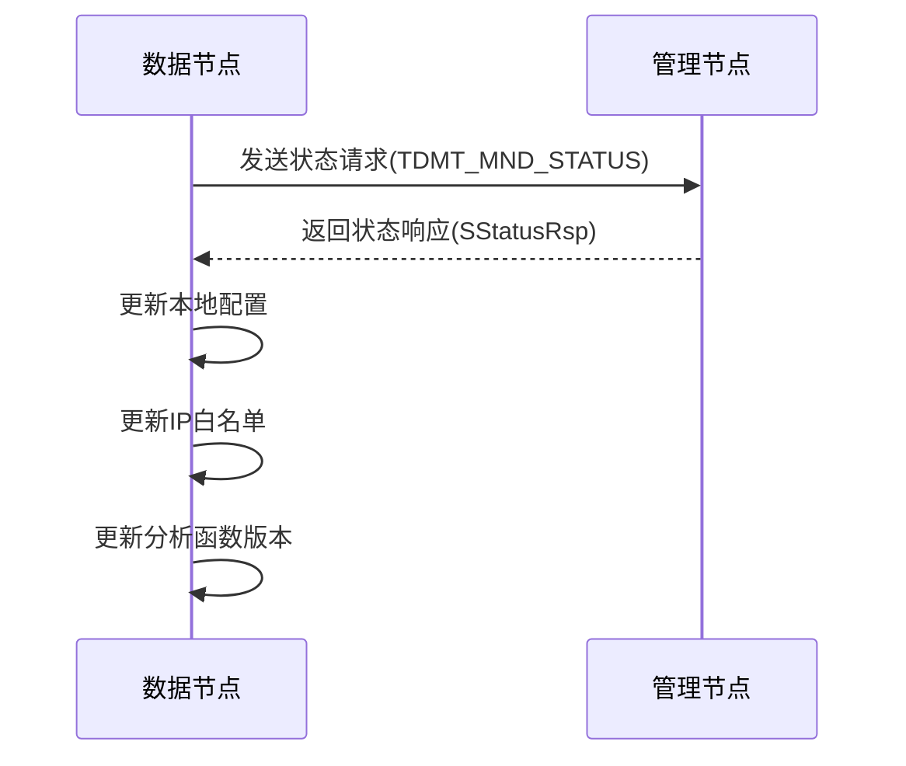
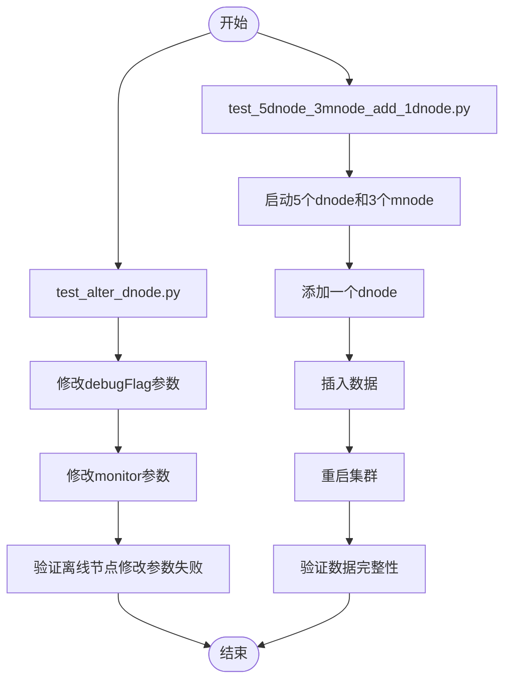

# 集群运维

<cite>
**本文档引用的文件**
- [dmInt.c](file://source/dnode/mgmt/mgmt_dnode/src/dmInt.c)
- [dmHandle.c](file://source/dnode/mgmt/mgmt_dnode/src/dmHandle.c)
- [dmMgmt.c](file://source/dnode/mgmt/node_mgmt/src/dmMgmt.c)
- [dmNodes.c](file://source/dnode/mgmt/node_mgmt/src/dmNodes.c)
- [dmMgmt.h](file://source/dnode/mgmt/node_mgmt/inc/dmMgmt.h)
- [test_alter_dnode.py](file://test/cases/70-Node/01-Dnode/test_alter_dnode.py)
- [test_5dnode_3mnode_add_1dnode.py](file://test/cases/70-Node/05-Cluster/test_5dnode_3mnode_add_1dnode.py)
</cite>

## 目录
1. [引言](#引言)
2. [核心组件与架构](#核心组件与架构)
3. [节点管理机制](#节点管理机制)
4. [集群动态管理操作](#集群动态管理操作)
5. [高可用性与容错验证](#高可用性与容错验证)
6. [运维最佳实践](#运维最佳实践)

## 引言
本操作手册旨在为TDengine数据库集群的日常运维提供全面指导。重点介绍如何使用SQL命令（如`ALTER DNODE`、`ALTER VNODE`）和系统工具对运行中的集群进行动态管理，包括添加/删除数据节点、查看集群拓扑和节点状态、处理节点故障等。通过深入解析`mgmtDnode.c`中的管理函数，揭示节点上下线、元数据同步和负载均衡的内部机制。同时，提供集群扩容、缩容、故障恢复和版本升级的标准化操作流程，并结合`test/cases/70-Node/`中的测试用例，说明高可用性和容错能力的验证方法。

## 核心组件与架构
TDengine集群的核心管理功能由`dnode`模块实现，该模块负责协调集群中所有节点的生命周期和状态管理。`dnode`模块通过一系列管理函数（`SMgmtFunc`）来控制不同类型的节点（如`DNODE`、`MNODE`、`QNODE`等）的启动、停止和配置。

**图源**
- [dmMgmt.h](file://source/dnode/mgmt/node_mgmt/inc/dmMgmt.h#L100-L150)

**本节源**
- [dmMgmt.h](file://source/dnode/mgmt/node_mgmt/inc/dmMgmt.h#L100-L150)

## 节点管理机制
TDengine集群的节点管理机制基于`SDnode`结构体，该结构体封装了集群中所有节点的管理信息。`SDnode`通过`wrappers`数组管理不同类型的节点，每个`SMgmtWrapper`实例负责一个特定类型的节点。

### 节点初始化与启动
节点的初始化和启动过程由`dmInitDnode`和`dmRunDnode`函数实现。`dmInitDnode`函数负责初始化`SDnode`结构体，包括设置各节点类型的管理函数、检查运行环境、初始化模块等。`dmRunDnode`函数则负责启动所有必需的节点。

**图源**
- [dmMgmt.c](file://source/dnode/mgmt/node_mgmt/src/dmMgmt.c#L100-L200)
- [dmNodes.c](file://source/dnode/mgmt/node_mgmt/src/dmNodes.c#L100-L200)

**本节源**
- [dmMgmt.c](file://source/dnode/mgmt/node_mgmt/src/dmMgmt.c#L100-L200)
- [dmNodes.c](file://source/dnode/mgmt/node_mgmt/src/dmNodes.c#L100-L200)

### 节点状态同步
节点状态同步是通过`dmSendStatusReq`和`dmProcessStatusRsp`函数实现的。`dmSendStatusReq`函数向管理节点（`mnode`）发送状态请求，`dmProcessStatusRsp`函数处理来自`mnode`的状态响应。

**图源**
- [dmHandle.c](file://source/dnode/mgmt/mgmt_dnode/src/dmHandle.c#L100-L200)

**本节源**
- [dmHandle.c](file://source/dnode/mgmt/mgmt_dnode/src/dmHandle.c#L100-L200)

## 集群动态管理操作
### 添加/删除数据节点
添加数据节点使用`CREATE DNODE` SQL命令，删除数据节点使用`DROP DNODE` SQL命令。这些操作通过`dmProcessCreateNodeFp`和`dmProcessDropNodeFp`回调函数处理。

### 查看集群拓扑和节点状态
查看集群拓扑和节点状态可以通过查询`information_schema.ins_dnodes`系统表实现。该操作由`dmProcessRetrieve`函数处理，返回节点的详细信息。

### 处理节点故障
当节点发生故障时，`mnode`会检测到节点离线，并触发相应的故障处理流程。`dnode`模块通过`dmProcessStatusRsp`函数处理来自`mnode`的状态响应，如果发现节点被标记为已删除，则会自动退出。

## 高可用性与容错验证
### 测试用例分析
`test/cases/70-Node/`目录下的测试用例提供了高可用性和容错能力的验证方法。例如，`test_alter_dnode.py`测试用例验证了`ALTER DNODE`命令的功能，`test_5dnode_3mnode_add_1dnode.py`测试用例验证了集群扩容的能力。

**图源**
- [test_alter_dnode.py](file://test/cases/70-Node/01-Dnode/test_alter_dnode.py#L10-L100)
- [test_5dnode_3mnode_add_1dnode.py](file://test/cases/70-Node/05-Cluster/test_5dnode_3mnode_add_1dnode.py#L10-L100)

**本节源**
- [test_alter_dnode.py](file://test/cases/70-Node/01-Dnode/test_alter_dnode.py#L10-L100)
- [test_5dnode_3mnode_add_1dnode.py](file://test/cases/70-Node/05-Cluster/test_5dnode_3mnode_add_1dnode.py#L10-L100)

## 运维最佳实践
1. **定期检查节点状态**：使用`SHOW DNODES`命令定期检查集群中所有节点的状态。
2. **监控系统资源**：监控CPU、内存、磁盘I/O等系统资源，确保集群稳定运行。
3. **备份重要数据**：定期备份重要数据，防止数据丢失。
4. **及时更新软件**：及时更新TDengine软件，获取最新的功能和安全修复。
5. **测试变更**：在生产环境中应用任何变更之前，先在测试环境中进行充分测试。