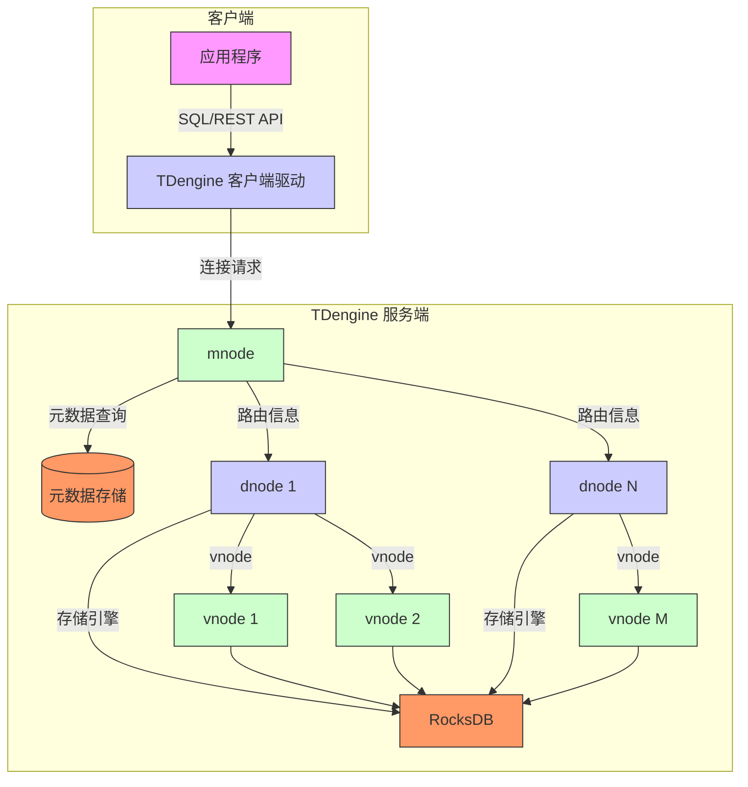

# 项目概述

<cite>
**本文档中引用的文件**  
- [README.md](file://README.md)
- [CONTRIBUTING.md](file://CONTRIBUTING.md)
- [packaging/docker/Dockerfile](file://packaging/docker/Dockerfile)
- [packaging/docker/README.md](file://packaging/docker/README.md)
- [source/dnode/mgmt/mgmt_dnode.c](file://source/dnode/mgmt/mgmt_dnode.c)
- [source/dnode/mgmt/mgmt_mnode.c](file://source/dnode/mgmt/mgmt_mnode.c)
- [source/dnode/vnode/vnode.c](file://source/dnode/vnode/vnode.c)
- [include/libs/executor/executor.h](file://include/libs/executor/executor.h)
- [include/libs/monitor/monitor.h](file://include/libs/monitor/monitor.h)
- [include/dnode/mnode/mnode.h](file://include/dnode/mnode/mnode.h)
- [include/dnode/vnode/vnode.h](file://include/dnode/vnode/vnode.h)
- [include/client/taos.h](file://include/client/taos.h)
</cite>

## 目录
1. [引言](#引言)
2. [核心功能与设计哲学](#核心功能与设计哲学)
3. [分布式架构组件](#分布式架构组件)
4. [系统上下文图](#系统上下文图)
5. [构建与部署](#构建与部署)
6. [项目愿景与社区贡献](#项目愿景与社区贡献)

## 引言

TDengine 是一个开源、高性能、云原生且由 AI 驱动的时序数据库（TSDB），专为物联网（IoT）、车联网和工业物联网等场景设计。它能够高效地实时处理每天由数十亿传感器和数据采集器生成的 TB 甚至 PB 级数据。TDengine 通过其创新的架构和功能，解决了传统时序数据库在高基数、高写入吞吐量和复杂查询方面的挑战，为用户提供了一个简化、高效且可扩展的数据处理平台。

**Section sources**
- [README.md](file://README.md#L1-L354)

## 核心功能与设计哲学

TDengine 的核心优势在于其针对时序数据特点进行的深度优化，其设计哲学围绕“简化”和“高性能”展开。

**高性能**：TDengine 通过创新的存储设计，实现了远超其他数据库的插入和查询速度。在单核机器上，每秒可处理超过 20,000 个请求，摄入数百万个数据点，并检索超过一千万个数据点，性能提升可达 10 倍。

**简化解决方案**：TDengine 集成了缓存、流式计算、消息队列和 AI 代理等功能，提供了一个完整的时序数据处理栈。这消除了集成 Kafka、Redis、HBase 或 Spark 等多种软件的复杂性，使系统架构更简单、更健壮。

**云原生**：TDengine 采用原生分布式设计，支持计算与存储分离、分片和分区，并基于 RAFT 共识算法，确保了高可用性和数据一致性。它支持 Kubernetes 部署，可轻松部署在公有云、私有云或混合云环境中。

**AI 驱动**：通过内置的 AI 代理 TDgpt，TDengine 能够连接多种时序基础模型、大语言模型、机器学习算法和传统算法，提供时序数据预测、异常检测、数据填补和分类等高级分析能力。

**易用性**：TDengine 对管理员而言，显著降低了部署和维护的难度；对开发者而言，提供了简单的接口和无缝的第三方工具集成；对数据使用者而言，实现了便捷的数据访问。

**易于数据分析**：通过超级表（Super Table）、按时间间隔分区、预计算和 AI 代理，TDengine 极大地简化了数据探索、格式化和访问过程。

**开源**：TDengine 的核心模块，包括集群功能和 AI 代理，均在开源许可证下提供，拥有一个活跃的开发者社区。

**Section sources**
- [README.md](file://README.md#L1-L354)

## 分布式架构组件

TDengine 的分布式架构由三个核心组件构成：dnode、mnode 和 vnode，它们协同工作以实现高可用、可扩展和高性能。

### dnode (Data Node)

dnode 是 TDengine 集群中的物理节点，通常对应一台物理服务器或虚拟机。它是集群的最小部署单元，负责存储数据、执行查询和提供服务。一个集群可以由一个或多个 dnode 组成。dnode 的主要职责包括：
- **资源管理**：管理其所在物理机的 CPU、内存、磁盘等资源。
- **服务提供**：运行 `taosd` 服务进程，对外提供数据写入、查询等接口。
- **vnode 容器**：作为虚拟节点（vnode）的宿主，一个 dnode 上可以运行多个 vnode。

**Section sources**
- [source/dnode/mgmt/mgmt_dnode.c](file://source/dnode/mgmt/mgmt_dnode.c)
- [include/dnode/mnode/mnode.h](file://include/dnode/mnode/mnode.h)

### mnode (Management Node)

mnode 是集群的管理节点，负责整个集群的元数据管理和协调工作。在一个集群中，通常有多个 mnode 以实现高可用，它们通过 RAFT 协议达成共识。mnode 的主要职责包括：
- **元数据存储**：存储数据库、表、用户、权限等所有元数据信息。
- **集群管理**：管理 dnode 的加入、离开和状态监控。
- **负载均衡**：为客户端分配 vnode，实现写入和查询的负载均衡。
- **协调操作**：协调跨 vnode 的分布式查询和事务。

**Section sources**
- [source/dnode/mgmt/mgmt_mnode.c](file://source/dnode/mgmt/mgmt_mnode.c)
- [include/dnode/mnode/mnode.h](file://include/dnode/mnode/mnode.h)

### vnode (Virtual Node)

vnode 是 TDengine 中的虚拟节点，是数据存储和计算的基本单元。一个 vnode 负责管理一组特定的时序数据（例如，一个数据库或一个数据分片）。vnode 是逻辑上的，它运行在 dnode 上。其主要特点和职责包括：
- **数据分片**：一个数据库的数据可以被水平分片到多个 vnode 中，以实现水平扩展。
- **独立运行**：每个 vnode 独立管理其数据的写入、压缩、查询和持久化。
- **高可用**：通过副本机制（Replication），一个 vnode 可以在多个 dnode 上拥有副本，确保在单个节点故障时数据不丢失、服务不中断。

这三个组件的关系可以概括为：**多个 dnode 组成集群，每个 dnode 上运行多个 vnode，而 mnode 负责管理所有 dnode 和 vnode 的元数据与协调**。

**Section sources**
- [source/dnode/vnode/vnode.c](file://source/dnode/vnode/vnode.c)
- [include/dnode/vnode/vnode.h](file://include/dnode/vnode/vnode.h)

## 系统上下文图

以下 Mermaid 图展示了 TDengine 系统的核心组件及其交互关系。



**Diagram sources**
- [include/client/taos.h](file://include/client/taos.h)
- [source/dnode/mgmt/mgmt_dnode.c](file://source/dnode/mgmt/mgmt_dnode.c)
- [source/dnode/vnode/vnode.c](file://source/dnode/vnode/vnode.c)

## 构建与部署

### 从源码构建

TDengine 支持在 Linux 和 macOS 系统上从源码构建。构建过程依赖于 GCC 9.3.1 或更高版本以及 CMake 3.18.0 或更高版本。

1.  **克隆仓库**：
    ```bash
    git clone https://github.com/taosdata/TDengine.git
    cd TDengine
    ```

2.  **构建**：
    在项目根目录下运行 `build.sh` 脚本，该脚本会自动创建构建目录并执行 CMake 和 Make 命令。
    ```bash
    ./build.sh
    ```
    此命令等同于：
    ```bash
    mkdir debug && cd debug
    cmake .. -DBUILD_TOOLS=true
    make
    ```

3.  **安装**：
    构建成功后，可以使用以下命令进行安装：
    ```bash
    sudo make install
    ```

**Section sources**
- [README.md](file://README.md#L1-L354)

### Docker 部署

TDengine 提供了官方的 Docker 镜像，可以快速启动服务。

1.  **启动单个实例**：
    ```bash
    docker run -d --name tdengine -p 6041:6041 tdengine/tdengine
    ```

2.  **使用 Docker Compose 启动集群**：
    创建一个 `docker-compose.yml` 文件来定义一个多节点集群，然后使用 `docker-compose up` 命令启动。

**Section sources**
- [packaging/docker/README.md](file://packaging/docker/README.md)
- [packaging/docker/Dockerfile](file://packaging/docker/Dockerfile)

## 项目愿景与社区贡献

### 项目愿景

TDengine 的愿景是成为时序数据领域的首选平台，通过持续的技术创新，为用户提供一个集高性能、高可用、易用性和智能化于一体的完整解决方案。其目标是简化物联网、车联网等领域的数据处理流程，让开发者能够更专注于业务逻辑，而非底层基础设施的复杂性。

### 社区贡献

TDengine 是一个开源项目，欢迎所有社区成员和开发者贡献代码。

- **报告问题**：用户可以通过 GitHub Issue Tracker 报告遇到的 bug。
- **代码贡献**：开发者可以提交补丁，无论是文档修改还是功能增强。贡献前需要阅读并接受 TAOS Data 贡献者许可协议（CLA）。
- **获取奖励**：为了感谢社区成员的支持，任何提交至少一个贡献的开发者都可以获得一份免费的纪念品。

**Section sources**
- [CONTRIBUTING.md](file://CONTRIBUTING.md)
- [README.md](file://README.md#L1-L354)