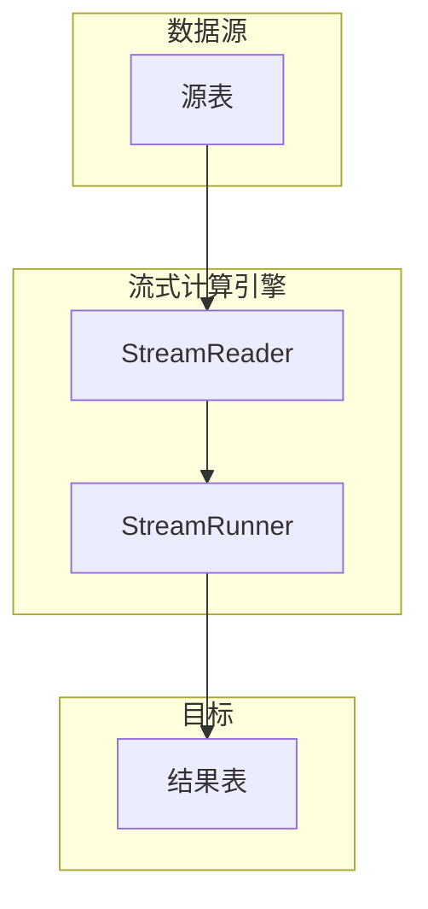
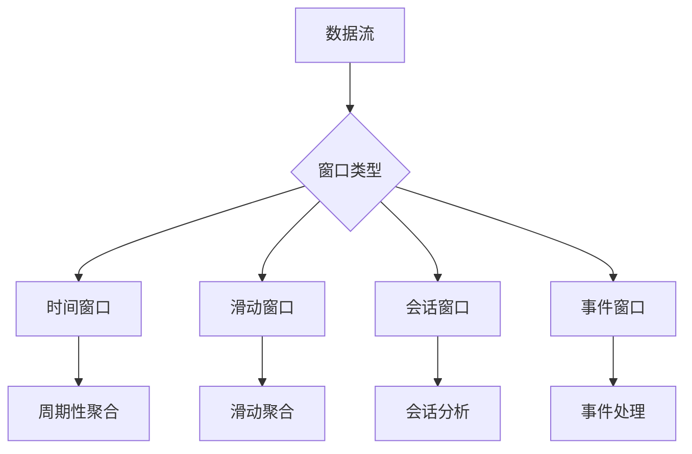

# 流式计算

<cite>
**本文档中引用的文件**
- [stream.h](file://include/libs/new-stream/stream.h)
- [streamRunner.h](file://include/libs/new-stream/streamRunner.h)
- [streamReader.h](file://include/libs/new-stream/streamReader.h)
- [stream.c](file://source/libs/new-stream/src/stream.c)
- [streamRunner.c](file://source/libs/new-stream/src/streamRunner.c)
- [streamReader.c](file://source/libs/new-stream/src/streamReader.c)
- [test_stream_notify.py](file://test/cases/uncatalog/army/stream/test_stream_notify.py)
- [idmp_manager_bug9.py](file://test/cases/41-StreamProcessing/20-UseCase/idmp_manager_bug9.py)
- [idmp_meters_bug13.py](file://test/cases/41-StreamProcessing/20-UseCase/idmp_meters_bug13.py)
- [stream_perf_realtime.py](file://test/cases/41-StreamProcessing/22-Performance/stream_perf_realtime.py)
- [crash_gen_main.py](file://tests/pytest/crash_gen/crash_gen_main.py)
</cite>

## 目录
1. [引言](#引言)
2. [流式计算架构设计](#流式计算架构设计)
3. [核心组件](#核心组件)
4. [窗口函数与计算模式](#窗口函数与计算模式)
5. [创建流的SQL语法](#创建流的sql语法)
6. [完整代码示例](#完整代码示例)
7. [应用场景](#应用场景)
8. [性能优化技巧](#性能优化技巧)
9. [错误处理机制](#错误处理机制)
10. [常见问题排查指南](#常见问题排查指南)

## 引言
TDengine是一款专为物联网（IoT）、车联网和工业物联网设计的高性能时序数据库，其流式计算功能支持实时数据处理、聚合和异常检测。通过内置的流式计算引擎，TDengine能够高效处理TB甚至PB级别的数据，适用于实时监控、数据聚合和异常检测等场景。

## 流式计算架构设计
TDengine的流式计算引擎采用分布式架构，由多个核心组件协同工作。流式计算任务被划分为读取器（StreamReader）和执行器（StreamRunner），分别负责数据读取和计算执行。读取器从数据源读取数据并触发计算任务，执行器则负责执行具体的计算逻辑并将结果写入目标表。



**图示来源**
- [stream.h](file://include/libs/new-stream/stream.h#L1-L290)
- [streamRunner.h](file://include/libs/new-stream/streamRunner.h#L1-L46)
- [streamReader.h](file://include/libs/new-stream/streamReader.h#L1-L124)

**本节来源**
- [stream.h](file://include/libs/new-stream/stream.h#L1-L290)
- [streamRunner.h](file://include/libs/new-stream/streamRunner.h#L1-L46)
- [streamReader.h](file://include/libs/new-stream/streamReader.h#L1-L124)

## 核心组件
流式计算的核心组件包括触发器、窗口函数和计算模式。触发器负责在特定条件下触发计算任务，窗口函数用于定义数据处理的时间窗口，计算模式则决定了数据处理的方式。

### 触发器
触发器是流式计算的起点，当满足特定条件时触发计算任务。TDengine支持多种触发模式，包括连续触发、事件触发和会话触发。

### 窗口函数
窗口函数用于定义数据处理的时间窗口，支持时间窗口、事件窗口和会话窗口等多种类型。

### 计算模式
计算模式决定了数据处理的方式，包括连续计算、事件计算和会话计算。

**本节来源**
- [stream.h](file://include/libs/new-stream/stream.h#L1-L290)
- [streamRunner.h](file://include/libs/new-stream/streamRunner.h#L1-L46)
- [streamReader.h](file://include/libs/new-stream/streamReader.h#L1-L124)

## 窗口函数与计算模式
TDengine支持多种窗口函数和计算模式，以满足不同的实时数据处理需求。

### 时间窗口（Interval）
时间窗口按固定时间间隔划分数据，适用于周期性数据聚合。

### 滑动窗口（Sliding）
滑动窗口在时间窗口的基础上增加了滑动步长，可以实现更细粒度的数据处理。

### 会话窗口（Session）
会话窗口根据数据的时间间隔划分，当数据间隔超过指定阈值时结束当前会话。

### 事件窗口（Event Window）
事件窗口基于特定事件的开始和结束条件划分，适用于复杂事件处理。



**图示来源**
- [test_stream_notify.py](file://test/cases/uncatalog/army/stream/test_stream_notify.py#L80-L116)
- [idmp_manager_bug9.py](file://test/cases/41-StreamProcessing/20-UseCase/idmp_manager_bug9.py#L191-L211)

**本节来源**
- [test_stream_notify.py](file://test/cases/uncatalog/army/stream/test_stream_notify.py#L80-L116)
- [idmp_manager_bug9.py](file://test/cases/41-StreamProcessing/20-UseCase/idmp_manager_bug9.py#L191-L211)

## 创建流的SQL语法
创建流的SQL语法如下：

```sql
CREATE STREAM <stream_name> 
<window_clause> 
FROM <source_table> 
[PARTITION BY <partition_clause>] 
[STREAM_OPTIONS(<options>)] 
[NOTIFY('<url>') ON(<events>)] 
INTO <target_table> 
AS <select_clause> 
FROM <source_table> 
[WHERE <condition>];
```

### 支持的选项
- **触发模式**：`TRIGGER_CONDITION`、`TRIGGER_INTERVAL`
- **延迟时间**：`MAX_DELAY`
- **填充策略**：`FILL_HISTORY`、`IGNORE_NODATA_TRIGGER`

**本节来源**
- [idmp_manager_bug9.py](file://test/cases/41-StreamProcessing/20-UseCase/idmp_manager_bug9.py#L191-L211)
- [idmp_meters_bug13.py](file://test/cases/41-StreamProcessing/20-UseCase/idmp_meters_bug13.py#L287-L343)
- [stream_perf_realtime.py](file://test/cases/41-StreamProcessing/22-Performance/stream_perf_realtime.py#L495-L529)

## 完整代码示例
以下是一个完整的流式计算示例，展示如何创建流、定义计算逻辑并查询结果。

```sql
-- 创建源表
CREATE TABLE sensors (ts TIMESTAMP, voltage DOUBLE, current DOUBLE, power DOUBLE);

-- 创建结果表
CREATE TABLE result_stream (ts TIMESTAMP, cnt BIGINT, min_current DOUBLE, max_current DOUBLE, min_voltage DOUBLE, max_voltage DOUBLE, total_power DOUBLE);

-- 创建流
CREATE STREAM stream1 
INTERVAL(5s) 
SLIDING(5s) 
FROM sensors 
STREAM_OPTIONS(MAX_DELAY(5s)) 
INTO result_stream 
AS SELECT _twstart AS ts, COUNT(*) AS cnt, MIN(current) AS min_current, MAX(current) AS max_current, MIN(voltage) AS min_voltage, MAX(voltage) AS max_voltage, SUM(power) AS total_power 
FROM %%trows;
```

**本节来源**
- [idmp_manager_bug9.py](file://test/cases/41-StreamProcessing/20-UseCase/idmp_manager_bug9.py#L191-L211)
- [stream_perf_realtime.py](file://test/cases/41-StreamProcessing/22-Performance/stream_perf_realtime.py#L495-L529)

## 应用场景
流式计算在实时监控、数据聚合和异常检测中具有广泛的应用。

### 实时监控
通过流式计算实时监控设备状态，及时发现异常。

### 数据聚合
对大量时序数据进行实时聚合，生成统计报表。

### 异常检测
基于历史数据和实时数据进行异常检测，提前预警。

**本节来源**
- [idmp_manager_bug9.py](file://test/cases/41-StreamProcessing/20-UseCase/idmp_manager_bug9.py#L191-L211)
- [idmp_meters_bug13.py](file://test/cases/41-StreamProcessing/20-UseCase/idmp_meters_bug13.py#L287-L343)

## 性能优化技巧
为了提高流式计算的性能，可以采取以下优化措施：

### 合理设置窗口大小
根据业务需求合理设置窗口大小，避免过小或过大。

### 设置适当的延迟时间
通过`MAX_DELAY`选项设置适当的延迟时间，平衡实时性和准确性。

### 处理乱序数据
使用`IGNORE_DISORDER`选项处理乱序数据，确保计算结果的准确性。

**本节来源**
- [stream_perf_realtime.py](file://test/cases/41-StreamProcessing/22-Performance/stream_perf_realtime.py#L495-L529)
- [crash_gen_main.py](file://tests/pytest/crash_gen/crash_gen_main.py#L1899-L1951)

## 错误处理机制
流式计算过程中可能会遇到各种错误，如数据源不可用、计算任务失败等。TDengine提供了完善的错误处理机制，包括任务状态监控、错误日志记录和自动重试。

**本节来源**
- [stream.h](file://include/libs/new-stream/stream.h#L1-L290)
- [streamRunner.c](file://source/libs/new-stream/src/streamRunner.c)
- [streamReader.c](file://source/libs/new-stream/src/streamReader.c)

## 常见问题排查指南
### 流计算任务未触发
检查触发条件是否正确，确保数据源有新数据写入。

### 计算结果不准确
检查窗口大小和延迟时间设置，确保处理乱序数据的策略正确。

### 性能瓶颈
分析系统资源使用情况，优化窗口大小和计算逻辑。

**本节来源**
- [test_stream_notify.py](file://test/cases/uncatalog/army/stream/test_stream_notify.py#L80-L116)
- [recalc_expired_bug_4.py](file://test/cases/41-StreamProcessing/08-Recalc/recalc_expired_bug_4.py#L145-L177)