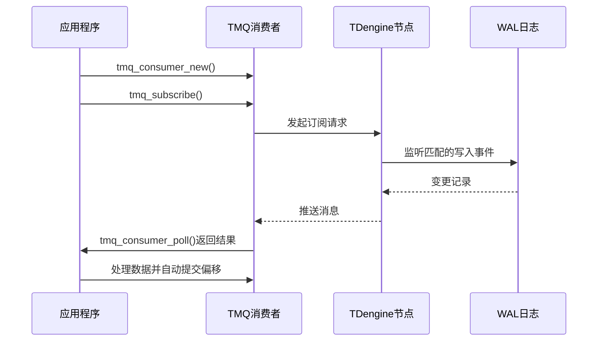
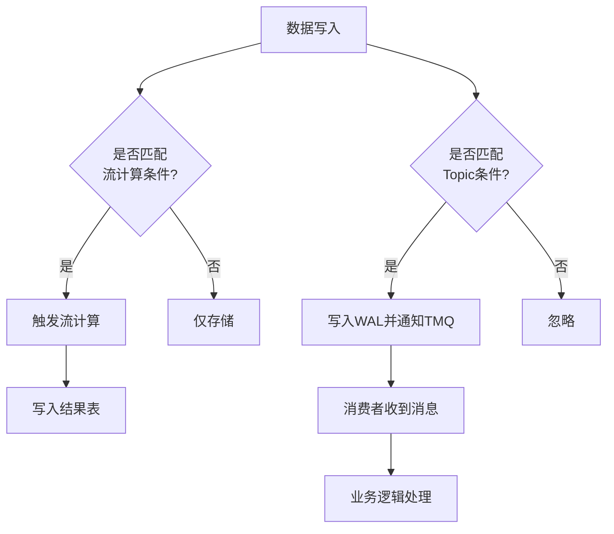

# 高级功能

<cite>
**本文档中引用的文件**  
- [stream_demo.c](file://examples/c/stream_demo.c)
- [tmq.c](file://examples/c/tmq.c)
- [taos.h](file://include/client/taos.h)
- [streamMsg.h](file://include/common/streamMsg.h)
- [new-stream/stream.h](file://include/libs/new-stream/stream.h)
- [clientTmq.c](file://source/client/src/clientTmq.c)
</cite>

## 目录
1. [引言](#引言)
2. [流式计算功能](#流式计算功能)
3. [数据订阅机制](#数据订阅机制)
4. [端到端示例流程](#端到端示例流程)
5. [应用场景分析](#应用场景分析)
6. [结论](#结论)

## 引言
TDengine 是一款专为时序数据设计的高性能数据库，其流式计算和数据订阅能力为实时数据处理提供了强大支持。本文档深入探讨 TDengine 的流式计算引擎如何实现高效的数据处理与告警机制，详细说明 TDengine 消息队列（TMQ）的工作原理，并通过完整示例展示从数据写入、流计算触发到消息订阅的全过程。

**Section sources**
- [stream_demo.c](file://examples/c/stream_demo.c#L1-L121)
- [tmq.c](file://examples/c/tmq.c#L1-L334)

## 流式计算功能

### 流式计算引擎概述
TDengine 的流式计算引擎允许用户定义基于时间窗口或事件驱动的连续查询，自动对实时流入的数据进行聚合、过滤和转换操作。该引擎在数据写入的同时完成计算，极大降低了延迟，适用于实时监控、异常检测等场景。

流式计算的核心是“流”（Stream）对象，它封装了一个 SELECT 查询语句，并指定输出目标表。每当有新数据写入源表时，系统会自动执行该查询并更新结果。

### 创建与管理流的 SQL 语法
创建流的基本语法如下：
```sql
CREATE STREAM stream_name INTO result_table [SUBTABLE(subtable_name)] 
AS SELECT _wstart, agg_func(column) FROM source_table 
PARTITION BY tbname[, tag] INTERVAL(interval_time);
```

其中关键参数说明：
- `INTO`：指定结果写入的目标超级表
- `SUBTABLE`：可选，用于动态生成子表名
- `PARTITION BY`：按指定列（如 `tbname` 或标签）分组处理
- `INTERVAL`：定义滑动或跳动时间窗口

例如，在示例代码中创建了一个每 10 秒计算一次平均值的流：
```sql
create stream stream2 into outstb subtable(concat(concat(concat('prefix_', tname), '_suffix_'), cast(k1 as varchar(20)))) as select _wstart wstart, avg(k) from st1 partition by tbname tname, a k1 interval(10s);
```

此语句将 `st1` 表的数据按 `tbname` 和标签 `a` 分区，每 10 秒计算一次 `k` 字段的平均值，并将结果写入以动态命名规则生成的子表中。

**Section sources**
- [stream_demo.c](file://examples/c/stream_demo.c#L70-L85)

## 数据订阅机制

### TDengine 消息队列（TMQ）工作原理
TDengine 消息队列（TMQ）是一种内置的消息发布/订阅系统，允许应用程序订阅数据库中的数据变更事件。TMQ 基于 WAL（Write-Ahead Log）机制捕获所有写入操作，确保数据变更的完整性和顺序性。

TMQ 的核心组件包括：
- **Topic（主题）**：由 SQL 查询定义的数据流，表示一组感兴趣的记录
- **Producer（生产者）**：TDengine 内部自动将满足条件的数据变更推送到 Topic
- **Consumer（消费者）**：外部应用通过 API 订阅 Topic 并消费数据

### 主题创建与使用
创建 Topic 的语法如下：
```sql
CREATE TOPIC topic_name AS SELECT columns FROM db.stable WHERE condition;
```

在示例中，创建了一个只包含 `c1 > 1` 条件数据的主题：
```sql
create topic topicname as select ts, c1, c2, c3, tbname from tmqdb.stb where c1 > 1
```

消费者通过配置 `group.id` 实现消费组语义，支持自动提交偏移量、从最早/最新位置开始消费等策略。

### 生产者与消费者的使用
生产者由 TDengine 自动管理，无需显式编程。消费者需使用 TMQ C API 构建，主要步骤包括：
1. 配置消费者参数（如 `group.id`、`auto.commit.interval.ms`）
2. 创建消费者实例
3. 订阅一个或多个 Topic
4. 调用 `tmq_consumer_poll()` 获取消息
5. 处理消息后释放资源

示例代码展示了完整的消费者构建过程，包括设置回调函数、订阅主题和循环拉取消息。



**Diagram sources**
- [tmq.c](file://examples/c/tmq.c#L150-L300)
- [clientTmq.c](file://source/client/src/clientTmq.c#L1-L500)

**Section sources**
- [tmq.c](file://examples/c/tmq.c#L1-L334)

## 端到端示例流程

以下是一个完整的端到端数据处理流程示例：

1. **初始化环境**：创建数据库和超级表
2. **写入原始数据**：向子表插入时序数据
3. **定义流计算任务**：创建基于时间窗口的流，实时计算指标
4. **创建订阅主题**：定义感兴趣的数据变更集
5. **启动消费者**：监听并处理实时数据流

该流程实现了从数据摄入到实时分析再到事件响应的闭环处理。



**Diagram sources**
- [stream_demo.c](file://examples/c/stream_demo.c#L1-L121)
- [tmq.c](file://examples/c/tmq.c#L1-L334)

**Section sources**
- [stream_demo.c](file://examples/c/stream_demo.c#L1-L121)
- [tmq.c](file://examples/c/tmq.c#L1-L334)

## 应用场景分析

### 实时监控系统
利用流式计算能力，可以实时统计设备状态、网络流量、服务器性能等指标，并结合告警规则及时通知运维人员。例如，每分钟计算一次 CPU 使用率均值，超过阈值则触发告警。

### 事件驱动架构
TMQ 可作为微服务间通信的桥梁，当数据库发生特定变更时（如订单状态更新），自动通知相关服务进行后续处理，实现松耦合的事件驱动架构。

### 数据管道与 ETL
通过订阅 Topic，可将 TDengine 中的数据实时同步到其他系统（如数据仓库、搜索引擎或缓存系统），构建低延迟的数据集成管道。

### 实时仪表盘
结合流计算输出的结果表，前端系统可快速查询最新聚合数据，实现毫秒级刷新的实时可视化看板。

## 结论
TDengine 的流式计算和数据订阅功能为构建实时数据应用提供了坚实基础。通过简洁的 SQL 接口和高效的内部机制，开发者能够轻松实现复杂的时间序列分析和事件响应逻辑。这些特性特别适合物联网、金融交易、工业监控等领域对高吞吐、低延迟处理的需求。